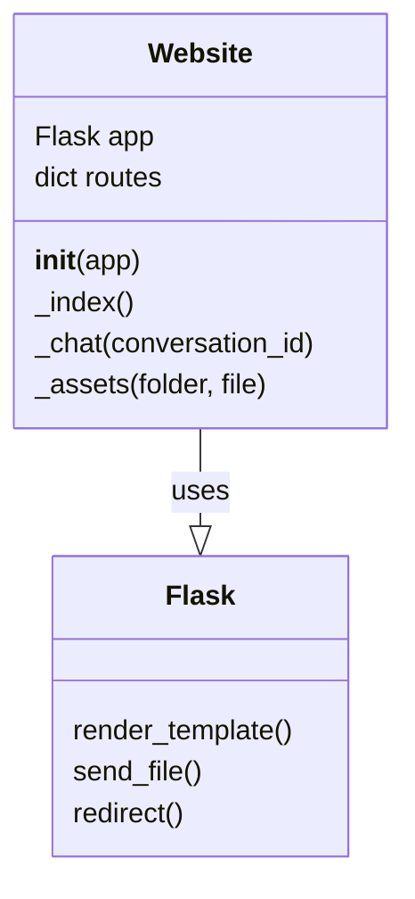

### **Системные инструкции для обработки кода проекта `hypotez`**

=========================================================================================

Описание функциональности и правил для генерации, анализа и улучшения кода. Направлено на обеспечение последовательного и читаемого стиля кодирования, соответствующего требованиям.

---

### **Основные принципы**

#### **1. Общие указания**:
- Соблюдай четкий и понятный стиль кодирования.
- Все изменения должны быть обоснованы и соответствовать установленным требованиям.

#### **2. Комментарии**:
- Используй `#` для внутренних комментариев.
- Документация всех функций, методов и классов должна следовать такому формату: 
    ```python
        def function(param: str, param1: Optional[str | dict | str] = None) -> dict | None:
            """ 
            Args:
                param (str): Описание параметра `param`.
                param1 (Optional[str | dict | str], optional): Описание параметра `param1`. По умолчанию `None`.
    
            Returns:
                dict | None: Описание возвращаемого значения. Возвращает словарь или `None`.
    
            Raises:
                SomeError: Описание ситуации, в которой возникает исключение `SomeError`.

            Ехаmple:
                >>> function('param', 'param1')
                {'param': 'param1'}
            """
    ```
- Комментарии и документация должны быть четкими, лаконичными и точными.

#### **3. Форматирование кода**:
- Используй одинарные кавычки. `a:str = 'value'`, `print('Hello World!')`;
- Добавляй пробелы вокруг операторов. Например, `x = 5`;
- Все параметры должны быть аннотированы типами. `def function(param: str, param1: Optional[str | dict | str] = None) -> dict | None:`;
- Не используй `Union`. Вместо этого используй `|`.

#### **4. Логирование**:
- Для логгирования Всегда Используй модуль `logger` из `src.logger.logger`.
- Ошибки должны логироваться с использованием `logger.error`.
Пример:
    ```python
        try:
            ...
        except Exception as ex:
            logger.error('Error while processing data', ех, exc_info=True)
    ```
#### **5 Не используй `Union[]` в коде. Вместо него используй `|`
Например:
```python
x: str | int ...
```


---

### **Основные требования**:

#### **1. Формат ответов в Markdown**:
- Все ответы должны быть выполнены в формате **Markdown**.

#### **2. Формат комментариев**:
- Используй указанный стиль для комментариев и документации в коде.
- Пример:

```python
from typing import Generator, Optional, List
from pathlib import Path


def read_text_file(
    file_path: str | Path,
    as_list: bool = False,
    extensions: Optional[List[str]] = None,
    chunk_size: int = 8192,
) -> Generator[str, None, None] | str | None:
    """
    Считывает содержимое файла (или файлов из каталога) с использованием генератора для экономии памяти.

    Args:
        file_path (str | Path): Путь к файлу или каталогу.
        as_list (bool): Если `True`, возвращает генератор строк.
        extensions (Optional[List[str]]): Список расширений файлов для чтения из каталога.
        chunk_size (int): Размер чанков для чтения файла в байтах.

    Returns:
        Generator[str, None, None] | str | None: Генератор строк, объединенная строка или `None` в случае ошибки.

    Raises:
        Exception: Если возникает ошибка при чтении файла.

    Example:
        >>> from pathlib import Path
        >>> file_path = Path('example.txt')
        >>> content = read_text_file(file_path)
        >>> if content:
        ...    print(f'File content: {content[:100]}...')
        File content: Example text...
    """
    ...
```
- Всегда делай подробные объяснения в комментариях. Избегай расплывчатых терминов, 
- таких как *«получить»* или *«делать»*. Вместо этого используйте точные термины, такие как *«извлечь»*, *«проверить»*, *«выполнить»*.
- Вместо: *«получаем»*, *«возвращаем»*, *«преобразовываем»* используй имя объекта *«функция получае»*, *«переменная возвращает»*, *«код преобразовывает»* 
- Комментарии должны непосредственно предшествовать описываемому блоку кода и объяснять его назначение.

#### **3. Пробелы вокруг операторов присваивания**:
- Всегда добавляйте пробелы вокруг оператора `=`, чтобы повысить читаемость.
- Примеры:
  - **Неправильно**: `x=5`
  - **Правильно**: `x = 5`

#### **4. Использование `j_loads` или `j_loads_ns`**:
- Для чтения JSON или конфигурационных файлов замените стандартное использование `open` и `json.load` на `j_loads` или `j_loads_ns`.
- Пример:

```python
# Неправильно:
with open('config.json', 'r', encoding='utf-8') as f:
    data = json.load(f)

# Правильно:
data = j_loads('config.json')
```

#### **5. Сохранение комментариев**:
- Все существующие комментарии, начинающиеся с `#`, должны быть сохранены без изменений в разделе «Улучшенный код».
- Если комментарий кажется устаревшим или неясным, не изменяйте его. Вместо этого отметьте его в разделе «Изменения».

#### **6. Обработка `...` в коде**:
- Оставляйте `...` как указатели в коде без изменений.
- Не документируйте строки с `...`.
```

#### **7. Аннотации**
Для всех переменных должны быть определены аннотации типа. 
Для всех функций все входные и выходные параметры аннотириваны
Для все параметров должны быть аннотации типа.


### **8. webdriver**
В коде используется webdriver. Он импртируется из модуля `webdriver` проекта `hypotez`
```python
from src.webdirver import Driver, Chrome, Firefox, Playwright, ...
driver = Driver(Firefox)

Пoсле чего может использоваться как

close_banner = {
  "attribute": null,
  "by": "XPATH",
  "selector": "//button[@id = 'closeXButton']",
  "if_list": "first",
  "use_mouse": false,
  "mandatory": false,
  "timeout": 0,
  "timeout_for_event": "presence_of_element_located",
  "event": "click()",
  "locator_description": "Закрываю pop-up окно, если оно не появилось - не страшно (`mandatory`:`false`)"
}

result = driver.execute_locator(close_banner)
```

### Анализ кода `hypotez/src/endpoints/freegpt-webui-ru/server/website.py`

#### 1. Блок-схема

```mermaid
graph LR
    A[Начало: Запрос к серверу] --> B{Определение маршрута}
    B -- Маршрут "/" --> C[Редирект на "/chat"]
    B -- Маршрут "/chat/" --> D[Вызов _index()]
    B -- Маршрут "/chat/<conversation_id>" --> E[Вызов _chat(conversation_id)]
    B -- Маршрут "/assets/<folder>/<file>" --> F[Вызов _assets(folder, file)]

    D --> G{Генерация chat_id}
    G --> H[Отображение index.html с chat_id]
    E --> I{Проверка conversation_id}
    I -- "Содержит '-'" --> J[Отображение index.html с conversation_id]
    I -- "Не содержит '-'" --> C
    F --> K{Попытка отправки файла}
    K -- Успех --> L[Отправка файла]
    K -- Ошибка --> M[Отправка "File not found", 404]
```

#### 2. Диаграмма



**Объяснение зависимостей:**

-   `Website` использует `Flask` для рендеринга шаблонов, отправки файлов и редиректов. Класс `Website` содержит ссылки на функции `render_template`, `send_file`, `redirect` из библиотеки `Flask`.

#### 3. Объяснение

**Импорты:**

*   `flask`:
    *   `render_template`: Используется для рендеринга HTML-шаблонов.
    *   `send_file`: Используется для отправки статических файлов (например, assets).
    *   `redirect`: Используется для перенаправления пользователя на другой URL.
*   `time`:
    *   `time`: Используется для получения текущего времени в секундах, необходимого для генерации уникального идентификатора чата.
*   `os`:
    *   `urandom`: Используется для генерации случайных байтов, что необходимо для создания уникального идентификатора чата.

**Класс `Website`:**

*   Роль: Определяет маршруты и обработчики для веб-сайта.
*   Атрибуты:
    *   `app`: Объект Flask-приложения.
    *   `routes`: Словарь, содержащий маршруты и связанные с ними функции и методы.
*   Методы:
    *   `__init__(self, app)`: Конструктор класса, инициализирует объект `Website` и связывает его с Flask-приложением.
    *   `_index(self)`: Обработчик для маршрута `/chat/`. Генерирует уникальный идентификатор чата и отображает шаблон `index.html` с этим идентификатором.
    *   `_chat(self, conversation_id)`: Обработчик для маршрута `/chat/<conversation_id>`. Проверяет формат `conversation_id` и отображает шаблон `index.html` с этим идентификатором.
    *   `_assets(self, folder: str, file: str)`: Обработчик для маршрута `/assets/<folder>/<file>`. Отправляет запрошенный статический файл из директории `client`.

**Функции:**

*   `_index()`:
    *   Аргументы: Отсутствуют.
    *   Возвращаемое значение: Результат рендеринга шаблона `index.html`.
    *   Назначение: Генерирует уникальный идентификатор чата, используя случайные байты и текущее время, и передает его в шаблон `index.html`.
    *   Пример: При обращении к `/chat/` генерируется новый `chat_id` и отображается страница чата.

*   `_chat(conversation_id)`:
    *   Аргументы:
        *   `conversation_id`: Идентификатор чата, переданный в URL.
    *   Возвращаемое значение: Результат рендеринга шаблона `index.html` или перенаправление на `/chat`.
    *   Назначение: Проверяет, что `conversation_id` содержит символ "-", и отображает шаблон `index.html` с этим идентификатором. Если символ отсутствует, происходит перенаправление на `/chat`.
    *   Пример: При обращении к `/chat/123-abc` отображается страница чата с идентификатором `123-abc`.

*   `_assets(folder, file)`:
    *   Аргументы:
        *   `folder`: Название папки, в которой находится файл.
        *   `file`: Имя файла.
    *   Возвращаемое значение: Отправляемый файл или сообщение об ошибке "File not found".
    *   Назначение: Отправляет запрошенный статический файл.
    *   Пример: При обращении к `/assets/js/app.js` отправляется файл `app.js` из папки `client/js`.

**Переменные:**

*   `app`: Объект Flask-приложения.
*   `routes`: Словарь, содержащий маршруты и связанные с ними функции.
*   `conversation_id`: Идентификатор чата.
*   `folder`: Название папки для assets.
*   `file`: Имя файла для assets.

**Потенциальные ошибки и области для улучшения:**

*   Обработка ошибок в `_assets`: Обработка исключений в `_assets` возвращает только "File not found", 404. Было бы полезно логировать ошибку, чтобы можно было понять причину, по которой файл не найден.
*   Безопасность: Генерация `chat_id` может быть улучшена с точки зрения безопасности. Использование `time()` может сделать идентификатор предсказуемым.
*   Отсутствие аннотаций типов: Следует добавить аннотации типов для параметров функций и переменных класса.

**Цепочка взаимосвязей:**

1.  Flask-приложение инициализируется.
2.  Создается экземпляр класса `Website`, которому передается Flask-приложение.
3.  `Website` определяет маршруты и связывает их с соответствующими обработчиками.
4.  При поступлении HTTP-запроса Flask-приложение определяет маршрут и вызывает соответствующий обработчик из класса `Website`.
5.  Обработчик выполняет необходимые действия (например, рендеринг шаблона, отправку файла, перенаправление) и возвращает ответ клиенту.