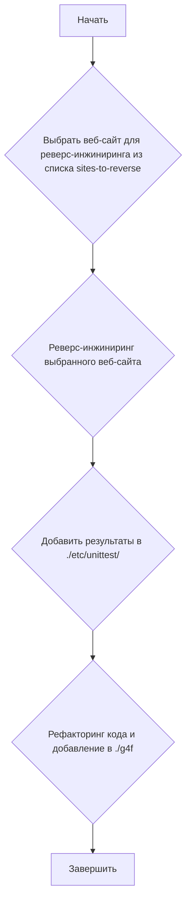
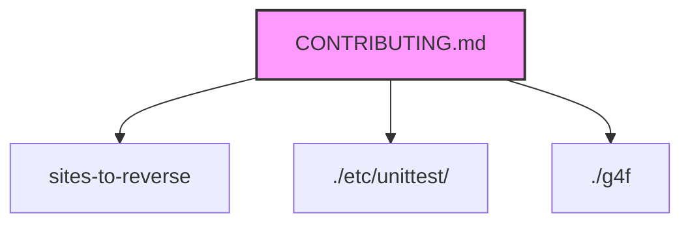

### **Системные инструкции для обработки кода проекта `hypotez`**

=========================================================================================

Описание функциональности и правил для генерации, анализа и улучшения кода. Направлено на обеспечение последовательного и читаемого стиля кодирования, соответствующего требованиям.

---

### **Основные принципы**

#### **1. Общие указания**:
- Соблюдай четкий и понятный стиль кодирования.
- Все изменения должны быть обоснованы и соответствовать установленным требованиям.

#### **2. Комментарии**:
- Используй `#` для внутренних комментариев.
- Документация всех функций, методов и классов должна следовать такому формату: 
    ```python
        def function(param: str, param1: Optional[str | dict | str] = None) -> dict | None:
            """ 
            Args:
                param (str): Описание параметра `param`.
                param1 (Optional[str | dict | str], optional): Описание параметра `param1`. По умолчанию `None`.
    
            Returns:
                dict | None: Описание возващаемого значения. Возвращает словарь или `None`.
    
            Raises:
                SomeError: Описание ситуации, в которой возникает исключение `SomeError`.

            Ехаmple:
                >>> function('param', 'param1')
                {'param': 'param1'}
            """
    ```
- Комментарии и документация должны быть четкими, лаконичными и точными.

#### **3. Форматирование кода**:
- Используй одинарные кавычки. `a:str = 'value'`, `print('Hello World!')`;
- Добавляй пробелы вокруг операторов. Например, `x = 5`;
- Все параметры должны быть аннотированы типами. `def function(param: str, param1: Optional[str | dict | str] = None) -> dict | None:`;
- Не используй `Union`. Вместо этого используй `|`.

#### **4. Логирование**:
- Для логгирования Всегда Используй модуль `logger` из `src.logger.logger`.
- Ошибки должны логироваться с использованием `logger.error`.
Пример:
    ```python
        try:
            ...
        except Exception as ex:
            logger.error('Error while processing data', ех, exc_info=True)
    ```
#### **5 Не используй `Union[]` в коде. Вместо него используй `|`
Например:
```python
x: str | int ...
```


---

### **Основные требования**:

#### **1. Формат ответов в Markdown**:
- Все ответы должны быть выполнены в формате **Markdown**.

#### **2. Формат комментариев**:
- Используй указанный стиль для комментариев и документации в коде.
- Пример:

```python
from typing import Generator, Optional, List
from pathlib import Path


def read_text_file(
    file_path: str | Path,
    as_list: bool = False,
    extensions: Optional[List[str]] = None,
    chunk_size: int = 8192,
) -> Generator[str, None, None] | str | None:
    """
    Считывает содержимое файла (или файлов из каталога) с использованием генератора для экономии памяти.

    Args:
        file_path (str | Path): Путь к файлу или каталогу.
        as_list (bool): Если `True`, возвращает генератор строк.
        extensions (Optional[List[str]]): Список расширений файлов для чтения из каталога.
        chunk_size (int): Размер чанков для чтения файла в байтах.

    Returns:
        Generator[str, None, None] | str | None: Генератор строк, объединенная строка или `None` в случае ошибки.

    Raises:
        Exception: Если возникает ошибка при чтении файла.

    Example:
        >>> from pathlib import Path
        >>> file_path = Path('example.txt')
        >>> content = read_text_file(file_path)
        >>> if content:
        ...    print(f'File content: {content[:100]}...')
        File content: Example text...
    """
    ...
```
- Всегда делай подробные объяснения в комментариях. Избегай расплывчатых терминов, 
- таких как *«получить»* или *«делать»*
-  . Вместо этого используйте точные термины, такие как *«извлечь»*, *«проверить»*, *«выполнить»*.
- Вместо: *«получаем»*, *«возвращаем»*, *«преобразовываем»* используй имя объекта *«функция получае»*, *«переменная возвращает»*, *«код преобразовывает»* 
- Комментарии должны непосредственно предшествовать описываемому блоку кода и объяснять его назначение.

#### **3. Пробелы вокруг операторов присваивания**:
- Всегда добавляйте пробелы вокруг оператора `=`, чтобы повысить читаемость.
- Примеры:
  - **Неправильно**: `x=5`
  - **Правильно**: `x = 5`

#### **4. Использование `j_loads` или `j_loads_ns`**:
- Для чтения JSON или конфигурационных файлов замените стандартное использование `open` и `json.load` на `j_loads` или `j_loads_ns`.
- Пример:

```python
# Неправильно:
with open('config.json', 'r', encoding='utf-8') as f:
    data = json.load(f)

# Правильно:
data = j_loads('config.json')
```

#### **5. Сохранение комментариев**:
- Все существующие комментарии, начинающиеся с `#`, должны быть сохранены без изменений в разделе «Улучшенный код».
- Если комментарий кажется устаревшим или неясным, не изменяйте его. Вместо этого отметьте его в разделе «Изменения».

#### **6. Обработка `...` в коде**:
- Оставляйте `...` как указатели в коде без изменений.
- Не документируйте строки с `...`.
```

#### **7. Аннотации**
Для всех переменных должны быть определены аннотации типа. 
Для всех функций все входные и выходные параметры аннотириваны
Для все параметров должны быть аннотации типа.


### **8. webdriver**
В коде используется webdriver. Он импртируется из модуля `webdriver` проекта `hypotez`
```python
from src.webdirver import Driver, Chrome, Firefox, Playwright, ...
driver = Driver(Firefox)

Пoсле чего может использоваться как

close_banner = {
  "attribute": null,
  "by": "XPATH",
  "selector": "//button[@id = 'closeXButton']",
  "if_list": "first",
  "use_mouse": false,
  "mandatory": false,
  "timeout": 0,
  "timeout_for_event": "presence_of_element_located",
  "event": "click()",
  "locator_description": "Закрываю pop-up окно, если оно не появилось - не страшно (`mandatory`:`false`)"
}

result = driver.execute_locator(close_banner)
```

## Анализ кода

Этот файл `CONTRIBUTING.md` находится в директории `hypotez/src/endpoints/gpt4free/`. Он предоставляет инструкции для тех, кто хочет внести вклад в проект `gpt4free`.

### 1. Блок-схема



Примеры:

- **A (Начать)**: Пользователь решает внести вклад в проект.
- **B (Выбрать веб-сайт)**: Пользователь выбирает, например, веб-сайт `example.com` из списка `sites-to-reverse`.
- **C (Реверс-инжиниринг)**: Пользователь анализирует, как `example.com` взаимодействует с GPT-4 и какие API использует.
- **D (Добавить в unittest)**: Пользователь добавляет тесты, проверяющие работу реверс-инжиниринга для `example.com` в `./etc/unittest/`.
- **E (Рефакторинг и добавление в g4f)**: Пользователь реорганизует код и добавляет его в директорию `./g4f`, чтобы он стал частью библиотеки `gpt4free`.
- **F (Завершить)**: Вклад внесен успешно.

### 2. Диаграмма



**Объяснение:**

- **A [CONTRIBUTING.md]**: Этот файл является отправной точкой для тех, кто хочет внести вклад.
- **B [sites-to-reverse]**: Ссылка на список веб-сайтов, которые необходимо реверс-инжинирить. Это внешний ресурс, указанный в файле.
- **C [./etc/unittest/]**: Директория внутри проекта, в которую добавляются модульные тесты для проверки функциональности реверс-инжиниринга.
- **D [./g4f]**: Директория, содержащая основной код библиотеки `gpt4free`, в которую добавляется реверс-инжиниринговый код.

Здесь нет импортов в обычном понимании Python, так как это файл Markdown. Он лишь ссылается на директории и ресурсы внутри и вне проекта.

### 3. Объяснение

- **Общее назначение**: Файл предоставляет инструкции для внесения вклада в проект `gpt4free`, особенно в части реверс-инжиниринга веб-сайтов для работы с GPT-4.
- **Ссылки**:
  - `sites-to-reverse`: Это ссылка на GitHub issue, где перечислены веб-сайты, которые нужно реверс-инжинирить.
  - `./etc/unittest/`: Директория внутри репозитория, предназначенная для хранения модульных тестов.
  - `./g4f`: Директория, содержащая основной код библиотеки `gpt4free`.
- **Процесс внесения вклада**: Включает выбор веб-сайта, его реверс-инжиниринг, добавление модульных тестов и интеграцию кода в основную библиотеку.
- **Возможные области для улучшения**:
  - Добавить более подробные инструкции по реверс-инжинирингу и написанию тестов.
  - Предоставить примеры кода и тестов для облегчения процесса внесения вклада.

**Взаимосвязи с другими частями проекта**:

- Директория `./g4f` является ключевой частью проекта, поскольку содержит основной код библиотеки `gpt4free`.
- Директория `./etc/unittest/` важна для обеспечения качества кода и предотвращения регрессий.
- Список `sites-to-reverse` определяет приоритеты для внесения вклада.