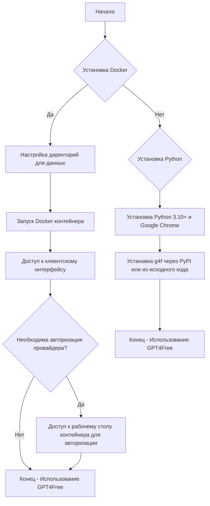
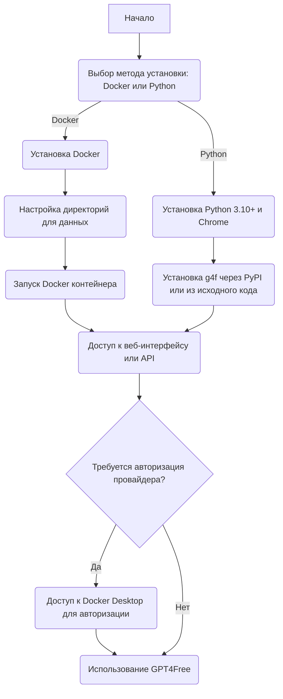

### **Анализ кода проекта `hypotez`**

=========================================================================================

Файл: `hypotez/src/endpoints/gpt4free/README.md`

#### **1. Блок-схема**



**Примеры для логических блоков:**

- **Установка Docker**: Пользователь решает использовать Docker для запуска `gpt4free`.
    ```bash
    docker pull hlohaus789/g4f
    docker run -p 8080:8080 -p 7900:7900 ... hlohaus789/g4f:latest
    ```
- **Настройка директорий для данных**: Создание директорий для хранения данных и установка прав доступа.
    ```bash
    mkdir -p ${PWD}/har_and_cookies ${PWD}/generated_images
    sudo chown -R 1200:1201 ${PWD}/har_and_cookies ${PWD}/generated_images
    ```
- **Запуск Docker контейнера**: Запуск контейнера с необходимыми параметрами.
    ```bash
    docker run -p 8080:8080 -p 7900:7900 ... hlohaus789/g4f:latest
    ```
- **Установка Python**: Пользователь решает использовать Python для запуска `gpt4free`.
    ```bash
    pip install -U g4f[all]
    ```
- **Установка Python 3.10+ и Google Chrome**: Установка необходимых компонентов для работы с Python версией 3.10 и выше.
- **Установка g4f через PyPI или из исходного кода**: Установка библиотеки `g4f` через PyPI или клонирование репозитория и установка зависимостей.
    ```bash
    pip install -U g4f[all]
    # или
    git clone https://github.com/xtekky/gpt4free.git
    cd gpt4free
    pip install -r requirements.txt
    ```
- **Доступ к клиентскому интерфейсу**: Открытие веб-интерфейса в браузере или настройка API.
    ```
    http://localhost:8080/chat/
    # или
    http://localhost:8080/v1
    ```
- **Необходима авторизация провайдера?**: Проверка необходимости авторизации для использования определенных провайдеров.
- **Доступ к рабочему столу контейнера для авторизации**: Подключение к рабочему столу Docker контейнера для выполнения авторизации.
    ```
    http://localhost:7900/?autoconnect=1&resize=scale&password=secret
    ```
- **Конец - Использование GPT4Free**: Успешная установка и использование `gpt4free`.

#### **2. Диаграмма**



**Объяснение зависимостей:**

- Диаграмма описывает процесс установки и использования `gpt4free`, начиная с выбора метода установки (Docker или Python).
- Если выбран Docker, необходимо установить Docker, настроить директории для данных и запустить контейнер.
- Если выбран Python, необходимо установить Python 3.10+ и Google Chrome, а затем установить `g4f` через PyPI или из исходного кода.
- После установки необходимо получить доступ к веб-интерфейсу или API.
- В зависимости от используемого провайдера может потребоваться авторизация через Docker Desktop.

#### **3. Объяснение**

Файл `README.md` предоставляет инструкции по установке и использованию библиотеки `gpt4free`, которая позволяет получать доступ к различным моделям AI.

- **Обзор функциональности:**
  - `gpt4free` предоставляет API для доступа к нескольким AI-провайдерам.
  - Поддерживает генерацию текста и изображений.
  - Предоставляет веб-интерфейс для удобного использования.

- **Основные разделы файла:**
  - **Что нового**: Описывает последние изменения и обновления в проекте.
  - **Установка**: Инструкции по установке с использованием Docker, Windows (.exe) и Python.
  - **Использование**: Примеры кода для генерации текста и изображений, а также запуск веб-интерфейса.
  - **Interference API**: Информация о совместимости с OpenAI API.
  - **Документация**: Ссылки на полную документацию Python API.
  - **Поддержка**: Информация о том, как получить поддержку и внести свой вклад в проект.

- **Установка через Docker:**
  - Требует установки Docker.
  - Предоставляет команды для запуска контейнера с `gpt4free`.
  - Опционально предоставляет доступ к рабочему столу контейнера для авторизации провайдеров.

- **Установка через Python:**
  - Требует Python 3.10+ и Google Chrome.
  - Инструкции по установке через PyPI или из исходного кода.

- **Примеры использования:**
  - Генерация текста:
    ```python
    from g4f.client import Client

    client = Client()
    response = client.chat.completions.create(
        model="gpt-4o-mini",
        messages=[{"role": "user", "content": "Hello"}],
        web_search=False
    )
    print(response.choices[0].message.content)
    ```
  - Генерация изображений:
    ```python
    from g4f.client import Client

    client = Client()
    response = client.images.generate(
        model="flux",
        prompt="a white siamese cat",
        response_format="url"
    )

    print(f"Generated image URL: {response.data[0].url}")
    ```
  - Запуск веб-интерфейса:
    ```python
    from g4f.gui import run_gui

    run_gui()
    ```
    или через CLI:
    ```bash
    python -m g4f.cli gui --port 8080 --debug
    ```

- **Interference API:**
  - Позволяет использовать `gpt4free` как замену OpenAI API.
  - Документация доступна по ссылке: `docs/interference-api.md`.

- **Потенциальные области для улучшения:**
  - Добавить более подробные инструкции по настройке и использованию различных провайдеров.
  - Улучшить документацию по Interference API.
  - Добавить примеры использования с другими библиотеками, такими как LangChain.

- **Взаимосвязи с другими частями проекта:**
  - `g4f.client`: Модуль для создания клиентов и выполнения запросов к AI-провайдерам.
  - `g4f.gui`: Модуль для запуска веб-интерфейса.
  - `docs/`: Каталог с документацией по различным аспектам использования `gpt4free`.