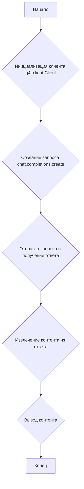
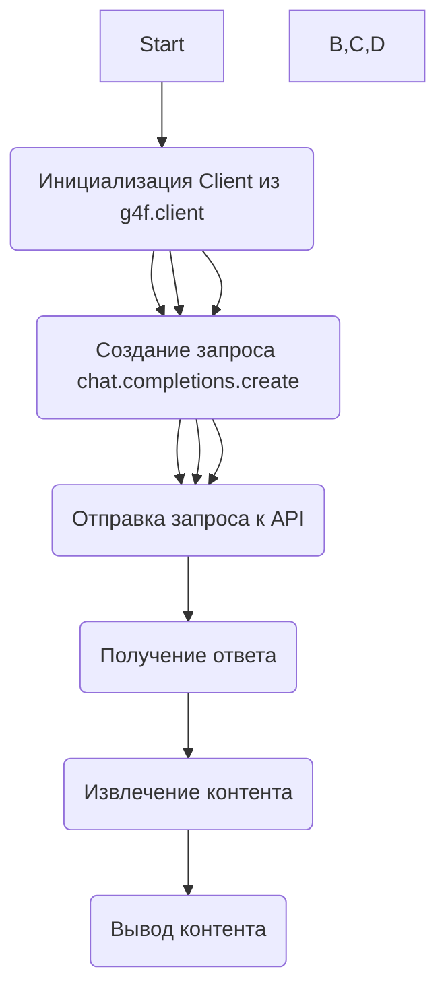

### **Анализ кода проекта `hypotez`**

=========================================================================================

#### **Расположение файла в проекте**:
`hypotez/src/endpoints/gpt4free/etc/examples/text_completions_demo_sync.py`

Данный файл, вероятно, является демонстрационным примером синхронного использования API `gpt4free` для текстовых завершений. Это позволяет предположить, что он предназначен для показа взаимодействия с библиотекой `g4f` в контексте проекта `hypotez`, возможно, как один из вариантов использования в конечных точках API.

---

### **1. Блок-схема**



**Примеры для каждого логического блока:**

1.  **Инициализация клиента**:
    ```python
    from g4f.client import Client
    client = Client()
    ```
    Создается экземпляр класса `Client` из библиотеки `g4f`.

2.  **Создание запроса**:
    ```python
    response = client.chat.completions.create(
        model="gpt-4o",
        messages=[
            {"role": "system", "content": "You are a helpful assistant."},
            {"role": "user", "content": "how does a court case get to the Supreme Court?"}
        ],
    )
    ```
    Формируется запрос к API для генерации текста на основе заданной модели (`gpt-4o`) и списка сообщений.

3.  **Отправка запроса и получение ответа**:
    Внутри `client.chat.completions.create` происходит отправка HTTP-запроса к API и получение ответа в формате JSON.

4.  **Извлечение контента из ответа**:
    ```python
    response.choices[0].message.content
    ```
    Извлекается текст сгенерированного ответа из объекта `response`.

5.  **Вывод контента**:
    ```python
    print(response.choices[0].message.content)
    ```
    Текст ответа выводится на экран.

### **2. Диаграмма**



**Объяснение зависимостей**:

*   `g4f.client`: Это модуль, который содержит класс `Client`, используемый для взаимодействия с API `gpt4free`.
    - **Важность**: Этот модуль является ключевым, поскольку он предоставляет интерфейс для выполнения запросов к API. Без него невозможно взаимодействие с `gpt4free`.
*   `client.chat.completions.create`: метод для создания запросов к API `gpt4free`.
    - **Важность**: Позволяет отправлять запросы для получения текстовых завершений.

### **3. Объяснение**

#### **Импорты**:

*   `from g4f.client import Client`: Импортирует класс `Client` из модуля `g4f.client`. Этот класс используется для создания HTTP-клиента, который взаимодействует с API `gpt4free`. Он, вероятно, содержит методы для отправки запросов и получения ответов. Взаимосвязь с другими пакетами `src.` не указана в данном фрагменте, но предполагает использование `g4f` как внешнего инструмента.

#### **Классы**:

*   `Client`: Класс, представляющий клиент для взаимодействия с API `gpt4free`. У него есть метод `chat.completions.create`, который используется для отправки запросов на генерацию текста.

#### **Функции**:

*   Отсутствуют пользовательские функции. Используется метод `create` объекта `client`.

    *   `client.chat.completions.create(model, messages)`:
        *   **Аргументы**:
            *   `model` (str): Идентификатор модели, которую нужно использовать для генерации текста (например, "gpt-4o").
            *   `messages` (list): Список словарей, представляющих сообщения в формате, требуемом API (например, [{"role": "system", "content": "You are a helpful assistant."}, {"role": "user", "content": "how does a court case get to the Supreme Court?"}]).
        *   **Возвращаемое значение**: Объект, содержащий ответ от API.
        *   **Назначение**: Отправляет запрос к API для генерации текста.

#### **Переменные**:

*   `client`: Экземпляр класса `Client`.
*   `response`: Объект, содержащий ответ от API.
*   `response.choices[0].message.content`: Строка, содержащая сгенерированный текст.

#### **Потенциальные ошибки и области для улучшения**:

*   **Обработка ошибок**: Код не содержит обработки ошибок. Если API возвращает ошибку, программа может завершиться с исключением. Необходимо добавить обработку исключений, чтобы код был более устойчивым.
*   **Конфигурация**: Параметры модели и сообщения заданы непосредственно в коде. Было бы лучше вынести их в конфигурационный файл или переменные окружения.
*   **Логирование**: Отсутствует логирование. Добавление логирования позволит отслеживать работу программы и выявлять проблемы.
*   **Асинхронность**: Код выполняется синхронно. Для повышения производительности можно использовать асинхронный клиент.

#### **Взаимосвязи с другими частями проекта**:

Этот код, вероятно, является частью модуля, который предоставляет API для генерации текста. Он может использоваться в других частях проекта, например, в веб-интерфейсе или в ботах. Взаимодействие с другими частями проекта `hypotez` не определено в данном примере.