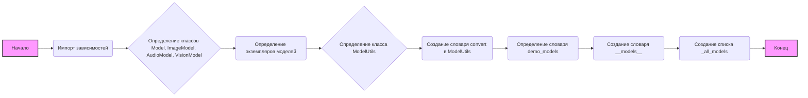

### **Системные инструкции для обработки кода проекта `hypotez`**

=========================================================================================

Описание функциональности и правил для генерации, анализа и улучшения кода. Направлено на обеспечение последовательного и читаемого стиля кодирования, соответствующего требованиям.

---

### **Основные принципы**

#### **1. Общие указания**:
- Соблюдай четкий и понятный стиль кодирования.
- Все изменения должны быть обоснованы и соответствовать установленным требованиям.

#### **2. Комментарии**:
- Используй `#` для внутренних комментариев.
- Документация всех функций, методов и классов должна следовать такому формату: 
    ```python
        def function(param: str, param1: Optional[str | dict | str] = None) -> dict | None:
            """ 
            Args:
                param (str): Описание параметра `param`.
                param1 (Optional[str | dict | str], optional): Описание параметра `param1`. По умолчанию `None`.
    
            Returns:
                dict | None: Описание возвращаемого значения. Возвращает словарь или `None`.
    
            Raises:
                SomeError: Описание ситуации, в которой возникает исключение `SomeError`.

            Ехаmple:
                >>> function('param', 'param1')
                {'param': 'param1'}
            """
    ```
- Комментарии и документация должны быть четкими, лаконичными и точными.

#### **3. Форматирование кода**:
- Используй одинарные кавычки. `a:str = 'value'`, `print('Hello World!')`;
- Добавляй пробелы вокруг операторов. Например, `x = 5`;
- Все параметры должны быть аннотированы типами. `def function(param: str, param1: Optional[str | dict | str] = None) -> dict | None:`;
- Не используй `Union`. Вместо этого используй `|`.

#### **4. Логирование**:
- Для логгирования Всегда Используй модуль `logger` из `src.logger.logger`.
- Ошибки должны логироваться с использованием `logger.error`.
Пример:
    ```python
        try:
            ...
        except Exception as ex:
            logger.error('Error while processing data', ех, exc_info=True)
    ```
#### **5 Не используй `Union[]` в коде. Вместо него используй `|`
Например:
```python
x: str | int ...
```


---

### **Основные требования**:

#### **1. Формат ответов в Markdown**:
- Все ответы должны быть выполнены в формате **Markdown**.

#### **2. Формат комментариев**:
- Используй указанный стиль для комментариев и документации в коде.
- Пример:

```python
from typing import Generator, Optional, List
from pathlib import Path


def read_text_file(
    file_path: str | Path,
    as_list: bool = False,
    extensions: Optional[List[str]] = None,
    chunk_size: int = 8192,
) -> Generator[str, None, None] | str | None:
    """
    Считывает содержимое файла (или файлов из каталога) с использованием генератора для экономии памяти.

    Args:
        file_path (str | Path): Путь к файлу или каталогу.
        as_list (bool): Если `True`, возвращает генератор строк.
        extensions (Optional[List[str]]): Список расширений файлов для чтения из каталога.
        chunk_size (int): Размер чанков для чтения файла в байтах.

    Returns:
        Generator[str, None, None] | str | None: Генератор строк, объединенная строка или `None` в случае ошибки.

    Raises:
        Exception: Если возникает ошибка при чтении файла.

    Example:
        >>> from pathlib import Path
        >>> file_path = Path('example.txt')
        >>> content = read_text_file(file_path)
        >>> if content:
        ...    print(f'File content: {content[:100]}...')
        File content: Example text...
    """
    ...
```
- Всегда делай подробные объяснения в комментариях. Избегай расплывчатых терминов, 
- таких как *«получить»* или *«делать»*
-  . Вместо этого используйте точные термины, такие как *«извлечь»*, *«проверить»*, *«выполнить»*.
- Вместо: *«получаем»*, *«возвращаем»*, *«преобразовываем»* используй имя объекта *«функция получае»*, *«переменная возвращает»*, *«код преобразовывает»* 
- Комментарии должны непосредственно предшествовать описываемому блоку кода и объяснять его назначение.

#### **3. Пробелы вокруг операторов присваивания**:
- Всегда добавляйте пробелы вокруг оператора `=`, чтобы повысить читаемость.
- Примеры:
  - **Неправильно**: `x=5`
  - **Правильно**: `x = 5`

#### **4. Использование `j_loads` или `j_loads_ns`**:
- Для чтения JSON или конфигурационных файлов замените стандартное использование `open` и `json.load` на `j_loads` или `j_loads_ns`.
- Пример:

```python
# Неправильно:
with open('config.json', 'r', encoding='utf-8') as f:
    data = json.load(f)

# Правильно:
data = j_loads('config.json')
```

#### **5. Сохранение комментариев**:
- Все существующие комментарии, начинающиеся с `#`, должны быть сохранены без изменений в разделе «Улучшенный код».
- Если комментарий кажется устаревшим или неясным, не изменяйте его. Вместо этого отметьте его в разделе «Изменения».

#### **6. Обработка `...` в коде**:
- Оставляйте `...` как указатели в коде без изменений.
- Не документируйте строки с `...`.
```

#### **7. Аннотации**
Для всех переменных должны быть определены аннотации типа. 
Для всех функций все входные и выходные параметры аннотириваны
Для все параметров должны быть аннотации типа.


### **8. webdriver**
В коде используется webdriver. Он импртируется из модуля `webdriver` проекта `hypotez`
```python
from src.webdirver import Driver, Chrome, Firefox, Playwright, ...
driver = Driver(Firefox)

Пoсле чего может использоваться как

close_banner = {
  "attribute": null,
  "by": "XPATH",
  "selector": "//button[@id = 'closeXButton']",
  "if_list": "first",
  "use_mouse": false,
  "mandatory": false,
  "timeout": 0,
  "timeout_for_event": "presence_of_element_located",
  "event": "click()",
  "locator_description": "Закрываю pop-up окно, если оно не появилось - не страшно (`mandatory`:`false`)"
}

result = driver.execute_locator(close_banner)
```

### **Анализ кода проекта `hypotez`**

=========================================================================================

#### **1. Блок-схема**



**Примеры для каждого логического блока:**

- **Импорт зависимостей**:
  ```python
  from dataclasses import dataclass
  from .Provider import IterListProvider, ProviderType
  from .Provider import AllenAI, Blackbox, ChatGLM, ...
  ```
- **Определение классов**:
  ```python
  @dataclass(unsafe_hash=True)
  class Model:
      name: str
      base_provider: str
      best_provider: ProviderType = None
  ```
- **Определение экземпляров моделей**:
  ```python
  gpt_3_5_turbo = Model(
      name='gpt-3.5-turbo',
      base_provider='OpenAI'
  )
  ```
- **Определение класса `ModelUtils`**:
  ```python
  class ModelUtils:
      convert: dict[str, Model] = {
          gpt_3_5_turbo.name: gpt_3_5_turbo,
          gpt_4.name: gpt_4,
          ...
      }
  ```
- **Создание словаря `demo_models`**:
  ```python
  demo_models = {
      llama_3_2_11b.name: [llama_3_2_11b, [HuggingChat]],
      qwen_2_vl_7b.name: [qwen_2_vl_7b, [HuggingFaceAPI]],
      ...
  }
  ```
- **Создание словаря `__models__`**:
  ```python
  __models__ = {
      model.name: (model, providers)
          for model, providers in [
              (model, [provider for provider in model.best_provider.providers if provider.working]
                  if isinstance(model.best_provider, IterListProvider)
                  else [model.best_provider]
                  if model.best_provider is not None and model.best_provider.working
                  else [])
          for model in ModelUtils.convert.values()]
          if providers
  }
  ```
- **Создание списка `_all_models`**:
  ```python
  _all_models = list(__models__.keys())
  ```

#### **2. Диаграмма**

```mermaid
flowchart TD
    subgraph Provider Modules
        AllenAI[AllenAI]
        Blackbox[Blackbox]
        ChatGLM[ChatGLM]
        ChatGptEs[ChatGptEs]
        Cloudflare[Cloudflare]
        Copilot[Copilot]
        DDG[DDG]
        DeepInfraChat[DeepInfraChat]
        Dynaspark[Dynaspark]
        Free2GPT[Free2GPT]
        FreeGpt[FreeGpt]
        HuggingSpace[HuggingSpace]
        G4F[G4F]
        Grok[Grok]
        DeepseekAI_JanusPro7b[DeepseekAI_JanusPro7b]
        Glider[Glider]
        Goabror[Goabror]
        ImageLabs[ImageLabs]
        Jmuz[Jmuz]
        LambdaChat[LambdaChat]
        Liaobots[Liaobots]
        OIVSCode[OIVSCode]
        PerplexityLabs[PerplexityLabs]
        Pi[Pi]
        PollinationsAI[PollinationsAI]
        PollinationsImage[PollinationsImage]
        TypeGPT[TypeGPT]
        TeachAnything[TeachAnything]
        Websim[Websim]
        Yqcloud[Yqcloud]
        BingCreateImages[BingCreateImages]
        CopilotAccount[CopilotAccount]
        Gemini[Gemini]
        GeminiPro[GeminiPro]
        GigaChat[GigaChat]
        HailuoAI[HailuoAI]
        HuggingChat[HuggingChat]
        HuggingFaceAPI[HuggingFaceAPI]
        MetaAI[MetaAI]
        MicrosoftDesigner[MicrosoftDesigner]
        OpenaiAccount[OpenaiAccount]
        OpenaiChat[OpenaiChat]
        Reka[Reka]
    end

    subgraph Model Definitions
        ModelClass[Class Model]
        ImageModelClass[Class ImageModel]
        AudioModelClass[Class AudioModel]
        VisionModelClass[Class VisionModel]
    end

    subgraph Model Instances
        gpt_3_5_turbo[gpt_3_5_turbo: Model]
        gpt_4[gpt_4: Model]
        gpt_4o[gpt_4o: VisionModel]
		gpt_4o_mini[gpt_4o_mini: Model]
        gpt_4o_audio[gpt_4o_audio: AudioModel]
        o1[o1: Model]
        o1_mini[o1_mini: Model]
        o3_mini[o3_mini: Model]
        gigachat[gigachat: Model]
        meta[meta: Model]
        llama_2_7b[llama_2_7b: Model]
        llama_3_8b[llama_3_8b: Model]
        llama_3_70b[llama_3_70b: Model]
        llama_3_1_8b[llama_3_1_8b: Model]
        llama_3_1_70b[llama_3_1_70b: Model]
        llama_3_1_405b[llama_3_1_405b: Model]
        llama_3_2_1b[llama_3_2_1b: Model]
        llama_3_2_3b[llama_3_2_3b: Model]
        llama_3_2_11b[llama_3_2_11b: VisionModel]
        llama_3_2_90b[llama_3_2_90b: Model]
        llama_3_3_70b[llama_3_3_70b: Model]
        mixtral_8x7b[mixtral_8x7b: Model]
        mixtral_8x22b[mixtral_8x22b: Model]
        mistral_nemo[mistral_nemo: Model]
        mixtral_small_24b[mixtral_small_24b: Model]
        hermes_3[hermes_3: Model]
        phi_3_5_mini[phi_3_5_mini: Model]
        phi_4[phi_4: Model]
        wizardlm_2_7b[wizardlm_2_7b: Model]
        wizardlm_2_8x22b[wizardlm_2_8x22b: Model]
        gemini_model[gemini: Model]
        gemini_exp[gemini_exp: Model]
        gemini_1_5_pro[gemini_1_5_pro: Model]
        gemini_1_5_flash[gemini_1_5_flash: Model]
        gemini_2_0_flash[gemini_2_0_flash: Model]
        gemini_2_0_flash_thinking[gemini_2_0_flash_thinking: Model]
        gemini_2_0_flash_thinking_with_apps[gemini_2_0_flash_thinking_with_apps: Model]
        claude_3_haiku[claude_3_haiku: Model]
        claude_3_5_sonnet[claude_3_5_sonnet: Model]
        claude_3_7_sonnet[claude_3_7_sonnet: Model]
        reka_core[reka_core: Model]
        blackboxai[blackboxai: Model]
        blackboxai_pro[blackboxai_pro: Model]
        command_r[command_r: Model]
        command_r_plus[command_r_plus: Model]
        command_r7b[command_r7b: Model]
        command_a[command_a: Model]
        qwen_1_5_7b[qwen_1_5_7b: Model]
        qwen_2_72b[qwen_2_72b: Model]
        qwen_2_vl_7b[qwen_2_vl_7b: VisionModel]
        qwen_2_5[qwen_2_5: Model]
        qwen_2_5_72b[qwen_2_5_72b: Model]
        qwen_2_5_coder_32b[qwen_2_5_coder_32b: Model]
        qwen_2_5_1m[qwen_2_5_1m: Model]
        qwen_2_5_max[qwen_2_5_max: Model]
        qwq_32b[qwq_32b: Model]
        qvq_72b[qvq_72b: VisionModel]
        pi_model[pi: Model]
        grok_3_model[grok_3: Model]
        sonar[sonar: Model]
        sonar_pro[sonar_pro: Model]
        sonar_reasoning[sonar_reasoning: Model]
        sonar_reasoning_pro[sonar_reasoning_pro: Model]
        r1_1776[r1_1776: Model]
        deepseek_chat[deepseek_chat: Model]
        deepseek_v3[deepseek_v3: Model]
        deepseek_r1[deepseek_r1: Model]
        nemotron_70b[nemotron_70b: Model]
        dbrx_instruct[dbrx_instruct: Model]
        glm_4[glm_4: Model]
        mini_max[mini_max: Model]
        yi_34b[yi_34b: Model]
        dolphin_2_6[dolphin_2_6: Model]
        dolphin_2_9[dolphin_2_9: Model]
        airoboros_70b[airoboros_70b: Model]
        lzlv_70b[lzlv_70b: Model]
        minicpm_2_5[minicpm_2_5: Model]
        tulu_3_405b[tulu_3_405b: Model]
        olmo_2_13b[olmo_2_13b: Model]
        tulu_3_1_8b[tulu_3_1_8b: Model]
        tulu_3_70b[tulu_3_70b: Model]
        olmoe_0125[olmoe_0125: Model]
        lfm_40b[lfm_40b: Model]
        evil[evil: Model]
        sdxl_turbo[sdxl_turbo: ImageModel]
        sd_3_5[sd_3_5: ImageModel]
        flux[flux: ImageModel]
        flux_pro[flux_pro: ImageModel]
        flux_dev[flux_dev: ImageModel]
        flux_schnell[flux_schnell: ImageModel]
        dall_e_3[dall_e_3: ImageModel]
        midjourney[midjourney: ImageModel]
    end
    
    ModelUtilsClass[Class ModelUtils] --> |convert: dict[str, Model]| ModelInstances
    demo_models[demo_models: dict[str, list]] --> ModelInstances
    __models__[__models__: dict[str, tuple[Model, list]]] --> ModelInstances
    _all_models[_all_models: list[str]] --> ModelInstances

    ModelInstances --> ModelClass
    ModelInstances --> ImageModelClass
    ModelInstances --> AudioModelClass
    ModelInstances --> VisionModelClass
    

    ModelClass --> AllenAI
    ModelClass --> Blackbox
    ModelClass --> ChatGLM
	ModelClass --> ChatGptEs
    ModelClass --> Cloudflare
    ModelClass --> Copilot
    ModelClass --> DDG
    ModelClass --> DeepInfraChat
    ModelClass --> Dynaspark
    ModelClass --> Free2GPT
    ModelClass --> FreeGpt
    ModelClass --> HuggingSpace
    ModelClass --> G4F
    ModelClass --> Grok
    ModelClass --> DeepseekAI_JanusPro7b
    ModelClass --> Glider
    ModelClass --> Goabror
    ModelClass --> ImageLabs
    ModelClass --> Jmuz
    ModelClass --> LambdaChat
    ModelClass --> Liaobots
    ModelClass --> OIVSCode
    ModelClass --> PerplexityLabs
    ModelClass --> Pi
    ModelClass --> PollinationsAI
    ModelClass --> PollinationsImage
    ModelClass --> TypeGPT
    ModelClass --> TeachAnything
    ModelClass --> Websim
    ModelClass --> Yqcloud
    ModelClass --> BingCreateImages
    ModelClass --> CopilotAccount
    ModelClass --> Gemini
    ModelClass --> GeminiPro
    ModelClass --> GigaChat
    ModelClass --> HailuoAI
    ModelClass --> HuggingChat
    ModelClass --> HuggingFaceAPI
    ModelClass --> MetaAI
    ModelClass --> MicrosoftDesigner
    ModelClass --> OpenaiAccount
    ModelClass --> OpenaiChat
    ModelClass --> Reka

```

**Анализ зависимостей:**

1.  **`dataclasses`**: Используется для создания классов данных (`Model`), автоматически генерируя методы, такие как `__init__`, `__repr__` и другие.
2.  **`.Provider`**:
    *   **`IterListProvider`**: Класс, который позволяет перебирать список провайдеров, пока один из них не сработает.
    *   **`ProviderType`**: Тип данных, представляющий провайдера.
    *   Различные провайдеры (например, `AllenAI`, `Blackbox`, `ChatGLM`): Конкретные реализации API для различных моделей.

#### **3. Объяснение**

**Импорты:**

*   `from __future__ import annotations`: Позволяет использовать аннотации типов, такие как `list[str]`, без необходимости импортировать `typing.List`.
*   `from dataclasses import dataclass`: Используется для создания классов данных, упрощает создание классов, которые в основном хранят данные.
*   `from .Provider import ...`: Импортирует классы и типы, связанные с провайдерами моделей, такие как `IterListProvider` и `ProviderType`, а также конкретные реализации провайдеров, такие как `AllenAI`, `Blackbox` и другие.

**Классы:**

*   **`Model`**:
    *   Роль: Представляет конфигурацию машинного обучения.
    *   Атрибуты:
        *   `name` (str): Имя модели.
        *   `base_provider` (str): Базовый провайдер для модели.
        *   `best_provider` (`ProviderType`): Предпочтительный провайдер для модели, обычно с логикой повторных попыток.
    *   Методы:
        *   `__all__() -> list[str]`: Возвращает список всех имен моделей.
    *   Взаимодействие: Используется для создания экземпляров конкретных моделей, таких как `gpt_3_5_turbo`, `gpt_4` и другие.
*   **`ImageModel(Model)`**:
    *   Роль: Подкласс `Model`, предназначенный для моделей, работающих с изображениями.
    *   Атрибуты: Наследует атрибуты от класса `Model`.
    *   Взаимодействие: Представляет модели, специализирующиеся на обработке изображений, такие как `sdxl_turbo` и `dall_e_3`.
*   **`AudioModel(Model)`**:
    *   Роль: Подкласс `Model`, предназначенный для моделей, работающих со звуком.
    *   Атрибуты: Наследует атрибуты от класса `Model`.
    *   Взаимодействие: Представляет модели, специализирующиеся на обработке аудио, такие как `gpt_4o_audio`.
*    **`VisionModel(Model)`**:
        *   Роль: Подкласс `Model`, предназначенный для моделей, работающих с видео.
        *   Атрибуты: Наследует атрибуты от класса `Model`.
        *   Взаимодействие: Представляет модели, специализирующиеся на обработке видео, такие как `llama_3_2_11b`.
*   **`ModelUtils`**:
    *   Роль: Утилитный класс для преобразования строковых идентификаторов в экземпляры `Model`.
    *   Атрибуты:
        *   `convert` (`dict[str, Model]`): Словарь, сопоставляющий строковые идентификаторы моделей с экземплярами `Model`.
    *   Методы: Отсутствуют.
    *   Взаимодействие: Используется для поиска экземпляра `Model` по его имени.

**Функции:**

*   `default = Model(...)`: Создает экземпляр `Model` по умолчанию с пустым именем и базовым провайдером, а также списком предпочтительных провайдеров.
*   `default_vision = Model(...)`: Создает экземпляр `Model` по умолчанию для моделей, работающих с видео, с пустым именем, базовым провайдером и списком предпочтительных провайдеров.

**Переменные:**

*   `gpt_3_5_turbo = Model(...)`: Экземпляр класса `Model`, представляющий модель GPT-3.5 Turbo.
*   `gpt_4 = Model(...)`: Экземпляр класса `Model`, представляющий модель GPT-4.
*   `ModelUtils.convert`: Словарь, который сопоставляет имена моделей с соответствующими экземплярами класса `Model`.
*   `__models__`: Словарь, который сопоставляет имена моделей с кортежами, содержащими экземпляр модели и список рабочих провайдеров.
*   `_all_models`: Список, содержащий имена всех моделей, определенных в `ModelUtils.convert`.
*   `demo_models`: Словарь, предназначенный для демонстрации моделей. Содержит имя модели и список рабочих провайдеров.

**Потенциальные ошибки и области для улучшения:**

*   **Дублирование ключей в `ModelUtils.convert`**: Некоторые модели (например, `gemini`) добавляются в словарь `convert` дважды, что может привести к непредсказуемому поведению.

**Взаимосвязи с другими частями проекта:**

*   Этот модуль зависит от модуля `.Provider`, который определяет различные провайдеры, используемые моделями.
*   `ModelUtils.convert` используется для поиска экземпляров моделей по их именам, что позволяет другим частям проекта динамически выбирать модели во время выполнения.

Этот код определяет набор моделей машинного обучения и их конфигурации, включая базовых и предпочтительных провайдеров. Он также предоставляет утилиты для управления этими моделями и их провайдерами.