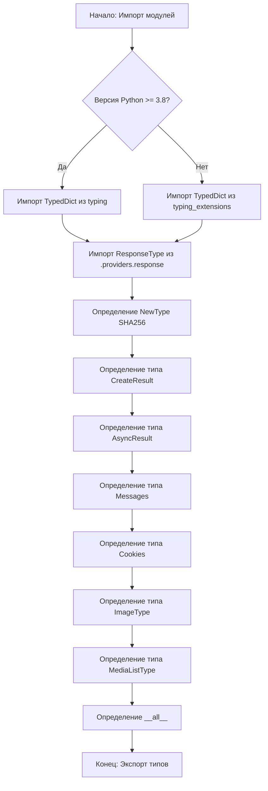
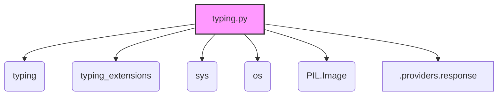

### Системные инструкции для обработки кода проекта `hypotez`

=========================================================================================

Описание функциональности и правил для генерации, анализа и улучшения кода. Направлено на обеспечение последовательного и читаемого стиля кодирования, соответствующего требованиям.

---

### **Основные принципы**

#### **1. Общие указания**:
- Соблюдай четкий и понятный стиль кодирования.
- Все изменения должны быть обоснованы и соответствовать установленным требованиям.

#### **2. Комментарии**:
- Используй `#` для внутренних комментариев.
- Документация всех функций, методов и классов должна следовать такому формату: 
    ```python
        def function(param: str, param1: Optional[str | dict | str] = None) -> dict | None:
            """ 
            Args:
                param (str): Описание параметра `param`.
                param1 (Optional[str | dict | str], optional): Описание параметра `param1`. По умолчанию `None`.
    
            Returns:
                dict | None: Описание возвращаемого значения. Возвращает словарь или `None`.
    
            Raises:
                SomeError: Описание ситуации, в которой возникает исключение `SomeError`.

            Ехаmple:
                >>> function('param', 'param1')
                {'param': 'param1'}
            """
    ```
- Комментарии и документация должны быть четкими, лаконичными и точными.

#### **3. Форматирование кода**:
- Используй одинарные кавычки. `a:str = 'value'`, `print('Hello World!')`;
- Добавляй пробелы вокруг операторов. Например, `x = 5`;
- Все параметры должны быть аннотированы типами. `def function(param: str, param1: Optional[str | dict | str] = None) -> dict | None:`;
- Не используй `Union`. Вместо этого используй `|`.

#### **4. Логирование**:
- Для логгирования Всегда Используй модуль `logger` из `src.logger.logger`.
- Ошибки должны логироваться с использованием `logger.error`.
Пример:
    ```python
        try:
            ...
        except Exception as ex:
            logger.error('Error while processing data', ех, exc_info=True)
    ```
#### **5 Не используй `Union[]` в коде. Вместо него используй `|`
Например:
```python
x: str | int ...
```


---

### **Основные требования**:

#### **1. Формат ответов в Markdown**:
- Все ответы должны быть выполнены в формате **Markdown**.

#### **2. Формат комментариев**:
- Используй указанный стиль для комментариев и документации в коде.
- Пример:

```python
from typing import Generator, Optional, List
from pathlib import Path


def read_text_file(
    file_path: str | Path,
    as_list: bool = False,
    extensions: Optional[List[str]] = None,
    chunk_size: int = 8192,
) -> Generator[str, None, None] | str | None:
    """
    Считывает содержимое файла (или файлов из каталога) с использованием генератора для экономии памяти.

    Args:
        file_path (str | Path): Путь к файлу или каталогу.
        as_list (bool): Если `True`, возвращает генератор строк.
        extensions (Optional[List[str]]): Список расширений файлов для чтения из каталога.
        chunk_size (int): Размер чанков для чтения файла в байтах.

    Returns:
        Generator[str, None, None] | str | None: Генератор строк, объединенная строка или `None` в случае ошибки.

    Raises:
        Exception: Если возникает ошибка при чтении файла.

    Example:
        >>> from pathlib import Path
        >>> file_path = Path('example.txt')
        >>> content = read_text_file(file_path)
        >>> if content:
        ...    print(f'File content: {content[:100]}...')
        File content: Example text...
    """
    ...
```
- Всегда делай подробные объяснения в комментариях. Избегай расплывчатых терминов, 
- таких как *«получить»* или *«делать»*. Вместо этого используйте точные термины, такие как *«извлечь»*, *«проверить»*, *«выполнить»*.
- Вместо: *«получаем»*, *«возвращаем»*, *«преобразовываем»* используй имя объекта *«функция получае»*, *«переменная возвращает»*, *«код преобразовывает»* 
- Комментарии должны непосредственно предшествовать описываемому блоку кода и объяснять его назначение.

#### **3. Пробелы вокруг операторов присваивания**:
- Всегда добавляйте пробелы вокруг оператора `=`, чтобы повысить читаемость.
- Примеры:
  - **Неправильно**: `x=5`
  - **Правильно**: `x = 5`

#### **4. Использование `j_loads` или `j_loads_ns`**:
- Для чтения JSON или конфигурационных файлов замените стандартное использование `open` и `json.load` на `j_loads` или `j_loads_ns`.
- Пример:

```python
# Неправильно:
with open('config.json', 'r', encoding='utf-8') as f:
    data = json.load(f)

# Правильно:
data = j_loads('config.json')
```

#### **5. Сохранение комментариев**:
- Все существующие комментарии, начинающиеся с `#`, должны быть сохранены без изменений в разделе «Улучшенный код».
- Если комментарий кажется устаревшим или неясным, не изменяйте его. Вместо этого отметьте его в разделе «Изменения».

#### **6. Обработка `...` в коде**:
- Оставляйте `...` как указатели в коде без изменений.
- Не документируйте строки с `...`.
```

#### **7. Аннотации**
Для всех переменных должны быть определены аннотации типа. 
Для всех функций все входные и выходные параметры аннотириваны
Для все параметров должны быть аннотации типа.


### **8. webdriver**
В коде используется webdriver. Он импртируется из модуля `webdriver` проекта `hypotez`
```python
from src.webdirver import Driver, Chrome, Firefox, Playwright, ...
driver = Driver(Firefox)

Пoсле чего может использоваться как

close_banner = {
  "attribute": null,
  "by": "XPATH",
  "selector": "//button[@id = 'closeXButton']",
  "if_list": "first",
  "use_mouse": false,
  "mandatory": false,
  "timeout": 0,
  "timeout_for_event": "presence_of_element_located",
  "event": "click()",
  "locator_description": "Закрываю pop-up окно, если оно не появилось - не страшно (`mandatory`:`false`)"
}

result = driver.execute_locator(close_banner)
```

### Анализ кода `hypotez/src/endpoints/gpt4free/g4f/typing.py`

#### 1. Блок-схема:



*   **A**: Начало блока. Импортирует необходимые модули, такие как `sys`, `os`, `typing`.
*   **B**: Условный блок. Проверяет версию Python. Если версия >= 3.8, то используется `TypedDict` из стандартной библиотеки `typing`.
*   **C**: Импорт `TypedDict` из модуля `typing`.
*   **D**: Импорт `TypedDict` из `typing_extensions`, если версия Python < 3.8.
*   **E**: Импортирует `ResponseType` из `./providers/response.py`. Этот тип используется для представления ответа от провайдера.
*   **F**: Определяет `NewType` с именем `SHA256` для строкового представления SHA256 hash.
*   **G**: Определяет тип `CreateResult` как итератор, возвращающий `str` или `ResponseType`.
*   **H**: Определяет тип `AsyncResult` как асинхронный итератор, возвращающий `str` или `ResponseType`.
*   **I**: Определяет тип `Messages` как список словарей, содержащих строковые ключи и значения, которые могут быть строками или списками словарей. Эти словари содержат строковые ключи и значения, которые могут быть строками или словарями.
*   **J**: Определяет тип `Cookies` как словарь, где ключи и значения являются строками.
*   **K**: Определяет тип `ImageType` как объединение `str`, `bytes`, `IO`, `Image`, `os.PathLike`.
*   **L**: Определяет тип `MediaListType` как список кортежей, где первый элемент кортежа - `ImageType`, а второй - `Optional[str]`.
*   **M**: Определяет `__all__` как список строк, содержащий имена всех определенных типов. Это нужно для упрощения импорта (`from g4f.typing import *`).
*   **Z**: Конец блок-схемы.

#### 2. Диаграмма зависимостей:



*   **typing.py**: Основной файл, определяющий типы.
*   **typing**: Модуль стандартной библиотеки Python, используемый для аннотации типов.
*   **typing\_extensions**: Модуль, содержащий расширенные возможности `typing` для старых версий Python.
*   **sys**: Модуль, предоставляющий доступ к некоторым переменным и функциям, взаимодействующим с интерпретатором Python.
*   **os**: Модуль, предоставляющий способы взаимодействия с операционной системой.
*   **PIL.Image**: Модуль библиотеки Pillow для работы с изображениями.
*   **.providers.response**: Подмодуль, содержащий класс `ResponseType`, используемый для представления ответов.

#### 3. Объяснение:

*   **Импорты**:
    *   `import sys`: Используется для доступа к переменным и функциям, связанным с интерпретатором Python, например, для проверки версии Python.
    *   `import os`: Используется для взаимодействия с операционной системой, например, для работы с путями к файлам.
    *   `from typing import ...`: Импортирует различные типы из модуля `typing`, такие как `Any`, `AsyncGenerator`, `Generator`, `AsyncIterator`, `Iterator`, `Tuple`, `Union`, `List`, `Dict`, `Type`, `IO`, `Optional`, `NewType`. Они используются для аннотации типов переменных, аргументов функций и возвращаемых значений.
    *   `from typing_extensions import TypedDict`: Импортируется `TypedDict` из `typing_extensions`, если версия Python меньше 3.8, так как в более ранних версиях `TypedDict` отсутствует в стандартном модуле `typing`.
    *   `from PIL.Image import Image`: Попытка импортировать класс `Image` из библиотеки Pillow (PIL). Если Pillow не установлена, определяется пустой класс `Image`, чтобы избежать ошибок при использовании аннотации типов.
    *   `from .providers.response import ResponseType`: Импортирует `ResponseType` из подмодуля `providers.response`.

*   **Классы**:
    *   `Image`: Определен как пустой класс, если не удалось импортировать из `PIL.Image`. Используется как тип для аннотации переменных, связанных с изображениями.

*   **Функции**:
    *   Нет функций. Файл содержит только определения типов.

*   **Переменные**:
    *   `SHA256`: Определен с использованием `NewType` как псевдоним для `str`, представляющий SHA256 hash.
    *   `CreateResult`: Определен как `Iterator[Union[str, ResponseType]]`, представляющий итератор, который может возвращать строки или объекты типа `ResponseType`.
    *   `AsyncResult`: Определен как `AsyncIterator[Union[str, ResponseType]]`, представляющий асинхронный итератор, который может возвращать строки или объекты типа `ResponseType`.
    *   `Messages`: Определен как `List[Dict[str, Union[str, List[Dict[str, Union[str, Dict[str, str]]]]]]]`, представляющий сложную структуру данных для сообщений.
    *   `Cookies`: Определен как `Dict[str, str]`, представляющий словарь для хранения cookie.
    *   `ImageType`: Определен как `Union[str, bytes, IO, Image, os.PathLike]`, представляющий различные типы данных, которые могут быть использованы для представления изображения.
    *   `MediaListType`: Определен как `List[Tuple[ImageType, Optional[str]]]`, представляющий список кортежей, содержащих изображение и опциональное описание.
    *   `__all__`: Список строк, содержащий имена всех определенных типов. Используется для упрощения импорта.

*   **Потенциальные ошибки и области для улучшения**:
    *   Отсутствие обработки исключений при импорте `PIL.Image`. Возможно, стоит добавить логирование ошибки, если Pillow не установлен.
    *   Сложная структура типа `Messages` может быть упрощена для улучшения читаемости.
    *   Использование `Union` вместо `|` (начиная с Python 3.10 `|` предпочтительнее).

#### Взаимосвязи с другими частями проекта:

*   `ResponseType` используется в `CreateResult` и `AsyncResult`, что указывает на то, что этот файл связан с модулем, обрабатывающим ответы от провайдеров (вероятно, GPT4Free providers).
*   Определенные типы используются для аннотации функций и методов в других частях проекта, обеспечивая статическую проверку типов.