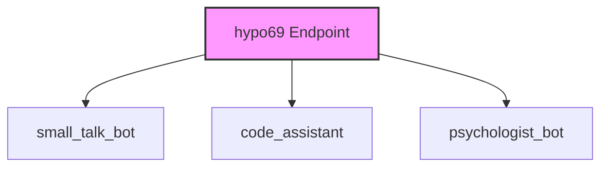

### **Анализ кода проекта `hypotez`**

=========================================================================================

Данный анализ предназначен для предоставления структурированного обзора функциональности и архитектуры предоставленного кода.

---

### **1. Блок-схема**

```mermaid
graph TD
    A[Начало] --> B{Определение модуля src.endpoints.hypo69};
    B --> C[Описание: Endpoint for my code AI training];
    C --> D{Навигация по проекту};
    D --> E[Ссылка на корень проекта: readme.ru.md];
    D --> F[Ссылка на директорию src: src/README.MD];
    D --> G[Ссылка на директорию endpoints: src/endpoints/README.MD];
    D --> H[Языковая версия: Русский (readme.ru.md)];
    H --> I[Описание модуля `hypo69`: Developer endpoints];
    I --> J[small_talk_bot - бот с чатом модели ии];
    I --> K[code_assistant - модуль обучения модели коду проекта];
    I --> L[psychologist_bot - ранняя разработка модуля парсинга диалогов];
    L --> M[Конец];
```

**Примеры для логических блоков:**

*   **A (Начало)**: Начальная точка документа.
*   **B (Определение модуля)**: Указывает на начало описания модуля `src.endpoints.hypo69`.
*   **C (Описание)**: Описывает назначение модуля как endpoint для обучения AI.
*   **D (Навигация)**: Предоставляет ссылки для навигации по проекту и документации.
*   **E (Ссылка на корень проекта)**: Ссылка на главный `readme.ru.md` файл.
*   **F (Ссылка на директорию src)**: Ссылка на директорию `src`.
*   **G (Ссылка на директорию endpoints)**: Ссылка на директорию `endpoints`.
*   **H (Языковая версия)**: Указывает на наличие русской версии документации.
*   **I (Описание модуля `hypo69`)**: Описывает `hypo69` как endpoint для разработчиков.
*   **J (small\_talk\_bot)**: Описание компонента бота для чата с моделью ИИ.
*   **K (code\_assistant)**: Описание модуля для обучения модели коду проекта.
*   **L (psychologist\_bot)**: Описание модуля для парсинга диалогов (ранняя разработка).
*   **M (Конец)**: Конечная точка документа.

### **2. Диаграмма зависимостей**



**Объяснение диаграммы:**

*   **hypo69 Endpoint**: Главный модуль, представляющий endpoint для разработчиков.
*   **small\_talk\_bot**: Бот с чатом модели ИИ, компонент модуля `hypo69`.
*   **code\_assistant**: Модуль обучения модели коду проекта, компонент модуля `hypo69`.
*   **psychologist\_bot**: Модуль парсинга диалогов (ранняя разработка), компонент модуля `hypo69`.

### **3. Объяснение**

#### **Импорты**:

В предоставленном коде отсутствуют явные импорты. Однако, предполагается, что модуль `src.endpoints.hypo69` может использовать другие модули из пакета `src`.

#### **Классы**:

В предоставленном фрагменте кода нет определения классов. Однако, судя по описанию, `small_talk_bot`, `code_assistant` и `psychologist_bot` могут быть реализованы как отдельные классы или модули.

#### **Функции**:

В коде указано:

```rst
.. module:: src.endpoints.hypo69
	.. synopsys: Endpoint for my code AI trainig
```

Это указывает на то, что `src.endpoints.hypo69` является модулем.

#### **Переменные**:

Переменные в явном виде не представлены, но из описания можно выделить:

*   `small_talk_bot`: Бот для общения.
*   `code_assistant`: Инструмент для обучения.
*   `psychologist_bot`: Инструмент для анализа диалогов.

#### **Потенциальные ошибки и области для улучшения**:

*   **Отсутствие структуры**: Код представлен в виде README, что затрудняет понимание структуры и зависимостей.
*   **Неопределенность реализации**: Отсутствует конкретный код реализации модулей, что делает невозможным детальный анализ.

#### **Взаимосвязь с другими частями проекта**:

Модуль `src.endpoints.hypo69` является частью системы endpoints, предназначенной для предоставления различных API и функциональности разработчикам. Он может взаимодействовать с другими модулями в проекте `hypotez` для выполнения своих задач, таких как обучение модели (`code_assistant`) или общение с пользователем (`small_talk_bot`).