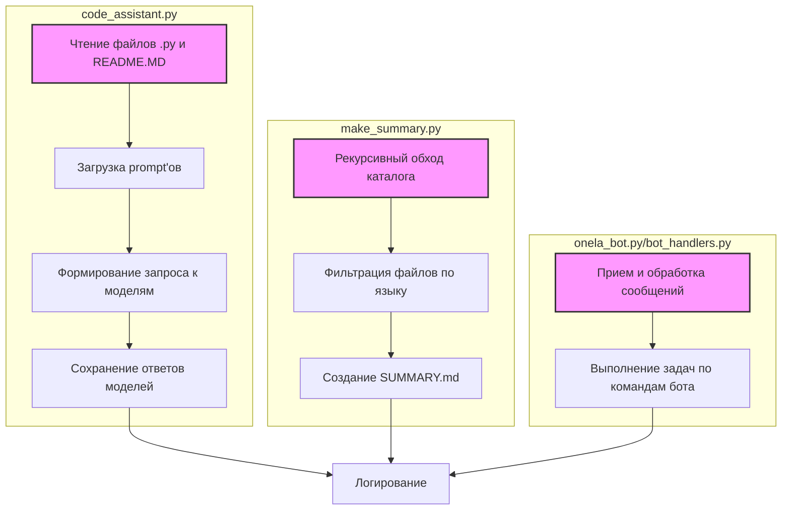

### **Системные инструкции для обработки кода проекта `hypotez`**

=========================================================================================

Описание функциональности и правил для генерации, анализа и улучшения кода. Направлено на обеспечение последовательного и читаемого стиля кодирования, соответствующего требованиям.

---

### **Основные принципы**

#### **1. Общие указания**:
- Соблюдай четкий и понятный стиль кодирования.
- Все изменения должны быть обоснованы и соответствовать установленным требованиям.

#### **2. Комментарии**:
- Используй `#` для внутренних комментариев.
- Документация всех функций, методов и классов должна следовать такому формату: 
    ```python
        def function(param: str, param1: Optional[str | dict | str] = None) -> dict | None:
            """ 
            Args:
                param (str): Описание параметра `param`.
                param1 (Optional[str | dict | str], optional): Описание параметра `param1`. По умолчанию `None`.
    
            Returns:
                dict | None: Описание возвращаемого значения. Возвращает словарь или `None`.
    
            Raises:
                SomeError: Описание ситуации, в которой возникает исключение `SomeError`.

            Ехаmple:
                >>> function('param', 'param1')
                {'param': 'param1'}
            """
    ```
- Комментарии и документация должны быть четкими, лаконичными и точными.

#### **3. Форматирование кода**:
- Используй одинарные кавычки. `a:str = 'value'`, `print('Hello World!')`;
- Добавляй пробелы вокруг операторов. Например, `x = 5`;
- Все параметры должны быть аннотированы типами. `def function(param: str, param1: Optional[str | dict | str] = None) -> dict | None:`;
- Не используй `Union`. Вместо этого используй `|`.

#### **4. Логирование**:
- Для логгирования Всегда Используй модуль `logger` из `src.logger.logger`.
- Ошибки должны логироваться с использованием `logger.error`.
Пример:
    ```python
        try:
            ...
        except Exception as ex:
            logger.error('Error while processing data', ех, exc_info=True)
    ```
#### **5 Не используй `Union[]` в коде. Вместо него используй `|`
Например:
```python
x: str | int ...
```


---

### **Основные требования**:

#### **1. Формат ответов в Markdown**:
- Все ответы должны быть выполнены в формате **Markdown**.

#### **2. Формат комментариев**:
- Используй указанный стиль для комментариев и документации в коде.
- Пример:

```python
from typing import Generator, Optional, List
from pathlib import Path


def read_text_file(
    file_path: str | Path,
    as_list: bool = False,
    extensions: Optional[List[str]] = None,
    chunk_size: int = 8192,
) -> Generator[str, None, None] | str | None:
    """
    Считывает содержимое файла (или файлов из каталога) с использованием генератора для экономии памяти.

    Args:
        file_path (str | Path): Путь к файлу или каталогу.
        as_list (bool): Если `True`, возвращает генератор строк.
        extensions (Optional[List[str]]): Список расширений файлов для чтения из каталога.
        chunk_size (int): Размер чанков для чтения файла в байтах.

    Returns:
        Generator[str, None, None] | str | None: Генератор строк, объединенная строка или `None` в случае ошибки.

    Raises:
        Exception: Если возникает ошибка при чтении файла.

    Example:
        >>> from pathlib import Path
        >>> file_path = Path('example.txt')
        >>> content = read_text_file(file_path)
        >>> if content:
        ...    print(f'File content: {content[:100]}...')
        File content: Example text...
    """
    ...
```
- Всегда делай подробные объяснения в комментариях. Избегай расплывчатых терминов, 
- таких как *«получить»* или *«делать»*
-  . Вместо этого используйте точные термины, такие как *«извлечь»*, *«проверить»*, *«выполнить»*.
- Вместо: *«получаем»*, *«возвращаем»*, *«преобразовываем»* используй имя объекта *«функция получае»*, *«переменная возвращает»*, *«код преобразовывает»* 
- Комментарии должны непосредственно предшествовать описываемому блоку кода и объяснять его назначение.

#### **3. Пробелы вокруг операторов присваивания**:
- Всегда добавляйте пробелы вокруг оператора `=`, чтобы повысить читаемость.
- Примеры:
  - **Неправильно**: `x=5`
  - **Правильно**: `x = 5`

#### **4. Использование `j_loads` или `j_loads_ns`**:
- Для чтения JSON или конфигурационных файлов замените стандартное использование `open` и `json.load` на `j_loads` или `j_loads_ns`.
- Пример:

```python
# Неправильно:
with open('config.json', 'r', encoding='utf-8') as f:
    data = json.load(f)

# Правильно:
data = j_loads('config.json')
```

#### **5. Сохранение комментариев**:
- Все существующие комментарии, начинающиеся с `#`, должны быть сохранены без изменений в разделе «Улучшенный код».
- Если комментарий кажется устаревшим или неясным, не изменяйте его. Вместо этого отметьте его в разделе «Изменения».

#### **6. Обработка `...` в коде**:
- Оставляйте `...` как указатели в коде без изменений.
- Не документируйте строки с `...`.
```

#### **7. Аннотации**
Для всех переменных должны быть определены аннотации типа. 
Для всех функций все входные и выходные параметры аннотириваны
Для все параметров должны быть аннотации типа.


### **8. webdriver**
В коде используется webdriver. Он импртируется из модуля `webdriver` проекта `hypotez`
```python
from src.webdirver import Driver, Chrome, Firefox, Playwright, ...
driver = Driver(Firefox)

Пoсле чего может использоваться как

close_banner = {
  "attribute": null,
  "by": "XPATH",
  "selector": "//button[@id = 'closeXButton']",
  "if_list": "first",
  "use_mouse": false,
  "mandatory": false,
  "timeout": 0,
  "timeout_for_event": "presence_of_element_located",
  "event": "click()",
  "locator_description": "Закрываю pop-up окно, если оно не появилось - не страшно (`mandatory`:`false`)"
}

result = driver.execute_locator(close_banner)
```

## Анализ `README.MD` файла модуля `code_assistant`

Файл `README.MD` предоставляет общее описание и инструкции по использованию модуля `code_assistant` в проекте `hypotez`. Модуль предназначен для автоматизации задач, связанных с анализом и обработкой кода, таких как генерация документации, проверка кода и создание тестов, с использованием моделей **Gemini** и **OpenAI**.

### 1. Блок-схема

```mermaid
graph LR
    A[Начало: Вызов скрипта code_assistant.py, make_summary.py или onela_bot.py] --> B{Определение настроек: JSON или параметры командной строки};
    B -- JSON settings.json --> C[Чтение параметров из JSON];
    B -- Параметры командной строки --> D[Обработка параметров командной строки];
    C --> E{Выбор скрипта};
    D --> E;
    E -- code_assistant.py --> F[Чтение файлов .py и README.MD];
    E -- make_summary.py --> G[Рекурсивный обход каталога для создания SUMMARY.md];
    E -- onela_bot.py / bot_handlers.py --> H[Обработка команд Telegram-бота];
    F --> I[Загрузка prompt'ов из src/ai/prompts/developer/];
    I --> J[Формирование запроса к моделям Gemini/OpenAI];
    J --> K[Сохранение ответов моделей в директориях docs/raw_rst_from_<model>/<lang>/];
    G --> L{Фильтрация файлов по языку (ru/en)};
    L --> M[Создание SUMMARY.md];
    H --> N[Прием и обработка сообщений через Telegram API];
    N --> O[Выполнение задач по командам бота];
    K --> P[Логирование процесса обработки файлов и ответов моделей];
    M --> P;
    O --> P;
    P --> Q[Завершение];
```

**Примеры логических блоков:**

*   **A (Начало):** Пользователь запускает скрипт `code_assistant.py` с параметрами, определяющими роль (`doc_writer`, `code_checker`), язык (`ru`, `en`), модели (`gemini`, `openai`) и директории для обработки.
*   **B (Определение настроек):** Скрипт проверяет, предоставлен ли файл настроек `settings.json`. Если да, настройки считываются из файла, иначе используются параметры командной строки.
*   **F (Чтение файлов .py и README.MD):** Скрипт `code_assistant.py` сканирует указанные директории в поисках файлов с расширениями `.py` и `README.MD`, исключая файлы и директории, указанные в параметрах исключений.
*   **J (Формирование запроса к моделям Gemini/OpenAI):** На основе прочитанных файлов и загруженных prompt'ов формируется запрос к выбранным моделям Gemini или OpenAI для выполнения задачи, например, генерации документации или проверки кода.
*   **M (Создание SUMMARY.md):** Скрипт `make_summary.py` создает файл `SUMMARY.md`, который содержит структуру каталогов и файлов, отфильтрованных по языку, для использования в процессе создания документации.
*   **O (Выполнение задач по командам бота):** Telegram-бот принимает команды от пользователей, например, запрос на проверку кода, и выполняет соответствующие действия, используя модели Gemini или OpenAI.

### 2. Диаграмма



**Зависимости и пояснения:**

*   **`code_assistant.py`**: Отвечает за чтение файлов кода и документации, загрузку prompt'ов, взаимодействие с моделями Gemini/OpenAI и сохранение результатов.
*   **`make_summary.py`**: Отвечает за создание файла `SUMMARY.md` на основе структуры каталогов и файлов, с возможностью фильтрации по языку.
*   **`onela_bot.py` и `bot_handlers.py`**: Реализуют функциональность Telegram-бота для обработки команд и сообщений, связанных с анализом кода.
*   Все три скрипта используют общий модуль **Логирование** для записи информации о процессе выполнения.

### 3. Объяснение

#### Импорты

В предоставленном тексте нет явных импортов, но подразумевается, что скрипты используют следующие модули и API:

*   **Gemini API**: API для взаимодействия с моделью Gemini. Требуется API key.
*   **OpenAI API**: API для взаимодействия с моделями OpenAI. Требуется API key.
*   **`src/ai/prompts/developer/`**: Директория, содержащая файлы с prompt'ами для разных ролей (например, `doc_writer_en.md`).
*   **`logger`**: Библиотека для логирования событий и ошибок.

#### Классы

В `README.MD` не описаны классы, но подразумевается, что в скриптах могут использоваться классы для представления различных сущностей, таких как:

*   **`CodeAssistant`**: Класс, инкапсулирующий логику взаимодействия с моделями и обработки файлов.
*   **`SummaryGenerator`**: Класс для генерации файла `SUMMARY.md`.
*   **`TelegramBot`**: Класс для управления Telegram-ботом и обработки команд.

#### Функции

*   **`read_files(dirs: List[str]) -> List[str]`**: Функция для чтения файлов `.py` и `README.MD` из указанных директорий. Возвращает список путей к файлам.
*   **`load_prompt(role: str, lang: str) -> str`**: Функция для загрузки prompt'а из директории `src/ai/prompts/developer/`. Возвращает строку с содержимым prompt'а.
*   **`send_request(model: str, prompt: str, code: str) -> str`**: Функция для отправки запроса к моделям Gemini или OpenAI. Возвращает ответ модели.
*   **`save_response(role: str, model: str, lang: str, filename: str, response: str) -> None`**: Функция для сохранения ответа модели в указанной директории.
*   **`create_summary(dir: str, lang: str) -> None`**: Функция для создания файла `SUMMARY.md` на основе структуры каталогов и файлов.

#### Переменные

*   **`settings`**: Словарь с настройками, считанными из файла `settings.json` или переданными через параметры командной строки.
*   **`role`**: Строка, определяющая роль модели (например, `doc_writer`, `code_checker`).
*   **`lang`**: Строка, определяющая язык для задачи (например, `ru`, `en`).
*   **`models`**: Список строк, определяющих модели для использования (например, `gemini`, `openai`).
*   **`start_dirs`**: Список строк, определяющих директории для обработки.
*   **`exclude_file_patterns`**: Список регулярных выражений для исключения файлов.
*   **`exclude_dirs`**: Список директорий для исключения.
*   **`exclude_files`**: Список файлов для исключения.

#### Потенциальные ошибки и области для улучшения

*   **Обработка исключений**: Необходимо предусмотреть обработку исключений при чтении файлов, отправке запросов к моделям и сохранении результатов.
*   **Валидация параметров**: Необходимо валидировать параметры, переданные через командную строку или файл настроек, чтобы избежать ошибок.
*   **Логирование**: Добавить более подробное логирование процесса обработки файлов и взаимодействия с моделями.
*   **Параллельная обработка**: Рассмотреть возможность параллельной обработки файлов для ускорения работы скриптов.

#### Взаимосвязи с другими частями проекта

*   Модуль `code_assistant` использует prompt'ы, хранящиеся в директории `src/ai/prompts/developer/`.
*   Модуль `code_assistant` использует библиотеку `logger` для логирования событий и ошибок.
*   Модуль `code_assistant` может использовать API для взаимодействия с моделями Gemini и OpenAI, которые могут быть реализованы в других частях проекта.