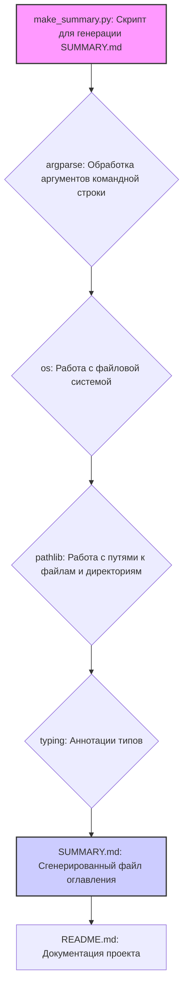

### **Системные инструкции для обработки кода проекта `hypotez`**

=========================================================================================

Описание функциональности и правил для генерации, анализа и улучшения кода. Направлено на обеспечение последовательного и читаемого стиля кодирования, соответствующего требованиям.

---

### **Основные принципы**

#### **1. Общие указания**:
- Соблюдай четкий и понятный стиль кодирования.
- Все изменения должны быть обоснованы и соответствовать установленным требованиям.

#### **2. Комментарии**:
- Используй `#` для внутренних комментариев.
- Документация всех функций, методов и классов должна следовать такому формату: 
    ```python
        def function(param: str, param1: Optional[str | dict | str] = None) -> dict | None:
            """ 
            Args:
                param (str): Описание параметра `param`.
                param1 (Optional[str | dict | str], optional): Описание параметра `param1`. По умолчанию `None`.
    
            Returns:
                dict | None: Описание возвращаемого значения. Возвращает словарь или `None`.
    
            Raises:
                SomeError: Описание ситуации, в которой возникает исключение `SomeError`.

            Ехаmple:
                >>> function('param', 'param1')
                {'param': 'param1'}
            """
    ```
- Комментарии и документация должны быть четкими, лаконичными и точными.

#### **3. Форматирование кода**:
- Используй одинарные кавычки. `a:str = 'value'`, `print('Hello World!')`;
- Добавляй пробелы вокруг операторов. Например, `x = 5`;
- Все параметры должны быть аннотированы типами. `def function(param: str, param1: Optional[str | dict | str] = None) -> dict | None:`;
- Не используй `Union`. Вместо этого используй `|`.

#### **4. Логирование**:
- Для логгирования Всегда Используй модуль `logger` из `src.logger.logger`.
- Ошибки должны логироваться с использованием `logger.error`.
Пример:
    ```python
        try:
            ...
        except Exception as ex:
            logger.error('Error while processing data', ех, exc_info=True)
    ```
#### **5 Не используй `Union[]` в коде. Вместо него используй `|`
Например:
```python
x: str | int ...
```


---

### **Основные требования**:

#### **1. Формат ответов в Markdown**:
- Все ответы должны быть выполнены в формате **Markdown**.

#### **2. Формат комментариев**:
- Используй указанный стиль для комментариев и документации в коде.
- Пример:

```python
from typing import Generator, Optional, List
from pathlib import Path


def read_text_file(
    file_path: str | Path,
    as_list: bool = False,
    extensions: Optional[List[str]] = None,
    chunk_size: int = 8192,
) -> Generator[str, None, None] | str | None:
    """
    Считывает содержимое файла (или файлов из каталога) с использованием генератора для экономии памяти.

    Args:
        file_path (str | Path): Путь к файлу или каталогу.
        as_list (bool): Если `True`, возвращает генератор строк.
        extensions (Optional[List[str]]): Список расширений файлов для чтения из каталога.
        chunk_size (int): Размер чанков для чтения файла в байтах.

    Returns:
        Generator[str, None, None] | str | None: Генератор строк, объединенная строка или `None` в случае ошибки.

    Raises:
        Exception: Если возникает ошибка при чтении файла.

    Example:
        >>> from pathlib import Path
        >>> file_path = Path('example.txt')
        >>> content = read_text_file(file_path)
        >>> if content:
        ...    print(f'File content: {content[:100]}...')
        File content: Example text...
    """
    ...
```
- Всегда делай подробные объяснения в комментариях. Избегай расплывчатых терминов, 
- таких как *«получить»* или *«делать»*
-  . Вместо этого используйте точные термины, такие как *«извлечь»*, *«проверить»*, *«выполнить»*.
- Вместо: *«получаем»*, *«возвращаем»*, *«преобразовываем»* используй имя объекта *«функция получае»*, *«переменная возвращает»*, *«код преобразовывает»* 
- Комментарии должны непосредственно предшествовать описываемому блоку кода и объяснять его назначение.

#### **3. Пробелы вокруг операторов присваивания**:
- Всегда добавляйте пробелы вокруг оператора `=`, чтобы повысить читаемость.
- Примеры:
  - **Неправильно**: `x=5`
  - **Правильно**: `x = 5`

#### **4. Использование `j_loads` или `j_loads_ns`**:
- Для чтения JSON или конфигурационных файлов замените стандартное использование `open` и `json.load` на `j_loads` или `j_loads_ns`.
- Пример:

```python
# Неправильно:
with open('config.json', 'r', encoding='utf-8') as f:
    data = json.load(f)

# Правильно:
data = j_loads('config.json')
```

#### **5. Сохранение комментариев**:
- Все существующие комментарии, начинающиеся с `#`, должны быть сохранены без изменений в разделе «Улучшенный код».
- Если комментарий кажется устаревшим или неясным, не изменяйте его. Вместо этого отметьте его в разделе «Изменения».

#### **6. Обработка `...` в коде**:
- Оставляйте `...` как указатели в коде без изменений.
- Не документируйте строки с `...`.
```

#### **7. Аннотации**
Для всех переменных должны быть определены аннотации типа. 
Для всех функций все входные и выходные параметры аннотириваны
Для все параметров должны быть аннотации типа.


### **8. webdriver**
В коде используется webdriver. Он импртируется из модуля `webdriver` проекта `hypotez`
```python
from src.webdirver import Driver, Chrome, Firefox, Playwright, ...
driver = Driver(Firefox)

Пoсле чего может использоваться как

close_banner = {
  "attribute": null,
  "by": "XPATH",
  "selector": "//button[@id = 'closeXButton']",
  "if_list": "first",
  "use_mouse": false,
  "mandatory": false,
  "timeout": 0,
  "timeout_for_event": "presence_of_element_located",
  "event": "click()",
  "locator_description": "Закрываю pop-up окно, если оно не появилось - не страшно (`mandatory`:`false`)"
}

result = driver.execute_locator(close_banner)
```

## Анализ кода модуля `make_summary.py`

### 1. Блок-схема

```mermaid
graph LR
    A[Начало: Вызов скрипта make_summary.py с аргументами -lang и src] --> B{Проверка аргументов: Указаны ли директория src и язык фильтрации?};
    B -- Да --> C{Определение корня проекта};
    B -- Нет --> Z[Завершение с ошибкой: Не указаны обязательные аргументы];
    C --> D{Определение директории docs для сохранения SUMMARY.md};
    D --> E{Рекурсивный обход директории src};
    E --> F{Для каждого найденного .md файла};
    F --> G{Проверка языка фильтрации};
    G -- ru --> H{Проверка: Имя файла заканчивается на .ru.md?};
    G -- en --> I{Проверка: Имя файла заканчивается на .ru.md?};
    H -- Да --> J{Добавить файл в SUMMARY.md};
    H -- Нет --> K[Пропустить файл];
    I -- Да --> L[Пропустить файл];
    I -- Нет --> M{Добавить файл в SUMMARY.md};
    J --> N{Формирование строки для SUMMARY.md: - [имя файла](путь к файлу)};
    M --> N;
    K --> E;
    L --> E;
    N --> O{Запись строки в SUMMARY.md};
    O --> E;
    E --> P{Запись SUMMARY.md в docs/SUMMARY.md};
    P --> Q[Завершение: SUMMARY.md успешно сгенерирован];
    Z --> Q
```

### 2. Диаграмма



**Объяснение зависимостей:**

-   **argparse**: Используется для обработки аргументов командной строки, таких как указание директории с исходными файлами и языка фильтрации.
-   **os**: Предоставляет функции для взаимодействия с операционной системой, включая работу с файловой системой.
-   **pathlib**: Модуль `pathlib` предоставляет способ представления путей к файлам и директориям как объекты, что упрощает работу с ними.
-   **typing**: Используется для аннотации типов, что улучшает читаемость и поддерживаемость кода.

### 3. Объяснение

#### Описание

Этот код представляет собой документацию для модуля `make_summary.py`, который предназначен для автоматической генерации файла `SUMMARY.md` на основе структуры директорий и файлов `.md` в проекте. Он полезен для создания документации, совместимой с инструментами, такими как `mdbook`.

#### Основные возможности

*   **Генерация `SUMMARY.md`**: Рекурсивно обходит указанную директорию с исходными файлами `.md` и создает оглавление в файле `SUMMARY.md`.
*   **Фильтрация по языку**: Поддерживает фильтрацию файлов по языку (`ru` или `en`), чтобы включать или исключать файлы в зависимости от суффикса `.ru.md`.
*   **Универсальность**: Пути строятся относительно корня проекта, что делает модуль устойчивым к изменениям структуры директорий.

#### Установка и запуск

Требуется Python 3.8 или выше и установленные зависимости из файла `requirements.txt`.

**Пример использования:**

```bash
python src/endpoints/hypo69/code_assistant/make_summary.py -lang ru src
```

#### Импорты

В предоставленном коде отсутствуют импорты. Однако, исходя из описания функциональности, можно предположить, что модуль использует следующие библиотеки:

*   `os`: Для работы с файловой системой.
*   `argparse`: Для обработки аргументов командной строки.
*   `pathlib`: Для удобной работы с путями файлов.

#### Классы

В предоставленном коде отсутствуют классы. Это скрипт, выполняющий последовательность действий для генерации файла `SUMMARY.md`.

#### Функции

В предоставленном коде отсутствуют функции. Однако можно предположить, что скрипт содержит функцию, которая рекурсивно обходит директорию и генерирует содержимое файла `SUMMARY.md`.

#### Переменные

Основные переменные, которые можно ожидать в коде:

*   `root_dir`: Корневая директория проекта.
*   `src_dir`: Директория с исходными файлами `.md`.
*   `lang`: Язык фильтрации (`ru` или `en`).
*   `summary_content`: Строка, содержащая содержимое файла `SUMMARY.md`.

#### Потенциальные ошибки и области для улучшения

*   **Обработка ошибок**: Не хватает обработки ошибок, например, если указанная директория не существует или если возникают проблемы при записи в файл.
*   **Логирование**: Было бы полезно добавить логирование для отслеживания процесса генерации `SUMMARY.md`.
*   **Конфигурация**: Параметры, такие как имя выходного файла (`SUMMARY.md`) и директория (`docs`), можно вынести в конфигурационный файл.

#### Цепочка взаимосвязей с другими частями проекта

Этот модуль тесно связан с системой документации проекта. Он обеспечивает автоматическую генерацию оглавления, которое используется для компиляции документации с помощью таких инструментов, как `mdbook`.

```
src/endpoints/hypo69/code_assistant/make_summary.py --> docs/SUMMARY.md --> mdbook