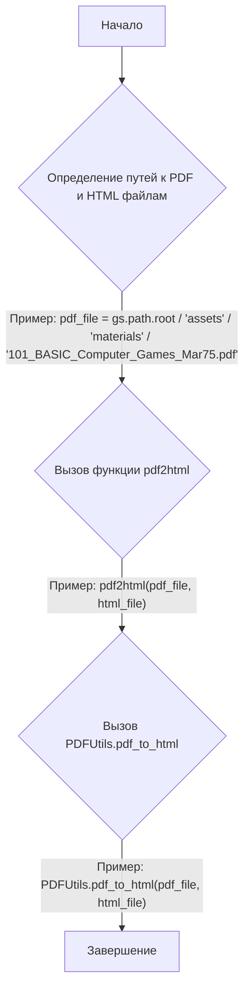
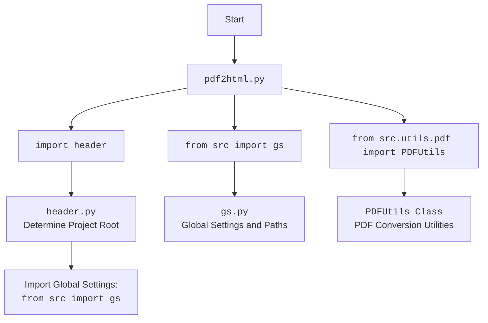

### Анализ кода `pdf2html.py`

=========================================================================================

Этот файл находится по адресу `hypotez/src/endpoints/hypo69/code_assistant/pdf2html.py` и предназначен для конвертации PDF-файлов в HTML.

---

### 1. Блок-схема



### 2. Диаграмма зависимостей



### 3. Объяснение

#### Импорты:

-   `import header`: Используется для определения корневого каталога проекта.
-   `from src import gs`: Импортирует глобальные настройки и пути проекта.
-   `from src.utils.pdf import PDFUtils`: Импортирует утилиты для работы с PDF, включая функцию конвертации в HTML.

#### Классы:

-   `PDFUtils`: Класс, содержащий статический метод `pdf_to_html` для конвертации PDF в HTML.

#### Функции:

-   `pdf2html(pdf_file, html_file)`:
    -   Аргументы:
        -   `pdf_file`: Путь к PDF-файлу.
        -   `html_file`: Путь к HTML-файлу, в который будет выполнена конвертация.
    -   Возвращаемое значение: Отсутствует (None).
    -   Назначение: Вызывает функцию `PDFUtils.pdf_to_html` для выполнения конвертации PDF в HTML.

#### Переменные:

-   `pdf_file`: Переменная типа `pathlib.Path`, содержащая путь к PDF-файлу.
-   `html_file`: Переменная типа `pathlib.Path`, содержащая путь к HTML-файлу.

#### Дополнительные замечания:

-   Использование `header` для определения корневого каталога позволяет скрипту быть переносимым и не зависеть от абсолютных путей.
-   `gs` предоставляет доступ к глобальным настройкам и путям, что упрощает конфигурирование скрипта.
-   `PDFUtils` инкапсулирует логику конвертации PDF в HTML, что делает код более модульным и читаемым.
-   В коде не хватает аннотаций типов для переменных и параметров функций.
-   Отсутствует обработка исключений. В случае ошибки конвертации PDF в HTML, скрипт завершится с ошибкой.
-   В коде нет документации для функции pdf2html.

#### Потенциальные улучшения:

1.  Добавить аннотации типов для переменных и параметров функций.
2.  Реализовать обработку исключений для более надежной работы скрипта.
3.  Добавить логирование для отслеживания процесса конвертации и ошибок.
4.  Добавить документацию для функции pdf2html.

#### Связи с другими частями проекта:

-   Этот скрипт использует `header` для определения корневого каталога проекта, что позволяет ему быть переносимым.
-   Он также использует `gs` для доступа к глобальным настройкам и путям, что упрощает конфигурирование скрипта.
-   Функция `PDFUtils.pdf_to_html` выполняет фактическую конвертацию PDF в HTML.

```mermaid
flowchart TD
    Start --> Header[<code>header.py</code><br> Determine Project Root]

    Header --> import[Import Global Settings: <br><code>from src import gs</code>]