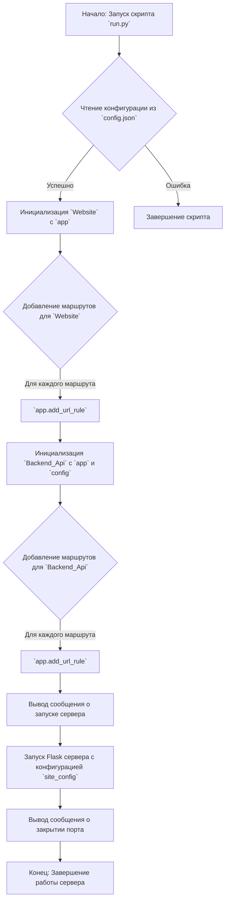
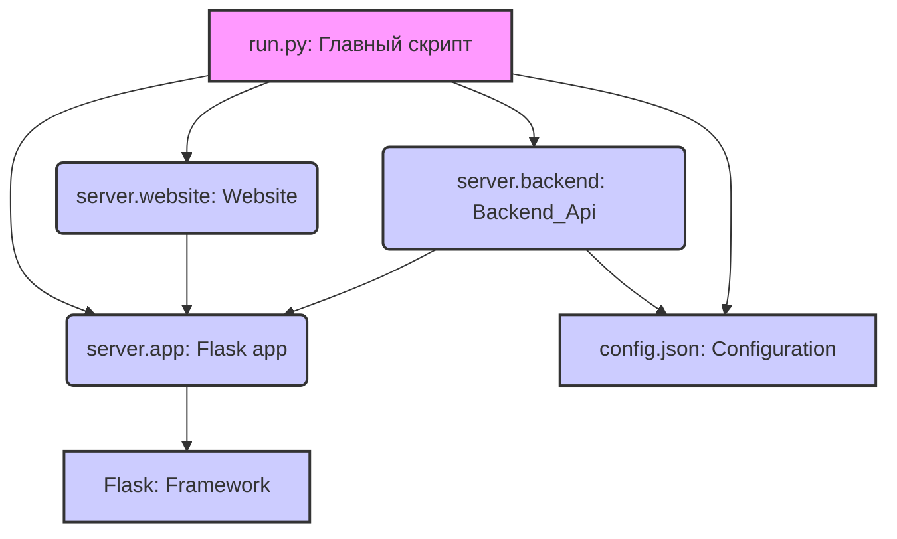

### **Системные инструкции для обработки кода проекта `hypotez`**

=========================================================================================

Описание функциональности и правил для генерации, анализа и улучшения кода. Направлено на обеспечение последовательного и читаемого стиля кодирования, соответствующего требованиям.

---

### **Основные принципы**

#### **1. Общие указания**:
- Соблюдай четкий и понятный стиль кодирования.
- Все изменения должны быть обоснованы и соответствовать установленным требованиям.

#### **2. Комментарии**:
- Используй `#` для внутренних комментариев.
- Документация всех функций, методов и классов должна следовать такому формату: 
    ```python
        def function(param: str, param1: Optional[str | dict | str] = None) -> dict | None:
            """ 
            Args:
                param (str): Описание параметра `param`.
                param1 (Optional[str | dict | str], optional): Описание параметра `param1`. По умолчанию `None`.
    
            Returns:
                dict | None: Описание возвращаемого значения. Возвращает словарь или `None`.
    
            Raises:
                SomeError: Описание ситуации, в которой возникает исключение `SomeError`.

            Ехаmple:
                >>> function('param', 'param1')
                {'param': 'param1'}
            """
    ```
- Комментарии и документация должны быть четкими, лаконичными и точными.

#### **3. Форматирование кода**:
- Используй одинарные кавычки. `a:str = 'value'`, `print('Hello World!')`;
- Добавляй пробелы вокруг операторов. Например, `x = 5`;
- Все параметры должны быть аннотированы типами. `def function(param: str, param1: Optional[str | dict | str] = None) -> dict | None:`;
- Не используй `Union`. Вместо этого используй `|`.

#### **4. Логирование**:
- Для логгирования Всегда Используй модуль `logger` из `src.logger.logger`.
- Ошибки должны логироваться с использованием `logger.error`.
Пример:
    ```python
        try:
            ...
        except Exception as ex:
            logger.error('Error while processing data', ех, exc_info=True)
    ```
#### **5 Не используй `Union[]` в коде. Вместо него используй `|`
Например:
```python
x: str | int ...
```


---

### **Основные требования**:

#### **1. Формат ответов в Markdown**:
- Все ответы должны быть выполнены в формате **Markdown**.

#### **2. Формат комментариев**:
- Используй указанный стиль для комментариев и документации в коде.
- Пример:

```python
from typing import Generator, Optional, List
from pathlib import Path


def read_text_file(
    file_path: str | Path,
    as_list: bool = False,
    extensions: Optional[List[str]] = None,
    chunk_size: int = 8192,
) -> Generator[str, None, None] | str | None:
    """
    Считывает содержимое файла (или файлов из каталога) с использованием генератора для экономии памяти.

    Args:
        file_path (str | Path): Путь к файлу или каталогу.
        as_list (bool): Если `True`, возвращает генератор строк.
        extensions (Optional[List[str]]): Список расширений файлов для чтения из каталога.
        chunk_size (int): Размер чанков для чтения файла в байтах.

    Returns:
        Generator[str, None, None] | str | None: Генератор строк, объединенная строка или `None` в случае ошибки.

    Raises:
        Exception: Если возникает ошибка при чтении файла.

    Example:
        >>> from pathlib import Path
        >>> file_path = Path('example.txt')
        >>> content = read_text_file(file_path)
        >>> if content:
        ...    print(f'File content: {content[:100]}...')
        File content: Example text...
    """
    ...
```
- Всегда делай подробные объяснения в комментариях. Избегай расплывчатых терминов, 
- таких как *«получить»* или *«делать»*
-  . Вместо этого используйте точные термины, такие как *«извлечь»*, *«проверить»*, *«выполнить»*.
- Вместо: *«получаем»*, *«возвращаем»*, *«преобразовываем»* используй имя объекта *«функция получае»*, *«переменная возвращает»*, *«код преобразовывает»* 
- Комментарии должны непосредственно предшествовать описываемому блоку кода и объяснять его назначение.

#### **3. Пробелы вокруг операторов присваивания**:
- Всегда добавляйте пробелы вокруг оператора `=`, чтобы повысить читаемость.
- Примеры:
  - **Неправильно**: `x=5`
  - **Правильно**: `x = 5`

#### **4. Использование `j_loads` или `j_loads_ns`**:
- Для чтения JSON или конфигурационных файлов замените стандартное использование `open` и `json.load` на `j_loads` или `j_loads_ns`.
- Пример:

```python
# Неправильно:
with open('config.json', 'r', encoding='utf-8') as f:
    data = json.load(f)

# Правильно:
data = j_loads('config.json')
```

#### **5. Сохранение комментариев**:
- Все существующие комментарии, начинающиеся с `#`, должны быть сохранены без изменений в разделе «Улучшенный код».
- Если комментарий кажется устаревшим или неясным, не изменяйте его. Вместо этого отметьте его в разделе «Изменения».

#### **6. Обработка `...` в коде**:
- Оставляйте `...` как указатели в коде без изменений.
- Не документируйте строки с `...`.
```

#### **7. Аннотации**
Для всех переменных должны быть определены аннотации типа. 
Для всех функций все входные и выходные параметры аннотириваны
Для все параметров должны быть аннотации типа.


### **8. webdriver**
В коде используется webdriver. Он импртируется из модуля `webdriver` проекта `hypotez`
```python
from src.webdirver import Driver, Chrome, Firefox, Playwright, ...
driver = Driver(Firefox)

Пoсле чего может использоваться как

close_banner = {
  "attribute": null,
  "by": "XPATH",
  "selector": "//button[@id = 'closeXButton']",
  "if_list": "first",
  "use_mouse": false,
  "mandatory": false,
  "timeout": 0,
  "timeout_for_event": "presence_of_element_located",
  "event": "click()",
  "locator_description": "Закрываю pop-up окно, если оно не появилось - не страшно (`mandatory`:`false`)"
}

result = driver.execute_locator(close_banner)
```

### **Анализ кода проекта `hypotez`**

**Расположение файла в проекте:** `hypotez/src/endpoints/juliana/run.py`

#### **1. Блок-схема**



**Примеры для логических блоков:**

- **B (Чтение конфигурации из `config.json`):**
  ```python
  config = load(open('config.json', 'r'))
  site_config = config['site_config']
  ```
  Здесь происходит чтение данных конфигурации из файла `config.json`, которые затем используются для настройки веб-сайта и backend API.

- **D (Добавление маршрутов для `Website`):**
  ```python
  for route in site.routes:
      app.add_url_rule(
          route,
          view_func=site.routes[route]['function'],
          methods=site.routes[route]['methods'],
      )
  ```
  Этот цикл перебирает маршруты веб-сайта и добавляет их в приложение Flask.

- **K (Запуск Flask сервера с конфигурацией `site_config`):**
  ```python
  app.run(**site_config)
  ```
  Здесь запускается Flask сервер с параметрами, указанными в конфигурации `site_config`.

#### **2. Диаграмма**



**Объяснение зависимостей:**

- `run.py`: Главный скрипт, который настраивает и запускает Flask приложение.
- `server.app`: Импортирует экземпляр Flask приложения из модуля `app.py`.
- `server.website`: Класс `Website`, который определяет маршруты для веб-сайта.
- `server.backend`: Класс `Backend_Api`, который определяет маршруты для backend API.
- `Flask`: Flask framework, который используется для создания веб-приложения.
- `config.json`: Файл конфигурации, который содержит настройки для веб-сайта и backend API.

#### **3. Объяснение**

**Импорты:**

- `from server.app import app`: Импортирует экземпляр Flask приложения `app` из модуля `server.app`. Это основной объект, который обрабатывает веб-запросы.
- `from server.website import Website`: Импортирует класс `Website` из модуля `server.website`. Класс используется для настройки маршрутов веб-сайта.
- `from server.backend import Backend_Api`: Импортирует класс `Backend_Api` из модуля `server.backend`. Класс используется для настройки маршрутов backend API.
- `from json import load`: Импортирует функцию `load` из модуля `json`. Используется для чтения данных из файла `config.json`.

**Классы:**

- `Website(app)`:
  - **Роль**: Определяет маршруты веб-сайта и связывает их с соответствующими функциями.
  - **Атрибуты**: `routes` (словарь маршрутов).
  - **Методы**: Методы для обработки запросов к веб-сайту (определены в `server.website`).
  - **Взаимодействие**: Использует объект `app` для добавления маршрутов (`app.add_url_rule`).

- `Backend_Api(app, config)`:
  - **Роль**: Определяет маршруты backend API и связывает их с соответствующими функциями.
  - **Атрибуты**: `routes` (словарь маршрутов).
  - **Методы**: Методы для обработки API запросов (определены в `server.backend`).
  - **Взаимодействие**: Использует объект `app` для добавления маршрутов (`app.add_url_rule`) и конфигурацию `config` для настройки API.

**Функции:**

- `if __name__ == '__main__':`:
  - **Роль**: Главная функция, которая запускается при выполнении скрипта.
  - **Аргументы**: Нет.
  - **Возвращаемые значения**: Нет.
  - **Назначение**: Загружает конфигурацию, настраивает маршруты для веб-сайта и backend API, запускает Flask сервер.
  - **Примеры**: Запуск сервера с параметрами из `config.json`.

**Переменные:**

- `config`:
  - **Тип**: `dict`
  - **Использование**: Содержит конфигурацию, загруженную из `config.json`. Используется для настройки веб-сайта и backend API.
- `site_config`:
  - **Тип**: `dict`
  - **Использование**: Содержит конфигурацию для веб-сайта, включая порт и другие параметры.
- `site`:
  - **Тип**: `Website`
  - **Использование**: Экземпляр класса `Website`, который управляет маршрутами веб-сайта.
- `backend_api`:
  - **Тип**: `Backend_Api`
  - **Использование**: Экземпляр класса `Backend_Api`, который управляет маршрутами backend API.

**Потенциальные ошибки или области для улучшения:**

- Отсутствует обработка ошибок при чтении файла `config.json`.
- Не указаны типы для переменных `config`, `site_config`, `site`, `backend_api`.
- Отсутствует логирование ошибок и событий. Рекомендуется добавить логирование для отслеживания работы сервера и выявления проблем.
- Не реализована обработка исключений при добавлении маршрутов.

**Цепочка взаимосвязей с другими частями проекта:**

- `run.py` -> `server.app`: Зависимость от экземпляра Flask приложения.
- `run.py` -> `server.website`: Использование класса `Website` для настройки маршрутов веб-сайта.
- `run.py` -> `server.backend`: Использование класса `Backend_Api` для настройки маршрутов backend API.
- `run.py` -> `config.json`: Зависимость от файла конфигурации для настройки параметров сервера.