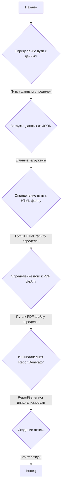
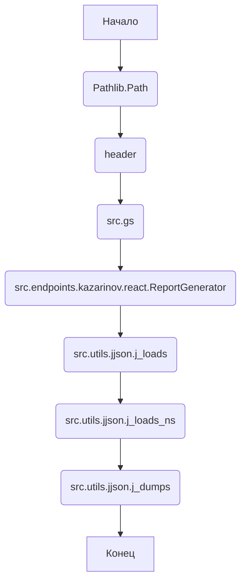
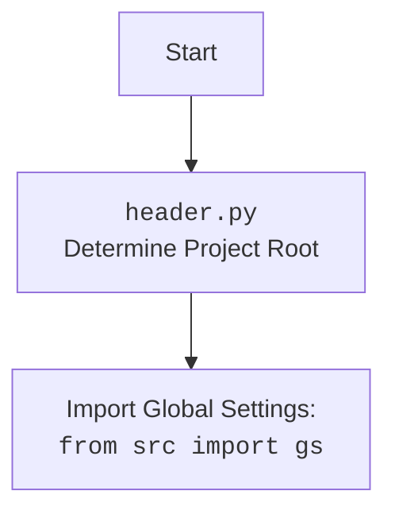

### **Системные инструкции для обработки кода проекта `hypotez`**

=========================================================================================

Описание функциональности и правил для генерации, анализа и улучшения кода. Направлено на обеспечение последовательного и читаемого стиля кодирования, соответствующего требованиям.

---

### **Основные принципы**

#### **1. Общие указания**:
- Соблюдай четкий и понятный стиль кодирования.
- Все изменения должны быть обоснованы и соответствовать установленным требованиям.

#### **2. Комментарии**:
- Используй `#` для внутренних комментариев.
- Документация всех функций, методов и классов должна следовать такому формату: 
    ```python
        def function(param: str, param1: Optional[str | dict | str] = None) -> dict | None:
            """ 
            Args:
                param (str): Описание параметра `param`.
                param1 (Optional[str | dict | str], optional): Описание параметра `param1`. По умолчанию `None`.
    
            Returns:
                dict | None: Описание возвращаемого значения. Возвращает словарь или `None`.
    
            Raises:
                SomeError: Описание ситуации, в которой возникает исключение `SomeError`.

            Ехаmple:
                >>> function('param', 'param1')
                {'param': 'param1'}
            """
    ```
- Комментарии и документация должны быть четкими, лаконичными и точными.

#### **3. Форматирование кода**:
- Используй одинарные кавычки. `a:str = 'value'`, `print('Hello World!')`;
- Добавляй пробелы вокруг операторов. Например, `x = 5`;
- Все параметры должны быть аннотированы типами. `def function(param: str, param1: Optional[str | dict | str] = None) -> dict | None:`;
- Не используй `Union`. Вместо этого используй `|`.

#### **4. Логирование**:
- Для логгирования Всегда Используй модуль `logger` из `src.logger.logger`.
- Ошибки должны логироваться с использованием `logger.error`.
Пример:
    ```python
        try:
            ...
        except Exception as ex:
            logger.error('Error while processing data', ех, exc_info=True)
    ```
#### **5 Не используй `Union[]` в коде. Вместо него используй `|`
Например:
```python
x: str | int ...
```


---

### **Основные требования**:

#### **1. Формат ответов в Markdown**:
- Все ответы должны быть выполнены в формате **Markdown**.

#### **2. Формат комментариев**:
- Используй указанный стиль для комментариев и документации в коде.
- Пример:

```python
from typing import Generator, Optional, List
from pathlib import Path


def read_text_file(
    file_path: str | Path,
    as_list: bool = False,
    extensions: Optional[List[str]] = None,
    chunk_size: int = 8192,
) -> Generator[str, None, None] | str | None:
    """
    Считывает содержимое файла (или файлов из каталога) с использованием генератора для экономии памяти.

    Args:
        file_path (str | Path): Путь к файлу или каталогу.
        as_list (bool): Если `True`, возвращает генератор строк.
        extensions (Optional[List[str]]): Список расширений файлов для чтения из каталога.
        chunk_size (int): Размер чанков для чтения файла в байтах.

    Returns:
        Generator[str, None, None] | str | None: Генератор строк, объединенная строка или `None` в случае ошибки.

    Raises:
        Exception: Если возникает ошибка при чтении файла.

    Example:
        >>> from pathlib import Path
        >>> file_path = Path('example.txt')
        >>> content = read_text_file(file_path)
        >>> if content:
        ...    print(f'File content: {content[:100]}...')
        File content: Example text...
    """
    ...
```
- Всегда делай подробные объяснения в комментариях. Избегай расплывчатых терминов, 
- таких как *«получить»* или *«делать»*
-  . Вместо этого используйте точные термины, такие как *«извлечь»*, *«проверить»*, *«выполнить»*.
- Вместо: *«получаем»*, *«возвращаем»*, *«преобразовываем»* используй имя объекта *«функция получае»*, *«переменная возвращает»*, *«код преобразовывает»* 
- Комментарии должны непосредственно предшествовать описываемому блоку кода и объяснять его назначение.

#### **3. Пробелы вокруг операторов присваивания**:
- Всегда добавляйте пробелы вокруг оператора `=`, чтобы повысить читаемость.
- Примеры:
  - **Неправильно**: `x=5`
  - **Правильно**: `x = 5`

#### **4. Использование `j_loads` или `j_loads_ns`**:
- Для чтения JSON или конфигурационных файлов замените стандартное использование `open` и `json.load` на `j_loads` или `j_loads_ns`.
- Пример:

```python
# Неправильно:
with open('config.json', 'r', encoding='utf-8') as f:
    data = json.load(f)

# Правильно:
data = j_loads('config.json')
```

#### **5. Сохранение комментариев**:
- Все существующие комментарии, начинающиеся с `#`, должны быть сохранены без изменений в разделе «Улучшенный код».
- Если комментарий кажется устаревшим или неясным, не изменяйте его. Вместо этого отметьте его в разделе «Изменения».

#### **6. Обработка `...` в коде**:
- Оставляйте `...` как указатели в коде без изменений.
- Не документируйте строки с `...`.
```

#### **7. Аннотации**
Для всех переменных должны быть определены аннотации типа. 
Для всех функций все входные и выходные параметры аннотириваны
Для все параметров должны быть аннотации типа.


### **8. webdriver**
В коде используется webdriver. Он импртируется из модуля `webdriver` проекта `hypotez`
```python
from src.webdirver import Driver, Chrome, Firefox, Playwright, ...
driver = Driver(Firefox)

Пoсле чего может использоваться как

close_banner = {
  "attribute": null,
  "by": "XPATH",
  "selector": "//button[@id = 'closeXButton']",
  "if_list": "first",
  "use_mouse": false,
  "mandatory": false,
  "timeout": 0,
  "timeout_for_event": "presence_of_element_located",
  "event": "click()",
  "locator_description": "Закрываю pop-up окно, если оно не появилось - не страшно (`mandatory`:`false`)"
}

result = driver.execute_locator(close_banner)
```

### Анализ кода `pricelist_generator.py`

Файл расположен в `hypotez/src/endpoints/kazarinov/_experiments/pricelist_generator.py` и предназначен для экспериментов с созданием PDF-отчетов.

#### 1. Блок-схема



**Примеры для каждого логического блока:**

-   **A (Начало)**: Начало выполнения скрипта.
-   **B (Определение пути к данным)**:
    `base_path = gs.path.external_data / 'kazarinov' / 'mexironim' / '24_11_24_05_29_40_543'`
-   **C (Загрузка данных из JSON)**:
    `data: dict = j_loads(base_path / '202410262326_he.json')`
-   **D (Определение пути к HTML файлу)**:
    `html_file: Path = base_path / '202410262326_he.html'`
-   **E (Определение пути к PDF файлу)**:
    `pdf_file: Path = base_path / '202410262326_he.pdf'`
-   **F (Инициализация ReportGenerator)**:
    `r = ReportGenerator()`
-   **G (Создание отчета)**:
    `r.create_report(data, html_file, pdf_file)`
-   **H (Конец)**: Завершение выполнения скрипта.

#### 2. Диаграмма



**Объяснение зависимостей:**

-   `pathlib.Path`: Используется для работы с путями к файлам и каталогам.
-   `header`: Используется для определения корневой директории проекта.
-   `src.gs`: Глобальные настройки проекта.
-   `src.endpoints.kazarinov.react.ReportGenerator`: Класс, генерирующий отчеты.
-   `src.utils.jjson.j_loads`: Функция для загрузки данных из JSON файлов.
-   `src.utils.jjson.j_loads_ns`: Функция для загрузки данных из JSON файлов (с обработкой namespace).
-   `src.utils.jjson.j_dumps`: Функция для сохранения данных в JSON файлы.



#### 3. Объяснение

**Импорты:**

-   `from pathlib import Path`: Импортирует класс `Path` из модуля `pathlib` для удобной работы с путями к файлам и директориям.
-   `import header`: Импортирует модуль `header`, предположительно содержащий функции для определения корневой директории проекта.
-   `from src import gs`: Импортирует глобальные настройки проекта из модуля `src.gs`.
-   `from src.endpoints.kazarinov.react import ReportGenerator`: Импортирует класс `ReportGenerator` из модуля `src.endpoints.kazarinov.react`, который отвечает за создание отчетов.
-   `from src.utils.jjson import j_loads, j_loads_ns, j_dumps`: Импортирует функции `j_loads`, `j_loads_ns` и `j_dumps` из модуля `src.utils.jjson` для работы с JSON-файлами. `j_loads` используется для загрузки JSON, `j_loads_ns` для загрузки JSON с пространством имен, а `j_dumps` для сохранения JSON.

**Переменные:**

-   `base_path: Path`: Определяет базовый путь к директории с данными, используя `gs.path.external_data` и добавляя поддиректории `'kazarinov' / 'mexironim' / '24_11_24_05_29_40_543'`.
-   `data: dict`: Загружает данные из JSON-файла `202410262326_he.json` с использованием функции `j_loads`.
-   `html_file: Path`: Определяет путь к HTML-файлу `202410262326_he.html`.
-   `pdf_file: Path`: Определяет путь к PDF-файлу `202410262326_he.pdf`.
-   `r: ReportGenerator`: Создает экземпляр класса `ReportGenerator`.

**Функциональность:**

Скрипт предназначен для генерации PDF-отчета на основе JSON-данных и HTML-шаблона. Он выполняет следующие шаги:

1.  Определяет базовый путь к данным.
2.  Загружает данные из JSON-файла.
3.  Определяет пути к HTML- и PDF-файлам.
4.  Создает экземпляр класса `ReportGenerator`.
5.  Создает отчет с использованием загруженных данных, HTML-шаблона и сохраняет его в PDF-файл.

**Потенциальные ошибки и области для улучшения:**

-   Отсутствует обработка исключений при загрузке JSON-файла. Если файл не существует или имеет неверный формат, скрипт завершится с ошибкой.
-   Не указаны типы переменных, например, `data`.
-   `...` в конце файла указывает на незавершенность кода.
-   В коде используется абсолютный путь, что может привести к проблемам при переносе проекта на другую машину. Рекомендуется использовать относительные пути.

**Цепочка взаимосвязей с другими частями проекта:**

-   Скрипт использует глобальные настройки проекта (`src.gs`) для определения базового пути к данным.
-   Он использует класс `ReportGenerator` из модуля `src.endpoints.kazarinov.react` для создания отчета.
-   Для работы с JSON-файлами используются функции из модуля `src.utils.jjson`.

```python
from pathlib import Path
import header
from src import gs

from src.endpoints.kazarinov.react import ReportGenerator
from src.utils.jjson import j_loads, j_loads_ns, j_dumps

base_path: Path = gs.path.external_data / 'kazarinov' / 'mexironim' / '24_11_24_05_29_40_543'
data: dict = j_loads(base_path / '202410262326_he.json')
html_file: Path = base_path / '202410262326_he.html'
pdf_file: Path = base_path / '202410262326_he.pdf'
r: ReportGenerator = ReportGenerator()
r.create_report(data, html_file, pdf_file)
...