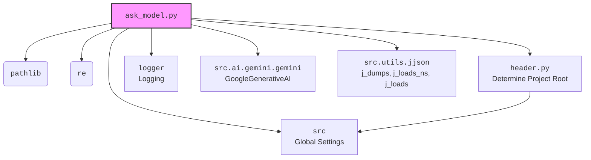

### **Анализ кода проекта `hypotez`**

=========================================================================================

#### **Расположение файла в проекте**:
Файл расположен по пути `hypotez/src/endpoints/kazarinov/scenarios/_experiments/ask_model.py`.
Это указывает на то, что файл является частью модуля, отвечающего за экспериментальные сценарии, связанные с обработкой данных от поставщиков и интеграцией с Facebook для публикации продуктов, в контексте задач, выполняемых kazarinov.

---

### **1. Блок-схема**:

```mermaid
graph TD
    A[Начало] --> B{Выбор языка (lang)?};
    B -- ru --> C[Чтение instruction_ru];
    B -- he --> D[Чтение instruction_he];
    C --> E{Отправка запроса в модель (model.ask)};
    D --> E;
    E --> F{Получен ответ от модели?};
    F -- Да --> G[Парсинг JSON ответа (j_loads)];
    F -- Нет --> H[Логирование ошибки];
    H --> I{Попытки > 1?};
    I -- Да --> A;
    I -- Нет --> J[Возврат {}];
    G --> K{Успешный парсинг?};
    K -- Да --> L[Возврат response_dict];
    K -- Нет --> M[Логирование ошибки парсинга];
    M --> I;
    L --> N[Сохранение в файл];
    J --> N;
    N --> Конец;
```

**Примеры для каждого логического блока**:

- **A (Начало)**: Начало выполнения скрипта.
- **B (Выбор языка (lang)?)**: Проверяется, какой язык указан (русский "ru" или иврит "he").
    - *Пример*: `lang == 'ru'`
- **C (Чтение instruction_ru)**: Чтение инструкции на русском языке из файла.
    - *Пример*: `command_instruction_ru = Path(...).read_text(encoding='UTF-8')`
- **D (Чтение instruction_he)**: Чтение инструкции на иврите из файла.
    - *Пример*: `command_instruction_he = Path(...).read_text(encoding='UTF-8')`
- **E (Отправка запроса в модель (model.ask))**: Отправка запроса в модель Gemini с соответствующей инструкцией.
    - *Пример*: `response = model.ask(q_ru if lang == 'ru' else q_he)`
- **F (Получен ответ от модели?)**: Проверка, получен ли ответ от модели.
    - *Пример*: `if not response:`
- **G (Парсинг JSON ответа (j_loads))**: Попытка парсинга полученного ответа как JSON.
    - *Пример*: `response_dict:dict = j_loads(response)`
- **H (Логирование ошибки)**: Логирование ошибки, если ответ от модели не получен.
    - *Пример*: `logger.error(f"Нет ответа от модели")`
- **I (Попытки > 1?)**: Проверка, остались ли еще попытки для повторного запроса.
    - *Пример*: `if attempts > 1:`
- **J (Возврат {})**: Возврат пустого словаря, если не удалось получить и распарсить ответ.
    - *Пример*: `return {}`
- **K (Успешный парсинг?)**: Проверка, успешно ли распарсен JSON ответ.
    - *Пример*: `if not response_dict:`
- **L (Возврат response_dict)**: Возврат распарсенного словаря с ответом.
    - *Пример*: `return response_dict`
- **M (Логирование ошибки парсинга)**: Логирование ошибки, если не удалось распарсить ответ.
    - *Пример*: `logger.error("Ошибка парсинга ")`
- **N (Сохранение в файл)**: Сохранение ответа в JSON файл.
    -*Пример*: `j_dumps(response_ru_dict,gs.path.external_storage / \'kazarinov\' / \'mexironim\' / \'24_12_07_19_06_40_508\' / f\'ru_{gs.now}.json\')`

---

### **2. Диаграмма зависимостей**:



**Объяснение зависимостей**:

- **`ask_model.py`**: Основной модуль, который отправляет запросы к модели и обрабатывает ответы.
- **`pathlib`**: Используется для работы с путями к файлам и директориям.
- **`re`**: Модуль регулярных выражений, который может использоваться для обработки текста. В данном коде не используется, но импортирован.
- **`header.py`**: Определяет корень проекта.
    -   **`header.py` mermaid flowchart:**
        ```mermaid
        flowchart TD
            Start --> Header[<code>header.py</code><br> Determine Project Root]

            Header --> import[Import Global Settings: <br><code>from src import gs</code>]
        ```
- **`src`**: Содержит глобальные настройки (`gs`).
- **`logger`**: Модуль для логирования событий и ошибок.
- **`src.ai.gemini.gemini`**: Класс `GoogleGenerativeAI`, используемый для взаимодействия с моделью Gemini.
- **`src.utils.jjson`**: Модуль, содержащий функции `j_dumps`, `j_loads_ns` и `j_loads` для работы с JSON.

---

### **3. Объяснение**:

#### **Импорты**:
- `pathlib`: Используется для представления путей к файлам и директориям в удобном объектно-ориентированном виде.
    - *Пример*: `test_directory:Path = gs.path.external_storage / 'kazarinov' / 'mexironim' / '24_12_07_19_06_40_508'`
- `re`: Модуль для работы с регулярными выражениями.
- `header`: Пользовательский модуль для определения корня проекта.
- `src`: Пакет, содержащий глобальные настройки (`gs`) и другие общие компоненты проекта.
    - `gs`: Объект, содержащий глобальные настройки, такие как пути к директориям и учетные данные.
- `src.logger.logger`: Модуль для логирования событий и ошибок.
    - `logger`: Объект логгера, используемый для записи информации о работе скрипта.
- `src.ai.gemini.gemini`: Модуль, содержащий класс `GoogleGenerativeAI` для взаимодействия с моделью Gemini.
- `src.utils.jjson`: Модуль, содержащий функции `j_dumps`, `j_loads_ns` и `j_loads` для работы с JSON.
    - `j_dumps`: Функция для сериализации Python-объектов в JSON-строку и записи в файл.
    - `j_loads_ns`: Функция для чтения JSON-файла с использованием namespaces.
    - `j_loads`: Функция для чтения JSON-файла.

#### **Классы**:
- `GoogleGenerativeAI`: Класс, инкапсулирующий логику взаимодействия с моделью Gemini.
    - *Атрибуты*:
        - `api_key`: Ключ API для доступа к сервисам Gemini.
        - `system_instruction`: Системная инструкция для модели.
        - `generation_config`: Конфигурация генерации ответа.
    - *Методы*:
        - `ask(prompt: str) -> str`: Отправляет запрос в модель и возвращает ответ.

#### **Функции**:
- `model_ask(lang: str, attempts: int = 3) -> dict`: Функция для отправки запроса в модель Gemini и обработки ответа.
    - *Аргументы*:
        - `lang (str)`: Язык запроса ("ru" или "he").
        - `attempts (int)`: Количество попыток отправки запроса в случае неудачи. По умолчанию равно 3.
    - *Возвращаемое значение*:
        - `dict`: Распарсенный JSON-ответ от модели в виде словаря. Возвращает пустой словарь `{}` в случае ошибки.
    - *Назначение*:
        - Формирует запрос на основе выбранного языка и списка продуктов.
        - Отправляет запрос в модель Gemini.
        - Обрабатывает ответ, пытаясь распарсить его как JSON.
        - Логирует ошибки в случае неудачи.
        - Повторяет запрос несколько раз, если возникают ошибки.
    - *Пример*:
        ```python
        response_ru_dict = model_ask('ru')
        ```

#### **Переменные**:
- `test_directory (Path)`: Путь к директории с тестовыми данными.
- `products_in_test_dir (Path)`: Путь к файлу со списком продуктов в тестовой директории.
- `products_list (list[dict])`: Список продуктов, загруженный из JSON-файла.
- `system_instruction (str)`: Системная инструкция для модели Gemini, загруженная из файла.
- `command_instruction_ru (str)`: Инструкция на русском языке для модели, загруженная из файла.
- `command_instruction_he (str)`: Инструкция на иврите для модели, загруженная из файла.
- `api_key (str)`: Ключ API для доступа к сервисам Gemini.
- `model (GoogleGenerativeAI)`: Экземпляр класса `GoogleGenerativeAI` для взаимодействия с моделью.
- `q_ru (str)`: Полный запрос на русском языке, включающий инструкцию и список продуктов.
- `q_he (str)`: Полный запрос на иврите, включающий инструкцию и список продуктов.
- `response_ru_dict (dict)`: Ответ от модели на русском языке в виде словаря.
- `response_he_dict (dict)`: Ответ от модели на иврите в виде словаря.

#### **Потенциальные ошибки и области для улучшения**:
- Отсутствует обработка исключений при чтении файлов.
- Повторный вызов `model_ask` в случае ошибки парсинга может привести к бесконечной рекурсии, если ошибка не устраняется.
- Жестко заданные пути к файлам и директориям.
- Отсутствует обработка ошибок при взаимодействии с моделью Gemini.
- Необходимо добавить аннотации типа для параметров функции `model_ask` и возвращаемого значения.

#### **Взаимосвязи с другими частями проекта**:
- Модуль использует глобальные настройки из пакета `src` (`gs`).
- Модуль использует модуль логирования из пакета `src` (`logger`).
- Модуль использует класс `GoogleGenerativeAI` из пакета `src.ai.gemini.gemini`.
- Модуль использует функции `j_dumps`, `j_loads_ns` и `j_loads` из пакета `src.utils.jjson`.
- Пути к файлам и директориям определяются на основе глобальных настроек.