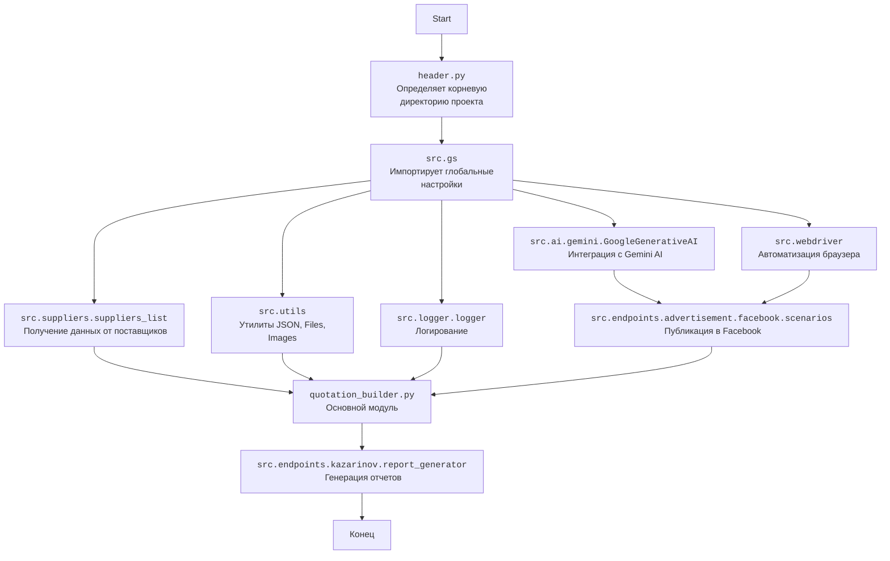

### **Системные инструкции для обработки кода проекта `hypotez`**

=========================================================================================

Описание функциональности и правил для генерации, анализа и улучшения кода. Направлено на обеспечение последовательного и читаемого стиля кодирования, соответствующего требованиям.

---

### **Основные принципы**

#### **1. Общие указания**:
- Соблюдай четкий и понятный стиль кодирования.
- Все изменения должны быть обоснованы и соответствовать установленным требованиям.

#### **2. Комментарии**:
- Используй `#` для внутренних комментариев.
- Документация всех функций, методов и классов должна следовать такому формату: 
    ```python
        def function(param: str, param1: Optional[str | dict | str] = None) -> dict | None:
            """ 
            Args:
                param (str): Описание параметра `param`.
                param1 (Optional[str | dict | str], optional): Описание параметра `param1`. По умолчанию `None`.
    
            Returns:
                dict | None: Описание возвращаемого значения. Возвращает словарь или `None`.
    
            Raises:
                SomeError: Описание ситуации, в которой возникает исключение `SomeError`.

            Ехаmple:
                >>> function('param', 'param1')
                {'param': 'param1'}
            """
    ```
- Комментарии и документация должны быть четкими, лаконичными и точными.

#### **3. Форматирование кода**:
- Используй одинарные кавычки. `a:str = 'value'`, `print('Hello World!')`;
- Добавляй пробелы вокруг операторов. Например, `x = 5`;
- Все параметры должны быть аннотированы типами. `def function(param: str, param1: Optional[str | dict | str] = None) -> dict | None:`;
- Не используй `Union`. Вместо этого используй `|`.

#### **4. Логирование**:
- Для логгирования Всегда Используй модуль `logger` из `src.logger.logger`.
- Ошибки должны логироваться с использованием `logger.error`.
Пример:
    ```python
        try:
            ...
        except Exception as ex:
            logger.error('Error while processing data', ех, exc_info=True)
    ```
#### **5 Не используй `Union[]` в коде. Вместо него используй `|`
Например:
```python
x: str | int ...
```


---

### **Основные требования**:

#### **1. Формат ответов в Markdown**:
- Все ответы должны быть выполнены в формате **Markdown**.

#### **2. Формат комментариев**:
- Используй указанный стиль для комментариев и документации в коде.
- Пример:

```python
from typing import Generator, Optional, List
from pathlib import Path


def read_text_file(
    file_path: str | Path,
    as_list: bool = False,
    extensions: Optional[List[str]] = None,
    chunk_size: int = 8192,
) -> Generator[str, None, None] | str | None:
    """
    Считывает содержимое файла (или файлов из каталога) с использованием генератора для экономии памяти.

    Args:
        file_path (str | Path): Путь к файлу или каталогу.
        as_list (bool): Если `True`, возвращает генератор строк.
        extensions (Optional[List[str]]): Список расширений файлов для чтения из каталога.
        chunk_size (int): Размер чанков для чтения файла в байтах.

    Returns:
        Generator[str, None, None] | str | None: Генератор строк, объединенная строка или `None` в случае ошибки.

    Raises:
        Exception: Если возникает ошибка при чтении файла.

    Example:
        >>> from pathlib import Path
        >>> file_path = Path('example.txt')
        >>> content = read_text_file(file_path)
        >>> if content:
        ...    print(f'File content: {content[:100]}...')
        File content: Example text...
    """
    ...
```
- Всегда делай подробные объяснения в комментариях. Избегай расплывчатых терминов, 
- таких как *«получить»* или *«делать»*
-  . Вместо этого используйте точные термины, такие как *«извлечь»*, *«проверить»*, *«выполнить»*.
- Вместо: *«получаем»*, *«возвращаем»*, *«преобразовываем»* используй имя объекта *«функция получае»*, *«переменная возвращает»*, *«код преобразовывает»* 
- Комментарии должны непосредственно предшествовать описываемому блоку кода и объяснять его назначение.

#### **3. Пробелы вокруг операторов присваивания**:
- Всегда добавляйте пробелы вокруг оператора `=`, чтобы повысить читаемость.
- Примеры:
  - **Неправильно**: `x=5`
  - **Правильно**: `x = 5`

#### **4. Использование `j_loads` или `j_loads_ns`**:
- Для чтения JSON или конфигурационных файлов замените стандартное использование `open` и `json.load` на `j_loads` или `j_loads_ns`.
- Пример:

```python
# Неправильно:
with open('config.json', 'r', encoding='utf-8') as f:
    data = json.load(f)

# Правильно:
data = j_loads('config.json')
```

#### **5. Сохранение комментариев**:
- Все существующие комментарии, начинающиеся с `#`, должны быть сохранены без изменений в разделе «Улучшенный код».
- Если комментарий кажется устаревшим или неясным, не изменяйте его. Вместо этого отметьте его в разделе «Изменения».

#### **6. Обработка `...` в коде**:
- Оставляйте `...` как указатели в коде без изменений.
- Не документируйте строки с `...`.
```

#### **7. Аннотации**
Для всех переменных должны быть определены аннотации типа. 
Для всех функций все входные и выходные параметры аннотириваны
Для все параметров должны быть аннотации типа.


### **8. webdriver**
В коде используется webdriver. Он импртируется из модуля `webdriver` проекта `hypotez`
```python
from src.webdirver import Driver, Chrome, Firefox, Playwright, ...
driver = Driver(Firefox)

Пoсле чего может использоваться как

close_banner = {
  "attribute": null,
  "by": "XPATH",
  "selector": "//button[@id = 'closeXButton']",
  "if_list": "first",
  "use_mouse": false,
  "mandatory": false,
  "timeout": 0,
  "timeout_for_event": "presence_of_element_located",
  "event": "click()",
  "locator_description": "Закрываю pop-up окно, если оно не появилось - не страшно (`mandatory`:`false`)"
}

result = driver.execute_locator(close_banner)
```

## Анализ кода `hypotez/src/endpoints/kazarinov/scenarios/quotation_builder.py`

### 1. Блок-схема

```mermaid
graph TD
    A[Начало: Инициализация QuotationBuilder] --> B{Загрузка конфигурации из JSON};
    B -- Успешно --> C{Инициализация WebDriver};
    B -- Ошибка --> E[Логирование ошибки загрузки конфигурации];
    C --> D{Инициализация Gemini AI модели};
    D -- Успешно --> F[Установка export_path];
    D -- Ошибка --> G[Логирование ошибки загрузки модели];
    F --> H{Обработка данных о продукте};
    H --> I{Преобразование данных продукта в формат для AI};
    I --> J{Обработка AI (генерация контента)};
    J -- Успешно --> K{Сохранение данных о продукте};
    J -- Ошибка --> L[Логирование ошибки обработки AI и повтор попытки];
    K --> M{Публикация данных в Facebook (опционально)};
    M --> N[Конец];
    E --> N;
    G --> N;
    L --> J;
```

**Примеры для логических блоков:**

*   **B (Загрузка конфигурации из JSON)**:

    ```python
    try:
        config: SimpleNamespace = j_loads_ns(base_path / f'{ENDPOINT}.json')
    except Exception as ex:
        logger.error(f"Error loading configuration",ex)
    ```
*   **C (Инициализация WebDriver)**:

    ```python
    if driver:
        if isinstance(driver, Driver):
            self.driver = driver
        elif isinstance(driver, (Firefox, Playwrid, )):  # Chrome, Edge
            self.driver = Driver(driver, **kwards)
        elif isinstance(driver, str):
            if driver.lower() == 'firefox':
                self.driver = Driver(Firefox, **kwards)
            elif driver.lower() == 'playwright':
                self.driver = Driver(Playwrid, **kwards)
    else:
        self.driver = Driver(Firefox, **kwards)
    ```
*   **J (Обработка AI (генерация контента))**:

    ```python
    q = model_command + '\n' + str(products_list)
    response = self.model.ask(q)
    ```
*   **K (Сохранение данных о продукте)**:

    ```python
    file_path = self.export_path / 'products' / f"{product_data['product_id']}.json"
    if not j_dumps(product_data, file_path, ensure_ascii=False):
        logger.error(f'Ошибка сохранения словаря {print(product_data)}\n Путь: {file_path}')
    ```
*   **M (Публикация данных в Facebook (опционально))**:

    ```python
    self.driver.get_url(r'https://www.facebook.com/profile.php?id=61566067514123')
    title = f'{mexiron.title}\n{mexiron.description}\n{mexiron.price} {currency}'
    if not post_message_title(self.d, title):
        logger.warning(f'Не получилось отправить название мехирона')
        ...
        return

    if not upload_post_media(self.d, media = mexiron.products):
        logger.warning(f'Не получилось отправить media')
        ...
        return
    if not message_publish(self.d):
        logger.warning(f'Не получилось отправить media')
        ...
        return
    ```

### 2. Диаграмма

```mermaid
flowchart TD
    A[<code>quotation_builder.py</code><br>Основной модуль] --> B(bs4.BeautifulSoup);
    A --> C(jinja2.utils.F);
    A --> D(pydantic.type_adapter.P);
    A --> E(requests);
    A --> F(asyncio);
    A --> G(random);
    A --> H(shutil);
    A --> I(pathlib.Path);
    A --> J(typing.Optional);
    A --> K(typing.List);
    A --> L(typing.Any);
    A --> M(types.SimpleNamespace);
    A --> N(dataclasses.field);
    A --> O(telebot);
    A --> P[<code>header.py</code><br>Определение корневого каталога проекта];
    A --> Q[<code>src.gs</code><br>Глобальные настройки проекта];
    A --> R[<code>src.endpoints.prestashop.product_fields.ProductFields</code><br>Определение полей продукта];
    A --> S[<code>src.webdriver.driver.Driver</code><br>Управление веб-драйвером];
    A --> T[<code>src.webdriver.firefox.Firefox</code><br>Драйвер Firefox];
    A --> U[<code>src.webdriver.playwright.Playwrid</code><br>Драйвер Playwright];
    A --> V[<code>src.ai.gemini.GoogleGenerativeAI</code><br>Интеграция с Gemini AI];
    A --> W[<code>src.endpoints.advertisement.facebook.scenarios</code><br>Сценарии для Facebook];
    A --> X[<code>src.suppliers.suppliers_list</code><br>Сбор данных от поставщиков];
    A --> Y[<code>src.endpoints.kazarinov.report_generator.ReportGenerator</code><br>Генерация отчетов];
    A --> Z[<code>src.utils</code><br>Вспомогательные утилиты];
    A --> AA[<code>src.logger.logger.logger</code><br>Логирование];

    P --> import_gs[Import Global Settings: <br><code>from src import gs</code>] ;

    W --> W1[post_message_title]
    W --> W2[upload_post_media]
    W --> W3[message_publish]

    X --> X1[MorleviGraber]
    X --> X2[KspGraber]
    X --> X3[IvoryGraber]
    X --> X4[GrandadvanceGraber]

    Z --> Z1[j_loads, j_loads_ns, j_dumps]
    Z --> Z2[read_text_file, save_text_file, recursively_get_file_path]
    Z --> Z3[save_image_from_url_async, save_image]
    Z --> Z4[printer.pprint]
```



**Объяснение зависимостей:**

*   **bs4.BeautifulSoup**: Используется для парсинга HTML-контента, например, при извлечении данных с веб-страниц.
*   **jinja2.utils.F**: Предоставляет утилиты для работы с шаблонизатором Jinja2.
*   **pydantic.type\_adapter.P**: Представляет функциональность для адаптации типов в Pydantic.
*   **requests**: Библиотека для выполнения HTTP-запросов.
*   **asyncio**: Библиотека для написания конкурентного кода с использованием синтаксиса async/await.
*   **random**: Модуль для генерации случайных чисел.
*   **shutil**: Модуль, предоставляющий высокоуровневые операции с файлами.
*   **pathlib.Path**: Класс для представления путей к файлам и директориям.
*   **typing.Optional, typing.List, typing.Any**: Используются для аннотации типов.
*   **types.SimpleNamespace**: Удобный класс для создания объектов, атрибутам которых можно присваивать значения.
*   **dataclasses.field**: Используется для определения полей в классах данных.
*   **telebot**: Библиотека для создания Telegram-ботов.
*   **header**: Определяет корневой каталог проекта.
*   **src.gs**: Содержит глобальные настройки проекта.
*   **src.endpoints.prestashop.product\_fields.ProductFields**: Класс для представления полей продукта.
*   **src.webdriver.driver.Driver**: Класс для управления веб-драйвером.
*   **src.webdriver.firefox.Firefox, src.webdriver.playwright.Playwrid**: Классы для управления конкретными веб-драйверами.
*   **src.ai.gemini.GoogleGenerativeAI**: Класс для интеграции с Gemini AI.
*   **src.endpoints.advertisement.facebook.scenarios**: Модуль, содержащий сценарии для публикации контента в Facebook.
*   **src.suppliers.suppliers\_list**: Содержит граберы для получения данных от различных поставщиков.
*   **src.endpoints.kazarinov.report\_generator.ReportGenerator**: Класс для генерации отчетов.
*   **src.utils**: Содержит различные утилиты, такие как `j_loads`, `j_dumps`, для работы с JSON, файлами и изображениями.
*   **src.logger.logger.logger**: Модуль для логирования.

### 3. Объяснение

*   **Импорты**:

    *   `re`: Используется для работы с регулярными выражениями.
    *   `bs4.BeautifulSoup`: Используется для парсинга HTML-контента, например, при извлечении данных с веб-страниц.
    *   `jinja2.utils.F`: Предоставляет утилиты для работы с шаблонизатором Jinja2.
    *   `pydantic.type_adapter.P`: Представляет функциональность для адаптации типов в Pydantic.
    *   `requests`: Библиотека для выполнения HTTP-запросов.
    *   `asyncio`: Библиотека для написания конкурентного кода с использованием синтаксиса async/await.
    *   `random`: Модуль для генерации случайных чисел.
    *   `shutil`: Модуль, предоставляющий высокоуровневые операции с файлами.
    *   `pathlib.Path`: Класс для представления путей к файлам и директориям.
    *   `typing.Optional, typing.List, typing.Any`: Используются для аннотации типов.
    *   `types.SimpleNamespace`: Удобный класс для создания объектов, атрибутам которых можно присваивать значения.
    *   `dataclasses.field`: Используется для определения полей в классах данных.
    *   `telebot`: Библиотека для создания Telegram-ботов.
    *   `header`: Содержит `__root__` для определения корневого каталога проекта.
    *   `src.gs`: Содержит глобальные настройки проекта.
    *   `src.endpoints.prestashop.product_fields.ProductFields`: Класс для представления полей продукта.
    *   `src.webdriver.driver.Driver`: Класс для управления веб-драйвером.
    *   `src.webdriver.firefox.Firefox, src.webdriver.playwright.Playwrid`: Классы для управления конкретными веб-драйверами.
    *   `src.ai.gemini.GoogleGenerativeAI`: Класс для интеграции с Gemini AI.
    *   `src.endpoints.advertisement.facebook.scenarios`: Модуль, содержащий сценарии для публикации контента в Facebook.
        *   `post_message_title`: функция отправляет заголовок сообщения.
        *   `upload_post_media`: функция загружает медиафайлы.
        *   `message_publish`: функция для публикации сообщения.
    *   `src.suppliers.suppliers_list`: Содержит граберы для получения данных от различных поставщиков.
        *   `MorleviGraber`,`KspGraber`,`IvoryGraber`,`GrandadvanceGraber`: классы для получения информации о поставщиках.
    *   `src.endpoints.kazarinov.report_generator.ReportGenerator`: Класс для генерации отчетов.
    *   `src.utils`: Содержит различные утилиты, такие как `j_loads`, `j_dumps`, для работы с JSON, файлами и изображениями.
        *   `j_loads`, `j_loads_ns`, `j_dumps`: функции для работы с JSON.
        *   `read_text_file`, `save_text_file`, `recursively_get_file_path`: функции для работы с файлами.
        *   `save_image_from_url_async`, `save_image`: функции для работы с изображениями.
        *   `printer.pprint`: функция для красивого вывода данных.
    *   `src.logger.logger.logger`: Модуль для логирования.
*   **Классы**:
    *   `QuotationBuilder`:
        *   **Роль**: Обрабатывает извлечение, разбор и сохранение данных о продуктах поставщиков, использует AI для обработки данных и публикует информацию в Facebook.
        *   **Атрибуты**:
            *   `base_path` (Path): Базовый путь к каталогу `kazarinov`.
            *   `config` (SimpleNamespace): Конфигурация, загруженная из JSON.
            *`html_path` (str|Path)
            *`pdf_path` (str|Path)
            *`docx_path` (str|Path)
            *   `driver` (Driver): Экземпляр Selenium WebDriver.
            *   `export_path` (Path): Путь для экспорта данных.
            *   `mexiron_name` (str): Имя Mexiron процесса.
            *   `price` (float): Цена.
            *   `timestamp` (str): Временная метка.
            *   `products_list` (List): Список обработанных данных о продуктах.
            *   `model` (GoogleGenerativeAI): Экземпляр модели Google Gemini AI.
            *   `translations` (SimpleNamespace): Переводы, загруженные из JSON.
        *   **Методы**:
            *   `__init__`: Инициализирует класс, загружает конфигурацию, инициализирует WebDriver и Gemini AI модель.
            *   `convert_product_fields`: Преобразует поля продукта в словарь для AI.
            *   `process_llm`: Обрабатывает список продуктов с помощью AI модели.
            *   `process_llm_async`: Асинхронно обрабатывает список продуктов с помощью AI модели.
            *   `save_product_data`: Сохраняет данные о продукте в файл.
            *   `post_facebook_async`: Асинхронно публикует данные в Facebook.
*   **Функции**:
    *   `main`: Главная функция, которая запускает процесс создания отчетов.
*   **Переменные**:
    *   `ENDPOINT` (str): Константа, содержащая имя endpoint'а ('kazarinov').
    *   `gs` (SimpleNamespace): Объект, содержащий глобальные настройки.
    *   `__root__` (Path): Корневой каталог проекта.
*   **Потенциальные ошибки и области для улучшения**:
    *   Отсутствует полная обработка исключений во всех методах класса `QuotationBuilder`. В некоторых местах стоит `...`, что говорит о незавершенной обработке ошибок.
    *   В методах `process_llm` и `process_llm_async` используется рекурсия при повторных попытках обработки AI. Это может привести к переполнению стека при большом количестве неудачных попыток. Лучше использовать цикл `while`.
    *   В коде есть захардкоженные URL, например, в методе `post_facebook_async`. Их следует вынести в конфигурационный файл.
    *   Использование `j_loads` и `j_loads_ns` для загрузки JSON и конфигурационных файлов, что является хорошей практикой.
    *   Использование аннотаций типов делает код более читаемым и помогает выявлять ошибки на ранних стадиях.

**Цепочка взаимосвязей с другими частями проекта**:

1.  Модуль `quotation_builder.py` использует глобальные настройки из `src.gs` для определения путей и учетных данных.
2.  Он интегрируется с Gemini AI через `src.ai.gemini.GoogleGenerativeAI` для обработки данных.
3.  Использует `src.webdriver` для автоматизации действий в браузере, в частности для публикации данных в Facebook.
4.  Использует модули из `src.suppliers.suppliers_list` для получения данных от различных поставщиков.
5.  Использует утилиты из `src.utils` для работы с JSON, файлами и изображениями.
6.  Логирует события с помощью `src.logger.logger`.
7.  Использует `header.py` для определения корневой директории проекта.

