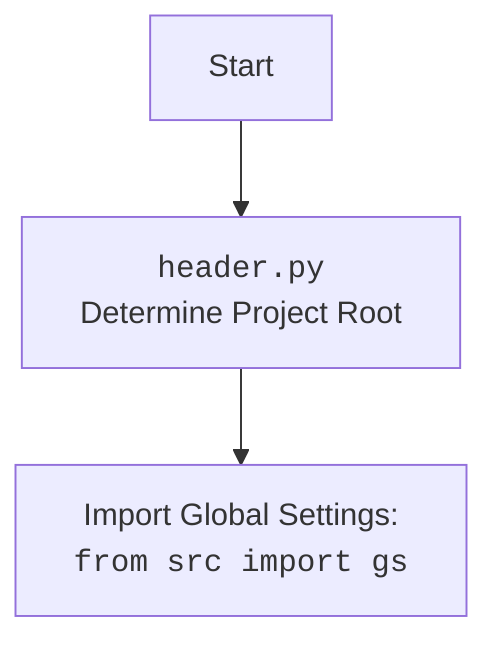

### **Системные инструкции для обработки кода проекта `hypotez`**

=========================================================================================

Описание функциональности и правил для генерации, анализа и улучшения кода. Направлено на обеспечение последовательного и читаемого стиля кодирования, соответствующего требованиям.

---

### **Основные принципы**

#### **1. Общие указания**:
- Соблюдай четкий и понятный стиль кодирования.
- Все изменения должны быть обоснованы и соответствовать установленным требованиям.

#### **2. Комментарии**:
- Используй `#` для внутренних комментариев.
- Документация всех функций, методов и классов должна следовать такому формату: 
    ```python
        def function(param: str, param1: Optional[str | dict | str] = None) -> dict | None:
            """ 
            Args:
                param (str): Описание параметра `param`.
                param1 (Optional[str | dict | str], optional): Описание параметра `param1`. По умолчанию `None`.
    
            Returns:
                dict | None: Описание возвращаемого значения. Возвращает словарь или `None`.
    
            Raises:
                SomeError: Описание ситуации, в которой возникает исключение `SomeError`.

            Ехаmple:
                >>> function('param', 'param1')
                {'param': 'param1'}
            """
    ```
- Комментарии и документация должны быть четкими, лаконичными и точными.

#### **3. Форматирование кода**:
- Используй одинарные кавычки. `a:str = 'value'`, `print('Hello World!')`;
- Добавляй пробелы вокруг операторов. Например, `x = 5`;
- Все параметры должны быть аннотированы типами. `def function(param: str, param1: Optional[str | dict | str] = None) -> dict | None:`;
- Не используй `Union`. Вместо этого используй `|`.

#### **4. Логирование**:
- Для логгирования Всегда Используй модуль `logger` из `src.logger.logger`.
- Ошибки должны логироваться с использованием `logger.error`.
Пример:
    ```python
        try:
            ...
        except Exception as ex:
            logger.error('Error while processing data', ех, exc_info=True)
    ```
#### **5 Не используй `Union[]` в коде. Вместо него используй `|`
Например:
```python
x: str | int ...
```


---

### **Основные требования**:

#### **1. Формат ответов в Markdown**:
- Все ответы должны быть выполнены в формате **Markdown**.

#### **2. Формат комментариев**:
- Используй указанный стиль для комментариев и документации в коде.
- Пример:

```python
from typing import Generator, Optional, List
from pathlib import Path


def read_text_file(
    file_path: str | Path,
    as_list: bool = False,
    extensions: Optional[List[str]] = None,
    chunk_size: int = 8192,
) -> Generator[str, None, None] | str | None:
    """
    Считывает содержимое файла (или файлов из каталога) с использованием генератора для экономии памяти.

    Args:
        file_path (str | Path): Путь к файлу или каталогу.
        as_list (bool): Если `True`, возвращает генератор строк.
        extensions (Optional[List[str]]): Список расширений файлов для чтения из каталога.
        chunk_size (int): Размер чанков для чтения файла в байтах.

    Returns:
        Generator[str, None, None] | str | None: Генератор строк, объединенная строка или `None` в случае ошибки.

    Raises:
        Exception: Если возникает ошибка при чтении файла.

    Example:
        >>> from pathlib import Path
        >>> file_path = Path('example.txt')
        >>> content = read_text_file(file_path)
        >>> if content:
        ...    print(f'File content: {content[:100]}...')
        File content: Example text...
    """
    ...
```
- Всегда делай подробные объяснения в комментариях. Избегай расплывчатых терминов, 
- таких как *«получить»* или *«делать»*
-  . Вместо этого используйте точные термины, такие как *«извлечь»*, *«проверить»*, *«выполнить»*.
- Вместо: *«получаем»*, *«возвращаем»*, *«преобразовываем»* используй имя объекта *«функция получае»*, *«переменная возвращает»*, *«код преобразовывает»* 
- Комментарии должны непосредственно предшествовать описываемому блоку кода и объяснять его назначение.

#### **3. Пробелы вокруг операторов присваивания**:
- Всегда добавляйте пробелы вокруг оператора `=`, чтобы повысить читаемость.
- Примеры:
  - **Неправильно**: `x=5`
  - **Правильно**: `x = 5`

#### **4. Использование `j_loads` или `j_loads_ns`**:
- Для чтения JSON или конфигурационных файлов замените стандартное использование `open` и `json.load` на `j_loads` или `j_loads_ns`.
- Пример:

```python
# Неправильно:
with open('config.json', 'r', encoding='utf-8') as f:
    data = json.load(f)

# Правильно:
data = j_loads('config.json')
```

#### **5. Сохранение комментариев**:
- Все существующие комментарии, начинающиеся с `#`, должны быть сохранены без изменений в разделе «Улучшенный код».
- Если комментарий кажется устаревшим или неясным, не изменяйте его. Вместо этого отметьте его в разделе «Изменения».

#### **6. Обработка `...` в коде**:
- Оставляйте `...` как указатели в коде без изменений.
- Не документируйте строки с `...`.
```

#### **7. Аннотации**
Для всех переменных должны быть определены аннотации типа. 
Для всех функций все входные и выходные параметры аннотириваны
Для все параметров должны быть аннотации типа.


### **8. webdriver**
В коде используется webdriver. Он импртируется из модуля `webdriver` проекта `hypotez`
```python
from src.webdirver import Driver, Chrome, Firefox, Playwright, ...
driver = Driver(Firefox)

Пoсле чего может использоваться как

close_banner = {
  "attribute": null,
  "by": "XPATH",
  "selector": "//button[@id = 'closeXButton']",
  "if_list": "first",
  "use_mouse": false,
  "mandatory": false,
  "timeout": 0,
  "timeout_for_event": "presence_of_element_located",
  "event": "click()",
  "locator_description": "Закрываю pop-up окно, если оно не появилось - не страшно (`mandatory`:`false`)"
}

result = driver.execute_locator(close_banner)
```

### **Анализ кода `hypotez/src/endpoints/prestashop/api/api_async.py`**

#### **1. Блок-схема**

```mermaid
graph LR
    A[Начало] --> B{Инициализация PrestaShopAsync};
    B --> C{Вызов метода API (например, ping, create, read)};
    C --> D{Подготовка URL запроса (_prepare)};
    D --> E{Выполнение HTTP запроса (_exec)};
    E --> F{Проверка ответа (_check_response)};
    F -- Статус 200/201 --> G{Обработка успешного ответа};
    F -- Ошибка --> H{Обработка ошибки (_parse_response_error)};
    G --> I{Разбор ответа (_parse)};
    I --> J{Возврат данных};
    H --> J;
    J --> K[Конец];
    style A fill:#f9f,stroke:#333,stroke-width:2px
    style K fill:#f9f,stroke:#333,stroke-width:2px
    style F fill:#ccf,stroke:#333,stroke-width:2px
    style G fill:#ccf,stroke:#333,stroke-width:2px

    subgraph Пример `create`
        C --> C1{Вызов `api.create('products', data)`};
        C1 --> D;
    end

    subgraph Пример `read`
         C --> C2{Вызов `api.read('products', product_id)`};
         C2 --> D;
    end
```

Примеры для логических блоков:
- **Инициализация PrestaShopAsync**:
  ```python
  api = PrestaShopAsync(
      api_domain='https://your-prestashop-domain.com',
      api_key='your_api_key',
      data_format='JSON',
      debug=True
  )
  ```
- **Подготовка URL запроса (_prepare)**:
  ```python
  prepared_url = self._prepare(
      f'{self.API_DOMAIN}/api/{resource}/{resource_id}',
      {'filter': search_filter, 'display': display}
  )
  ```
- **Выполнение HTTP запроса (_exec)**:
  ```python
  async with self.client.request(
      method='GET',
      url=prepared_url,
      headers=headers
  ) as response:
      ...
  ```
- **Проверка ответа (_check_response)**:
  ```python
  if not self._check_response(response.status, response, method, prepared_url, headers, request_data):
      return False
  ```
- **Обработка ошибки (_parse_response_error)**:
  ```python
  self._parse_response_error(response, method, url, headers, data)
  ```
- **Разбор ответа (_parse)**:
  ```python
  data = j_loads(text)
  return data.get('PrestaShop', {}) if 'PrestaShop' in data else data
  ```

#### **2. Диаграмма**

```mermaid
graph TD
    Start --> PrestaShopAsync[PrestaShopAsync];
    PrestaShopAsync --> ClientSession[aiohttp.ClientSession];
    PrestaShopAsync --> API_DOMAIN;
    PrestaShopAsync --> API_KEY;
    PrestaShopAsync --> data_format;
    PrestaShopAsync --> debug;
    PrestaShopAsync --> ping;
    PrestaShopAsync --> create;
    PrestaShopAsync --> read;
    PrestaShopAsync --> write;
    PrestaShopAsync --> unlink;
    PrestaShopAsync --> search;
    PrestaShopAsync --> create_binary;
    PrestaShopAsync --> get_data;
    PrestaShopAsync --> get_apis;
    PrestaShopAsync --> upload_image_async;
    PrestaShopAsync --> get_languages_schema;
    ping --> _check_response;
    _check_response --> _parse_response_error;
    create --> _exec;
    read --> _exec;
    write --> _exec;
    unlink --> _exec;
    search --> _exec;
    create_binary --> ClientSession;
    get_data --> _exec;
    _exec --> _prepare;
    _exec --> dict2xml[dict2xml];
    _exec --> ClientSession;
    _exec --> _check_response;
    _exec --> _parse;
    _parse --> j_loads[j_loads];
    _parse --> ElementTree[xml.etree.ElementTree];
    _parse --> logger;
    upload_image_async --> save_image_from_url[save_image_from_url_async];
    upload_image_async --> create_binary;
    upload_image_async --> remove_file;
    remove_file --> os;

    style PrestaShopAsync fill:#f9f,stroke:#333,stroke-width:2px
    style ClientSession fill:#ccf,stroke:#333,stroke-width:2px
    style API_DOMAIN fill:#eee,stroke:#333,stroke-width:2px
    style API_KEY fill:#eee,stroke:#333,stroke-width:2px
    style data_format fill:#eee,stroke:#333,stroke-width:2px
    style debug fill:#eee,stroke:#333,stroke-width:2px
    
    subgraph utils
        dict2xml --> src_utils_convertors_dict[src.utils.convertors.dict];
        j_loads --> src_utils_jjson[src.utils.jjson];
        save_image_from_url --> src_utils_image[src.utils.image];
    end
    
    subgraph logger
        logger --> src_logger_logger[src.logger.logger];
    end
```

**Объяснение зависимостей:**

- **`PrestaShopAsync`**: Основной класс, представляющий API PrestaShop.
- **`aiohttp.ClientSession`**: Используется для выполнения асинхронных HTTP-запросов.
- **`API_DOMAIN`**: URL домена PrestaShop API.
- **`API_KEY`**: Ключ API для аутентификации.
- **`data_format`**: Формат данных (JSON или XML).
- **`debug`**: Флаг для включения режима отладки.
- **`ping`**: Метод для проверки доступности API.
- **`create`**, **`read`**, **`write`**, **`unlink`**, **`search`**: Методы для CRUD операций с ресурсами API.
- **`create_binary`**: Метод для загрузки бинарных файлов (например, изображений).
- **`get_data`**: Метод для получения и сохранения данных API в файл.
- **`get_apis`**: Метод для получения списка доступных API.
- **`upload_image_async`**: Метод для асинхронной загрузки изображений.
- **`get_languages_schema`**: Метод для получения схемы языков.
- **`_prepare`**: Метод для подготовки URL запроса.
- **`dict2xml`**: Функция для преобразования словаря в XML.
- **`j_loads`**: Функция для загрузки JSON из текста.
- **`save_image_from_url`**: Функция для сохранения изображения из URL.
- **`logger`**: Объект логгера для записи сообщений об ошибках и отладочной информации.
- **`os`**: Модуль для операций с файловой системой, используется для удаления временных файлов.
- **`ElementTree`**: Модуль для работы с XML.

Дополнительный `mermaid` flowchart, объясняющий `header.py`:



#### **3. Объяснение**

**Импорты:**

- `os`: Предоставляет функции для взаимодействия с операционной системой, такие как удаление файлов.
- `sys`: Предоставляет доступ к некоторым переменным и функциям, взаимодействующим с интерпретатором Python.
- `enum.Enum`: Используется для создания перечислений, в данном случае, для определения форматов данных (JSON, XML).
- `http.client.HTTPConnection`: Используется для низкоуровневой работы с HTTP-соединениями.
- `pathlib.Path`: Предоставляет способ представления путей к файлам и директориям.
- `typing`: Используется для аннотации типов.
- `xml.etree.ElementTree`: Используется для работы с XML-данными.
- `xml.parsers.expat.ExpatError`: Обработка исключений при парсинге XML.
- `requests.Session`: Управление HTTP сессиями.
- `requests.models.PreparedRequest`: Подготовка HTTP запросов.
- `header`: Кастомный модуль для определения корневой директории проекта.
- `src`: Содержит внутренние пакеты проекта.
  - `src.gs`: Содержит глобальные настройки проекта.
  - `src.logger.exceptions`: Содержит определения кастомных исключений, связанных с PrestaShop.
  - `src.logger.logger`: Предоставляет функциональность логгирования.
  - `src.utils.convertors.base64`: Утилиты для работы с base64.
  - `src.utils.convertors.dict`: Утилиты для работы с dict.
  - `src.utils.convertors.xml2dict`: Утилиты для конвертации XML в dict.
  - `src.utils.file`: Утилиты для работы с файлами.
  - `src.utils.image`: Утилиты для работы с изображениями.
  - `src.utils.jjson`: Утилиты для работы с JSON (загрузка, сохранение).
  - `src.utils.printer`: Утилиты для форматированного вывода.
- `asyncio`: Используется для асинхронного программирования.
- `aiohttp`: Асинхронный HTTP клиент/сервер.

**Классы:**

- `Format(Enum)`:
  - Описывает формат данных, возвращаемых API (JSON или XML).
  - Атрибуты:
    - `JSON = 'JSON'`
    - `XML = 'XML'`
- `PrestaShopAsync`:
  - Асинхронный класс для взаимодействия с API PrestaShop.
  - Атрибуты:
    - `client: ClientSession`: Асинхронная HTTP сессия.
    - `debug: bool`: Флаг для включения режима отладки.
    - `lang_index: Optional[int]`: Индекс языка по умолчанию.
    - `data_format: str`: Формат данных (JSON или XML).
    - `ps_version: str`: Версия PrestaShop.
    - `API_DOMAIN: str`: URL домена PrestaShop API.
    - `API_KEY: str`: Ключ API.
  - Методы:
    - `__init__`: Инициализирует класс, устанавливает параметры аутентификации и создает асинхронную сессию.
    - `ping`: Проверяет доступность API.
    - `_check_response`: Проверяет статус ответа и обрабатывает ошибки.
    - `_parse_response_error`: Разбирает сообщение об ошибке из ответа API.
    - `_prepare`: Подготавливает URL для запроса, добавляя параметры.
    - `_exec`: Выполняет HTTP-запрос к API.
    - `_parse`: Разбирает ответ API (JSON или XML).
    - `create`: Создает новый ресурс.
    - `read`: Читает существующий ресурс.
    - `write`: Обновляет существующий ресурс.
    - `unlink`: Удаляет ресурс.
    - `search`: Выполняет поиск ресурсов.
    - `create_binary`: Загружает бинарный файл.
    - `_save`: Сохраняет данные в файл.
    - `get_data`: Получает данные и сохраняет их в файл.
    - `remove_file`: Удаляет файл.
    - `get_apis`: Получает список доступных API.
    - `get_languages_schema`: Получает схему языков.
    - `upload_image_async`: Загружает изображение асинхронно.
    - `upload_image`: Загружает изображение асинхронно (дубликат `upload_image_async`).
    - `get_product_images`: Получает изображения продукта.

**Функции:**

- `ping(self) -> bool`:
  - Аргументы: `self`.
  - Возвращаемое значение: `bool`.
  - Назначение: Проверяет, доступен ли API PrestaShop.
- `_check_response(self, status_code: int, response, method: Optional[str] = None, url: Optional[str] = None, headers: Optional[dict] = None, data: Optional[dict] = None) -> bool`:
  - Аргументы: `status_code` (int), `response`, `method` (Optional[str]), `url` (Optional[str]), `headers` (Optional[dict]), `data` (Optional[dict]).
  - Возвращаемое значение: `bool`.
  - Назначение: Проверяет статус код HTTP ответа.
- `_parse_response_error(self, response, method: Optional[str] = None, url: Optional[str] = None, headers: Optional[dict] = None, data: Optional[dict] = None)`:
  - Аргументы: `response`, `method` (Optional[str]), `url` (Optional[str]), `headers` (Optional[dict]), `data` (Optional[dict]).
  - Возвращаемое значение: `None`.
  - Назначение: Разбирает ответ об ошибке от API PrestaShop и логирует детали ошибки.
- `_prepare(self, url: str, params: dict) -> str`:
  - Аргументы: `url` (str), `params` (dict).
  - Возвращаемое значение: `str`.
  - Назначение: Подготавливает URL запроса, добавляя параметры.
- `_exec(self, resource: str, resource_id: Optional[Union[int, str]] = None, resource_ids: Optional[Union[int, Tuple[int]]] = None, method: str = 'GET', data: Optional[dict] = None, headers: Optional[dict] = None, search_filter: Optional[Union[str, dict]] = None, display: Optional[Union[str, list]] = 'full', schema: Optional[str] = None, sort: Optional[str] = None, limit: Optional[str] = None, language: Optional[int] = None, io_format: str = 'JSON') -> Optional[dict]`:
  - Аргументы: `resource` (str), `resource_id` (Optional[Union[int, str]]), `resource_ids` (Optional[Union[int, Tuple[int]]]), `method` (str), `data` (Optional[dict]), `headers` (Optional[dict]), `search_filter` (Optional[Union[str, dict]]), `display` (Optional[Union[str, list]]), `schema` (Optional[str]), `sort` (Optional[str]), `limit` (Optional[str]), `language` (Optional[int]), `io_format` (str).
  - Возвращаемое значение: `Optional[dict]`.
  - Назначение: Выполняет HTTP запрос к API PrestaShop.
- `_parse(self, text: str) -> dict | ElementTree.Element | bool`:
  - Аргументы: `text` (str).
  - Возвращаемое значение: `dict | ElementTree.Element | bool`.
  - Назначение: Разбирает ответ API (JSON или XML).
- `create(self, resource: str, data: dict) -> Optional[dict]`:
  - Аргументы: `resource` (str), `data` (dict).
  - Возвращаемое значение: `dict`.
  - Назначение: Создает новый ресурс в API PrestaShop.
- `read(self, resource: str, resource_id: Union[int, str], **kwargs) -> Optional[dict]`:
  - Аргументы: `resource` (str), `resource_id` (Union[int, str]), `**kwargs`.
  - Возвращаемое значение: `dict`.
  - Назначение: Читает ресурс из API PrestaShop.
- `write(self, resource: str, data: dict) -> Optional[dict]`:
  - Аргументы: `resource` (str), `data` (dict).
  - Возвращаемое значение: `dict`.
  - Назначение: Обновляет существующий ресурс в API PrestaShop.
- `unlink(self, resource: str, resource_id: Union[int, str]) -> bool`:
  - Аргументы: `resource` (str), `resource_id` (Union[int, str]).
  - Возвращаемое значение: `bool`.
  - Назначение: Удаляет ресурс из API PrestaShop.
- `search(self, resource: str, filter: Optional[Union[str, dict]] = None, **kwargs) -> List[dict]`:
  - Аргументы: `resource` (str), `filter` (Optional[Union[str, dict]]), `**kwargs`.
  - Возвращаемое значение: `List[dict]`.
  - Назначение: Выполняет поиск ресурсов в API PrestaShop.
- `create_binary(self, resource: str, file_path: str, file_name: str) -> dict`:
  - Аргументы: `resource` (str), `file_path` (str), `file_name` (str).
  - Возвращаемое значение: `dict`.
  - Назначение: Загружает бинарный файл в API PrestaShop.
- `_save(self, file_name: str, data: dict)`:
  - Аргументы: `file_name` (str), `data` (dict).
  - Возвращаемое значение: `None`.
  - Назначение: Сохраняет данные в файл.
- `get_data(self, resource: str, **kwargs) -> Optional[dict]`:
  - Аргументы: `resource` (str), `**kwargs`.
  - Возвращаемое значение: `dict`.
  - Назначение: Получает данные из API PrestaShop и сохраняет их в файл.
- `remove_file(self, file_path: str)`:
  - Аргументы: `file_path` (str).
  - Возвращаемое значение: `None`.
  - Назначение: Удаляет файл.
- `get_apis(self) -> Optional[dict]`:
  - Аргументы: `self`.
  - Возвращаемое значение: `dict`.
  - Назначение: Получает список доступных API.
- `get_languages_schema(self) -> Optional[dict]`:
  - Аргументы: `self`.
  - Возвращаемое значение: `dict`.
  - Назначение: Получает схему языков.
- `upload_image_async(self, resource: str, resource_id: int, img_url: str, img_name: Optional[str] = None) -> Optional[dict]`:
  - Аргументы: `resource` (str), `resource_id` (int), `img_url` (str), `img_name` (Optional[str]).
  - Возвращаемое значение: `dict`.
  - Назначение: Загружает изображение в API PrestaShop.
- `upload_image(self, resource: str, resource_id: int, img_url: str, img_name: Optional[str] = None) -> Optional[dict]`:
  - Аргументы: `resource` (str), `resource_id` (int), `img_url` (str), `img_name` (Optional[str]).
  - Возвращаемое значение: `dict`.
  - Назначение: Загружает изображение в API PrestaShop (дубликат `upload_image_async`).
- `get_product_images(self, product_id: int) -> Optional[dict]`:
  - Аргументы: `product_id` (int).
  - Возвращаемое значение: `dict`.
  - Назначение: Получает изображения продукта.

**Переменные:**

- `client: ClientSession`: Асинхронная HTTP сессия.
- `debug: bool`: Флаг для включения режима отладки.
- `lang_index: Optional[int]`: Индекс языка по умолчанию.
- `data_format: str`: Формат данных (JSON или XML).
- `ps_version: str`: Версия PrestaShop.
- `API_DOMAIN: str`: URL домена PrestaShop API.
- `API_KEY: str`: Ключ API.

**Потенциальные ошибки и области для улучшения:**

- Дублирование функциональности в методах `upload_image_async` и `upload_image`.
- Обработка ошибок в `_parse_response_error` для JSON формата возвращает объект `response` не обработанным, что может привести к проблемам в дальнейшем.

**Взаимосвязи с другими частями проекта:**

- Класс `PrestaShopAsync` использует `src.logger.logger` для логирования ошибок и отладочной информации.
- Использует `src.utils.jjson` для работы с JSON данными (загрузка и сохранение).
- Использует `src.utils.image` для загрузки изображений по URL.
- Использует `src.utils.file` для сохранения данных в файл.
- Использует `header` для определения корневой директории проекта.