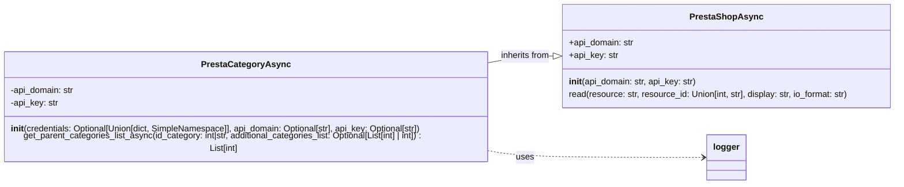

### **Системные инструкции для обработки кода проекта `hypotez`**

=========================================================================================

Описание функциональности и правил для генерации, анализа и улучшения кода. Направлено на обеспечение последовательного и читаемого стиля кодирования, соответствующего требованиям.

---

### **Основные принципы**

#### **1. Общие указания**:
- Соблюдай четкий и понятный стиль кодирования.
- Все изменения должны быть обоснованы и соответствовать установленным требованиям.

#### **2. Комментарии**:
- Используй `#` для внутренних комментариев.
- Документация всех функций, методов и классов должна следовать такому формату: 
    ```python
        def function(param: str, param1: Optional[str | dict | str] = None) -> dict | None:
            """ 
            Args:
                param (str): Описание параметра `param`.
                param1 (Optional[str | dict | str], optional): Описание параметра `param1`. По умолчанию `None`.
    
            Returns:
                dict | None: Описание возвращаемого значения. Возвращает словарь или `None`.
    
            Raises:
                SomeError: Описание ситуации, в которой возникает исключение `SomeError`.

            Ехаmple:
                >>> function('param', 'param1')
                {'param': 'param1'}
            """
    ```
- Комментарии и документация должны быть четкими, лаконичными и точными.

#### **3. Форматирование кода**:
- Используй одинарные кавычки. `a:str = 'value'`, `print('Hello World!')`;
- Добавляй пробелы вокруг операторов. Например, `x = 5`;
- Все параметры должны быть аннотированы типами. `def function(param: str, param1: Optional[str | dict | str] = None) -> dict | None:`;
- Не используй `Union`. Вместо этого используй `|`.

#### **4. Логирование**:
- Для логгирования Всегда Используй модуль `logger` из `src.logger.logger`.
- Ошибки должны логироваться с использованием `logger.error`.
Пример:
    ```python
        try:
            ...
        except Exception as ex:
            logger.error('Error while processing data', ех, exc_info=True)
    ```
#### **5 Не используй `Union[]` в коде. Вместо него используй `|`
Например:
```python
x: str | int ...
```


---

### **Основные требования**:

#### **1. Формат ответов в Markdown**:
- Все ответы должны быть выполнены в формате **Markdown**.

#### **2. Формат комментариев**:
- Используй указанный стиль для комментариев и документации в коде.
- Пример:

```python
from typing import Generator, Optional, List
from pathlib import Path


def read_text_file(
    file_path: str | Path,
    as_list: bool = False,
    extensions: Optional[List[str]] = None,
    chunk_size: int = 8192,
) -> Generator[str, None, None] | str | None:
    """
    Считывает содержимое файла (или файлов из каталога) с использованием генератора для экономии памяти.

    Args:
        file_path (str | Path): Путь к файлу или каталогу.
        as_list (bool): Если `True`, возвращает генератор строк.
        extensions (Optional[List[str]]): Список расширений файлов для чтения из каталога.
        chunk_size (int): Размер чанков для чтения файла в байтах.

    Returns:
        Generator[str, None, None] | str | None: Генератор строк, объединенная строка или `None` в случае ошибки.

    Raises:
        Exception: Если возникает ошибка при чтении файла.

    Example:
        >>> from pathlib import Path
        >>> file_path = Path('example.txt')
        >>> content = read_text_file(file_path)
        >>> if content:
        ...    print(f'File content: {content[:100]}...')
        File content: Example text...
    """
    ...
```
- Всегда делай подробные объяснения в комментариях. Избегай расплывчатых терминов, 
- таких как *«получить»* или *«делать»*. Вместо этого используйте точные термины, такие как *«извлечь»*, *«проверить»*, *«выполнить»*.
- Вместо: *«получаем»*, *«возвращаем»*, *«преобразовываем»* используй имя объекта *«функция получае»*, *«переменная возвращает»*, *«код преобразовывает»* 
- Комментарии должны непосредственно предшествовать описываемому блоку кода и объяснять его назначение.

#### **3. Пробелы вокруг операторов присваивания**:
- Всегда добавляйте пробелы вокруг оператора `=`, чтобы повысить читаемость.
- Примеры:
  - **Неправильно**: `x=5`
  - **Правильно**: `x = 5`

#### **4. Использование `j_loads` или `j_loads_ns`**:
- Для чтения JSON или конфигурационных файлов замените стандартное использование `open` и `json.load` на `j_loads` или `j_loads_ns`.
- Пример:

```python
# Неправильно:
with open('config.json', 'r', encoding='utf-8') as f:
    data = json.load(f)

# Правильно:
data = j_loads('config.json')
```

#### **5. Сохранение комментариев**:
- Все существующие комментарии, начинающиеся с `#`, должны быть сохранены без изменений в разделе «Улучшенный код».
- Если комментарий кажется устаревшим или неясным, не изменяйте его. Вместо этого отметьте его в разделе «Изменения».

#### **6. Обработка `...` в коде**:
- Оставляйте `...` как указатели в коде без изменений.
- Не документируйте строки с `...`.
```

#### **7. Аннотации**
Для всех переменных должны быть определены аннотации типа. 
Для всех функций все входные и выходные параметры аннотириваны
Для все параметров должны быть аннотации типа.


### **8. webdriver**
В коде используется webdriver. Он импртируется из модуля `webdriver` проекта `hypotez`
```python
from src.webdirver import Driver, Chrome, Firefox, Playwright, ...
driver = Driver(Firefox)

Пoсле чего может использоваться как

close_banner = {
  "attribute": null,
  "by": "XPATH",
  "selector": "//button[@id = 'closeXButton']",
  "if_list": "first",
  "use_mouse": false,
  "mandatory": false,
  "timeout": 0,
  "timeout_for_event": "presence_of_element_located",
  "event": "click()",
  "locator_description": "Закрываю pop-up окно, если оно не появилось - не страшно (`mandatory`:`false`)"
}

result = driver.execute_locator(close_banner)
```

### **Анализ кода `hypotez/src/endpoints/prestashop/category_async.py`**

#### **1. Блок-схема**

```mermaid
graph TD
    A[Начало] --> B{credentials?}
    B -- Да --> C[Извлечь api_domain и api_key из credentials]
    B -- Нет --> D[Проверка api_domain и api_key]
    C --> D
    D -- Нет --> E[Выбросить ValueError]
    D -- Да --> F[Инициализация PrestaShopAsync]
    F --> G[Вызов get_parent_categories_list_async]
    G --> H{id_category является int?}
    H -- Да --> I[id_category = id_category]
    H -- Нет --> J[Преобразовать id_category в int]
    I --> K{additional_categories_list является list?}
    J --> K
    K -- Да --> L[additional_categories_list = additional_categories_list]
    K -- Нет --> M[Преобразовать additional_categories_list в list]
    L --> N[Добавить id_category в additional_categories_list]
    M --> N
    N --> O[out_categories_list = []]
    O --> P{Цикл по additional_categories_list}
    P --> Q[Вызов super().read()]
    Q --> R{parent <= 2?}
    R -- Да --> S[Возврат out_categories_list]
    R -- Нет --> T[Добавить parent в out_categories_list]
    T --> P
    P -- Конец цикла --> S
    E --> End[Конец]
    S --> End
```

**Примеры для логических блоков:**

-   **B{credentials?}**:

    *   Пример `Да`: `credentials = {'api_domain': 'example.com', 'api_key': 'test_key'}`
    *   Пример `Нет`: `credentials = None`
-   **H{id\_category является int?}**:
    *   Пример `Да`: `id_category = 123`
    *   Пример `Нет`: `id_category = "123"`
-   **K{additional\_categories\_list является list?}**:
    *   Пример `Да`: `additional_categories_list = [1, 2, 3]`
    *   Пример `Нет`: `additional_categories_list = 1`
-   **R{parent <= 2?}**:
    *   Пример `Да`: `parent = 1`
    *   Пример `Нет`: `parent = 3`

#### **2. Диаграмма**



**Объяснение зависимостей:**

-   `PrestaCategoryAsync` наследуется от `PrestaShopAsync`, указывая на то, что `PrestaCategoryAsync` является специализированной версией `PrestaShopAsync`.
-   `PrestaCategoryAsync` использует `logger` для логирования ошибок и информации, что необходимо для отладки и мониторинга.

#### **3. Объяснение**

**Импорты:**

-   `typing`: Используется для аннотации типов. `List`, `Dict`, `Optional`, и `Union` позволяют указать типы переменных, аргументов функций и возвращаемых значений.
-   `types.SimpleNamespace`: Предоставляет простой способ создания объектов, доступ к атрибутам которых можно получить через точечную нотацию.
-   `asyncio`: Используется для асинхронного программирования, позволяя функциям выполняться параллельно.
-   `src.logger.logger`:  Используется для логирования событий, ошибок и отладочной информации. Модуль предоставляет функции для записи сообщений в различные источники, такие как файлы или консоль.
-   `src.utils.jjson`:  Модуль содержит функции `j_loads` и `j_dumps` для работы с JSON данными. `j_loads` используется для чтения JSON из файла, а `j_dumps` для записи JSON в файл. Это может быть необходимо для работы с конфигурационными файлами.
-   `src.endpoints.prestashop.api`: Импортирует классы `PrestaShop` и `PrestaShopAsync`, которые, вероятно, предоставляют интерфейс для взаимодействия с API PrestaShop. `PrestaShopAsync` является асинхронной версией класса `PrestaShop`.

**Классы:**

-   `PrestaCategoryAsync`:
    -   **Роль**: Асинхронный класс для управления категориями в PrestaShop.
    -   **Атрибуты**:
        -   `api_domain` (str): Домен API PrestaShop.
        -   `api_key` (str): Ключ API для доступа к PrestaShop.
    -   **Методы**:
        -   `__init__(self, credentials: Optional[Union[dict, SimpleNamespace]] = None, api_domain: Optional[str] = None, api_key: Optional[str] = None)`: Конструктор класса. Принимает учетные данные (credentials) в виде словаря или `SimpleNamespace`, а также домен API и ключ API. Если учетные данные переданы, они используются для получения домена и ключа API. Если домен или ключ API не предоставлены, выбрасывается исключение `ValueError`.
        -   `get_parent_categories_list_async(self, id_category: int|str, additional_categories_list: Optional[List[int] | int] = []) -> List[int]`: Асинхронный метод для получения списка родительских категорий для заданной категории. Принимает идентификатор категории (`id_category`) и дополнительный список категорий (`additional_categories_list`). Возвращает список идентификаторов родительских категорий.
    -   **Взаимодействие с другими компонентами**:
        -   Наследуется от `PrestaShopAsync`, что позволяет использовать методы для взаимодействия с API PrestaShop.
        -   Использует модуль `logger` для логирования ошибок.
-   `PrestaShopAsync`:
    -   Родительский класс для взаимодействия с PrestaShop API асинхронно.
    -   `api_domain`: Домен API PrestaShop.
    -   `api_key`: Ключ API для доступа к PrestaShop.
    -   `read`: Метод для чтения данных из API PrestaShop.

**Функции:**

-   `get_parent_categories_list_async(self, id_category: int|str, additional_categories_list: Optional[List[int] | int] = []) -> List[int]`:
    -   **Аргументы**:
        -   `id_category` (int|str): Идентификатор категории, для которой нужно получить родительские категории.
        -   `additional_categories_list` (Optional[List[int]  |  int], optional): Дополнительный список категорий для обработки. По умолчанию `[]`.
    -   **Возвращаемое значение**:
        -   `List[int]`: Список идентификаторов родительских категорий.
    -   **Назначение**: Асинхронно получает список родительских категорий для заданной категории. Сначала проверяет, является ли `id_category` целым числом, и преобразует его, если это строка. Затем проверяет, является ли `additional_categories_list` списком, и преобразует его, если это не так. Добавляет `id_category` в `additional_categories_list`. Затем итерируется по `additional_categories_list` и вызывает метод `read` для получения родительской категории для каждой категории в списке. Если родительская категория меньше или равна 2, возвращает список родительских категорий.
    -   **Пример**:

```python
    async def get_parent_categories_list_async(self, id_category: int|str = 5, additional_categories_list: Optional[List[int] | int] = [1,2,3]) -> List[int]:
        ...
```

**Переменные:**

-   `credentials` (Optional[Union[dict, SimpleNamespace]]): Учетные данные для доступа к API PrestaShop. Может быть словарем или экземпляром `SimpleNamespace`.
-   `api_domain` (Optional[str]): Домен API PrestaShop.
-   `api_key` (Optional[str]): Ключ API для доступа к API PrestaShop.
-   `id_category` (int|str): Идентификатор категории, для которой нужно получить родительские категории.
-   `additional_categories_list` (Optional[List[int] | int]): Дополнительный список категорий для обработки.
-   `out_categories_list` (list): Список идентификаторов родительских категорий.
-   `parent` (int): Идентификатор родительской категории.

**Потенциальные ошибки и области для улучшения:**

-   Обработка ошибок в `get_parent_categories_list_async`: Сейчас при возникновении исключения в цикле просто логируется ошибка и происходит переход к следующей итерации. Возможно, стоит рассмотреть возможность возврата ошибки или прекращения выполнения функции в зависимости от требований.
-   Не хватает обработки ошибок при чтении конфигурационных файлов.  Если файл не существует или имеет неверный формат, программа завершится с ошибкой.
-   В функции `get_parent_categories_list_async`  происходит преобразование типов `id_category` и `additional_categories_list`.  Необходимо убедиться, что эти преобразования корректно обрабатывают все возможные входные данные.
-   Функция `main` содержит только `...`, что указывает на незавершенную реализацию. Необходимо добавить функциональность в эту функцию.

**Цепочка взаимосвязей с другими частями проекта:**

1.  `src.endpoints.prestashop.category_async` использует `src.endpoints.prestashop.api.PrestaShopAsync` для взаимодействия с API PrestaShop.
2.  `src.endpoints.prestashop.category_async` использует `src.logger.logger` для логирования событий и ошибок.
3.  `src.endpoints.prestashop.category_async` использует `src.utils.jjson` для загрузки конфигурационных файлов.

**Дополнительно**:
В коде нет импорта `import header`.