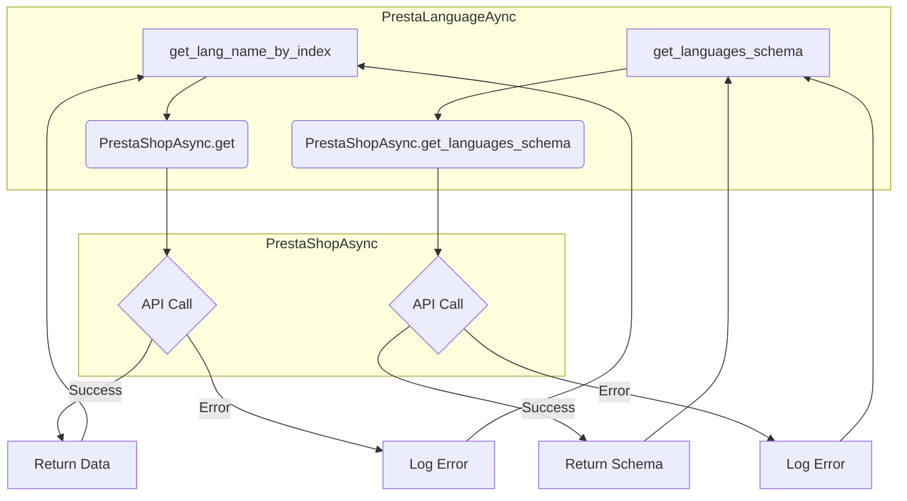
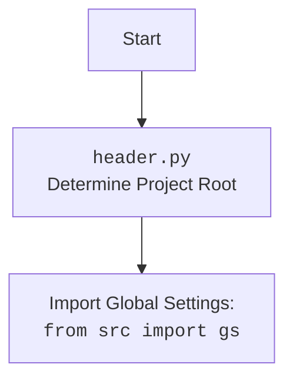

### **Анализ кода проекта `hypotez`**

=========================================================================================

#### **1. Блок-схема**

```mermaid
graph LR
    A[Start] --> B(PrestaLanguageAsync Class);
    B --> C{get_lang_name_by_index(lang_index: int|str)};
    C -- Вызов super().get() --> D(PrestaShopAsync.get());
    D -- API Call --> E{Success?};
    E -- Yes --> F[Return Language Name];
    E -- No --> G{Exception};
    G --> H[Log Error];
    H --> I[Return Empty String];
    B --> J{get_languages_schema()};
    J -- Вызов super().get_languages_schema() --> K(PrestaShopAsync.get_languages_schema());
    K -- API Call --> L[Return Language Schema];
    L --> M[Print Language Schema];
    M --> N[End];
```

**Примеры:**

- **get_lang_name_by_index**:
  - Вход: `lang_index = 3`
  - Вызов: `super().get('languagaes', resource_id='3', display='full', io_format='JSON')`
  - Результат: Возвращает имя языка ISO (например, "English") или пустую строку в случае ошибки.
- **get_languages_schema**:
  - Вызов: `super().get_languages_schema()`
  - Результат: Возвращает структуру данных (словарь) с описанием схемы языков в PrestaShop.

#### **2. Диаграмма**



**Объяснение зависимостей:**

- Класс `PrestaLanguageAync` наследуется от класса `PrestaShopAsync`, что обеспечивает доступ к методам для выполнения API-запросов.
- Метод `get_lang_name_by_index` вызывает метод `get` из `PrestaShopAsync` для получения имени языка по индексу.
- Метод `get_languages_schema` вызывает метод `get_languages_schema` из `PrestaShopAsync` для получения схемы языков.



#### **3. Объяснение**

**Импорты:**

- `asyncio`: Используется для поддержки асинхронного программирования.
- `types.SimpleNamespace`: Предоставляет простой способ создания объектов с атрибутами, доступными через точечную нотацию.
- `header`: Определяет корень проекта.
- `src`: Содержит основные настройки и конфигурации проекта.
- `src.endpoints.prestashop.api.PrestaShopAsync`: Класс для взаимодействия с API PrestaShop.
- `src.logger.exceptions.PrestaShopException`: Класс исключений, специфичных для PrestaShop.
- `src.utils.printer.pprint`: Функция для красивой печати данных.
- `src.logger.logger.logger`: Модуль логирования.

**Классы:**

- `PrestaLanguageAync`:
  - **Роль**: Управление языками в магазине PrestaShop.
  - **Атрибуты**: Отсутствуют (только методы).
  - **Методы**:
    - `__init__`: Конструктор класса.
    - `get_lang_name_by_index(lang_index: int|str) -> str`: Возвращает имя языка по индексу.
    - `get_languages_schema() -> dict`: Возвращает схему языков.
  - **Взаимодействие**:
    - Наследуется от `PrestaShopAsync`, что обеспечивает доступ к API PrestaShop.

**Функции:**

- `get_lang_name_by_index(lang_index: int|str) -> str`:
  - **Аргументы**:
    - `lang_index (int|str)`: Индекс языка в PrestaShop.
  - **Возвращаемое значение**:
    - `str`: Имя языка ISO или пустая строка в случае ошибки.
  - **Назначение**:
    - Получение имени языка по его индексу в таблице PrestaShop.
  - **Пример**:
    ```python
    lang_name = await self.get_lang_name_by_index(3)
    print(lang_name)  # Output: English
    ```
- `get_languages_schema() -> dict`:
  - **Аргументы**:
    - Отсутствуют.
  - **Возвращаемое значение**:
    - `dict`: Схема языков в формате словаря.
  - **Назначение**:
    - Получение схемы языков из PrestaShop.
  - **Пример**:
    ```python
    schema = await self.get_languages_schema()
    print(schema)  # Output: {'languages': [...]}
    ```
- `main()`:
  - **Назначение**:
    - Асинхронная функция для демонстрации работы с классом `PrestaLanguageAync`.

**Переменные:**

- Отсутствуют значимые переменные, кроме аргументов методов.

**Потенциальные ошибки и области для улучшения:**

- В методе `get_lang_name_by_index` обрабатывается исключение, но возвращается пустая строка. Возможно, стоит пересмотреть обработку ошибок и, например, возвращать `None` или выбрасывать исключение выше.
- Не реализован метод `get_languages_schema` в классе `PrestaLanguageAync`, что указано многоточием (`...`). Необходимо реализовать логику получения схемы языков.
- Отсутствует документация для параметра `lang_index` в `get_lang_name_by_index`, необходимо добавить описание.

**Взаимосвязи с другими частями проекта:**

- Класс `PrestaLanguageAync` использует `PrestaShopAsync` для выполнения API-запросов к PrestaShop.
- Используется модуль `logger` для логирования ошибок.
- Класс использует `header` для определения настроек проекта и `gs` для доступа к глобальным настройкам.