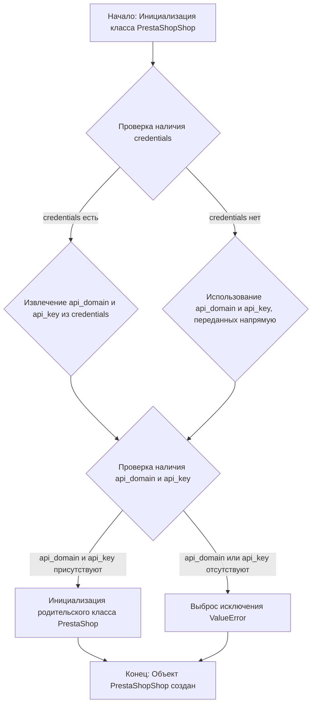
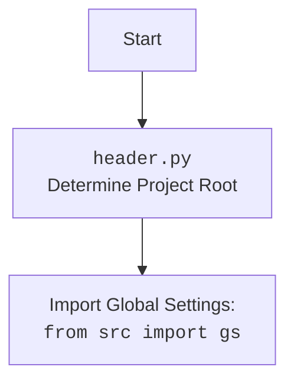

### **Системные инструкции для обработки кода проекта `hypotez`**

=========================================================================================

Описание функциональности и правил для генерации, анализа и улучшения кода. Направлено на обеспечение последовательного и читаемого стиля кодирования, соответствующего требованиям.

---

### **Основные принципы**

#### **1. Общие указания**:
- Соблюдай четкий и понятный стиль кодирования.
- Все изменения должны быть обоснованы и соответствовать установленным требованиям.

#### **2. Комментарии**:
- Используй `#` для внутренних комментариев.
- Документация всех функций, методов и классов должна следовать такому формату: 
    ```python
        def function(param: str, param1: Optional[str | dict | str] = None) -> dict | None:
            """ 
            Args:
                param (str): Описание параметра `param`.
                param1 (Optional[str | dict | str], optional): Описание параметра `param1`. По умолчанию `None`.
    
            Returns:
                dict | None: Описание возвращаемого значения. Возвращает словарь или `None`.
    
            Raises:
                SomeError: Описание ситуации, в которой возникает исключение `SomeError`.

            Ехаmple:
                >>> function('param', 'param1')
                {'param': 'param1'}
            """
    ```
- Комментарии и документация должны быть четкими, лаконичными и точными.

#### **3. Форматирование кода**:
- Используй одинарные кавычки. `a:str = 'value'`, `print('Hello World!')`;
- Добавляй пробелы вокруг операторов. Например, `x = 5`;
- Все параметры должны быть аннотированы типами. `def function(param: str, param1: Optional[str | dict | str] = None) -> dict | None:`;
- Не используй `Union`. Вместо этого используй `|`.

#### **4. Логирование**:
- Для логгирования Всегда Используй модуль `logger` из `src.logger.logger`.
- Ошибки должны логироваться с использованием `logger.error`.
Пример:
    ```python
        try:
            ...
        except Exception as ex:
            logger.error('Error while processing data', ех, exc_info=True)
    ```
#### **5 Не используй `Union[]` в коде. Вместо него используй `|`
Например:
```python
x: str | int ...
```


---

### **Основные требования**:

#### **1. Формат ответов в Markdown**:
- Все ответы должны быть выполнены в формате **Markdown**.

#### **2. Формат комментариев**:
- Используй указанный стиль для комментариев и документации в коде.
- Пример:

```python
from typing import Generator, Optional, List
from pathlib import Path


def read_text_file(
    file_path: str | Path,
    as_list: bool = False,
    extensions: Optional[List[str]] = None,
    chunk_size: int = 8192,
) -> Generator[str, None, None] | str | None:
    """
    Считывает содержимое файла (или файлов из каталога) с использованием генератора для экономии памяти.

    Args:
        file_path (str | Path): Путь к файлу или каталогу.
        as_list (bool): Если `True`, возвращает генератор строк.
        extensions (Optional[List[str]]): Список расширений файлов для чтения из каталога.
        chunk_size (int): Размер чанков для чтения файла в байтах.

    Returns:
        Generator[str, None, None] | str | None: Генератор строк, объединенная строка или `None` в случае ошибки.

    Raises:
        Exception: Если возникает ошибка при чтении файла.

    Example:
        >>> from pathlib import Path
        >>> file_path = Path('example.txt')
        >>> content = read_text_file(file_path)
        >>> if content:
        ...    print(f'File content: {content[:100]}...')
        File content: Example text...
    """
    ...
```
- Всегда делай подробные объяснения в комментариях. Избегай расплывчатых терминов, 
- таких как *«получить»* или *«делать»*. Вместо этого используйте точные термины, такие как *«извлечь»*, *«проверить»*, *«выполнить»*.
- Вместо: *«получаем»*, *«возвращаем»*, *«преобразовываем»* используй имя объекта *«функция получае»*, *«переменная возвращает»*, *«код преобразовывает»* 
- Комментарии должны непосредственно предшествовать описываемому блоку кода и объяснять его назначение.

#### **3. Пробелы вокруг операторов присваивания**:
- Всегда добавляйте пробелы вокруг оператора `=`, чтобы повысить читаемость.
- Примеры:
  - **Неправильно**: `x=5`
  - **Правильно**: `x = 5`

#### **4. Использование `j_loads` или `j_loads_ns`**:
- Для чтения JSON или конфигурационных файлов замените стандартное использование `open` и `json.load` на `j_loads` или `j_loads_ns`.
- Пример:

```python
# Неправильно:
with open('config.json', 'r', encoding='utf-8') as f:
    data = json.load(f)

# Правильно:
data = j_loads('config.json')
```

#### **5. Сохранение комментариев**:
- Все существующие комментарии, начинающиеся с `#`, должны быть сохранены без изменений в разделе «Улучшенный код».
- Если комментарий кажется устаревшим или неясным, не изменяйте его. Вместо этого отметьте его в разделе «Изменения».

#### **6. Обработка `...` в коде**:
- Оставляйте `...` как указатели в коде без изменений.
- Не документируйте строки с `...`.
```

#### **7. Аннотации**
Для всех переменных должны быть определены аннотации типа. 
Для всех функций все входные и выходные параметры аннотириваны
Для все параметров должны быть аннотации типа.


### **8. webdriver**
В коде используется webdriver. Он импртируется из модуля `webdriver` проекта `hypotez`
```python
from src.webdirver import Driver, Chrome, Firefox, Playwright, ...
driver = Driver(Firefox)

Пoсле чего может использоваться как

close_banner = {
  "attribute": null,
  "by": "XPATH",
  "selector": "//button[@id = 'closeXButton']",
  "if_list": "first",
  "use_mouse": false,
  "mandatory": false,
  "timeout": 0,
  "timeout_for_event": "presence_of_element_located",
  "event": "click()",
  "locator_description": "Закрываю pop-up окно, если оно не появилось - не страшно (`mandatory`:`false`)"
}

result = driver.execute_locator(close_banner)
```

### Анализ кода `hypotez/src/endpoints/prestashop/shop.py`

#### 1. Блок-схема:



**Примеры для каждого логического блока:**

-   **A**: Создание экземпляра класса `PrestaShopShop`.
-   **B**: Проверка, переданы ли параметры аутентификации через аргумент `credentials`.
    -   Пример: `shop = PrestaShopShop(credentials={'api_domain': 'example.com', 'api_key': '123'})`
-   **C**: Извлечение `api_domain` и `api_key` из словаря `credentials`.
-   **D**: Использование `api_domain` и `api_key`, переданных непосредственно в конструктор.
    -   Пример: `shop = PrestaShopShop(api_domain='example.com', api_key='123')`
-   **E**: Проверка наличия обоих параметров: `api_domain` и `api_key`.
-   **F**: Инициализация родительского класса `PrestaShop` с переданными параметрами.
-   **G**: Выброс исключения `ValueError`, если не хватает `api_domain` или `api_key`.
-   **H**: Завершение процесса инициализации объекта.

#### 2. Диаграмма:

```mermaid
flowchart TD
    A[<code>PrestaShopShop</code>] --> B(<code>PrestaShop</code>);
    B --> C{credentials: Optional[dict | SimpleNamespace]};
    C --> D{api_domain: Optional[str]};
    C --> E{api_key: Optional[str]};
    D --> F{ValueError: 'Необходимы оба параметра: api_domain и api_key.'};
    E --> F;
    A --> G[header.py];
    G --> H[Import Global Settings: <br><code>from src import gs</code>];
    A --> I[from src.logger.logger import logger];
    A --> J[from src.utils.jjson import j_loads];
    A --> K[from src.logger.exceptions import PrestaShopException];
    A --> L[from pathlib import Path];
    A --> M[from attr import attr, attrs];
    
    style A fill:#f9f,stroke:#333,stroke-width:2px
```

#### 3. Объяснение:

-   **Импорты**:
    -   `types.SimpleNamespace`: Используется для создания простых объектов, к атрибутам которых можно обращаться через точку.
    -   `typing.Optional`: Указывает, что переменная может иметь значение определенного типа или `None`.
    -   `header`: Предположительно, содержит общие настройки или функции, специфичные для проекта `hypotez`.
    -   `src.gs`: Глобальные настройки проекта `hypotez`.
    -   `src.logger.logger`: Модуль логирования для записи информации о работе программы.
    -   `src.utils.jjson`: Содержит функции для работы с JSON, возможно, `j_loads` - это функция для загрузки JSON из файла.
    -   `.api.PrestaShop`: Базовый класс для работы с API PrestaShop.
    -   `src.logger.exceptions`: Пользовательские исключения для логирования ошибок PrestaShop.
    -   `pathlib.Path`: Работа с путями к файлам и директориям.
    -   `attr.attr, attr.attrs`: Библиотека `attrs` для создания классов с меньшим количеством boilerplate кода.
    -   `sys`: Доступ к системным переменным и функциям.
    -   `os`: Взаимодействие с операционной системой.

-   **Классы**:
    -   `PrestaShopShop(PrestaShop)`:
        -   Роль: Класс для работы с магазинами PrestaShop, наследуется от `PrestaShop`.
        -   Атрибуты: Отсутствуют, используются атрибуты родительского класса `PrestaShop`.
        -   Методы:
            -   `__init__(self, credentials: Optional[dict | SimpleNamespace] = None, api_domain: Optional[str] = None, api_key: Optional[str] = None, *args, **kwards)`:
                -   Конструктор класса. Инициализирует объект `PrestaShopShop`.
                -   Аргументы:
                    -   `credentials`: Словарь или `SimpleNamespace` с параметрами аутентификации (`api_domain` и `api_key`).
                    -   `api_domain`: Домен API PrestaShop.
                    -   `api_key`: Ключ API PrestaShop.
                -   Возвращаемое значение: None.
                -   Назначение: Инициализация объекта, проверка наличия необходимых параметров аутентификации и вызов конструктора родительского класса `PrestaShop`.

-   **Функции**:
    -   `__init__`: Конструктор класса, описан выше.

-   **Переменные**:
    -   `credentials`: Может быть словарем или объектом `SimpleNamespace`, содержащим параметры аутентификации.
    -   `api_domain`: Строка, представляющая домен API PrestaShop.
    -   `api_key`: Строка, представляющая ключ API PrestaShop.

**Потенциальные ошибки и области для улучшения:**

-   Обработка исключений может быть расширена для более конкретных случаев.
-   Можно добавить логирование для отслеживания процесса инициализации и возможных ошибок.
-   В документации класса можно указать пример использования.

**Взаимосвязи с другими частями проекта:**

-   Класс `PrestaShopShop` использует класс `PrestaShop` из модуля `.api`, который, вероятно, содержит общую логику для взаимодействия с API PrestaShop.
-   Используются глобальные настройки из `src.gs` и модуль логирования `src.logger.logger`.
-   Для загрузки JSON используется функция `j_loads` из `src.utils.jjson`.

Дополнительный `mermaid` flowchart для `header.py`:

