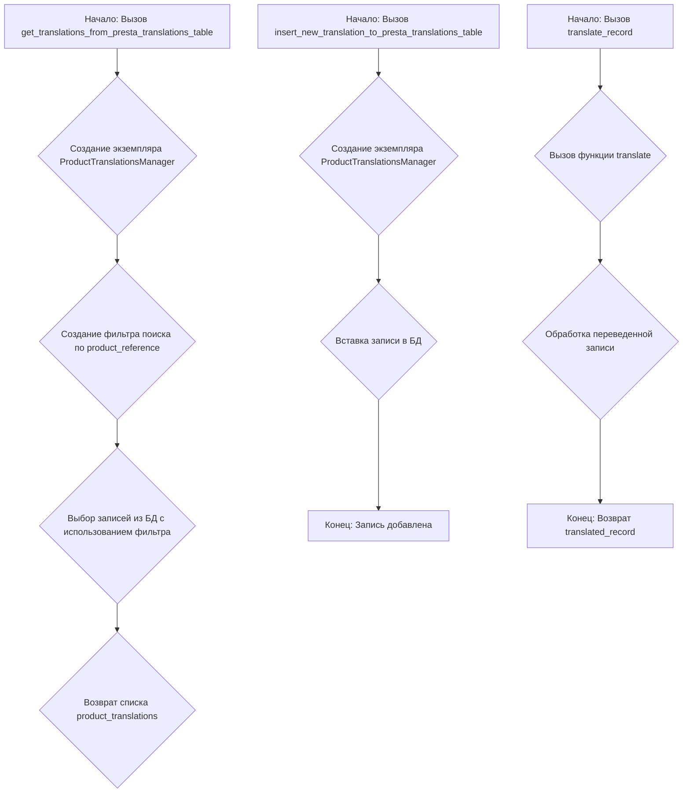

### **Системные инструкции для обработки кода проекта `hypotez`**

=========================================================================================

Описание функциональности и правил для генерации, анализа и улучшения кода. Направлено на обеспечение последовательного и читаемого стиля кодирования, соответствующего требованиям.

---

### **Основные принципы**

#### **1. Общие указания**:
- Соблюдай четкий и понятный стиль кодирования.
- Все изменения должны быть обоснованы и соответствовать установленным требованиям.

#### **2. Комментарии**:
- Используй `#` для внутренних комментариев.
- Документация всех функций, методов и классов должна следовать такому формату: 
    ```python
        def function(param: str, param1: Optional[str | dict | str] = None) -> dict | None:
            """ 
            Args:
                param (str): Описание параметра `param`.
                param1 (Optional[str | dict | str], optional): Описание параметра `param1`. По умолчанию `None`.
    
            Returns:
                dict | None: Описание возвращаемого значения. Возвращает словарь или `None`.
    
            Raises:
                SomeError: Описание ситуации, в которой возникает исключение `SomeError`.

            Ехаmple:
                >>> function('param', 'param1')
                {'param': 'param1'}
            """
    ```
- Комментарии и документация должны быть четкими, лаконичными и точными.

#### **3. Форматирование кода**:
- Используй одинарные кавычки. `a:str = 'value'`, `print('Hello World!')`;
- Добавляй пробелы вокруг операторов. Например, `x = 5`;
- Все параметры должны быть аннотированы типами. `def function(param: str, param1: Optional[str | dict | str] = None) -> dict | None:`;
- Не используй `Union`. Вместо этого используй `|`.

#### **4. Логирование**:
- Для логгирования Всегда Используй модуль `logger` из `src.logger.logger`.
- Ошибки должны логироваться с использованием `logger.error`.
Пример:
    ```python
        try:
            ...
        except Exception as ex:
            logger.error('Error while processing data', ех, exc_info=True)
    ```
#### **5 Не используй `Union[]` в коде. Вместо него используй `|`
Например:
```python
x: str | int ...
```


---

### **Основные требования**:

#### **1. Формат ответов в Markdown**:
- Все ответы должны быть выполнены в формате **Markdown**.

#### **2. Формат комментариев**:
- Используй указанный стиль для комментариев и документации в коде.
- Пример:

```python
from typing import Generator, Optional, List
from pathlib import Path


def read_text_file(
    file_path: str | Path,
    as_list: bool = False,
    extensions: Optional[List[str]] = None,
    chunk_size: int = 8192,
) -> Generator[str, None, None] | str | None:
    """
    Считывает содержимое файла (или файлов из каталога) с использованием генератора для экономии памяти.

    Args:
        file_path (str | Path): Путь к файлу или каталогу.
        as_list (bool): Если `True`, возвращает генератор строк.
        extensions (Optional[List[str]]): Список расширений файлов для чтения из каталога.
        chunk_size (int): Размер чанков для чтения файла в байтах.

    Returns:
        Generator[str, None, None] | str | None: Генератор строк, объединенная строка или `None` в случае ошибки.

    Raises:
        Exception: Если возникает ошибка при чтении файла.

    Example:
        >>> from pathlib import Path
        >>> file_path = Path('example.txt')
        >>> content = read_text_file(file_path)
        >>> if content:
        ...    print(f'File content: {content[:100]}...')
        File content: Example text...
    """
    ...
```
- Всегда делай подробные объяснения в комментариях. Избегай расплывчатых терминов, 
- таких как *«получить»* или *«делать»*
-  . Вместо этого используйте точные термины, такие как *«извлечь»*, *«проверить»*, *«выполнить»*.
- Вместо: *«получаем»*, *«возвращаем»*, *«преобразовываем»* используй имя объекта *«функция получае»*, *«переменная возвращает»*, *«код преобразовывает»* 
- Комментарии должны непосредственно предшествовать описываемому блоку кода и объяснять его назначение.

#### **3. Пробелы вокруг операторов присваивания**:
- Всегда добавляйте пробелы вокруг оператора `=`, чтобы повысить читаемость.
- Примеры:
  - **Неправильно**: `x=5`
  - **Правильно**: `x = 5`

#### **4. Использование `j_loads` или `j_loads_ns`**:
- Для чтения JSON или конфигурационных файлов замените стандартное использование `open` и `json.load` на `j_loads` или `j_loads_ns`.
- Пример:

```python
# Неправильно:
with open('config.json', 'r', encoding='utf-8') as f:
    data = json.load(f)

# Правильно:
data = j_loads('config.json')
```

#### **5. Сохранение комментариев**:
- Все существующие комментарии, начинающиеся с `#`, должны быть сохранены без изменений в разделе «Улучшенный код».
- Если комментарий кажется устаревшим или неясным, не изменяйте его. Вместо этого отметьте его в разделе «Изменения».

#### **6. Обработка `...` в коде**:
- Оставляйте `...` как указатели в коде без изменений.
- Не документируйте строки с `...`.
```

#### **7. Аннотации**
Для всех переменных должны быть определены аннотации типа. 
Для всех функций все входные и выходные параметры аннотириваны
Для все параметров должны быть аннотации типа.


### **8. webdriver**
В коде используется webdriver. Он импртируется из модуля `webdriver` проекта `hypotez`
```python
from src.webdirver import Driver, Chrome, Firefox, Playwright, ...
driver = Driver(Firefox)

Пoсле чего может использоваться как

close_banner = {
  "attribute": null,
  "by": "XPATH",
  "selector": "//button[@id = 'closeXButton']",
  "if_list": "first",
  "use_mouse": false,
  "mandatory": false,
  "timeout": 0,
  "timeout_for_event": "presence_of_element_located",
  "event": "click()",
  "locator_description": "Закрываю pop-up окно, если оно не появилось - не страшно (`mandatory`:`false`)"
}

result = driver.execute_locator(close_banner)
```

## Анализ кода `translate_product_fields.py`

### 1. Блок-схема



### 2. Диаграмма

```mermaid
flowchart TD
    A[<code>translate_product_fields.py</code>] --> B(<code>src.gs</code>);
    A --> C(<code>src.utils.printer.pprint</code>);
    A --> D(<code>src.product.product_fields.product_fields.record</code>);
    A --> E(<code>src.db.ProductTranslationsManager</code>);
    A --> F(<code>src.ai.translate</code>);
    A --> G(<code>src.endpoints.PrestaShop.PrestaShop</code>);
    A --> H(<code>pathlib.Path</code>);
    A --> I(<code>typing.List</code>);
    A --> J(<code>typing.Dict</code>);
    B --> K[Global Settings: <br><code>from src import gs</code>]
    C --> L[Pretty Print Function: <br><code>from src.utils.printer import pprint</code>]
    D --> M[Product Fields Record: <br><code>from src.product.product_fields.product_fields import record</code>]
    E --> N[Product Translations Manager: <br><code>from src.db import ProductTranslationsManager</code>]
    F --> O[Translation Function: <br><code>from src.ai import translate</code>]
    G --> P[PrestaShop Endpoint: <br><code>from src.endpoints.PrestaShop import PrestaShop</code>]
    H --> Q[Path Object: <br><code>from pathlib import Path</code>]
    I --> R[List Type: <br><code>from typing import List</code>]
    J --> S[Dict Type: <br><code>from typing import Dict</code>]
```



**Объяснение зависимостей:**

-   `src.gs`: Импортируются глобальные настройки проекта.
-   `src.utils.printer.pprint`: Импортируется функция для "красивой" печати данных (pretty print).
-   `src.product.product_fields.product_fields.record`: Импортируется структура записи полей продукта.
-   `src.db.ProductTranslationsManager`: Импортируется класс для управления переводами продуктов в базе данных.
-   `src.ai.translate`: Импортируется функция для осуществления перевода текста с использованием AI.
-   `src.endpoints.PrestaShop.PrestaShop`: Импортируется класс для взаимодействия с PrestaShop.
-   `pathlib.Path`: Импортируется для работы с путями к файлам и директориям.
-   `typing.List`, `typing.Dict`: Импортируются для аннотации типов.

### 3. Объяснение

#### Импорты:

-   `pathlib.Path`: Используется для представления путей к файлам в файловой системе.
-   `typing.List`, `typing.Dict`: Используются для статической типизации, указывают типы данных списков и словарей соответственно.
-   `src.gs`: Представляет собой модуль с глобальными настройками.
-   `src.utils.printer.pprint`: Функция для удобного вывода данных, вероятно, с форматированием.
-   `src.product.product_fields.product_fields.record`:  Представляет структуру данных для хранения полей продукта.
-   `src.db.ProductTranslationsManager`: Класс, отвечающий за взаимодействие с базой данных для управления переводами продуктов.
-   `src.ai.translate`: Функция, выполняющая перевод текста с использованием технологий машинного перевода.
-   `src.endpoints.PrestaShop.PrestaShop`: Класс для взаимодействия с API PrestaShop.

#### Функции:

1.  `get_translations_from_presta_translations_table(product_reference: str, credentials: dict, i18n: str = None) -> list:`
    *   **Аргументы**:
        *   `product_reference` (str): Уникальный идентификатор продукта.
        *   `credentials` (dict):  Параметры для подключения к базе данных.
        *   `i18n` (str, optional): Языковой код (например, 'en_US'). По умолчанию `None`.
    *   **Возвращаемое значение**:
        *   `list`: Список словарей, представляющих переводы для данного продукта.
    *   **Назначение**:
        *   Извлекает переводы продукта из таблицы переводов PrestaShop на основе `product_reference`. Использует `ProductTranslationsManager` для взаимодействия с базой данных.
    *   **Пример**:

    ```python
    credentials = {'host': 'localhost', 'user': 'user', 'password': 'password', 'database': 'prestashop'}
    translations = get_translations_from_presta_translations_table('REF123', credentials, 'en_US')
    print(translations) # Вывод: [{'field1': 'translation1', 'field2': 'translation2'}]
    ```

2.  `insert_new_translation_to_presta_translations_table(record: dict, credentials: dict):`
    *   **Аргументы**:
        *   `record` (dict): Словарь, содержащий данные для вставки в таблицу переводов.
        *   `credentials` (dict): Параметры для подключения к базе данных.
    *   **Возвращаемое значение**:
        *   `None`
    *   **Назначение**:
        *   Вставляет новую запись перевода в таблицу переводов PrestaShop. Использует `ProductTranslationsManager` для взаимодействия с базой данных.
    *   **Пример**:

    ```python
    record = {'product_reference': 'REF456', 'field1': 'new translation', 'lang': 'fr_FR'}
    credentials = {'host': 'localhost', 'user': 'user', 'password': 'password', 'database': 'prestashop'}
    insert_new_translation_to_presta_translations_table(record, credentials)
    ```

3.  `translate_record(record: dict, from_locale: str, to_locale: str) -> dict:`
    *   **Аргументы**:
        *   `record` (dict): Словарь с данными для перевода.
        *   `from_locale` (str): Язык оригинала (например, 'en').
        *   `to_locale` (str): Язык перевода (например, 'fr').
    *   **Возвращаемое значение**:
        *   `dict`: Словарь с переведенными данными.
    *   **Назначение**:
        *   Переводит поля записи с одного языка на другой, используя функцию `translate` из модуля `src.ai`.
    *   **Пример**:

    ```python
    record = {'name': 'Product Name', 'description': 'Product Description'}
    translated_record = translate_record(record, 'en', 'fr')
    print(translated_record) # Вывод: {'name': 'Nom du produit', 'description': 'Description du produit'}
    ```

#### Переменные:

-   В основном, переменные используются внутри функций для хранения промежуточных результатов, таких как фильтры поиска (`search_filter`), результаты запросов к базе данных (`product_translations`), и переведенные записи (`translated_record`).

#### Потенциальные ошибки и области для улучшения:

1.  **Обработка исключений**:  В коде не предусмотрена обработка исключений, которые могут возникнуть при подключении к базе данных или при выполнении запросов. Рекомендуется добавить блоки `try...except` для обработки возможных ошибок.
2.  **Логирование**: Отсутствует логирование действий, что затрудняет отладку и мониторинг работы функций. Необходимо добавить логирование с использованием модуля `logger` из `src.logger.logger`.
3.  **Обработка ошибок перевода**: В функции `translate_record` есть закомментированная строка `# Добавить обработку переведенной записи`. Необходимо реализовать обработку результатов перевода, чтобы убедиться в его качестве и корректности.

#### Взаимосвязи с другими частями проекта:

-   Этот модуль является частью системы управления переводами продуктов и взаимодействует с базой данных через `src.db.ProductTranslationsManager`, с системой машинного перевода через `src.ai.translate` и с API PrestaShop через `src.endpoints.PrestaShop.PrestaShop`. Он использует глобальные настройки из `src.gs` и функцию `pprint` для отладки.