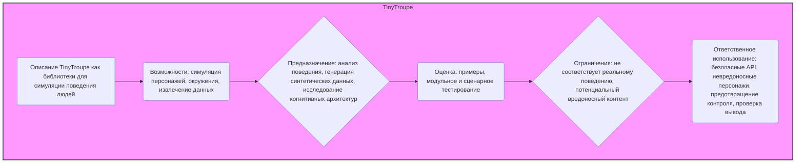

### **Системные инструкции для обработки кода проекта `hypotez`**

=========================================================================================

Описание функциональности и правил для генерации, анализа и улучшения кода. Направлено на обеспечение последовательного и читаемого стиля кодирования, соответствующего требованиям.

---

### **Основные принципы**

#### **1. Общие указания**:
- Соблюдай четкий и понятный стиль кодирования.
- Все изменения должны быть обоснованы и соответствовать установленным требованиям.

#### **2. Комментарии**:
- Используй `#` для внутренних комментариев.
- Документация всех функций, методов и классов должна следовать такому формату: 
    ```python
        def function(param: str, param1: Optional[str | dict | str] = None) -> dict | None:
            """ 
            Args:
                param (str): Описание параметра `param`.
                param1 (Optional[str | dict | str], optional): Описание параметра `param1`. По умолчанию `None`.
    
            Returns:
                dict | None: Описание возвращаемого значения. Возвращает словарь или `None`.
    
            Raises:
                SomeError: Описание ситуации, в которой возникает исключение `SomeError`.

            Ехаmple:
                >>> function('param', 'param1')
                {'param': 'param1'}
            """
    ```
- Комментарии и документация должны быть четкими, лаконичными и точными.

#### **3. Форматирование кода**:
- Используй одинарные кавычки. `a:str = 'value'`, `print('Hello World!')`;
- Добавляй пробелы вокруг операторов. Например, `x = 5`;
- Все параметры должны быть аннотированы типами. `def function(param: str, param1: Optional[str | dict | str] = None) -> dict | None:`;
- Не используй `Union`. Вместо этого используй `|`.

#### **4. Логирование**:
- Для логгирования Всегда Используй модуль `logger` из `src.logger.logger`.
- Ошибки должны логироваться с использованием `logger.error`.
Пример:
    ```python
        try:
            ...
        except Exception as ex:
            logger.error('Error while processing data', ех, exc_info=True)
    ```
#### **5 Не используй `Union[]` в коде. Вместо него используй `|`
Например:
```python
x: str | int ...
```


---

### **Основные требования**:

#### **1. Формат ответов в Markdown**:
- Все ответы должны быть выполнены в формате **Markdown**.

#### **2. Формат комментариев**:
- Используй указанный стиль для комментариев и документации в коде.
- Пример:

```python
from typing import Generator, Optional, List
from pathlib import Path


def read_text_file(
    file_path: str | Path,
    as_list: bool = False,
    extensions: Optional[List[str]] = None,
    chunk_size: int = 8192,
) -> Generator[str, None, None] | str | None:
    """
    Считывает содержимое файла (или файлов из каталога) с использованием генератора для экономии памяти.

    Args:
        file_path (str | Path): Путь к файлу или каталогу.
        as_list (bool): Если `True`, возвращает генератор строк.
        extensions (Optional[List[str]]): Список расширений файлов для чтения из каталога.
        chunk_size (int): Размер чанков для чтения файла в байтах.

    Returns:
        Generator[str, None, None] | str | None: Генератор строк, объединенная строка или `None` в случае ошибки.

    Raises:
        Exception: Если возникает ошибка при чтении файла.

    Example:
        >>> from pathlib import Path
        >>> file_path = Path('example.txt')
        >>> content = read_text_file(file_path)
        >>> if content:
        ...    print(f'File content: {content[:100]}...')
        File content: Example text...
    """
    ...
```
- Всегда делай подробные объяснения в комментариях. Избегай расплывчатых терминов, 
- таких как *«получить»* или *«делать»*. Вместо этого используйте точные термины, такие как *«извлечь»*, *«проверить»*, *«выполнить»*.
- Вместо: *«получаем»*, *«возвращаем»*, *«преобразовываем»* используй имя объекта *«функция получае»*, *«переменная возвращает»*, *«код преобразовывает»* 
- Комментарии должны непосредственно предшествовать описываемому блоку кода и объяснять его назначение.

#### **3. Пробелы вокруг операторов присваивания**:
- Всегда добавляйте пробелы вокруг оператора `=`, чтобы повысить читаемость.
- Примеры:
  - **Неправильно**: `x=5`
  - **Правильно**: `x = 5`

#### **4. Использование `j_loads` или `j_loads_ns`**:
- Для чтения JSON или конфигурационных файлов замените стандартное использование `open` и `json.load` на `j_loads` или `j_loads_ns`.
- Пример:

```python
# Неправильно:
with open('config.json', 'r', encoding='utf-8') as f:
    data = json.load(f)

# Правильно:
data = j_loads('config.json')
```

#### **5. Сохранение комментариев**:
- Все существующие комментарии, начинающиеся с `#`, должны быть сохранены без изменений в разделе «Улучшенный код».
- Если комментарий кажется устаревшим или неясным, не изменяйте его. Вместо этого отметьте его в разделе «Изменения».

#### **6. Обработка `...` в коде**:
- Оставляйте `...` как указатели в коде без изменений.
- Не документируйте строки с `...`.
```

#### **7. Аннотации**
Для всех переменных должны быть определены аннотации типа. 
Для всех функций все входные и выходные параметры аннотириваны
Для все параметров должны быть аннотации типа.


### **8. webdriver**
В коде используется webdriver. Он импртируется из модуля `webdriver` проекта `hypotez`
```python
from src.webdirver import Driver, Chrome, Firefox, Playwright, ...
driver = Driver(Firefox)

Пoсле чего может использоваться как

close_banner = {
  "attribute": null,
  "by": "XPATH",
  "selector": "//button[@id = 'closeXButton']",
  "if_list": "first",
  "use_mouse": false,
  "mandatory": false,
  "timeout": 0,
  "timeout_for_event": "presence_of_element_located",
  "event": "click()",
  "locator_description": "Закрываю pop-up окно, если оно не появилось - не страшно (`mandatory`:`false`)"
}

result = driver.execute_locator(close_banner)
```

## Анализ кода файла `hypotez/src/endpoints/tiny_troupe/RESPONSIBLE_AI_FAQ.md`

Этот файл представляет собой FAQ (Frequently Asked Questions) документ в формате Markdown, касающийся ответственного использования библиотеки `TinyTroupe`. `TinyTroupe` - это экспериментальная библиотека на Python, предназначенная для симуляции поведения людей с определенными личностями, интересами и целями. Файл содержит ответы на вопросы о назначении, возможностях, ограничениях и правилах ответственного использования этой библиотеки.

### 1. Блок-схема

```mermaid
graph TD
    A[Начало] --> B{Что такое TinyTroupe?};
    B -- Описание --> C[TinyTroupe - библиотека для симуляции людей с использованием LLM (GPT-4)];
    C --> D{Что может TinyTroupe?};
    D -- Возможности --> E[Симуляция персонажей, окружения, извлечение структурированных данных];
    E --> F{Для чего предназначена TinyTroupe?};
    F -- Использование --> G[Анализ поведения, генерация синтетических данных, исследование когнитивных архитектур];
    G --> H{Как оценивалась TinyTroupe?};
    H -- Оценка --> I[Использование примеров, модульное и сценарное тестирование];
    I --> J{Ограничения TinyTroupe};
    J -- Ограничения --> K[Не соответствует реальному поведению людей, потенциально может генерировать вредоносный контент];
    K --> L{Как ответственно использовать TinyTroupe?};
    L -- Ответственное использование --> M[Использование безопасных API, описание невредоносных персонажей, предотвращение контроля над реальными механизмами, проверка выходных данных];
    M --> N[Конец];
```

**Примеры для каждого логического блока:**

*   **B (Что такое TinyTroupe?)**: Описание библиотеки как инструмента для симуляции поведения людей на основе LLM.
*   **D (Что может TinyTroupe?)**: Перечисление основных возможностей библиотеки, таких как симуляция персонажей и извлечение данных.
*   **F (Для чего предназначена TinyTroupe?)**: Указание на цели использования библиотеки в исследованиях и анализе поведения.
*   **J (Ограничения TinyTroupe)**: Описание ограничений, включая возможность генерации вредоносного контента.
*   **L (Как ответственно использовать TinyTroupe?)**: Предоставление рекомендаций по безопасному и ответственному использованию библиотеки.

### 2. Диаграмма



В данной диаграмме, разработанной в формате Mermaid, наглядно представлена структура и взаимосвязи ключевых аспектов, затронутых в FAQ по ответственному использованию `TinyTroupe`.

*   **Описание TinyTroupe**:
    Описывает библиотеку `TinyTroupe` как инструмент, предназначенный для моделирования поведения людей, что достигается за счёт использования современных языковых моделей.
*   **Возможности**:
    Описывает основные функции, которые предоставляет `TinyTroupe`, такие как симуляция персонажей и их окружения, а также извлечение структурированных данных из этих симуляций.
*   **Предназначение**:
    Описывает цели применения `TinyTroupe`, включая анализ человеческого поведения в искусственных условиях, создание синтетических артефактов и исследование вычислительных когнитивных архитектур.
*   **Оценка**:
    Описывает методы, использованные для оценки `TinyTroupe`, такие как примеры использования, модульное тестирование и сценарное тестирование.
*   **Ограничения**:
    Описывает ограничения `TinyTroupe`, включая её неспособность полностью соответствовать реальному человеческому поведению и потенциальную возможность генерации вредоносного контента.
*   **Ответственное использование**:
    Описывает рекомендации для ответственного использования `TinyTroupe`, включая использование безопасных API, создание невредоносных персонажей, предотвращение контроля над реальными механизмами и проверку выходных данных.

### 3. Объяснение

#### **Общее описание**

Файл `RESPONSIBLE_AI_FAQ.md` предоставляет ответы на часто задаваемые вопросы касательно ответственного использования библиотеки `TinyTroupe`. Документ объясняет, что такое `TinyTroupe`, для чего она предназначена, какие у неё ограничения и как её следует использовать ответственно.

#### **Разделы файла**

1.  **What is TinyTroupe?**:

    *   Описывает `TinyTroupe` как экспериментальную Python библиотеку для симуляции людей с определенными личностями, интересами и целями.
    *   Указывает, что `TinyTroupe` использует Language Models (LLMs), такие как GPT-4, для генерации реалистичного поведения.
    *   Подчеркивает, что цель библиотеки - понимание человеческого поведения, а не непосредственная поддержка (как у AI ассистентов).
2.  **What can TinyTroupe do?**:

    *   Описывает основные возможности `TinyTroupe`, такие как симуляция персонажей, окружения, извлечение структурированных данных и обогащение артефактов симуляции.
3.  **What is/are TinyTroupe’s intended use(s)?**:

    *   Указывает на то, что `TinyTroupe` предназначена для анализа искусственного человеческого поведения, генерации синтетических артефактов и исследования когнитивных архитектур.
    *   Предостерегает от прямого взаимодействия с пользователями и использования в принятии политических или важных решений.
4.  **How was TinyTroupe evaluated? What metrics are used to measure performance?**:

    *   Описывает, что `TinyTroupe` была оценена через различные примеры использования и включает модульное и сценарное тестирование.
5.  **What are the limitations of TinyTroupe? How can users minimize the impact of TinyTroupe’s limitations when using the system?**:

    *   Подчеркивает, что `TinyTroupe` не соответствует реальному человеческому поведению и имеет теоретический потенциал генерации вредоносного контента.
    *   Предостерегает пользователей от использования `TinyTroupe` без собственных мер безопасности и напоминает, что это всего лишь инструмент, требующий осторожного использования.
6.  **What operational factors and settings allow for effective and responsible use of TinyTroupe?**:

    *   Предоставляет рекомендации по ответственному использованию `TinyTroupe`, такие как использование безопасных API, описание невредоносных персонажей, предотвращение контроля над реальными механизмами и проверка выходных данных.

#### **Взаимосвязи с другими частями проекта**

Файл `RESPONSIBLE_AI_FAQ.md` является важной частью проекта `hypotez`, так как он определяет правила и рекомендации по ответственному использованию библиотеки `TinyTroupe`. Это особенно важно, учитывая возможность генерации нежелательного контента и необходимость обеспечения безопасности при использовании библиотеки в различных приложениях. Этот FAQ дополняет документацию и примеры использования `TinyTroupe`, предоставляя пользователям четкое понимание её ограничений и способов минимизации рисков.