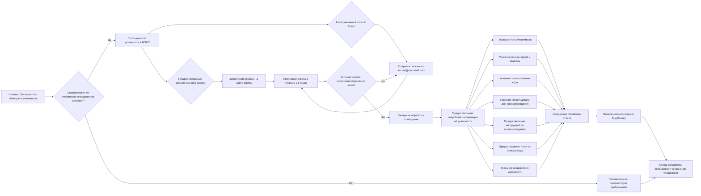

### **Системные инструкции для обработки кода проекта `hypotez`**

=========================================================================================

Описание функциональности и правил для генерации, анализа и улучшения кода. Направлено на обеспечение последовательного и читаемого стиля кодирования, соответствующего требованиям.

---

### **Основные принципы**

#### **1. Общие указания**:
- Соблюдай четкий и понятный стиль кодирования.
- Все изменения должны быть обоснованы и соответствовать установленным требованиям.

#### **2. Комментарии**:
- Используй `#` для внутренних комментариев.
- Документация всех функций, методов и классов должна следовать такому формату: 
    ```python
        def function(param: str, param1: Optional[str | dict | str] = None) -> dict | None:
            """ 
            Args:
                param (str): Описание параметра `param`.
                param1 (Optional[str | dict | str], optional): Описание параметра `param1`. По умолчанию `None`.
    
            Returns:
                dict | None: Описание возвращаемого значения. Возвращает словарь или `None`.
    
            Raises:
                SomeError: Описание ситуации, в которой возникает исключение `SomeError`.

            Ехаmple:
                >>> function('param', 'param1')
                {'param': 'param1'}
            """
    ```
- Комментарии и документация должны быть четкими, лаконичными и точными.

#### **3. Форматирование кода**:
- Используй одинарные кавычки. `a:str = 'value'`, `print('Hello World!')`;
- Добавляй пробелы вокруг операторов. Например, `x = 5`;
- Все параметры должны быть аннотированы типами. `def function(param: str, param1: Optional[str | dict | str] = None) -> dict | None:`;
- Не используй `Union`. Вместо этого используй `|`.

#### **4. Логирование**:
- Для логгирования Всегда Используй модуль `logger` из `src.logger.logger`.
- Ошибки должны логироваться с использованием `logger.error`.
Пример:
    ```python
        try:
            ...
        except Exception as ex:
            logger.error('Error while processing data', ех, exc_info=True)
    ```
#### **5 Не используй `Union[]` в коде. Вместо него используй `|`
Например:
```python
x: str | int ...
```


---

### **Основные требования**:

#### **1. Формат ответов в Markdown**:
- Все ответы должны быть выполнены в формате **Markdown**.

#### **2. Формат комментариев**:
- Используй указанный стиль для комментариев и документации в коде.
- Пример:

```python
from typing import Generator, Optional, List
from pathlib import Path


def read_text_file(
    file_path: str | Path,
    as_list: bool = False,
    extensions: Optional[List[str]] = None,
    chunk_size: int = 8192,
) -> Generator[str, None, None] | str | None:
    """
    Считывает содержимое файла (или файлов из каталога) с использованием генератора для экономии памяти.

    Args:
        file_path (str | Path): Путь к файлу или каталогу.
        as_list (bool): Если `True`, возвращает генератор строк.
        extensions (Optional[List[str]]): Список расширений файлов для чтения из каталога.
        chunk_size (int): Размер чанков для чтения файла в байтах.

    Returns:
        Generator[str, None, None] | str | None: Генератор строк, объединенная строка или `None` в случае ошибки.

    Raises:
        Exception: Если возникает ошибка при чтении файла.

    Example:
        >>> from pathlib import Path
        >>> file_path = Path('example.txt')
        >>> content = read_text_file(file_path)
        >>> if content:
        ...    print(f'File content: {content[:100]}...')
        File content: Example text...
    """
    ...
```
- Всегда делай подробные объяснения в комментариях. Избегай расплывчатых терминов, 
- таких как *«получить»* или *«делать»*
-  . Вместо этого используйте точные термины, такие как *«извлечь»*, *«проверить»*, *«выполнить»*.
- Вместо: *«получаем»*, *«возвращаем»*, *«преобразовываем»* используй имя объекта *«функция получае»*, *«переменная возвращает»*, *«код преобразовывает»* 
- Комментарии должны непосредственно предшествовать описываемому блоку кода и объяснять его назначение.

#### **3. Пробелы вокруг операторов присваивания**:
- Всегда добавляйте пробелы вокруг оператора `=`, чтобы повысить читаемость.
- Примеры:
  - **Неправильно**: `x=5`
  - **Правильно**: `x = 5`

#### **4. Использование `j_loads` или `j_loads_ns`**:
- Для чтения JSON или конфигурационных файлов замените стандартное использование `open` и `json.load` на `j_loads` или `j_loads_ns`.
- Пример:

```python
# Неправильно:
with open('config.json', 'r', encoding='utf-8') as f:
    data = json.load(f)

# Правильно:
data = j_loads('config.json')
```

#### **5. Сохранение комментариев**:
- Все существующие комментарии, начинающиеся с `#`, должны быть сохранены без изменений в разделе «Улучшенный код».
- Если комментарий кажется устаревшим или неясным, не изменяйте его. Вместо этого отметьте его в разделе «Изменения».

#### **6. Обработка `...` в коде**:
- Оставляйте `...` как указатели в коде без изменений.
- Не документируйте строки с `...`.
```

#### **7. Аннотации**
Для всех переменных должны быть определены аннотации типа. 
Для всех функций все входные и выходные параметры аннотириваны
Для все параметров должны быть аннотации типа.


### **8. webdriver**
В коде используется webdriver. Он импртируется из модуля `webdriver` проекта `hypotez`
```python
from src.webdirver import Driver, Chrome, Firefox, Playwright, ...
driver = Driver(Firefox)

Пoсле чего может использоваться как

close_banner = {
  "attribute": null,
  "by": "XPATH",
  "selector": "//button[@id = 'closeXButton']",
  "if_list": "first",
  "use_mouse": false,
  "mandatory": false,
  "timeout": 0,
  "timeout_for_event": "presence_of_element_located",
  "event": "click()",
  "locator_description": "Закрываю pop-up окно, если оно не появилось - не страшно (`mandatory`:`false`)"
}

result = driver.execute_locator(close_banner)
```

## Анализ файла `hypotez/src/endpoints/tiny_troupe/SECURITY.md`

Этот файл представляет собой стандартный документ `SECURITY.md`, описывающий политику безопасности для репозиториев Microsoft, включая инструкции по сообщению об уязвимостях.

### 1. **Блок-схема**:



**Примеры для каждого логического блока:**

*   **A (Начало):** Аналитик безопасности обнаружил XSS уязвимость в компоненте веб-приложения.
*   **B (Соответствие определению):** Уязвимость позволяет злоумышленнику выполнять произвольный код в браузере пользователя.
*   **C (Сообщение в MSRC):** Отправка отчета через онлайн-форму или email.
*   **E (Онлайн-форма):** Заполнение полей на сайте MSRC с описанием уязвимости.
*   **F (Email):** Отправка письма на `secure@microsoft.com` с деталями.
*   **G (Заполнение формы):** Указание параметров, необходимых для воспроизведения уязвимости.
*   **H (Отправка письма):** Шифрование письма с использованием PGP ключа.
*   **I (Получение ответа):** Автоматическое уведомление о получении отчета.
*   **J (Повторная отправка):** Отправка повторного письма, если не было ответа в течение 24 часов.
*   **K (Ожидание обработки):** Ожидание анализа отчета командой безопасности Microsoft.
*   **L (Предоставление информации):** Включение PoC кода, если это возможно.
*   **M-S (Типы информации):** Указание, например, что это XSS уязвимость в файле `/src/webapp/user.js`.
*   **T (Ускоренная обработка):** Более полное описание помогает быстрее устранить уязвимость.
*   **U (Bug Bounty):** Возможность получения денежного вознаграждения.
*   **V (Конец):** Уязвимость устранена, и информация об этом опубликована.

### 2. **Диаграмма**:

```mermaid
graph LR
    A[Пользователь/Исследователь] --> B(Обнаружение потенциальной уязвимости);
    B --> C{Соответствует ли определение уязвимости Microsoft?};
    C -- Да --> D[Сообщение об уязвимости в Microsoft Security Response Center (MSRC)];
    C -- Нет --> E[Прекратить: Не соответствует критериям];
    D --> F{Предпочтительный метод: Отправка через онлайн-форму MSRC};
    D --> G{Альтернативный метод: Отправка email на secure@microsoft.com};
    F --> H[Заполнение онлайн-формы с деталями уязвимости];
    G --> I[Отправка email с деталями уязвимости (возможно, зашифрованным PGP)];
    H --> J(Ожидание ответа от MSRC (обычно в течение 24 часов));
    I --> J;
    J --> K{Получен ли ответ в течение 24 часов?};
    K -- Да --> L[Анализ и триаж уязвимости командой MSRC];
    K -- Нет --> M[Повторная отправка email для подтверждения получения];
    M --> I;
    L --> N[Предоставление дополнительной информации (тип, файлы, расположение, конфигурация, PoC, воздействие)];
    N --> O(Определение приоритета и плана устранения уязвимости);
    O --> P{Соответствует ли требованиям Bug Bounty?};
    P -- Да --> Q[Рассмотрение на Bug Bounty];
    P -- Нет --> R[Устранение уязвимости без вознаграждения];
    Q --> S[Выплата Bug Bounty (если применимо)];
    R --> T[Устранение уязвимости];
    S --> T;
    T --> U[Публикация информации об устранении уязвимости];
    E --> V[Конец процесса];
    U --> V;
```

**Объяснение зависимостей:**

В данном случае, этот документ не содержит импортов как таковых, поскольку это `.md` файл, а не код Python. Однако, в контексте организации процессов, можно представить себе зависимости следующим образом:

*   **Пользователь/Исследователь**: Это внешний актор, который обнаруживает уязвимость.
*   **Microsoft Security Response Center (MSRC)**: Это внутренний отдел Microsoft, отвечающий за обработку сообщений об уязвимостях.
*   **Microsoft Bug Bounty Program**: Это программа, которая определяет, будет ли выплачено вознаграждение за найденную уязвимость.

### 3. **Объяснение**:

*   **Описание**: Документ `SECURITY.md` предназначен для предоставления инструкций исследователям безопасности о том, как безопасно сообщать об уязвимостях в продуктах и сервисах Microsoft.
*   **Основные моменты**:
    *   Запрещено сообщать об уязвимостях через публичные GitHub issues.
    *   Рекомендуется использовать онлайн-форму MSRC или отправлять email на `secure@microsoft.com`.
    *   Важно предоставлять как можно больше информации об уязвимости, включая тип, затронутые файлы, шаги для воспроизведения и возможное воздействие.
    *   Microsoft придерживается принципа Coordinated Vulnerability Disclosure (CVD).
*   **Потенциальные улучшения**:
    *   Можно добавить более конкретные примеры типов уязвимостей и их возможного воздействия.
    *   Можно включить FAQ с ответами на часто задаваемые вопросы.
*   **Взаимосвязи с другими частями проекта**:
    *   Этот документ важен для поддержания безопасности всех репозиториев, управляемых Microsoft, включая те, которые используются в проекте `hypotez`.
    *   Он может быть связан с другими документами, такими как `CONTRIBUTING.md`, которые описывают общие правила участия в проекте.

Таким образом, `SECURITY.md` играет ключевую роль в обеспечении безопасности проекта `hypotez` и других репозиториев Microsoft, предоставляя четкие инструкции для ответственного сообщения об уязвимостях.