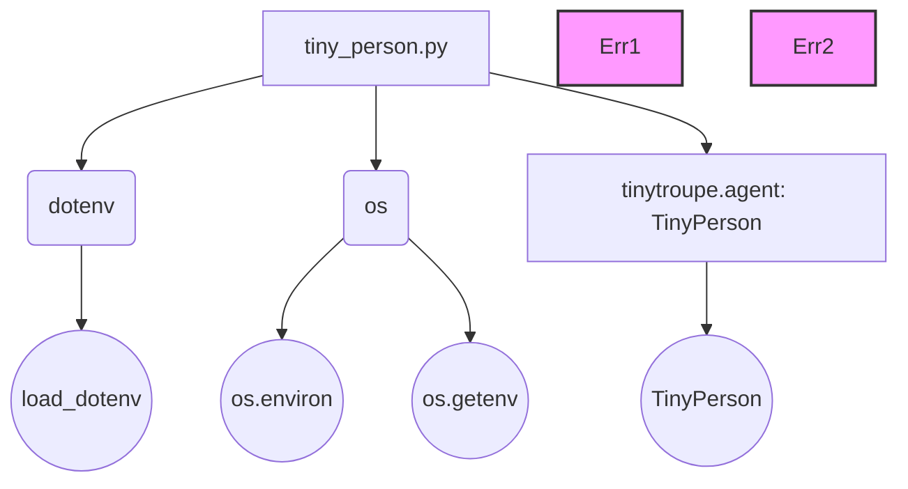

### **Анализ кода проекта `hypotez`**

=========================================================================================

#### **Расположение файла в проекте**:
`hypotez/src/endpoints/tiny_troupe/tiny_person.py`

#### **Назначение файла**:
Файл `tiny_person.py` предназначен для демонстрации и тестирования класса `TinyPerson` из модуля `tinytroupe.agent`. Он создает экземпляр `TinyPerson`, определяет его характеристики и взаимодействует с ним.

---

### **1. Блок-схема**

```mermaid
graph TD
    A[Начало] --> B{Загрузка переменных окружения из .env};
    B -- Успешно --> C{Определение OPENAI_API_KEY из переменных окружения};
    C -- Успешно --> D{Импорт класса TinyPerson};
    D --> E{Создание экземпляра TinyPerson "John"};
    E --> F{Определение характеристик "John"};
    F --> G{John слушает "Hello, John! How are you today?"};
    G --> H{John действует};
    H --> I{Вывод текущих взаимодействий};
    I --> Z[Конец];
    B -- Ошибка --> Err1((Ошибка загрузки .env));
    C -- Ошибка --> Err2((Ошибка определения API_KEY));
    style Err1 fill:#f9f,stroke:#333,stroke-width:2px
    style Err2 fill:#f9f,stroke:#333,stroke-width:2px
```

**Примеры для логических блоков**:

- **B (Загрузка переменных окружения из .env)**:
  - Пример: Если в `.env` файле есть строка `OPENAI_API_KEY=YOUR_API_KEY`, то `load_dotenv()` загрузит эту переменную окружения.
- **C (Определение OPENAI_API_KEY из переменных окружения)**:
  - Пример: `os.environ["OPENAI_API_KEY"] = os.getenv("OPENAI_API_KEY")` установит значение переменной окружения `OPENAI_API_KEY` из `.env` файла.
- **E (Создание экземпляра TinyPerson "John")**:
  - Пример: `john = TinyPerson(name="John")` создаст объект класса `TinyPerson` с именем "John".
- **F (Определение характеристик "John")**:
  - Пример: `john.define("age", 35)` определит возраст John как 35.
- **G (John слушает "Hello, John! How are you today?")**:
  - Пример: `john.listen("Hello, John! How are you today?")` передает сообщение агенту для обработки.
- **H (John действует)**:
  - Пример: `john.act()` вызывает метод, который определяет действия агента на основе прослушанного сообщения и определенных характеристик.
- **I (Вывод текущих взаимодействий)**:
  - Пример: `john.pp_current_interactions()` выводит в консоль текущие взаимодействия агента.

### **2. Диаграмма зависимостей**



**Объяснение зависимостей**:

- `tiny_person.py` зависит от модулей `dotenv` и `os` для загрузки переменных окружения и работы с операционной системой.
- `dotenv` используется для загрузки переменных окружения из файла `.env`.
- `os` используется для установки и получения переменных окружения.
- `tiny_person.py` также зависит от класса `TinyPerson` из модуля `tinytroupe.agent`.
- `load_dotenv` из `dotenv` загружает переменные окружения.
- `os.environ` и `os.getenv` из `os` используются для работы с переменными окружения.
- `TinyPerson` - класс, который используется для создания агента.

### **3. Объяснение**

#### **Импорты**:
- `import os`:
  - **Назначение**: Предоставляет функции для взаимодействия с операционной системой, такие как установка и получение переменных окружения.
  - **Взаимосвязь**: Используется для получения значения `OPENAI_API_KEY` из переменных окружения.
- `from dotenv import load_dotenv`:
  - **Назначение**: Позволяет загружать переменные окружения из файла `.env` в окружение операционной системы.
  - **Взаимосвязь**: Помогает избежать жесткого кодирования секретных ключей в коде, подгружая их из файла `.env`.
- `from tinytroupe.agent import TinyPerson`:
  - **Назначение**: Импортирует класс `TinyPerson`, который представляет собой агента с определенными характеристиками и поведением.
  - **Взаимосвязь**: Используется для создания экземпляра агента и взаимодействия с ним.

#### **Классы**:
- `TinyPerson`:
  - **Роль**: Представляет собой агента (в данном случае, персону) с возможностью определения характеристик, прослушивания сообщений и выполнения действий.
  - **Атрибуты**:
    - `name` (str): Имя агента.
  - **Методы**:
    - `define(self, key: str, value: Any)`: Определяет характеристику агента.
    - `listen(self, message: str)`: Принимает сообщение для обработки.
    - `act(self)`: Выполняет действия на основе прослушанного сообщения и характеристик.
    - `pp_current_interactions(self)`: Выводит текущие взаимодействия агента.
  - **Взаимодействие**: Взаимодействует с другими модулями для обработки естественного языка и определения действий.

#### **Функции**:
- `load_dotenv()`:
  - **Аргументы**: Нет.
  - **Возвращаемое значение**: Нет.
  - **Назначение**: Загружает переменные окружения из файла `.env`.
  - **Пример**: `load_dotenv()` загрузит переменные, если в файле `.env` есть строка `OPENAI_API_KEY=YOUR_API_KEY`.
- `os.getenv(key: str, default: Optional[str] = None) -> Optional[str]`:
    - **Аргументы**:
        - `key` (str): Имя переменной окружения.
        - `default` (Optional[str]): Значение по умолчанию, если переменная не найдена.
    - **Возвращаемое значение**: Значение переменной окружения или `None`, если переменная не найдена и `default` не указан.
    - **Назначение**: Получает значение переменной окружения.
    - **Пример**: `os.getenv("OPENAI_API_KEY")` вернет значение переменной `OPENAI_API_KEY` из окружения.

#### **Переменные**:
- `john`:
  - **Тип**: `TinyPerson`
  - **Использование**: Экземпляр класса `TinyPerson`, представляющий агента John.
  - **Назначение**: Предназначен для определения характеристик, прослушивания сообщений и выполнения действий агента.

#### **Потенциальные ошибки и области для улучшения**:
- **Обработка ошибок**: Отсутствует явная обработка ошибок при загрузке переменных окружения или при взаимодействии с `OPENAI_API_KEY`.
- **Конфигурация**: Жестко заданные характеристики агента. Было бы лучше, если бы характеристики можно было задавать через конфигурационный файл или аргументы командной строки.

#### **Взаимосвязи с другими частями проекта**:
- `tinytroupe.agent`:
  - Класс `TinyPerson` является частью модуля `tinytroupe.agent`, который, вероятно, предоставляет функциональность для создания и управления агентами.
- `src.logger.logger`:
  - Желательно использовать `logger.error` для логирования ошибок, которые могут возникнуть при загрузке переменных окружения или взаимодействии с `OPENAI_API_KEY`.