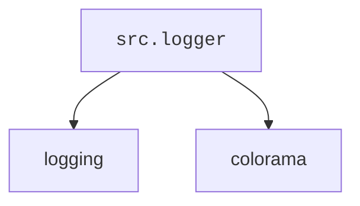

## Проект `hypotez`
# Роль `code explainer`

## АНАЛИЗ `src.logger`

### 1. Блок-схема

```mermaid
graph LR
    A[Начало] --> B{Инициализация Logger}
    B --> C{Конфигурация Loggers}
    C --> D{Console Logger}
    D --> E{File Logger}
    E --> F{JSON Logger}
    F --> G{Логирование сообщений}
    G --> H{Уровни логирования (INFO, DEBUG, ERROR)}
    H --> I{Форматирование сообщений}
    I --> J{Вывод в консоль}
    J --> K{Запись в файл}
    K --> L[Конец]

    subgraph Logger Initialization
    B
    C
    end

    subgraph Logger Configuration
    D
    E
    F
    end

    subgraph Message Logging
    G
    H
    I
    J
    K
    end
```

### 2. Диаграмма зависимостей



**Объяснение зависимостей:**

-   `logging`: Стандартный модуль Python для логирования. Используется для создания и настройки логгеров, определения уровней логирования и форматирования сообщений.
-   `colorama`: Библиотека для добавления цветного текста в консольный вывод. Используется для выделения сообщений разных уровней логирования разными цветами.

### 3. Подробное объяснение

Модуль `src.logger` предоставляет гибкую систему логирования, поддерживающую вывод в консоль, файлы и JSON. Он использует паттерн Singleton для обеспечения единственного экземпляра логгера во всем приложении. Логгер поддерживает различные уровни логирования (`INFO`, `ERROR`, `DEBUG`) и включает цветной вывод для консольных логов. Можно настраивать форматы вывода логов и управлять записью логов в разные файлы.

#### Импорты:

-   `logging`: Стандартный модуль Python для логирования.
-   `colorama`: Библиотека для добавления цветного текста в консольный вывод.

#### Классы:

-   **SingletonMeta**: Метакласс, реализующий паттерн Singleton для логгера.
-   **JsonFormatter**: Пользовательский форматтер, выводящий логи в формате JSON.
-   **Logger**: Основной класс логгера, поддерживающий логирование в консоль, файлы и JSON.

#### Функции:

-   `__init__`: Инициализирует экземпляр Logger с заполнителями для разных типов логгеров (консоль, файл и JSON).
-   `_configure_logger(name: str, log_path: str, level: Optional[int] = logging.DEBUG, formatter: Optional[logging.Formatter] = None, mode: Optional[str] = 'a') -> logging.Logger`: Конфигурирует и возвращает экземпляр логгера.
    -   `name`: Имя логгера.
    -   `log_path`: Путь к файлу лога.
    -   `level`: Уровень логирования, например, `logging.DEBUG`. По умолчанию `logging.DEBUG`.
    -   `formatter`: Пользовательский форматтер (необязательно).
    -   `mode`: Режим файла, например, `'a'` для добавления (по умолчанию).
-   `initialize_loggers(info_log_path: Optional[str] = '', debug_log_path: Optional[str] = '', errors_log_path: Optional[str] = '', json_log_path: Optional[str] = '')`: Инициализирует логгеры для консоли и файла (инфо, отладка, ошибки и JSON).
    -   `info_log_path`: Путь для файла инфо-логов (необязательно).
    -   `debug_log_path`: Путь для файла отладочных логов (необязательно).
    -   `errors_log_path`: Путь для файла логов ошибок (необязательно).
    -   `json_log_path`: Путь для файла JSON-логов (необязательно).
-   `log(level, message, ex=None, exc_info=False, color=None)`: Логирует сообщение на указанном уровне (например, `INFO`, `DEBUG`, `ERROR`) с необязательным исключением и форматированием цвета.
    -   `level`: Уровень логирования (например, `logging.INFO`, `logging.DEBUG`).
    -   `message`: Сообщение лога.
    -   `ex`: Необязательное исключение для логирования.
    -   `exc_info`: Включать ли информацию об исключении (по умолчанию `False`).
    -   `color`: Кортеж с цветами текста и фона для вывода в консоль (необязательно).
-   `info(message, ex=None, exc_info=False, colors: Optional[tuple] = None)`: Логирует информационное сообщение.
    -   `message`: Информационное сообщение для логирования.
    -   `ex`: Необязательное исключение для логирования.
    -   `exc_info`: Включать ли информацию об исключении (по умолчанию `False`).
    -   `colors`: Кортеж значений цвета для сообщения (необязательно).
-   `success(message, ex=None, exc_info=False, colors: Optional[tuple] = None)`: Логирует сообщение об успехе.
-   `warning(message, ex=None, exc_info=False, colors: Optional[tuple] = None)`: Логирует предупреждающее сообщение.
-   `debug(message, ex=None, exc_info=True, colors: Optional[tuple] = None)`: Логирует отладочное сообщение.
-   `error(message, ex=None, exc_info=True, colors: Optional[tuple] = None)`: Логирует сообщение об ошибке.
-   `critical(message, ex=None, exc_info=True, colors: Optional[tuple] = None)`: Логирует критическое сообщение.

#### Параметры для Logger

Класс `Logger` принимает несколько необязательных параметров для настройки поведения логирования.

-   **Level**: Управляет серьезностью захватываемых логов. Общие уровни включают:
    -   `logging.DEBUG`: Подробная информация, полезная для диагностики проблем.
    -   `logging.INFO`: Общая информация, такая как успешные операции.
    -   `logging.WARNING`: Предупреждения, которые не обязательно требуют немедленных действий.
    -   `logging.ERROR`: Сообщения об ошибках.
    -   `logging.CRITICAL`: Критические ошибки, требующие немедленного внимания.
-   **Formatter**: Определяет, как форматируются сообщения лога. По умолчанию сообщения форматируются как `'%(asctime)s - %(levelname)s - %(message)s'`. Можно предоставить пользовательский форматтер для различных форматов, таких как JSON.
-   **Color**: Цвета для сообщений лога в консоли. Цвета указываются как кортеж с двумя элементами:
    -   **Text color**: Указывает цвет текста (например, `colorama.Fore.RED`).
    -   **Background color**: Указывает цвет фона (например, `colorama.Back.WHITE`).

Цвет можно настроить для разных уровней лога (например, зеленый для информации, красный для ошибок и т. д.).

#### Конфигурация файлового логирования (`config`)

Для логирования сообщений в файл можно указать пути к файлам в конфигурации.

```python
config = {
    'info_log_path': 'logs/info.log',
    'debug_log_path': 'logs/debug.log',
    'errors_log_path': 'logs/errors.log',
    'json_log_path': 'logs/log.json'
}
```

Пути к файлам, указанные в `config`, используются для записи логов в соответствующие файлы для каждого уровня лога.

#### Пример использования

```python
logger: Logger = Logger()
config = {
    'info_log_path': 'logs/info.log',
    'debug_log_path': 'logs/debug.log',
    'errors_log_path': 'logs/errors.log',
    'json_log_path': 'logs/log.json'
}
logger.initialize_loggers(**config)

logger.info('This is an info message')
logger.success('This is a success message')
logger.warning('This is a warning message')
logger.debug('This is a debug message')
logger.error('This is an error message')
logger.critical('This is a critical message')

logger.info('This message will be green', colors=(colorama.Fore.GREEN, colorama.Back.BLACK))
logger.error('This message will have a red background', colors=(colorama.Fore.WHITE, colorama.Back.RED))