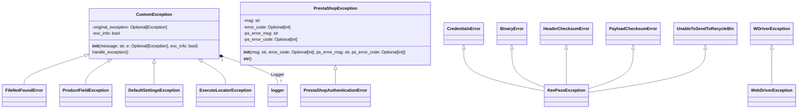

### **Системные инструкции для обработки кода проекта `hypotez`**

=========================================================================================

Описание функциональности и правил для генерации, анализа и улучшения кода. Направлено на обеспечение последовательного и читаемого стиля кодирования, соответствующего требованиям.

---

### **Основные принципы**

#### **1. Общие указания**:
- Соблюдай четкий и понятный стиль кодирования.
- Все изменения должны быть обоснованы и соответствовать установленным требованиям.

#### **2. Комментарии**:
- Используй `#` для внутренних комментариев.
- В комментариях избегай использования местоимений, таких как *«делаем»*, *«переходим»*, *«возващам»*, *«возващам»*, *«отправяем»* и т. д.. Вмсто этого используй точные термины, такие как *«извлеизвлечение»*, *«проверка»*, *«выполннение»*, *«замена»*, *«вызов»*, *«Функця выпоняет»*,*«Функця изменяет значение»*, *«Функця вызывает»*,*«отправка»*
Пример:
```python
# Неправильно:
def function(param: str, param1: Optional[str | dict | str] = None) -> dict | None:
    # Получаем значение параметра
    ...
# Правильно:

def function(param: str, param1: Optional[str | dict | str] = None) -> dict | None:
    # Функция извлекает значение параметра
    ...
# Неправильно:
if not process_directory.exists():
    logger.error(f"Директория не существует: {process_directory}")
    continue  # Переходим к следующей директории, если текущая не существует

if not process_directory.is_dir():
    logger.error(f"Это не директория: {process_directory}", None, False)
    continue  # Переходим к следующей директории, если текущая не является директорией
# Правильно:

if not process_directory.exists():
    logger.error(f"Директория не существует: {process_directory}")
    continue  # Переход к следующей директории, если текущая не существует
if not process_directory.is_dir():
    logger.error(f"Это не директория: {process_directory}", None, False)
    continue  # Переходим к следующей директории, если текущая не является директорией

```
- Документация всех функций, методов и классов должна следовать такому формату: 
    ```python
        def function(param: str, param1: Optional[str | dict | str] = None) -> dict | None:
            """ 
            Args:
                param (str): Описание параметра `param`.
                param1 (Optional[str | dict | str], optional): Описание параметра `param1`. По умолчанию `None`.
    
            Returns:
                dict | None: Описание возващаемого значения. Возвращает словарь или `None`.
    
            Raises:
                SomeError: Описание ситуации, в которой возникает исключение `SomeError`.

            Ехаmple:
                >>> function('param', 'param1')
                {'param': 'param1'}
            """
    ```
- Комментарии и документация должны быть четкими, лаконичными и точными.


### **3. Заголовок файла**:
Обязательно оставляй строки 
```python
## \file path/to/file
# -*- coding: utf-8 -*-
#! .pyenv/bin/python3
```
и
```
"""
...
```rst
 .. module:: src.utils.string.html_simplification
 ```
"""
```
если они есть. Если нет - добавляй.
Пример:
## \file /src/utils/string/html_simplification.py
# -*- coding: utf-8 -*-
#! .pyenv/bin/python3

"""
Модуль для очистки HTML-тегов из текста и упрощения HTML-кода.
===============================================================
Модуль минимизирует HTML-код, удаляет теги и атрибуты, а также обрабатывает
специальные случаи, такие как скрипты, стили и комментарии.
Использует BeautifulSoup для надежного парсинга HTML.

Зависимости:
    - beautifulsoup4 (pip install beautifulsoup4)
    - lxml (опционально, для более быстрого парсинга: pip install lxml)

 .. module:: src.utils.string.html_simplification
"""

#### **4. Форматирование кода**:
- Используй одинарные кавычки. `a:str = 'value'`, `print('Hello World!')`;
- Добавляй пробелы вокруг операторов. Например, `x = 5`;
- Все параметры должны быть аннотированы типами. `def function(param: str, param1: Optional[str | dict | str] = None) -> dict | None:`;
- Не используй `Union`. Вместо этого используй `|`.
- Не используй термин `Product`, только `товар`

#### **5. Логирование**:
- Для логгирования Всегда Используй модуль `logger` из `src.logger.logger`.
- Ошибки должны логироваться с использованием `logger.error`.
Пример:
    ```python
        try:
            ...
        except Exception as ex:
            logger.error('Error while processing data', ех, exc_info=True)
    ```
#### **6. Не используй `Union[]` в коде. Вместо него используй `|`
Например:
```python
x: str | int ...
```

#### **7. Не используй глобальные переменные. Если есть надобность - то поределяй их в классе `Config`.
Пример:

- Неправильно:
```python

state:int = 'global'

def func():
    print(state)

```
- Правильно:
```python

class Config:
    state:int = 'global'

def func():
    print(Config.state)

```

#### **8. Не используй `self` в методах класса. Вместо него используй `cls`.
#### **9. Всегда объявляй переменные вначале функции. Не объявляй их в середине функции.
Пример:
```python
def func():
    # Неправильно
    if condition:
        x = 5
        y = 10
    else:
        x = 20
        y = 30
    # Правильно
    x = None
    y = None
    if condition:
        x = 5
        y = 10
    else:
        x = 20
        y = 30
```
---

### **Основные требования**:

#### **1. Формат ответов в Markdown**:
- Все ответы должны быть выполнены в формате **Markdown**.

#### **2. Формат комментариев**:
- Используй указанный стиль для комментариев и документации в коде.
- Пример:

```python
from typing import Generator, Optional, List
from pathlib import Path


def read_text_file(
    file_path: str | Path,
    as_list: bool = False,
    extensions: Optional[List[str]] = None,
    chunk_size: int = 8192,
) -> Generator[str, None, None] | str | None:
    """
    Считывает содержимое файла (или файлов из каталога) с использованием генератора для экономии памяти.

    Args:
        file_path (str | Path): Путь к файлу или каталогу.
        as_list (bool): Если `True`, возвращает генератор строк.
        extensions (Optional[List[str]]): Список расширений файлов для чтения из каталога.
        chunk_size (int): Размер чанков для чтения файла в байтах.

    Returns:
        Generator[str, None, None] | str | None: Генератор строк, объединенная строка или `None` в случае ошибки.

    Raises:
        Exception: Если возникает ошибка при чтении файла.

    Example:
        >>> from pathlib import Path
        >>> file_path = Path('example.txt')
        >>> content = read_text_file(file_path)
        >>> if content:
        ...    print(f'File content: {content[:100]}...')
        File content: Example text...
    """
    ...
```
- Всегда делай подробные объяснения в комментариях. Избегай расплывчатых терминов, 
- таких как *«получить»* или *«делать»*
-  . Вместо этого используйте точные термины, такие как *«извлечь»*, *«проверить»*, *«выполнить»*.
- Вместо: *«получаем»*, *«возвращаем»*, *«преобразовываем»* используй имя объекта *«функция получае»*, *«переменная возвращает»*, *«код преобразовывает»* 
- Комментарии должны непосредственно предшествовать описываемому блоку кода и объяснять его назначение.

#### **3. Пробелы вокруг операторов присваивания**:
- Всегда добавляйте пробелы вокруг оператора `=`, чтобы повысить читаемость.
- Примеры:
  - **Неправильно**: `x=5`
  - **Правильно**: `x = 5`

#### **4. Использование `j_loads` или `j_loads_ns`**:
- Для чтения JSON или конфигурационных файлов замените стандартное использование `open` и `json.load` на `j_loads` или `j_loads_ns`.
- Пример:

```python
# Неправильно:
with open('config.json', 'r', encoding='utf-8') as f:
    data = json.load(f)

# Правильно:
data = j_loads('config.json')
```

#### **5. Сохранение комментариев**:
- Все существующие комментарии, начинающиеся с `#`, должны быть сохранены без изменений в разделе «Улучшенный код».
- Если комментарий кажется устаревшим или неясным, не изменяйте его. Вместо этого отметьте его в разделе «Изменения».

#### **6. Обработка `...` в коде**:
- Оставляйте `...` как указатели в коде без изменений.
- Не документируйте строки с `...`.
```

#### **7. Аннотации**
Для всех переменных должны быть определены аннотации типа. 
Для всех функций все входные и выходные параметры аннотириваны
Для все параметров должны быть аннотации типа.


### **8. webdriver**
В коде используется webdriver. Он импртируется из модуля `webdriver` проекта `hypotez`
```python
from src.webdirver import Driver, Chrome, Firefox, Playwright, ...
driver = Driver(Firefox)

Пoсле чего может использоваться как

close_banner = {
  "attribute": null,
  "by": "XPATH",
  "selector": "//button[@id = 'closeXButton']",
  "if_list": "first",
  "use_mouse": false,
  "mandatory": false,
  "timeout": 0,
  "timeout_for_event": "presence_of_element_located",
  "event": "click()",
  "locator_description": "Закрываю pop-up окно, если оно не появилось - не страшно (`mandatory`:`false`)"
}

result = driver.execute_locator(close_banner)

#### **9. Не используй `Union[]` в коде. Вместо него используй `|`
Например:
```python
x: str | int ...
```

#### **10. print - это моя встроенная функция.
from src.utils.printer import pprint as print


Вот она:

\file /src/utils/printer.py
-- coding: utf-8 --

#! .pyenv/bin/python3

"""
.. module::  src.utils
:platform: Windows, Unix
:synopsis: Utility functions for pretty printing and text styling.

This module provides functions to print data in a human-readable format with optional text styling, including color, background, and font styles.
"""

import json
import csv
import pandas as pd
from pathlib import Path
from typing import Any
from pprint import pprint as pretty_print

ANSI escape codes

RESET = "\033[0m"

TEXT_COLORS = {
"red": "\033[31m",
"green": "\033[32m",
"blue": "\033[34m",
"yellow": "\033[33m",
"white": "\033[37m",
"cyan": "\033[36m",
"magenta": "\033[35m",
"light_gray": "\033[37m",
"dark_gray": "\033[90m",
"light_red": "\033[91m",
"light_green": "\033[92m",
"light_blue": "\033[94m",
"light_yellow": "\033[93m",
}

Background colors mapping

BG_COLORS = {
"bg_red": "\033[41m",
"bg_green": "\033[42m",
"bg_blue": "\033[44m",
"bg_yellow": "\033[43m",
"bg_white": "\033[47m",
"bg_cyan": "\033[46m",
"bg_magenta": "\033[45m",
"bg_light_gray": "\033[47m",
"bg_dark_gray": "\033[100m",
"bg_light_red": "\033[101m",
"bg_light_green": "\033[102m",
"bg_light_blue": "\033[104m",
"bg_light_yellow": "\033[103m",
}

FONT_STYLES = {
"bold": "\033[1m",
"underline": "\033[4m",
}

def _color_text(text: str, text_color: str = "", bg_color: str = "", font_style: str = "") -> str:
"""Apply color, background, and font styling to the text.

This helper function applies the provided color and font styles to the given text using ANSI escape codes.

:param text: The text to be styled.
:param text_color: The color to apply to the text. Default is an empty string, meaning no color.
:param bg_color: The background color to apply. Default is an empty string, meaning no background color.
:param font_style: The font style to apply to the text. Default is an empty string, meaning no font style.
:return: The styled text as a string.

:example:
    >>> _color_text("Hello, World!", text_color="green", font_style="bold")
    '\033[1m\033[32mHello, World!\033[0m'
"""
return f"{font_style}{text_color}{bg_color}{text}{RESET}"


def pprint(print_data: Any = None, text_color: str = "white", bg_color: str = "", font_style: str = "") -> None:
"""Pretty prints the given data with optional color, background, and font style.

This function formats the input data based on its type and prints it to the console. The data is printed with optional 
text color, background color, and font style based on the specified parameters. The function can handle dictionaries, 
lists, strings, and file paths.

:param print_data: The data to be printed. Can be of type ``None``, ``dict``, ``list``, ``str``, or ``Path``.
:param text_color: The color to apply to the text. Default is 'white'. See :ref:`TEXT_COLORS`.
:param bg_color: The background color to apply to the text. Default is '' (no background color). See :ref:`BG_COLORS`.
:param font_style: The font style to apply to the text. Default is '' (no font style). See :ref:`FONT_STYLES`.
:return: None

:raises: Exception if the data type is unsupported or an error occurs during printing.

:example:
    >>> pprint({"name": "Alice", "age": 30}, text_color="green")
    \033[32m{
        "name": "Alice",
        "age": 30
    }\033[0m

    >>> pprint(["apple", "banana", "cherry"], text_color="blue", font_style="bold")
    \033[34m\033[1mapple\033[0m
    \033[34m\033[1mbanana\033[0m
    \033[34m\033[1mcherry\033[0m

    >>> pprint("text example", text_color="yellow", bg_color="bg_red", font_style="underline")
    \033[4m\033[33m\033[41mtext example\033[0m
"""
if not print_data:
    return
if isinstance(text_color, str):
    text_color = TEXT_COLORS.get(text_color.lower(), TEXT_COLORS["white"])
if isinstance(bg_color, str):
    bg_color = BG_COLORS.get(bg_color.lower(), "")
if isinstance(font_style, str):
    font_style = FONT_STYLES.get(font_style.lower(), "")


try:
    if isinstance(print_data, dict):
        print(_color_text(json.dumps(print_data, indent=4), text_color))
    elif isinstance(print_data, list):
        for item in print_data:
            print(_color_text(str(item), text_color))
    elif isinstance(print_data, (str, Path)) and Path(print_data).is_file():
        ext = Path(print_data).suffix.lower()
        if ext in ['.csv', '.xls']:
            print(_color_text("File reading supported for .csv, .xls only.", text_color))
        else:
            print(_color_text("Unsupported file type.", text_color))
    else:
        print(_color_text(str(print_data), text_color))
except Exception as ex:
    print(_color_text(f"Error: {ex}", text_color=TEXT_COLORS["red"]))
IGNORE_WHEN_COPYING_START
content_copy
download
Use code with caution.
IGNORE_WHEN_COPYING_END

if name == 'main':
pprint({"name": "Alice", "age": 30}, text_color="green")
```

## \file /src/logger/exceptions.py

# -*- coding: utf-8 -*-

#! .pyenv/bin/python3

"""
.. module:: src.logger.exceptions
    :platform: Windows, Unix
    :synopsis: This module defines custom exceptions used in the application.

Program Exceptions
------------------

This module contains several custom exception classes to handle errors related to various application components, including file operations, product fields, KeePass database connections, and PrestaShop WebService errors.

Classes:
--------
- CustomException: The base custom exception class that handles logging.
- FileNotFoundError: Raised when a file is not found.
- ProductFieldException: Raised for errors related to product fields.
- KeePassException: Raised for errors related to KeePass database connections.
- DefaultSettingsException: Raised when there are issues with default settings.
- WebDriverException: Raised for errors related to WebDriver.
- ExecuteLocatorException: Raised for errors related to locator executors.
- PrestaShopException: Raised for generic PrestaShop WebService errors.
- PrestaShopAuthenticationError: Raised for authentication errors with PrestaShop WebServices.

"""

from typing import Optional
from src.logger.logger import logger
from selenium.common.exceptions import WebDriverException as WDriverException
from pykeepass.exceptions import (
    CredentialsError,
    BinaryError,
    HeaderChecksumError,
    PayloadChecksumError,
    UnableToSendToRecycleBin,
)


class CustomException(Exception):
    """Base custom exception class.

    This is the base class for all custom exceptions in the application. It handles logging of the exception
    and provides a mechanism for dealing with the original exception if it exists.

    Attributes:
    ----------
    original_exception : Optional[Exception]
        The original exception that caused this custom exception, if any.
    exc_info : bool
        A flag to indicate if exception information should be logged.
    """

    def __init__(self, message: str, e: Optional[Exception] = None, exc_info: bool = True):
        """Initializes the CustomException with a message and an optional original exception."""
        super().__init__(message)
        self.original_exception = e
        self.exc_info = exc_info
        self.handle_exception()

    def handle_exception(self):
        """Handles the exception by logging the error and original exception, if available."""
        logger.error(f"Exception occurred: {self}")
        if self.original_exception:
            logger.debug(f"Original exception: {self.original_exception}")
        # Add recovery logic, retries, or other handling as necessary.


class FileNotFoundError(CustomException, IOError):
    """Exception raised when a file is not found."""

    pass


class ProductFieldException(CustomException):
    """Exception raised for errors related to product fields."""

    pass


class KeePassException(
    CredentialsError,
    BinaryError,
    HeaderChecksumError,
    PayloadChecksumError,
    UnableToSendToRecycleBin,
):
    """Exception raised for connection issues with KeePass database."""

    pass


class DefaultSettingsException(CustomException):
    """Exception raised for issues with default settings."""

    pass


class WebDriverException(WDriverException):
    """Exception raised for WebDriver related issues."""

    pass


class ExecuteLocatorException(CustomException):
    """Exception raised for errors related to locator executors."""

    pass


class PrestaShopException(Exception):
    """Generic exception for PrestaShop WebService errors.

    This class is used for handling errors that occur when interacting with the PrestaShop WebService.

    Attributes:
    ----------
    msg : str
        A custom error message.
    error_code : Optional[int]
        The error code returned by PrestaShop.
    ps_error_msg : str
        The error message from PrestaShop.
    ps_error_code : Optional[int]
        The PrestaShop error code.
    """

    def __init__(
        self,
        msg: str,
        error_code: Optional[int] = None,
        ps_error_msg: str = '',
        ps_error_code: Optional[int] = None,
    ):
        """Initializes the PrestaShopException with the provided message and error details."""
        self.msg = msg
        self.error_code = error_code
        self.ps_error_msg = ps_error_msg
        self.ps_error_code = ps_error_code

    def __str__(self):
        """Returns the string representation of the exception."""
        return repr(self.ps_error_msg or self.msg)


class PrestaShopAuthenticationError(PrestaShopException):
    """Exception raised for PrestaShop authentication errors (Unauthorized)."""

    pass
```

### 1. Блок-схема

```mermaid
graph TD
    A[Начало] --> B{Произошла ошибка?};
    B -- Да --> C[Создание экземпляра CustomException];
    C --> D{Есть оригинальное исключение?};
    D -- Да --> E[Логгирование оригинального исключения];
    D -- Нет --> F[Логгирование сообщения об ошибке];
    E --> F;
    F --> G[Обработка исключения (логирование, повторные попытки и т.д.)];
    G --> H[Конец];
    B -- Нет --> H;

    subgraph CustomException
    C
    D
    E
    F
    G
    end

    subgraph Другие исключения (FileNotFoundError, и т.д.)
    I[Создание экземпляра исключения] --> J[Вызов родительского конструктора (CustomException)];
    J --> K[Логирование и обработка исключения];
    K --> L[Конец];
    end
```

**Примеры для логических блоков:**

*   **A (Начало)**: Начало выполнения кода, где может возникнуть исключение.
    ```python
    try:
        # Код, который может вызвать исключение
        result = 10 / 0
    except Exception as e:
        # Перехват исключения
        custom_exception = CustomException("Division by zero error", e)
    ```
*   **B (Произошла ошибка?)**: Проверка, произошло ли исключение. В примере выше, если происходит деление на ноль, управление переходит в блок `except`.
*   **C (Создание экземпляра CustomException)**: Создание объекта пользовательского исключения.
    ```python
    custom_exception = CustomException("Division by zero error", e)
    ```
*   **D (Есть оригинальное исключение?)**: Проверка, передано ли оригинальное исключение при создании `CustomException`. В примере выше, `e` является оригинальным исключением.
*   **E (Логгирование оригинального исключения)**: Запись в лог информации об оригинальном исключении.
    ```python
    logger.debug(f"Original exception: {e}")
    ```
*   **F (Логгирование сообщения об ошибке)**: Запись в лог сообщения о произошедшей ошибке.
    ```python
    logger.error(f"Exception occurred: {self}")
    ```
*   **G (Обработка исключения)**: Дополнительные действия по обработке исключения, такие как повторные попытки или логика восстановления.
*   **H (Конец)**: Завершение обработки исключения.

### 2. Диаграмма



**Объяснение зависимостей:**

*   `CustomException` является базовым классом для большинства пользовательских исключений в проекте. Он зависит от модуля `logger` для логирования ошибок.
*   `FileNotFoundError`, `ProductFieldException`, `DefaultSettingsException`, `ExecuteLocatorException` наследуются от `CustomException`, получая возможность логирования и обработки исключений.
*   `KeePassException` наследуется от нескольких исключений из библиотеки `pykeepass`, что позволяет обрабатывать специфичные ошибки, связанные с KeePass.
*   `WebDriverException` наследуется от `selenium.common.exceptions.WebDriverException`, что позволяет обрабатывать исключения, возникающие при работе с WebDriver.
*   `PrestaShopException` является базовым классом для исключений, связанных с PrestaShop WebService, и содержит атрибуты для хранения информации об ошибках, полученных от PrestaShop.
*   `PrestaShopAuthenticationError` наследуется от `PrestaShopException` и используется для обработки ошибок аутентификации в PrestaShop.

### 3. Объяснение

**Импорты:**

*   `typing.Optional`: Используется для указания, что переменная может иметь значение определенного типа или `None`.
*   `src.logger.logger.logger`: Импортируется объект `logger` из модуля `src.logger.logger` для логирования исключений.
*   `selenium.common.exceptions.WebDriverException as WDriverException`: Импортируется исключение `WebDriverException` из библиотеки `selenium` для обработки ошибок, связанных с WebDriver. Переименовано в `WDriverException` для избежания конфликтов имен.
*   `pykeepass.exceptions`: Импортируются исключения из библиотеки `pykeepass` для обработки ошибок, связанных с работой с KeePass.

**Классы:**

*   **`CustomException(Exception)`**:
    *   **Роль**: Базовый класс для всех пользовательских исключений в приложении. Обеспечивает логирование исключений.
    *   **Атрибуты**:
        *   `original_exception: Optional[Exception]`: Оригинальное исключение, вызвавшее данное исключение (если есть).
        *   `exc_info: bool`: Флаг, указывающий, нужно ли логировать информацию об исключении.
    *   **Методы**:
        *   `__init__(self, message: str, e: Optional[Exception] = None, exc_info: bool = True)`: Конструктор класса, инициализирует сообщение об ошибке, оригинальное исключение и флаг логирования.
        *   `handle_exception(self)`: Функция логирует сообщение об ошибке и оригинальное исключение (если есть), используя объект `logger`.

    *   **Взаимодействие**:
        *   Используется как базовый класс для других пользовательских исключений.
        *   Взаимодействует с модулем `src.logger.logger` для логирования информации об исключениях.

    *   **Пример**:

        ```python
        try:
            raise ValueError("Invalid value")
        except ValueError as e:
            raise CustomException("Error processing value", e)
        ```
*   **`FileNotFoundError(CustomException, IOError)`**:
    *   **Роль**: Исключение, которое выбрасывается, когда файл не найден.
    *   **Взаимодействие**: Наследуется от `CustomException` и `IOError`.
*   **`ProductFieldException(CustomException)`**:
    *   **Роль**: Исключение, которое выбрасывается при ошибках, связанных с полями товара.
    *   **Взаимодействие**: Наследуется от `CustomException`.
*   **`KeePassException(CredentialsError, BinaryError, HeaderChecksumError, PayloadChecksumError, UnableToSendToRecycleBin)`**:
    *   **Роль**: Исключение, которое выбрасывается при ошибках, связанных с подключением к базе данных KeePass.
    *   **Взаимодействие**: Наследуется от исключений `pykeepass`.
*   **`DefaultSettingsException(CustomException)`**:
    *   **Роль**: Исключение, которое выбрасывается при проблемах с настройками по умолчанию.
    *   **Взаимодействие**: Наследуется от `CustomException`.
*   **`WebDriverException(WDriverException)`**:
    *   **Роль**: Исключение, которое выбрасывается при проблемах, связанных с WebDriver.
    *   **Взаимодействие**: Наследуется от `selenium.common.exceptions.WebDriverException`.
*   **`ExecuteLocatorException(CustomException)`**:
    *   **Роль**: Исключение, которое выбрасывается при ошибках, связанных с выполнением локаторов.
    *   **Взаимодействие**: Наследуется от `CustomException`.
*   **`PrestaShopException(Exception)`**:
    *   **Роль**: Базовое исключение для ошибок, связанных с PrestaShop WebService.
    *   **Атрибуты**:
        *   `msg: str`: Пользовательское сообщение об ошибке.
        *   `error_code: Optional[int]`: Код ошибки, возвращенный PrestaShop.
        *   `ps_error_msg: str`: Сообщение об ошибке от PrestaShop.
        *   `ps_error_code: Optional[int]`: Код ошибки от PrestaShop.
    *   **Методы**:
        *   `__init__(self, msg: str, error_code: Optional[int] = None, ps_error_msg: str = '', ps_error_code: Optional[int] = None)`: Конструктор класса.
        *   `__str__(self)`: Возвращает строковое представление исключения.
    *   **Взаимодействие**:
        *   Используется как базовый класс для `PrestaShopAuthenticationError`.
*   **`PrestaShopAuthenticationError(PrestaShopException)`**:
    *   **Роль**: Исключение, которое выбрасывается при ошибках аутентификации в PrestaShop.
    *   **Взаимодействие**: Наследуется от `PrestaShopException`.

**Функции:**

*   `__init__` (конструкторы классов): Инициализируют атрибуты классов. Например, конструктор `CustomException` инициализирует сообщение об ошибке, оригинальное исключение и флаг логирования.
*   `handle_exception` (метод класса `CustomException`): Функция логирует сообщение об ошибке и оригинальное исключение (если есть).
*   `__str__` (метод класса `PrestaShopException`): Возвращает строковое представление исключения.

**Переменные:**

*   `logger`: Объект логгера, используемый для записи информации об исключениях.
*   `original_exception`: Атрибут класса `CustomException`, хранит оригинальное исключение, вызвавшее данное исключение.
*   `exc_info`: Атрибут класса `CustomException`, флаг, указывающий, нужно ли логировать информацию об исключении.
*   `msg`: Атрибут класса `PrestaShopException`, пользовательское сообщение об ошибке.
*   `error_code`: Атрибут класса `PrestaShopException`, код ошибки, возвращенный PrestaShop.
*   `ps_error_msg`: А