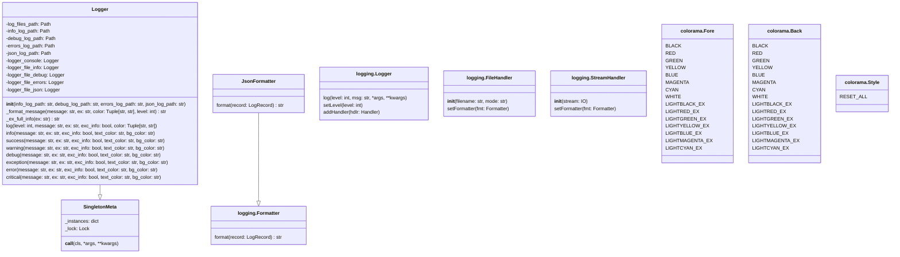
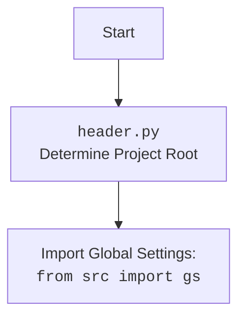

## \file hypotez/src/logger/logger.py
# -*- coding: utf-8 -*-
#! .pyenv/bin/python3

"""
 .. module:: src.logger.logger
:platform: Windows, Unix
:synopsis: Модуль логгера

"""

Модуль предназначен для организации логирования в проекте. Он обеспечивает гибкую настройку логирования, включая вывод в консоль, запись в файлы различных уровней (info, debug, error) и сохранение логов в формате JSON. Модуль использует паттерн Singleton для создания единственного экземпляра логгера.

### **1. Блок-схема**

```mermaid
graph LR
    A[Начало] --> B{Инициализация Logger}
    B --> C{Определение путей к файлам логов}
    C --> D{Создание директорий для логов}
    D --> E{Создание файлов логов}
    E --> F{Инициализация логгера для консоли}
    F --> G{Инициализация логгеров для файлов (info, debug, errors, json)}
    G --> H{Установка уровней логирования для каждого логгера}
    H --> I{Добавление обработчиков (handlers) к логгерам файлов}
    I --> J{Установка форматтеров для обработчиков файлов}
    J --> K{Форматирование сообщений}
    K --> L{Запись сообщений в консоль и файлы}
    L --> M[Конец]

    subgraph Инициализация Logger
    C -->|Чтение из config.json| C1[Чтение параметров из файла конфигурации]
    C1 --> C
    end

    subgraph Форматирование сообщений
    K -->|Определение префикса| K1[Определение префикса на основе уровня лога (INFO, WARNING, ERROR, DEBUG, CRITICAL)]
    K1 --> K2[Добавление цветового оформления (если указано)]
    K2 --> K3[Добавление информации об исключении (если есть)]
    K3 --> K
    end

    subgraph Запись сообщений
    L -->|В зависимости от уровня| L1[Запись в logger_console]
    L -->|В зависимости от уровня| L2[Запись в logger_file_info]
    L -->|В зависимости от уровня| L3[Запись в logger_file_debug]
    L -->|В зависимости от уровня| L4[Запись в logger_file_errors]
    L -->|В зависимости от уровня| L5[Запись в logger_file_json]
    end
```

### **2. Диаграмма**





**Объяснение зависимостей:**

-   `logging`: Стандартный модуль Python для логирования. Используется для создания и настройки логгеров, обработчиков и форматтеров.
-   `colorama`: Модуль для добавления цветов в вывод консоли. Используется для выделения сообщений разного уровня важности.
-   `datetime`: Модуль для работы с датой и временем. Используется для добавления временных меток к сообщениям лога.
-   `json`: Модуль для работы с JSON-форматом. Используется для форматирования логов в JSON.
-   `inspect`: Модуль для интроспекции кода. Используется для получения информации о месте вызова логгера (имя файла, функции, номер строки).
-   `threading`: Модуль для работы с потоками. Используется для реализации Singleton паттерна с помощью блокировки потоков.
-   `pathlib.Path`: Класс для работы с путями к файлам и директориям. Используется для определения путей к файлам логов.
-   `typing.Optional, Tuple`: Используется для аннотации типов.
-   `types.SimpleNamespace`: Используется для удобного доступа к данным из `config.json`.
-   `header`: Локальный модуль для определения корневой директории проекта.

### **3. Объяснение**

#### **Импорты:**

*   `logging`: Стандартный модуль Python для логирования.
*   `colorama`: Используется для добавления цветов в консольный вывод логов.
*   `datetime`: Используется для получения текущей даты и времени, которые включаются в имена файлов логов.
*   `json`: Используется для форматирования логов в JSON.
*   `inspect`: Используется для получения информации о месте вызова функции логирования (имя файла, функции, номер строки).
*   `threading`: Используется для реализации потокобезопасного Singleton.
*   `pathlib.Path`: Используется для работы с путями к файлам и директориям.
*   `typing.Optional, Tuple`: Используется для аннотации типов.
*   `types.SimpleNamespace`: Используется для упрощения доступа к данным конфигурации.
*   `header`: Локальный модуль, который, вероятно, определяет корневой каталог проекта. Используется для определения путей к файлам конфигурации и логов.

#### **Классы:**

*   `SingletonMeta(type)`:
    *   Метакласс для реализации паттерна Singleton.
    *   Обеспечивает создание только одного экземпляра класса `Logger`.
    *   Использует блокировку (`threading.Lock`) для обеспечения потокобезопасности.
    *   `_instances`: Словарь для хранения экземпляров классов, использующих этот метакласс.
    *   `_lock`: Объект блокировки для синхронизации доступа к `_instances`.
*   `JsonFormatter(logging.Formatter)`:
    *   Кастомный форматтер для логирования в JSON-формате.
    *   Переопределяет метод `format` для форматирования записи лога в виде JSON.
    *   Включает в JSON-запись время, уровень логирования, сообщение и информацию об исключении (если есть).
*   `Logger(metaclass=SingletonMeta)`:
    *   Основной класс логгера.
    *   Реализует паттерн Singleton через метакласс `SingletonMeta`.
    *   Имеет методы для логирования сообщений разных уровней (info, debug, warning, error, critical) с возможностью добавления цвета и информации об исключении.
    *   `log_files_path`: Путь к директории, где хранятся файлы логов.
    *   `info_log_path`: Путь к файлу лога для сообщений уровня INFO.
    *   `debug_log_path`: Путь к файлу лога для сообщений уровня DEBUG.
    *   `errors_log_path`: Путь к файлу лога для сообщений уровня ERROR.
    *   `json_log_path`: Путь к файлу лога в формате JSON.
    *   `logger_console`: Логгер для вывода сообщений в консоль.
    *   `logger_file_info`: Логгер для записи сообщений уровня INFO в файл.
    *   `logger_file_debug`: Логгер для записи сообщений уровня DEBUG в файл.
    *   `logger_file_errors`: Логгер для записи сообщений уровня ERROR в файл.
    *   `logger_file_json`: Логгер для записи всех сообщений в JSON-файл.

#### **Функции:**

*   `__init__(self, info_log_path: Optional[str] = None, debug_log_path: Optional[str] = None, errors_log_path: Optional[str] = None, json_log_path: Optional[str] = None)`:
    *   Конструктор класса `Logger`.
    *   Определяет пути к файлам логов на основе параметров и конфигурационного файла `config.json`.
    *   Создает директории и файлы логов, если они не существуют.
    *   Инициализирует логгеры для консоли и файлов, устанавливает уровни логирования и добавляет обработчики.
*   `_format_message(self, message, ex=None, color: Optional[Tuple[str, str]] = None, level=None)`:
    *   Форматирует сообщение лога, добавляя префикс в зависимости от уровня логирования, цвет (если указан) и информацию об исключении (если есть).
    *   Использует `colorama` для добавления цветов в консольный вывод.
*   `_ex_full_info(self, ex)`:
    *   Получает полную информацию об исключении, включая имя файла, функции и номер строки, где произошло исключение.
    *   Использует `inspect.stack()` для получения информации о стеке вызовов.
*   `log(self, level, message, ex=None, exc_info=False, color: Optional[Tuple[str, str]] = None)`:
    *   Основной метод для записи сообщений лога.
    *   Принимает уровень логирования, сообщение, исключение (если есть) и информацию о цвете.
    *   Форматирует сообщение с помощью `_format_message` и записывает его в консоль и файлы.
*   `info(self, message, ex=None, exc_info=False, text_color: str = "green", bg_color: str = "")`:
    *   Записывает сообщение уровня INFO.
    *   По умолчанию использует зеленый цвет для текста.
*   `success(self, message, ex=None, exc_info=False, text_color: str = "yellow", bg_color: str = "")`:
    *   Записывает сообщение уровня SUCCESS.
    *   По умолчанию использует желтый цвет для текста.
*   `warning(self, message, ex=None, exc_info=False, text_color: str = "light_red", bg_color: str = "")`:
    *   Записывает сообщение уровня WARNING.
    *   По умолчанию использует светло-красный цвет для текста.
*   `debug(self, message, ex=None, exc_info=True, text_color: str = "cyan", bg_color: str = "")`:
    *   Записывает сообщение уровня DEBUG.
    *   По умолчанию использует голубой цвет для текста.
*   `exception(self, message, ex=None, exc_info=True, text_color: str = "cyan", bg_color: str = "light_gray")`:
    *   Записывает сообщение об исключении (уровень ERROR).
    *   По умолчанию использует голубой цвет для текста и светло-серый для фона.
*   `error(self, message, ex=None, exc_info=True, text_color: str = "red", bg_color: str = "")`:
    *   Записывает сообщение уровня ERROR.
    *   По умолчанию использует красный цвет для текста.
*   `critical(self, message, ex=None, exc_info=True, text_color: str = "red", bg_color: str = "white")`:
    *   Записывает сообщение уровня CRITICAL.
    *   По умолчанию использует красный цвет для текста и белый для фона.

#### **Переменные:**

*   `TEXT_COLORS`: Словарь, содержащий коды цветов текста для `colorama`.
*   `BG_COLORS`: Словарь, содержащий коды цветов фона для `colorama`.
*   `LOG_SYMBOLS`: Словарь, содержащий символы для разных уровней логирования.
*   `logger`: Экземпляр класса `Logger`, используемый для логирования.

#### **Потенциальные ошибки и области для улучшения:**

*   Жестко заданные пути к файлам логов в конструкторе класса `Logger`.  Лучше вынести конфигурацию путей в отдельный файл или переменные окружения.
*   Использование `SimpleNamespace` для конфигурации может быть не самым удобным способом.  Рассмотреть возможность использования более структурированного подхода, например, dataclasses или pydantic.
*   Метод `_ex_full_info` получает информацию о стеке вызовов на глубину 3.  Это может быть недостаточно или избыточно в разных ситуациях.  Рассмотреть возможность передачи глубины стека в качестве параметра.
*   Обработка исключений в методе `log` может быть улучшена.  В текущей реализации, если `exc_info` True и `ex` не None, используется `self.logger_console.exception(formatted_message)`. В противном случае, используется `self.logger_console.log(level, formatted_message, exc_info=exc_info)`. Это может приводить к дублированию информации об исключении в логах.

#### **Взаимосвязь с другими частями проекта:**

*   Модуль `header` используется для определения корневого каталога проекта, что позволяет находить файл конфигурации `config.json`.
*   Файл `config.json` содержит пути к директориям для хранения логов.
*   Класс `Logger` используется во всем проекте для логирования сообщений разного уровня важности.

Этот модуль предоставляет централизованный и настраиваемый механизм логирования, который может быть использован во всем проекте.