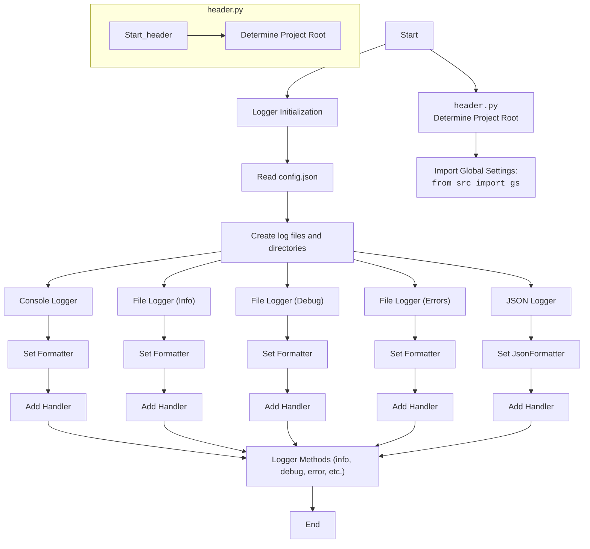

### **Системные инструкции для обработки кода проекта `hypotez`**

=========================================================================================

Описание функциональности и правил для генерации, анализа и улучшения кода. Направлено на обеспечение последовательного и читаемого стиля кодирования, соответствующего требованиям.

---

### **Основные принципы**

#### **1. Общие указания**:
- Соблюдай четкий и понятный стиль кодирования.
- Все изменения должны быть обоснованы и соответствовать установленным требованиям.

#### **2. Комментарии**:
- Используй `#` для внутренних комментариев.
- Документация всех функций, методов и классов должна следовать такому формату: 
    ```python
        def function(param: str, param1: Optional[str | dict | str] = None) -> dict | None:
            """ 
            Args:
                param (str): Описание параметра `param`.
                param1 (Optional[str | dict | str], optional): Описание параметра `param1`. По умолчанию `None`.
    
            Returns:
                dict | None: Описание возвращаемого значения. Возвращает словарь или `None`.
    
            Raises:
                SomeError: Описание ситуации, в которой возникает исключение `SomeError`.

            Ехаmple:
                >>> function('param', 'param1')
                {'param': 'param1'}
            """
    ```
- Комментарии и документация должны быть четкими, лаконичными и точными.

#### **3. Форматирование кода**:
- Используй одинарные кавычки. `a:str = 'value'`, `print('Hello World!')`;
- Добавляй пробелы вокруг операторов. Например, `x = 5`;
- Все параметры должны быть аннотированы типами. `def function(param: str, param1: Optional[str | dict | str] = None) -> dict | None:`;
- Не используй `Union`. Вместо этого используй `|`.

#### **4. Логирование**:
- Для логгирования Всегда Используй модуль `logger` из `src.logger.logger`.
- Ошибки должны логироваться с использованием `logger.error`.
Пример:
    ```python
        try:
            ...
        except Exception as ex:
            logger.error('Error while processing data', ех, exc_info=True)
    ```
#### **5 Не используй `Union[]` в коде. Вместо него используй `|`
Например:
```python
x: str | int ...
```


---

### **Основные требования**:

#### **1. Формат ответов в Markdown**:
- Все ответы должны быть выполнены в формате **Markdown**.

#### **2. Формат комментариев**:
- Используй указанный стиль для комментариев и документации в коде.
- Пример:

```python
from typing import Generator, Optional, List
from pathlib import Path


def read_text_file(
    file_path: str | Path,
    as_list: bool = False,
    extensions: Optional[List[str]] = None,
    chunk_size: int = 8192,
) -> Generator[str, None, None] | str | None:
    """
    Считывает содержимое файла (или файлов из каталога) с использованием генератора для экономии памяти.

    Args:
        file_path (str | Path): Путь к файлу или каталогу.
        as_list (bool): Если `True`, возвращает генератор строк.
        extensions (Optional[List[str]]): Список расширений файлов для чтения из каталога.
        chunk_size (int): Размер чанков для чтения файла в байтах.

    Returns:
        Generator[str, None, None] | str | None: Генератор строк, объединенная строка или `None` в случае ошибки.

    Raises:
        Exception: Если возникает ошибка при чтении файла.

    Example:
        >>> from pathlib import Path
        >>> file_path = Path('example.txt')
        >>> content = read_text_file(file_path)
        >>> if content:
        ...    print(f'File content: {content[:100]}...')
        File content: Example text...
    """
    ...
```
- Всегда делай подробные объяснения в комментариях. Избегай расплывчатых терминов, 
- таких как *«получить»* или *«делать»*
-  . Вместо этого используйте точные термины, такие как *«извлечь»*, *«проверить»*, *«выполнить»*.
- Вместо: *«получаем»*, *«возвращаем»*, *«преобразовываем»* используй имя объекта *«функция получае»*, *«переменная возвращает»*, *«код преобразовывает»* 
- Комментарии должны непосредственно предшествовать описываемому блоку кода и объяснять его назначение.

#### **3. Пробелы вокруг операторов присваивания**:
- Всегда добавляйте пробелы вокруг оператора `=`, чтобы повысить читаемость.
- Примеры:
  - **Неправильно**: `x=5`
  - **Правильно**: `x = 5`

#### **4. Использование `j_loads` или `j_loads_ns`**:
- Для чтения JSON или конфигурационных файлов замените стандартное использование `open` и `json.load` на `j_loads` или `j_loads_ns`.
- Пример:

```python
# Неправильно:
with open('config.json', 'r', encoding='utf-8') as f:
    data = json.load(f)

# Правильно:
data = j_loads('config.json')
```

#### **5. Сохранение комментариев**:
- Все существующие комментарии, начинающиеся с `#`, должны быть сохранены без изменений в разделе «Улучшенный код».
- Если комментарий кажется устаревшим или неясным, не изменяйте его. Вместо этого отметьте его в разделе «Изменения».

#### **6. Обработка `...` в коде**:
- Оставляйте `...` как указатели в коде без изменений.
- Не документируйте строки с `...`.
```

#### **7. Аннотации**
Для всех переменных должны быть определены аннотации типа. 
Для всех функций все входные и выходные параметры аннотириваны
Для все параметров должны быть аннотации типа.


### **8. webdriver**
В коде используется webdriver. Он импртируется из модуля `webdriver` проекта `hypotez`
```python
from src.webdirver import Driver, Chrome, Firefox, Playwright, ...
driver = Driver(Firefox)

Пoсле чего может использоваться как

close_banner = {
  "attribute": null,
  "by": "XPATH",
  "selector": "//button[@id = 'closeXButton']",
  "if_list": "first",
  "use_mouse": false,
  "mandatory": false,
  "timeout": 0,
  "timeout_for_event": "presence_of_element_located",
  "event": "click()",
  "locator_description": "Закрываю pop-up окно, если оно не появилось - не страшно (`mandatory`:`false`)"
}

result = driver.execute_locator(close_banner)
```

## Анализ кода `hypotez/src/logger/logger.py`

### 1. Блок-схема

```mermaid
graph TD
    A[Начало] --> B{Инициализация Logger};
    B --> C{Определение путей к лог-файлам};
    C --> D{Создание директорий и файлов};
    D --> E{Настройка логгеров (console, info, debug, errors, json)};
    E --> F{Настройка форматтеров для логгеров};
    F --> G{Добавление обработчиков к логгерам};
    G --> H{Определение методов логирования (info, debug, error, и т.д.)};
    H --> I[Конец];
    
    subgraph Инициализация Logger
        C --> C1{Чтение конфига из JSON};
        C1 --> C2{Определение timestamp};
        C2 --> C3{Формирование путей};
    end
    
    subgraph Настройка логгеров
        E --> E1{Получение экземпляра логгера logging.getLogger()};
        E1 --> E2{Установка уровня логирования logger.setLevel()};
    end
    
    subgraph Настройка форматтеров
        F --> F1{Создание форматтера logging.Formatter() или JsonFormatter()};
        F1 --> F2{Установка форматтера handler.setFormatter()};
    end
    
    subgraph Добавление обработчиков
        G --> G1{Создание обработчика logging.FileHandler()};
        G1 --> G2{Добавление обработчика logger.addHandler()};
    end
    
    subgraph Методы логирования
        H --> H1{Форматирование сообщения _format_message()};
        H1 --> H2{Логирование сообщения logger.log()};
    end
```

**Примеры для логических блоков:**

*   **Инициализация Logger**: При создании экземпляра `Logger`, первым делом считывается конфигурация из `config.json`, чтобы определить базовый путь для логов. Далее создается директория для хранения логов с текущей временной меткой.
*   **Настройка логгеров**: Для каждого типа лога (info, debug, error, json) создается свой логгер с соответствующим уровнем. Например, для `logger_file_info` устанавливается уровень `logging.INFO`.
*   **Настройка форматтеров**: Для консольных и файловых логгеров используется стандартный `logging.Formatter`, а для JSON логгера — кастомный `JsonFormatter`.
*   **Добавление обработчиков**: К каждому логгеру добавляется обработчик, который указывает, куда записывать логи (в данном случае, в файл).
*   **Методы логирования**: При вызове `logger.info("Сообщение")`, сообщение форматируется с использованием `_format_message` и передается в основной метод `log`, который уже записывает его в консоль и/или файл.

### 2. Диаграмма


```mermaid
flowchart TD
    subgraph header.py
        Start_header --> Determine_Project_Root["Determine Project Root"];
    end

    Start --> Logger_Initialization["Logger Initialization"];
    Logger_Initialization --> Read_Config["Read config.json"];
    Read_Config --> Create_Log_Files["Create log files and directories"];
    Create_Log_Files --> Console_Logger["Console Logger"];
    Create_Log_Files --> File_Logger_Info["File Logger (Info)"];
    Create_Log_Files --> File_Logger_Debug["File Logger (Debug)"];
    Create_Log_Files --> File_Logger_Errors["File Logger (Errors)"];
    Create_Log_Files --> JSON_Logger["JSON Logger"];
    Console_Logger --> Set_Formatter_Console["Set Formatter"];
    File_Logger_Info --> Set_Formatter_Info["Set Formatter"];
    File_Logger_Debug --> Set_Formatter_Debug["Set Formatter"];
    File_Logger_Errors --> Set_Formatter_Errors["Set Formatter"];
    JSON_Logger --> Set_Formatter_JSON["Set JsonFormatter"];
    Set_Formatter_Console --> Add_Handler_Console["Add Handler"];
    Set_Formatter_Info --> Add_Handler_Info["Add Handler"];
    Set_Formatter_Debug --> Add_Handler_Debug["Add Handler"];
    Set_Formatter_Errors --> Add_Handler_Errors["Add Handler"];
    Set_Formatter_JSON --> Add_Handler_JSON["Add Handler"];
    Add_Handler_Console --> Logger_Methods["Logger Methods (info, debug, error, etc.)"];
    Add_Handler_Info --> Logger_Methods;
    Add_Handler_Debug --> Logger_Methods;
    Add_Handler_Errors --> Logger_Methods;
    Add_Handler_JSON --> Logger_Methods;
    Logger_Methods --> End;
    
    Start --> Header[<code>header.py</code><br> Determine Project Root]

    Header --> import_gs[Import Global Settings: <br><code>from src import gs</code>] 
```

**Объяснение зависимостей:**

*   **`header`**: Этот модуль используется для определения корневого каталога проекта. Это важно для определения путей к конфигурационным файлам и лог-файлам.
*   **`logging`**: Стандартный модуль Python для логирования. Используется для создания логгеров, установки уровней логирования, добавления обработчиков и форматирования сообщений.
*   **`colorama`**: Используется для добавления цветов в вывод консоли. Позволяет выделять сообщения разного уровня (info, debug, error) разными цветами.
*   **`datetime`**: Используется для получения текущей временной метки, которая используется для создания уникальных директорий для логов.
*   **`json`**: Используется для работы с JSON-файлами. В данном случае, для чтения конфигурационного файла `config.json` и для форматирования логов в JSON-формате.
*   **`inspect`**: Используется для получения информации о текущем стеке вызовов. Это позволяет получить имя файла, функции и номер строки, где произошло логирование.
*   **`threading`**: Используется для реализации Singleton pattern в классе `Logger`. Это гарантирует, что в приложении будет только один экземпляр логгера.
*   **`pathlib`**: Используется для работы с путями к файлам и директориям.
*   **`typing`**: Используется для аннотации типов.

### 3. Объяснение

#### Импорты:

*   **`logging`**: Предоставляет функциональность логирования.
*   **`colorama`**: Добавляет поддержку цветов в консоль.
*   **`datetime`**: Используется для получения текущей даты и времени.
*   **`json`**: Используется для работы с JSON-данными.
*   **`inspect`**: Используется для интроспекции стека вызовов.
*   **`threading`**: Используется для обеспечения потокобезопасности при создании Singleton-экземпляра логгера.
*   **`pathlib`**: Предоставляет объектно-ориентированный способ работы с файловой системой.
*   **`typing`**: Используется для аннотации типов.
*   **`header`**: Содержит информацию о корневой директории проекта. Импортирует `__root__` из `header.py`.

#### Классы:

*   **`SingletonMeta`**: Метакласс, реализующий паттерн Singleton. Гарантирует, что у класса будет только один экземпляр.
    *   `_instances`: Словарь для хранения экземпляров класса.
    *   `_lock`: Блокировка для обеспечения потокобезопасности.
    *   `__call__`: Метод, вызываемый при создании экземпляра класса. Если экземпляр класса уже существует, он возвращает существующий экземпляр. В противном случае он создает новый экземпляр и сохраняет его в `_instances`.
*   **`JsonFormatter`**: Кастомный форматтер для логирования в JSON-формате.
    *   `format`: Метод, форматирующий запись лога в JSON.
*   **`Logger`**: Класс логгера, реализующий паттерн Singleton.
    *   `log_files_path`: Путь к директории, где хранятся лог-файлы.
    *   `info_log_path`: Путь к файлу с информационными логами.
    *   `debug_log_path`: Путь к файлу с отладочными логами.
    *   `errors_log_path`: Путь к файлу с логами ошибок.
    *   `json_log_path`: Путь к файлу с логами в формате JSON.
    *   `logger_console`: Логгер для вывода в консоль.
    *   `logger_file_info`: Логгер для записи информационных логов в файл.
    *   `logger_file_debug`: Логгер для записи отладочных логов в файл.
    *   `logger_file_errors`: Логгер для записи логов ошибок в файл.
    *   `logger_file_json`: Логгер для записи логов в формате JSON в файл.
    *   `__init__`: Конструктор класса. Инициализирует пути к лог-файлам, создает директории и файлы, настраивает логгеры и обработчики.
    *   `_format_message`: Форматирует сообщение лога с учетом уровня логирования и цветов.
    *   `_ex_full_info`: Формирует полную информацию об исключении, включая имя файла, функции и номер строки.
    *   `log`: Общий метод для логирования сообщений на указанном уровне.
    *   `info`: Метод для логирования информационных сообщений.
    *   `success`: Метод для логирования сообщений об успехе.
    *   `warning`: Метод для логирования предупреждений.
    *   `debug`: Метод для логирования отладочных сообщений.
    *   `exception`: Метод для логирования исключений.
    *   `error`: Метод для логирования ошибок.
    *   `critical`: Метод для логирования критических ошибок.

#### Функции:

*   Функций как таковых нет, но есть методы классов, описанные выше.

#### Переменные:

*   `TEXT_COLORS`: Словарь, содержащий коды цветов текста для `colorama`.
*   `BG_COLORS`: Словарь, содержащий коды цветов фона для `colorama`.
*   `LOG_SYMBOLS`: Словарь, содержащий символы для различных уровней логирования.
* `logger`: Экземпляр класса `Logger`, используемый для логирования.

#### Потенциальные ошибки и области для улучшения:

*   **Обработка исключений при чтении конфигурационного файла**: В случае, если файл `config.json` не существует или имеет неверный формат, программа упадет. Необходимо добавить обработку исключений, чтобы избежать этого.
*   **Централизованное управление уровнями логирования**: Уровни логирования для разных логгеров задаются независимо. Было бы полезно иметь централизованный способ управления уровнями логирования.
*   **Добавление возможности ротации лог-файлов**: Лог-файлы могут расти неограниченно. Необходимо добавить возможность ротации лог-файлов, чтобы они не занимали слишком много места на диске.
*   **Использование Enum для уровней логирования и цветов**: Вместо использования строк для указания уровней логирования и цветов, можно использовать `Enum`. Это сделает код более читаемым и менее подверженным ошибкам.
*   **Улучшение форматирования сообщений об исключениях**: Сейчас информация об исключении форматируется в методе `_ex_full_info`. Было бы полезно добавить возможность настройки формата сообщений об исключениях.

#### Цепочка взаимосвязей с другими частями проекта:

*   Модуль `logger` используется во многих других частях проекта для логирования информации о работе программы, ошибок и исключений.
*   Он зависит от модуля `header` для определения корневой директории проекта.
*   Он использует конфигурационный файл `config.json` для определения путей к лог-файлам.

```mermaid
flowchart TD
    subgraph header.py
        Start_header --> Determine_Project_Root["Determine Project Root"];
    end
    
    Hypotez --> Logger
    Logger --> Header[header.py]
    Header --> config_json[config.json]
    Logger --> Modules[logging, colorama, datetime, json, inspect, threading, pathlib, typing]
    style Logger fill:#f9f,stroke:#333,stroke-width:2px