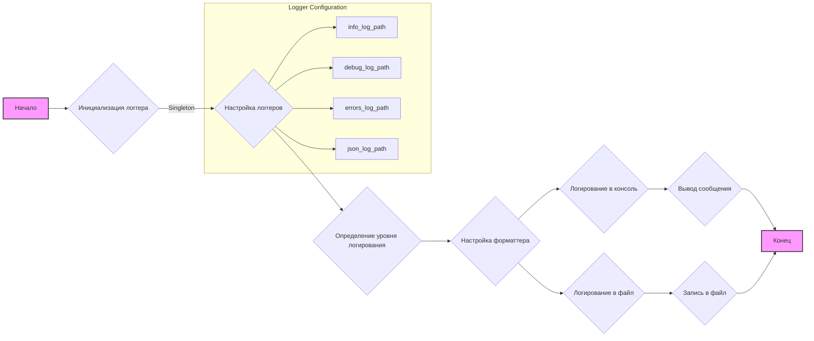

### **Анализ кода проекта `hypotez`**

=========================================================================================

#### **Расположение файла в проекте**:
Файл расположен в `hypotez/src/logger/readme.ru.md`. Это указывает на то, что файл содержит документацию на русском языке для модуля `src.logger`.

---

### **1. Блок-схема**:


```mermaid
graph LR
    A[Начало] --> B{Инициализация логгера};
    B -- Singleton --> C{Настройка логгеров};
    C --> D{Определение уровня логирования};
    D --> E{Настройка форматтера};
    E --> F{Логирование в консоль};
    E --> G{Логирование в файл};
    F --> H{Вывод сообщения};
    G --> I{Запись в файл};
    H --> J[Конец];
    I --> J

    subgraph Logger Configuration
        C --> C1[info_log_path];
        C --> C2[debug_log_path];
        C --> C3[errors_log_path];
        C --> C4[json_log_path];
    end

    style A fill:#f9f,stroke:#333,stroke-width:2px
    style J fill:#f9f,stroke:#333,stroke-width:2px
```

**Примеры для каждого логического блока:**

- **Инициализация логгера**:
  ```python
  logger: Logger = Logger()
  ```

- **Настройка логгеров**:
  ```python
  config = {
      'info_log_path': 'logs/info.log',
      'debug_log_path': 'logs/debug.log',
      'errors_log_path': 'logs/errors.log',
      'json_log_path': 'logs/log.json'
  }
  logger.initialize_loggers(**config)
  ```

- **Определение уровня логирования**:
  ```python
  logger.setLevel(logging.DEBUG)  # Пример установки уровня логирования
  ```

- **Настройка форматтера**:
  ```python
  formatter = logging.Formatter('%(asctime)s - %(levelname)s - %(message)s')
  ```

- **Логирование в консоль**:
  ```python
  logger.addHandler(console_handler)
  ```

- **Логирование в файл**:
  ```python
  logger.addHandler(file_handler)
  ```

- **Вывод сообщения**:
  ```python
  logger.info('Это информационное сообщение')
  ```

- **Запись в файл**:
  Сообщение записывается в указанный файл с использованием настроенного форматтера.

---

### **2. Диаграмма**:

```mermaid
graph TD
    A[Logger Class] --> B(SingletonMeta Metaclass);
    A --> C{_configure_logger()};
    A --> D{initialize_loggers()};
    A --> E{log()};
    A --> F{info()};
    A --> G{success()};
    A --> H{warning()};
    A --> I{debug()};
    A --> J{error()};
    A --> K{critical()};

    C --> L[logging.Logger];
    E --> M[logging.INFO];
    E --> N[logging.DEBUG];
    E --> O[logging.ERROR];

    style A fill:#f9f,stroke:#333,stroke-width:2px
```

**Объяснение зависимостей**:

- **Logger Class**: Основной класс логгера, который использует метакласс SingletonMeta для реализации паттерна Singleton.
- **SingletonMeta Metaclass**: Метакласс, гарантирующий, что у класса Logger будет только один экземпляр.
- **_configure_logger()**: Метод, настраивающий и возвращающий экземпляр `logging.Logger` из стандартной библиотеки `logging`.
- **initialize_loggers()**: Метод, инициализирующий логгеры для различных типов логирования (консоль, файлы и JSON).
- **log()**: Метод, логирующий сообщение на указанном уровне.
- **info(), success(), warning(), debug(), error(), critical()**: Методы, вызывающие метод `log()` с соответствующим уровнем логирования.
- **logging.Logger**: Класс из стандартной библиотеки `logging`, предоставляющий основные функции логирования.
- **logging.INFO, logging.DEBUG, logging.ERROR**: Уровни логирования из стандартной библиотеки `logging`.

---

### **3. Объяснение**:

#### **Импорты**:
- Модуль не содержит импортов. Он описывает использование стандартной библиотеки `logging` и модуля `colorama` (для цветного вывода в консоль), но не импортирует их напрямую.

#### **Классы**:
- **SingletonMeta**: Метакласс, реализующий шаблон Singleton. Это означает, что класс, использующий этот метакласс, может иметь только один экземпляр.
- **JsonFormatter**: Пользовательский форматтер для вывода логов в формате JSON. Этот класс позволяет форматировать логи в JSON-формате для удобного хранения и анализа.
- **Logger**: Основной класс логгера. Он содержит методы для логирования сообщений на различных уровнях (INFO, DEBUG, ERROR и т.д.) и поддерживает вывод в консоль, файлы и в формате JSON.

#### **Функции**:
- `__init__`: Инициализирует экземпляр класса Logger с плейсхолдерами для различных типов логгеров.
- `_configure_logger(name: str, log_path: str, level: Optional[int] = logging.DEBUG, formatter: Optional[logging.Formatter] = None, mode: Optional[str] = 'a') -> logging.Logger`:
  - **Аргументы**:
    - `name` (str): Имя логгера.
    - `log_path` (str): Путь к файлу логов.
    - `level` (Optional[int]): Уровень логирования (по умолчанию `logging.DEBUG`).
    - `formatter` (Optional[logging.Formatter]): Кастомный форматтер (опционально).
    - `mode` (Optional[str]): Режим работы с файлом (по умолчанию `'a'` для добавления).
  - **Возвращаемое значение**: Настроенный экземпляр `logging.Logger`.
  - **Назначение**: Настраивает и возвращает экземпляр логгера с указанными параметрами.
  - **Пример**:
    ```python
    logger = self._configure_logger('my_logger', 'logs/my_log.log', logging.INFO)
    ```
- `initialize_loggers(info_log_path: Optional[str] = '', debug_log_path: Optional[str] = '', errors_log_path: Optional[str] = '', json_log_path: Optional[str] = '')`:
  - **Аргументы**:
    - `info_log_path` (Optional[str]): Путь к файлу логов информации (опционально).
    - `debug_log_path` (Optional[str]): Путь к файлу логов отладки (опционально).
    - `errors_log_path` (Optional[str]): Путь к файлу логов ошибок (опционально).
    - `json_log_path` (Optional[str]): Путь к файлу логов в формате JSON (опционально).
  - **Возвращаемое значение**: None
  - **Назначение**: Инициализирует логгеры для логирования в консоль и файлы.
  - **Пример**:
    ```python
    logger.initialize_loggers(info_log_path='logs/info.log', debug_log_path='logs/debug.log')
    ```
- `log(level, message, ex=None, exc_info=False, color=None)`:
  - **Аргументы**:
    - `level` (int): Уровень логирования (например, `logging.INFO`, `logging.DEBUG`).
    - `message` (str): Логируемое сообщение.
    - `ex` (Exception): Исключение для логирования (опционально).
    - `exc_info` (bool): Включать информацию об исключении (по умолчанию `False`).
    - `color` (tuple): Кортеж цветов текста и фона для консольного вывода (опционально).
  - **Возвращаемое значение**: None
  - **Назначение**: Логирует сообщение на указанном уровне с возможным исключением и цветовым форматированием.
  - **Пример**:
    ```python
    logger.log(logging.ERROR, 'Произошла ошибка', ex=e, exc_info=True)
    ```
- `info(message, ex=None, exc_info=False, color=None)`: Логирует информационное сообщение.
- `success(message, ex=None, exc_info=False, color=None)`: Логирует сообщение об успешной операции.
- `warning(message, ex=None, exc_info=False, color=None)`: Логирует предупреждение.
- `debug(message, ex=None, exc_info=False, color=None)`: Логирует сообщение для отладки.
- `error(message, ex=None, exc_info=False, color=None)`: Логирует сообщение об ошибке.
- `critical(message, ex=None, exc_info=False, color=None)`: Логирует критическое сообщение.

#### **Переменные**:
- Не указаны конкретные переменные, но подразумевается использование переменных для хранения путей к файлам логов, уровней логирования и форматтеров.

#### **Потенциальные ошибки и области для улучшения**:
- **Отсутствие обработки исключений**: В коде примеров не показана обработка исключений при записи в файлы.
- **Недостаточная гибкость конфигурации**: Конфигурация логирования в файлы задается через словарь `config`. Было бы полезно добавить возможность загрузки конфигурации из файла (например, JSON или YAML).
- **Зависимость от `colorama`**: Использование `colorama` для цветного вывода в консоль может быть проблемой на платформах, где `colorama` не поддерживается.

#### **Взаимосвязи с другими частями проекта**:
- Модуль `src.logger` используется другими частями проекта для логирования событий и ошибок. Он предоставляет централизованный интерфейс для логирования, что упрощает отладку и мониторинг приложения. Конфигурация логирования может быть задана глобально и использоваться во всех модулях проекта.

---