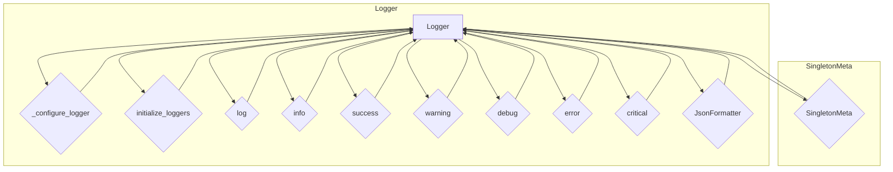

### **Анализ кода проекта `hypotez`**

=========================================================================================

#### **Расположение файла в проекте**:
Файл находится по пути `hypotez/src/logger/readme.ru.md`. Это указывает на то, что данный файл является документацией для модуля логирования `src.logger` на русском языке.

---

### **1. Блок-схема**

```mermaid
graph LR
    A[Начало] --> B{Инициализация Logger}
    B --> C{Настройка Logger}
    C --> D{Инициализация логгеров (консоль, файлы, JSON)}
    D --> E{Логирование сообщений (info, debug, error, и т.д.)}
    E --> F{Форматирование сообщений}
    F --> G{Вывод сообщений (консоль, файл)}
    G --> H[Конец]

    subgraph Инициализация Logger
        B --> B1[SingletonMeta]
        B --> B2[Logger.__init__]
    end

    subgraph Настройка Logger
        C --> C1[_configure_logger]
    end

    subgraph Логирование сообщений
        E --> E1[log(level, message, ex, exc_info, color)]
        E --> E2[info, success, warning, debug, error, critical]
    end

    subgraph Вывод сообщений
        G --> G1[Консоль]
        G --> G2[Файл]
    end
```

**Примеры для каждого логического блока:**

- **Инициализация Logger**:
  - Пример кода:
    ```python
    logger: Logger = Logger()
    ```
  - Объяснение: Создается экземпляр класса `Logger`, который использует SingletonMeta для гарантии единственного экземпляра.

- **Настройка Logger**:
  - Пример кода:
    ```python
    logger._configure_logger(name='my_logger', log_path='logs/my_log.log')
    ```
  - Объяснение: Функция `_configure_logger` настраивает параметры логгера, такие как имя и путь к файлу логов.

- **Инициализация логгеров (консоль, файлы, JSON)**:
  - Пример кода:
    ```python
    config = {
        'info_log_path': 'logs/info.log',
        'debug_log_path': 'logs/debug.log',
        'errors_log_path': 'logs/errors.log',
        'json_log_path': 'logs/log.json'
    }
    logger.initialize_loggers(**config)
    ```
  - Объяснение: Функция `initialize_loggers` инициализирует различные логгеры для разных типов логов (информация, отладка, ошибки, JSON), используя пути, указанные в `config`.

- **Логирование сообщений (info, debug, error, и т.д.)**:
  - Пример кода:
    ```python
    logger.info('Это информационное сообщение')
    logger.error('Это сообщение об ошибке', exc_info=True)
    ```
  - Объяснение: Методы `info` и `error` используются для логирования сообщений с соответствующим уровнем. `exc_info=True` добавляет информацию об исключении в лог.

- **Форматирование сообщений**:
  - Пример кода:
    ```python
    formatter = logging.Formatter('%(asctime)s - %(levelname)s - %(message)s')
    ```
  - Объяснение: Форматтер определяет структуру лог-сообщения. Можно использовать как стандартные форматтеры, так и кастомные, например, `JsonFormatter`.

- **Вывод сообщений (консоль, файл)**:
  - Пример кода:
    ```python
    logger.addHandler(logging.StreamHandler())  # Консоль
    logger.addHandler(logging.FileHandler('logs/example.log'))  # Файл
    ```
  - Объяснение: Сообщения выводятся либо в консоль через `StreamHandler`, либо в файл через `FileHandler`.

---

### **2. Диаграмма**



**Объяснение зависимостей:**

- **Logger**: Основной класс логгера, предоставляющий методы для логирования сообщений разных уровней (`info`, `debug`, `error`, и т.д.).
- **SingletonMeta**: Метакласс, используемый для реализации паттерна Singleton, гарантирующего единственный экземпляр логгера.
- **_configure_logger**: Метод для настройки экземпляра логгера с указанным именем, путем к файлу логов, уровнем логирования и форматтером.
- **initialize_loggers**: Метод для инициализации логгеров для различных типов логов (информация, отладка, ошибки и JSON).
- **log**: Основной метод для логирования сообщений на указанном уровне с возможным исключением и цветовым форматированием.
- **JsonFormatter**: Кастомный форматтер для вывода логов в формате JSON.

---

### **3. Объяснение**

#### **Импорты**:
- Документ не предоставляет импорты, но упоминает `logging` и `colorama`. Предположительно в `src.logger.py` находятся следующие импорты:
  - `logging`: Стандартный модуль Python для логирования. Используется для создания и настройки логгеров, определения уровней логирования и форматирования сообщений.
  - `colorama`: Используется для добавления цветового форматирования в вывод консоли.

#### **Классы**:
- **SingletonMeta**:
  - **Роль**: Реализует шаблон Singleton, чтобы гарантировать, что у класса `Logger` будет только один экземпляр.
  - **Атрибуты**: Нет явных атрибутов.
  - **Методы**: Метод `__call__` переопределен для управления созданием экземпляра.
  - **Взаимодействие**: Используется как метакласс для `Logger`.
- **JsonFormatter**:
  - **Роль**: Кастомный форматтер для логирования в формате JSON.
  - **Атрибуты**: Нет явных атрибутов.
  - **Методы**: Вероятно, содержит метод `format` для преобразования записи лога в JSON.
  - **Взаимодействие**: Используется для форматирования логов, когда требуется вывод в формате JSON.
- **Logger**:
  - **Роль**: Предоставляет интерфейс для логирования сообщений разных уровней в консоль и файлы.
  - **Атрибуты**:
    - `_console_logger`: Логгер для консоли.
    - `_info_logger`: Логгер для информационных сообщений.
    - `_debug_logger`: Логгер для отладочных сообщений.
    - `_errors_logger`: Логгер для сообщений об ошибках.
    - `_json_logger`: Логгер для сообщений в формате JSON.
  - **Методы**:
    - `__init__`: Инициализирует плейсхолдеры для различных логгеров.
    - `_configure_logger`: Настраивает и возвращает экземпляр логгера.
    - `initialize_loggers`: Инициализирует логгеры для консоли и файлов.
    - `log`: Логирует сообщение на указанном уровне.
    - `info`, `success`, `warning`, `debug`, `error`, `critical`: Методы для логирования сообщений на соответствующих уровнях.
  - **Взаимодействие**: Использует `SingletonMeta` для реализации Singleton, взаимодействует с модулем `logging` для создания и настройки логгеров, и использует `colorama` для добавления цветов в вывод консоли.

#### **Функции**:
- `_configure_logger(name: str, log_path: str, level: Optional[int] = logging.DEBUG, formatter: Optional[logging.Formatter] = None, mode: Optional[str] = 'a') -> logging.Logger`
  - **Аргументы**:
    - `name`: Имя логгера.
    - `log_path`: Путь к файлу логов.
    - `level`: Уровень логирования.
    - `formatter`: Форматтер логов.
    - `mode`: Режим открытия файла.
  - **Возвращаемое значение**: Настроенный экземпляр `logging.Logger`.
  - **Назначение**: Настраивает и возвращает логгер с указанными параметрами.
  - **Пример**:
    ```python
    logger = Logger()
    info_logger = logger._configure_logger(name='info', log_path='logs/info.log', level=logging.INFO)
    ```
- `initialize_loggers(info_log_path: Optional[str] = '', debug_log_path: Optional[str] = '', errors_log_path: Optional[str] = '', json_log_path: Optional[str] = '')`
  - **Аргументы**:
    - `info_log_path`: Путь к файлу информационных логов.
    - `debug_log_path`: Путь к файлу отладочных логов.
    - `errors_log_path`: Путь к файлу логов ошибок.
    - `json_log_path`: Путь к файлу JSON-логов.
  - **Возвращаемое значение**: None
  - **Назначение**: Инициализирует логгеры для разных типов логов.
  - **Пример**:
    ```python
    logger = Logger()
    config = {
        'info_log_path': 'logs/info.log',
        'debug_log_path': 'logs/debug.log',
        'errors_log_path': 'logs/errors.log',
        'json_log_path': 'logs/log.json'
    }
    logger.initialize_loggers(**config)
    ```
- `log(level, message, ex=None, exc_info=False, color=None)`
  - **Аргументы**:
    - `level`: Уровень логирования.
    - `message`: Сообщение для логирования.
    - `ex`: Исключение для логирования.
    - `exc_info`: Включать ли информацию об исключении.
    - `color`: Цвет для консольного вывода.
  - **Возвращаемое значение**: None
  - **Назначение**: Логирует сообщение на указанном уровне с возможностью добавления исключения и цвета.
  - **Пример**:
    ```python
    logger = Logger()
    logger.log(logging.INFO, 'Это информационное сообщение')
    logger.log(logging.ERROR, 'Произошла ошибка', ex=ValueError('Неверное значение'), exc_info=True)
    ```

#### **Переменные**:
- `config`: Словарь, содержащий пути к файлам логов. Используется для конфигурации логгеров.

#### **Потенциальные ошибки и области для улучшения**:
- **Обработка исключений**: В методе `log` можно добавить более детальную обработку исключений, чтобы логировать дополнительную информацию.
- **Конфигурируемость**: Можно улучшить конфигурируемость, добавив возможность загрузки конфигурации из файла (например, JSON или YAML).
- **Асинхронное логирование**: Для больших приложений можно реализовать асинхронное логирование, чтобы не блокировать основной поток выполнения.

#### **Взаимосвязи с другими частями проекта**:
- Модуль `src.logger` используется во многих частях проекта для логирования информации, отладочных сообщений и ошибок. Например, он может использоваться в модулях обработки данных, сетевых запросов и пользовательского интерфейса.
- Он может быть связан с модулем конфигурации, который предоставляет пути к файлам логов.