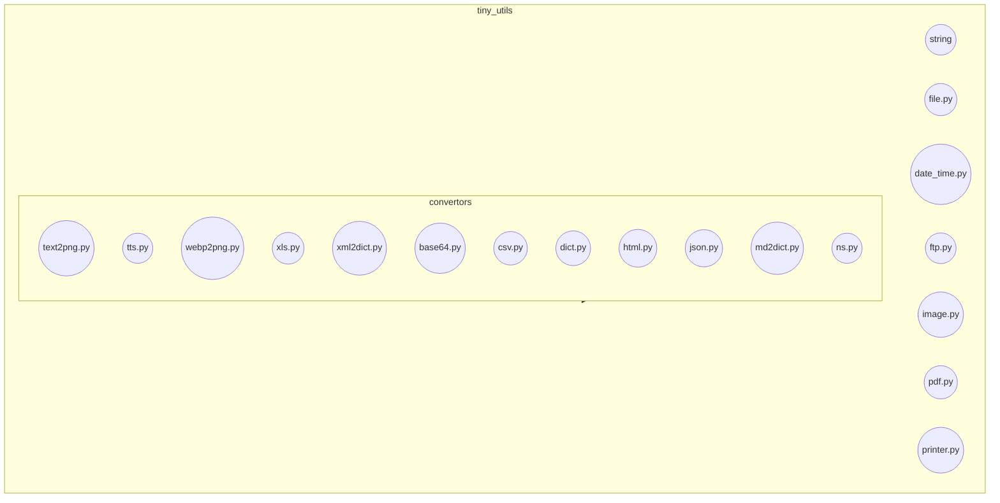

### **Проект `hypotez`**
# Роль `code explainer`
## ИНСТРУКЦИЯ  :

Анализируй предоставленный код подробно и объясни его функциональность. Ответ должен включать три раздела:  

1. **Блок-схема**: Опиши рабочий процесс в виде пошаговой блок-схемы, включая примеры для каждого логического блока, и проиллюстрируй поток данных между функциями, классами или методами.  
2. **Диаграмма**: Напиши код для диаграммы в формате `mermaid`, проанализируй и объясни все зависимости, 
    которые импортируются при создании диаграммы. 
    **ВАЖНО!** Убедитесь, что все имена переменных, используемые в диаграмме `mermaid`, 
    имеют осмысленные и описательные имена. Имена переменных вроде `A`, `B`, `C`, и т.д., не допускаются!  
    
    **Дополнительно**: Если в коде есть импорт `import header`, добавьте блок `mermaid` flowchart, объясняющий `header.py`:\
    ```mermaid\
    flowchart TD\
        Start --> Header[<code>header.py</code><br> Determine Project Root]\
    \
        Header --> import[Import Global Settings: <br><code>from src import gs</code>] \
    ```

3. **Объяснение**: Предоставь подробные объяснения для:  
   - **Импорты**: Их назначение и взаимосвязь с другими пакетами `src.`.  
   - **Классы**: Их роль, атрибуты, методы и взаимодействие с другими компонентами проекта.  
   - **Функции**: Их аргументы, возвращаемые значения, назначение и примеры.  
   - **Переменные**: Их типы и использование.  
   - Выдели потенциальные ошибки или области для улучшения.  

Дополнительно, постройте цепочку взаимосвязей с другими частями проекта (если применимо).  

Это обеспечивает всесторонний и структурированный анализ кода.
## Формат ответа: `.md` (markdown) UTF-8 RU


## Твое поведение при анализе кода:
- всегда смотри системную инструкцию для обработки кода проекта `hypotez`;
- анализируй расположение файла в проекте. Это поможет понять его назначение и взаимосвязь с другими файлами. Расположение файла ты найдешь в самой превой строке кода, начинающейся с `## \\file /...`;
- запоминай предоставленный код и анализируй его связь с другими частями проекта `hypotez`;

**КОНЕЦ ИНСТРУКЦИИ**

## \file hypotez/src/utils/README.MD
# Анализ файла `README.MD` в директории `src/utils`

Предоставленный текст является файлом `README.MD`, описывающим библиотеку `Tiny Utils`.

### 1. Блок-схема

```mermaid
graph LR
    A[Начало] --> B{Установка Tiny Utils};
    B -- Клонирование репозитория --> C[cd tiny_utils];
    C --> D[pip install -r requirements.txt];
    D --> E{Обзор модулей};
    E --> F{Конверторы};
    F -- text2png.py --> G[Конвертация текста в PNG];
    F -- xml2dict.py --> H[Конвертация XML в словарь];
    F -- json.py --> I[Парсинг и обработка JSON];
    E --> J{Строковые утилиты};
    E --> K{Файловые операции};
    E --> L{Утилиты даты и времени};
    E --> M{FTP утилиты};
    E --> N{Утилиты изображений};
    E --> O{PDF утилиты};
    E --> P{Утилиты принтера};
    I --> Q{Примеры использования};
    Q -- Конвертация текста в PNG --> R[text2png.convert(text, output_path)];
    Q -- Конвертация XML в словарь --> S[xml2dict.convert(xml_data)];
    Q -- Парсинг JSON --> T[json.parse(json_data)];
    T --> U[Вклад в проект];
    U --> V[Лицензия];
    V --> W[Конец];
```

**Примеры для каждого логического блока:**

-   **Установка Tiny Utils**:
    *   Клонирование репозитория: `git clone https://github.com/hypo69/tiny-utils.git`
    *   Переход в директорию: `cd tiny_utils`
    *   Установка зависимостей: `pip install -r requirements.txt`
-   **Обзор модулей**: Описание основных модулей библиотеки.
-   **Конверторы**: Модуль, содержащий утилиты для конвертации данных между форматами (например, текст в PNG, XML в словарь, JSON).
-   **Примеры использования**:
    *   Конвертация текста в PNG:

        ```python
        from tiny_utils.convertors import text2png
        text = "Hello, World!"
        output_path = "output_image.png"
        text2png.convert(text, output_path)
        ```
    *   Конвертация XML в словарь:

        ```python
        from tiny_utils.convertors import xml2dict
        xml_data = "<root><item>Hello</item></root>"
        dictionary = xml2dict.convert(xml_data)
        print(dictionary)
        ```
    *   Парсинг JSON:

        ```python
        from tiny_utils.convertors import json
        json_data = '{"name": "John", "age": 30}'
        parsed_data = json.parse(json_data)
        print(parsed_data)
        ```

### 2. Диаграмма



**Анализ зависимостей:**

Диаграмма демонстрирует структуру библиотеки `Tiny Utils`. Она состоит из нескольких модулей: `convertors`, `string`, `file`, `date_time`, `ftp`, `image`, `pdf` и `printer`. Модуль `convertors` дополнительно разбит на несколько подмодулей, каждый из которых выполняет определенную функцию преобразования данных (например, `text2png.py` конвертирует текст в PNG).

### 3. Объяснение

#### Общее описание

`Tiny Utils` - это библиотека утилит, предоставляющая набор легких вспомогательных функций для различных общих задач. Она включает утилиты для преобразования форматов данных, манипуляции с текстом и файлами, строковых операций, форматирования даты и времени, обработки изображений и многого другого.

#### Модули и их описание

*   **Convertors**: Содержит утилиты для преобразования данных между форматами.

    *   `text2png.py`: Конвертирует текст в изображение PNG.
    *   `tts.py`: Преобразует текст в речь и сохраняет в аудиофайл.
    *   `webp2png.py`: Конвертирует изображения из формата WebP в формат PNG.
    *   `xls.py`: Обрабатывает преобразования и манипуляции с файлами XLS.
    *   `xml2dict.py`: Конвертирует данные XML в словарь Python.
    *   `base64.py`: Кодирует или декодирует данные с использованием кодировки Base64.
    *   `csv.py`: Предоставляет инструменты для разбора и манипуляции CSV.
    *   `dict.py`: Утилиты для работы со словарями Python.
    *   `html.py`: Конвертирует HTML-контент в различные форматы.
    *   `json.py`: Утилиты для разбора и манипуляции JSON.
    *   `md2dict.py`: Конвертирует контент Markdown в словарь.
    *   `ns.py`: Утилиты для преобразования пространств имен.
*   **String Utilities**: Расширенные функции для манипуляции строками.
*   **File Operations**: Утилиты для обработки файлов.
*   **Date-Time Utilities**: Утилиты для форматирования даты и времени.
*   **FTP Utilities**: Функции для работы с FTP.
*   **Image Utilities**: Основные инструменты для обработки изображений.
*   **PDF Utilities**: Утилиты для работы с PDF.
*   **Printer Utilities**: Функции для отправки данных на принтер.

#### Примеры использования

Примеры демонстрируют, как использовать различные модули библиотеки `Tiny Utils`. Например, конвертация текста в PNG, XML в словарь и парсинг JSON.

#### Потенциальные области для улучшения

*   Некоторые модули (`String Utilities`, `File Operations` и другие) не имеют детального описания в `README.MD`. Необходимо добавить описание функциональности каждого модуля.
*   Следует добавить больше примеров использования для каждого модуля, чтобы облегчить понимание и использование библиотеки.
*   Документация по установке зависимостей указывает на файл `requirements.txt`, но не упоминает, где он находится (в каком репозитории/проекте).
*   В разделе "Files:" модуля "Convertors" не все файлы имеют описание.

#### Связь с другими частями проекта `hypotez`

Невозможно определить связь с другими частями проекта `hypotez` без дополнительного контекста. `Tiny Utils` потенциально может быть использована как независимая библиотека в различных частях проекта для обработки данных, файлов, изображений и т.д.