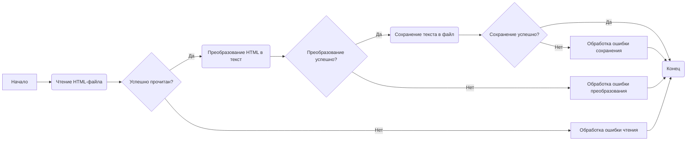
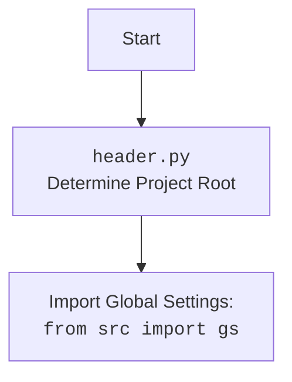

### **Анализ кода проекта `hypotez`**

=========================================================================================

#### **1. Блок-схема**



**Примеры для каждого логического блока:**

- **A (Начало)**: Начало выполнения скрипта.
- **B (Чтение HTML-файла)**: `html = read_text_file(gs.path.google_drive / 'html2text' / 'index.html')` - Попытка чтения HTML-файла из указанного пути. Если файл не существует или нет прав доступа, будет ошибка.
- **C (Успешно прочитан?)**: Проверка, что `html` не `None` и содержит данные.
- **D (Преобразование HTML в текст)**: `text_from_html = html2text(html)` - Преобразование HTML-содержимого в текст. Если `html` содержит некорректный HTML, может возникнуть исключение.
- **E (Преобразование успешно?)**: Проверка, что `text_from_html` не `None` и содержит текст.
- **F (Сохранение текста в файл)**: `save_text_file(text_from_html, gs.path.google_drive / 'html2text' / 'index.txt')` - Сохранение преобразованного текста в файл. Если нет прав на запись в указанную директорию, будет ошибка.
- **G (Сохранение успешно?)**: Проверка, что файл успешно сохранен.
- **H (Конец)**: Завершение выполнения скрипта.
- **I (Обработка ошибки чтения)**: Логирование ошибки и завершение работы.
- **J (Обработка ошибки преобразования)**: Логирование ошибки и завершение работы.
- **K (Обработка ошибки сохранения)**: Логирование ошибки и завершение работы.

#### **2. Диаграмма**

```mermaid
flowchart TD
    Start --> A[<code>html2text.py</code><br>Преобразование HTML в текст];

    A --> Import_Header[Import <code>header.py</code><br>Определение корневой директории проекта];
    A --> Import_gs[Import Global Settings: <br><code>from src import gs</code>];
    A --> Import_html2text[Import <code>html2text, html2text_file</code><br>from <code>src.utils.convertors</code>];
    A --> Import_file[Import <code>read_text_file, save_text_file</code><br>from <code>src.utils.file</code>];

    Import_Header --> Global_Settings[Использование глобальных настроек];
    Import_gs --> File_Operations[Чтение и запись файлов];
    Import_html2text --> Text_Conversion[Преобразование HTML в текст];
    Import_file --> File_Management[Управление файлами];

    Start --> Read_HTML[Чтение HTML файла: <br><code>read_text_file</code>];
    Read_HTML --> Convert_to_Text[Преобразование в текст: <br><code>html2text(html)</code>];
    Convert_to_Text --> Save_Text[Сохранение текста в файл: <br><code>save_text_file</code>];

    Save_Text --> End[Конец];
```



#### **3. Объяснение**

**Импорты:**

- `import header`: Определяет корневую директорию проекта.
- `from src import gs`: Импортирует глобальные настройки проекта из `src.gs`.
- `from src.utils.convertors import html2text, html2text_file`: Импортирует функции для преобразования HTML в текст. `html2text` используется для преобразования HTML-строки, а `html2text_file` - для преобразования HTML-файла. В данном коде используется только `html2text`.
- `from src.utils.file import read_text_file, save_text_file`: Импортирует функции для чтения и сохранения текстовых файлов.

**Переменные:**

- `html`: Содержит HTML-код, прочитанный из файла `index.html`.
- `text_from_html`: Содержит текст, полученный после преобразования HTML-кода.

**Функции:**

- `read_text_file(file_path: str | Path, as_list: bool = False, extensions: Optional[List[str]] = None, chunk_size: int = 8192) -> Generator[str, None, None] | str | None:`: Читает содержимое текстового файла. В данном случае используется для чтения HTML-файла.
    - `file_path`: Путь к файлу.
    - `as_list`: Если `True`, возвращает список строк.
    - `extensions`: Список расширений файлов для чтения (если `file_path` - директория).
    - `chunk_size`: Размер чанка для чтения файла.
    - Возвращает: генератор строк, строку или `None`.
- `html2text(html: str) -> str`: Преобразует HTML-код в текст.
    - `html`: HTML-код для преобразования.
    - Возвращает: текст.
- `save_text_file(text: str, file_path: str) -> None`: Сохраняет текст в файл.
    - `text`: Текст для сохранения.
    - `file_path`: Путь к файлу.

**Потенциальные ошибки и области для улучшения:**

1.  **Отсутствие обработки ошибок:** В коде отсутствует обработка исключений при чтении, преобразовании и сохранении файлов. Необходимо добавить блоки `try...except` для обработки возможных ошибок, таких как `FileNotFoundError`, `IOError` и других.
2.  **Жестко заданные пути:** Пути к файлам заданы жестко через `gs.path.google_drive / 'html2text' / 'index.html'`. Это может быть неудобно при изменении структуры проекта или переносе файлов. Лучше использовать конфигурационные файлы или аргументы командной строки для передачи путей.
3.  **Отсутствие логирования:** В коде отсутствует логирование операций. Необходимо добавить логирование для отслеживания хода выполнения программы и облегчения отладки.
4.  **`...`:** В конце кода стоит `...`, что может означать незавершенность кода. Необходимо проверить и дописать недостающий код.
5. **Аннотации**:
Не для всех переменных определены аннотации типа. Например `html`.

**Взаимосвязи с другими частями проекта:**

- Файл использует `header.py` для определения корневой директории проекта и `src.gs` для получения глобальных настроек.
- Используются функции из `src.utils.convertors` для преобразования HTML в текст и из `src.utils.file` для чтения и сохранения файлов.

**Рекомендации по улучшению:**

1.  Добавить обработку исключений.
2.  Использовать конфигурационные файлы или аргументы командной строки для задания путей к файлам.
3.  Добавить логирование.
4. Завершить код вместо `...`
5.  Добавить аннотации типа.