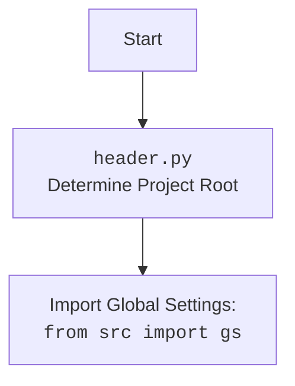

### **Системные инструкции для обработки кода проекта `hypotez`**

=========================================================================================

Описание функциональности и правил для генерации, анализа и улучшения кода. Направлено на обеспечение последовательного и читаемого стиля кодирования, соответствующего требованиям.

---

### **Основные принципы**

#### **1. Общие указания**:
- Соблюдай четкий и понятный стиль кодирования.
- Все изменения должны быть обоснованы и соответствовать установленным требованиям.

#### **2. Комментарии**:
- Используй `#` для внутренних комментариев.
- Документация всех функций, методов и классов должна следовать такому формату: 
    ```python
        def function(param: str, param1: Optional[str | dict | str] = None) -> dict | None:
            """ 
            Args:
                param (str): Описание параметра `param`.
                param1 (Optional[str | dict | str], optional): Описание параметра `param1`. По умолчанию `None`.
    
            Returns:
                dict | None: Описание возвращаемого значения. Возвращает словарь или `None`.
    
            Raises:
                SomeError: Описание ситуации, в которой возникает исключение `SomeError`.

            Ехаmple:
                >>> function('param', 'param1')
                {'param': 'param1'}
            """
    ```
- Комментарии и документация должны быть четкими, лаконичными и точными.

#### **3. Форматирование кода**:
- Используй одинарные кавычки. `a:str = 'value'`, `print('Hello World!')`;
- Добавляй пробелы вокруг операторов. Например, `x = 5`;
- Все параметры должны быть аннотированы типами. `def function(param: str, param1: Optional[str | dict | str] = None) -> dict | None:`;
- Не используй `Union`. Вместо этого используй `|`.

#### **4. Логирование**:
- Для логгирования Всегда Используй модуль `logger` из `src.logger.logger`.
- Ошибки должны логироваться с использованием `logger.error`.
Пример:
    ```python
        try:
            ...
        except Exception as ex:
            logger.error('Error while processing data', ех, exc_info=True)
    ```
#### **5 Не используй `Union[]` в коде. Вместо него используй `|`
Например:
```python
x: str | int ...
```


---

### **Основные требования**:

#### **1. Формат ответов в Markdown**:
- Все ответы должны быть выполнены в формате **Markdown**.

#### **2. Формат комментариев**:
- Используй указанный стиль для комментариев и документации в коде.
- Пример:

```python
from typing import Generator, Optional, List
from pathlib import Path


def read_text_file(
    file_path: str | Path,
    as_list: bool = False,
    extensions: Optional[List[str]] = None,
    chunk_size: int = 8192,
) -> Generator[str, None, None] | str | None:
    """
    Считывает содержимое файла (или файлов из каталога) с использованием генератора для экономии памяти.

    Args:
        file_path (str | Path): Путь к файлу или каталогу.
        as_list (bool): Если `True`, возвращает генератор строк.
        extensions (Optional[List[str]]): Список расширений файлов для чтения из каталога.
        chunk_size (int): Размер чанков для чтения файла в байтах.

    Returns:
        Generator[str, None, None] | str | None: Генератор строк, объединенная строка или `None` в случае ошибки.

    Raises:
        Exception: Если возникает ошибка при чтении файла.

    Example:
        >>> from pathlib import Path
        >>> file_path = Path('example.txt')
        >>> content = read_text_file(file_path)
        >>> if content:
        ...    print(f'File content: {content[:100]}...')
        File content: Example text...
    """
    ...
```
- Всегда делай подробные объяснения в комментариях. Избегай расплывчатых терминов, 
- таких как *«получить»* или *«делать»*. Вместо этого используйте точные термины, такие как *«извлечь»*, *«проверить»*, *«выполнить»*.
- Вместо: *«получаем»*, *«возвращаем»*, *«преобразовываем»* используй имя объекта *«функция получае»*, *«переменная возвращает»*, *«код преобразовывает»* 
- Комментарии должны непосредственно предшествовать описываемому блоку кода и объяснять его назначение.

#### **3. Пробелы вокруг операторов присваивания**:
- Всегда добавляйте пробелы вокруг оператора `=`, чтобы повысить читаемость.
- Примеры:
  - **Неправильно**: `x=5`
  - **Правильно**: `x = 5`

#### **4. Использование `j_loads` или `j_loads_ns`**:
- Для чтения JSON или конфигурационных файлов замените стандартное использование `open` и `json.load` на `j_loads` или `j_loads_ns`.
- Пример:

```python
# Неправильно:
with open('config.json', 'r', encoding='utf-8') as f:
    data = json.load(f)

# Правильно:
data = j_loads('config.json')
```

#### **5. Сохранение комментариев**:
- Все существующие комментарии, начинающиеся с `#`, должны быть сохранены без изменений в разделе «Улучшенный код».
- Если комментарий кажется устаревшим или неясным, не изменяйте его. Вместо этого отметьте его в разделе «Изменения».

#### **6. Обработка `...` в коде**:
- Оставляйте `...` как указатели в коде без изменений.
- Не документируйте строки с `...`.
```

#### **7. Аннотации**
Для всех переменных должны быть определены аннотации типа. 
Для всех функций все входные и выходные параметры аннотириваны
Для все параметров должны быть аннотации типа.


### **8. webdriver**
В коде используется webdriver. Он импртируется из модуля `webdriver` проекта `hypotez`
```python
from src.webdirver import Driver, Chrome, Firefox, Playwright, ...
driver = Driver(Firefox)

Пoсле чего может использоваться как

close_banner = {
  "attribute": null,
  "by": "XPATH",
  "selector": "//button[@id = 'closeXButton']",
  "if_list": "first",
  "use_mouse": false,
  "mandatory": false,
  "timeout": 0,
  "timeout_for_event": "presence_of_element_located",
  "event": "click()",
  "locator_description": "Закрываю pop-up окно, если оно не появилось - не страшно (`mandatory`:`false`)"
}

result = driver.execute_locator(close_banner)
```

### Анализ кода `hypotez/src/utils/convertors/_experiments/webp2png.py`

#### 1. Блок-схема:

```mermaid
graph TD
    A[Начало: __main__] --> B{Определение каталогов: webp_dir, png_dir};
    B --> C{Вызов convert_images(webp_dir, png_dir)};
    C --> D[Получение списка WebP файлов: webp_files = get_filenames(webp_dir)];
    D --> E{Цикл по webp_files};
    E --> F[Формирование пути к PNG файлу: png = png_dir / f"{Path(webp).stem}.png"];
    F --> G[Формирование пути к WebP файлу: webp_path = webp_dir / webp];
    G --> H[Конвертация WebP в PNG: result = webp2png(webp_path, png)];
    H --> I[Вывод результата: print(result)];
    I --> J{Конец цикла};
    J --> E;
    E -- Конец цикла --> K[Конец: convert_images];
    K --> L[Конец: __main__];
```

**Примеры для каждого блока:**

- **A (Начало: `__main__`)**: Начало выполнения скрипта.
- **B (Определение каталогов: `webp_dir`, `png_dir`)**:
  ```python
  webp_dir = gs.path.google_drive / 'kazarinov' / 'raw_images_from_openai'
  png_dir = gs.path.google_drive / 'kazarinov' / 'converted_images'
  ```
  Пример: `webp_dir` становится путем к директории с исходными WebP изображениями, а `png_dir` - путем к директории для сохранения сконвертированных PNG изображений.
- **C (Вызов `convert_images(webp_dir, png_dir)`)**: Вызов основной функции конвертации.
- **D (Получение списка WebP файлов: `webp_files = get_filenames(webp_dir)`)**:
  ```python
  webp_files: list = get_filenames(webp_dir)
  ```
  Пример: `webp_files` становится списком имен файлов WebP в директории `webp_dir`.
- **E (Цикл по `webp_files`)**: Итерация по каждому файлу WebP в списке.
- **F (Формирование пути к PNG файлу: `png = png_dir / f"{Path(webp).stem}.png"`)**:
  ```python
  png = png_dir / f"{Path(webp).stem}.png"
  ```
  Пример: Если `webp` это `"image.webp"`, то `png` станет путем к файлу `"converted_images/image.png"`.
- **G (Формирование пути к WebP файлу: `webp_path = webp_dir / webp`)**:
  ```python
  webp_path = webp_dir / webp
  ```
  Пример: Если `webp` это `"image.webp"`, то `webp_path` станет полным путем к файлу `"raw_images_from_openai/image.webp"`.
- **H (Конвертация WebP в PNG: `result = webp2png(webp_path, png)`)**:
  ```python
  result = webp2png(webp_path, png)
  ```
  Пример: Функция `webp2png` конвертирует WebP файл по пути `webp_path` в PNG файл по пути `png`, результат конвертации сохраняется в переменной `result`.
- **I (Вывод результата: `print(result)`)**: Вывод информации о результате конвертации.
- **J (Конец цикла)**: Завершение итерации цикла.
- **K (Конец: `convert_images`)**: Завершение работы функции `convert_images`.
- **L (Конец: `__main__`)**: Завершение выполнения скрипта.

#### 2. Диаграмма:

```mermaid
flowchart TD
    A[convert_images] --> B(get_filenames);
    B --> C{webp_files: list};
    C --> D{for webp in webp_files};
    D --> E(Path(webp).stem);
    E --> F{png_dir / f"{Path(webp).stem}.png"};
    F --> G(webp2png);
    G --> H{print(result)};
    H --> D;

```

**Объяснение зависимостей:**

- `convert_images`: Основная функция, которая управляет процессом конвертации WebP в PNG.
- `get_filenames`: Функция из `src.utils.file`, используемая для получения списка файлов WebP из указанной директории.
- `webp_files`: Список, возвращаемый функцией `get_filenames`, содержащий имена файлов WebP.
- `Path(webp).stem`: Используется для извлечения имени файла без расширения.
- `png_dir / f"{Path(webp).stem}.png"`: Формирование пути к PNG файлу.
- `webp2png`: Функция из `src.utils.convertors.webp2png`, которая выполняет фактическую конвертацию WebP в PNG.
- `print(result)`: Выводит результат конвертации.



#### 3. Объяснение:

**Импорты:**

- `header`: Предназначен для определения корневого каталога проекта. Используется для настройки путей и других глобальных параметров.
- `pathlib.Path`: Используется для представления путей к файлам и директориям, упрощает работу с файловой системой.
- `src`: Используется для доступа к глобальным настройкам (gs).
- `src.utils.convertors.webp2png.webp2png`: Функция для конвертации WebP в PNG.
- `src.utils.file.get_filenames`: Функция для получения списка файлов в директории.
- `gs`: Глобальные настройки проекта, содержащие пути к директориям (например, google_drive).

**Классы:**

- В данном коде классы явно не определены. Используются объекты `Path` из модуля `pathlib`.

**Функции:**

- `convert_images(webp_dir: Path, png_dir: Path) -> None`:
  - **Аргументы:**
    - `webp_dir` (Path): Путь к директории с WebP изображениями.
    - `png_dir` (Path): Путь к директории для сохранения PNG изображений.
  - **Возвращаемое значение:** `None`.
  - **Назначение:** Конвертирует все WebP изображения из `webp_dir` в PNG и сохраняет их в `png_dir`.
  - **Пример:**
    ```python
    convert_images(
        gs.path.google_drive / 'emil' / 'raw_images_from_openai',
        gs.path.google_drive / 'emil' / 'converted_images'
    )
    ```
- `get_filenames(webp_dir)`:
    - **Аргументы:**
        - `webp_dir` (Path): Путь к директории.
    - **Возвращаемое значение:** `list`.
    - **Назначение:** Возвращает список имен файлов в указанной директории.
- `webp2png(webp_path, png)`:
  - **Аргументы:**
    - `webp_path` (Path): Путь к WebP файлу.
    - `png` (Path): Путь для сохранения PNG файла.
  - **Возвращаемое значение:** Зависит от реализации функции (не указано явно).
  - **Назначение:** Конвертирует WebP изображение в PNG формат.

**Переменные:**

- `webp_dir` (Path): Путь к директории с WebP изображениями.
- `png_dir` (Path): Путь к директории для сохранения PNG изображения.
- `webp_files` (list): Список имен файлов WebP в директории `webp_dir`.
- `webp` (str): Имя текущего WebP файла в цикле.
- `png` (Path): Путь к PNG файлу, который будет создан.
- `webp_path` (Path): Полный путь к WebP файлу.
- `result`: Результат выполнения функции `webp2png`.

**Потенциальные ошибки и области для улучшения:**

- Отсутствует обработка ошибок при конвертации WebP в PNG. Если `webp2png` возвращает ошибку, она не обрабатывается, а просто выводится в консоль.
- Не указаны типы возвращаемых значений для `get_filenames` и `webp2png`.
- Отсутствует логирование. Было бы полезно логировать успешные и неудачные конвертации.

**Взаимосвязи с другими частями проекта:**

- Использует `gs` для доступа к глобальным путям, что позволяет гибко настраивать директории для работы.
- Зависит от функций `get_filenames` и `webp2png`, которые должны быть определены в других модулях проекта.