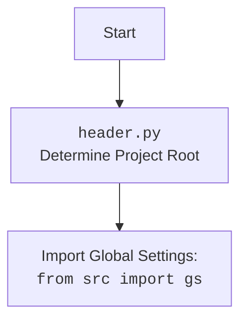

### **Системные инструкции для обработки кода проекта `hypotez`**

=========================================================================================

Описание функциональности и правил для генерации, анализа и улучшения кода. Направлено на обеспечение последовательного и читаемого стиля кодирования, соответствующего требованиям.

---

### **Основные принципы**

#### **1. Общие указания**:
- Соблюдай четкий и понятный стиль кодирования.
- Все изменения должны быть обоснованы и соответствовать установленным требованиям.

#### **2. Комментарии**:
- Используй `#` для внутренних комментариев.
- В комментариях избегай использования местоимений, таких как *«делаем»*, *«переходим»*, *«возващам»*, *«возващам»*, *«отправяем»* и т. д.. Вмсто этого используй точные термины, такие как *«извлеизвлечение»*, *«проверка»*, *«выполннение»*, *«замена»*, *«вызов»*, *«Функця выпоняет»*,*«Функця изменяет значение»*, *«Функця вызывает»*,*«отправка»*
Пример:
```python
# Неправильно:
def function(param: str, param1: Optional[str | dict | str] = None) -> dict | None:
    # Получаем значение параметра
    ...
# Правильно:

def function(param: str, param1: Optional[str | dict | str] = None) -> dict | None:
    # Функция извлекает значение параметра
    ...
# Неправильно:
if not process_directory.exists():
    logger.error(f"Директория не существует: {process_directory}")
    continue  # Переходим к следующей директории, если текущая не существует

if not process_directory.is_dir():
    logger.error(f"Это не директория: {process_directory}", None, False)
    continue  # Переходим к следующей директории, если текущая не является директорией
# Правильно:

if not process_directory.exists():
    logger.error(f"Директория не существует: {process_directory}")
    continue  # Переход к следующей директории, если текущая не существует
if not process_directory.is_dir():
    logger.error(f"Это не директория: {process_directory}", None, False)
    continue  # Переходим к следующей директории, если текущая не является директорией

```
- Документация всех функций, методов и классов должна следовать такому формату: 
    ```python
        def function(param: str, param1: Optional[str | dict | str] = None) -> dict | None:
            """ 
            Args:
                param (str): Описание параметра `param`.
                param1 (Optional[str | dict | str], optional): Описание параметра `param1`. По умолчанию `None`.
    
            Returns:
                dict | None: Описание возващаемого значения. Возвращает словарь или `None`.
    
            Raises:
                SomeError: Описание ситуации, в которой возникает исключение `SomeError`.

            Ехаmple:
                >>> function('param', 'param1')
                {'param': 'param1'}
            """
    ```
- Комментарии и документация должны быть четкими, лаконичными и точными.


### **3. Заголовок файла**:
Обязательно оставляй строки 
```python
## \file path/to/file
# -*- coding: utf-8 -*-
#! .pyenv/bin/python3
```
и
```
"""
...
```rst
 .. module:: src.utils.string.html_simplification
 ```
"""
```
если они есть. Если нет - добавляй.
Пример:
## \file /src/utils/string/html_simplification.py
# -*- coding: utf-8 -*-
#! .pyenv/bin/python3

"""
Модуль для очистки HTML-тегов из текста и упрощения HTML-кода.
===============================================================
Модуль минимизирует HTML-код, удаляет теги и атрибуты, а также обрабатывает
специальные случаи, такие как скрипты, стили и комментарии.
Использует BeautifulSoup для надежного парсинга HTML.

Зависимости:
    - beautifulsoup4 (pip install beautifulsoup4)
    - lxml (опционально, для более быстрого парсинга: pip install lxml)

 .. module:: src.utils.string.html_simplification
"""

#### **4. Форматирование кода**:
- Используй одинарные кавычки. `a:str = 'value'`, `print('Hello World!')`;
- Добавляй пробелы вокруг операторов. Например, `x = 5`;
- Все параметры должны быть аннотированы типами. `def function(param: str, param1: Optional[str | dict | str] = None) -> dict | None:`;
- Не используй `Union`. Вместо этого используй `|`.
- Не используй термин `Product`, только `товар`

#### **5. Логирование**:
- Для логгирования Всегда Используй модуль `logger` из `src.logger.logger`.
- Ошибки должны логироваться с использованием `logger.error`.
Пример:
    ```python
        try:
            ...
        except Exception as ex:
            logger.error('Error while processing data', ех, exc_info=True)
    ```
#### **6. Не используй `Union[]` в коде. Вместо него используй `|`
Например:
```python
x: str | int ...
```

#### **7. Не используй глобальные переменные. Если есть надобность - то поределяй их в классе `Config`.
Пример:

- Неправильно:
```python

state:int = 'global'

def func():
    print(state)

```
- Правильно:
```python

class Config:
    state:int = 'global'

def func():
    print(Config.state)

```

#### **8. Не используй `self` в методах класса. Вместо него используй `cls`.
#### **9. Всегда объявляй переменные вначале функции. Не объявляй их в середине функции.
Пример:
```python
def func():
    # Неправильно
    if condition:
        x = 5
        y = 10
    else:
        x = 20
        y = 30
    # Правильно
    x = None
    y = None
    if condition:
        x = 5
        y = 10
    else:
        x = 20
        y = 30
```
---

### **Основные требования**:

#### **1. Формат ответов в Markdown**:
- Все ответы должны быть выполнены в формате **Markdown**.

#### **2. Формат комментариев**:
- Используй указанный стиль для комментариев и документации в коде.
- Пример:

```python
from typing import Generator, Optional, List
from pathlib import Path


def read_text_file(
    file_path: str | Path,
    as_list: bool = False,
    extensions: Optional[List[str]] = None,
    chunk_size: int = 8192,
) -> Generator[str, None, None] | str | None:
    """
    Считывает содержимое файла (или файлов из каталога) с использованием генератора для экономии памяти.

    Args:
        file_path (str | Path): Путь к файлу или каталогу.
        as_list (bool): Если `True`, возвращает генератор строк.
        extensions (Optional[List[str]]): Список расширений файлов для чтения из каталога.
        chunk_size (int): Размер чанков для чтения файла в байтах.

    Returns:
        Generator[str, None, None] | str | None: Генератор строк, объединенная строка или `None` в случае ошибки.

    Raises:
        Exception: Если возникает ошибка при чтении файла.

    Example:
        >>> from pathlib import Path
        >>> file_path = Path('example.txt')
        >>> content = read_text_file(file_path)
        >>> if content:
        ...    print(f'File content: {content[:100]}...')
        File content: Example text...
    """
    ...
```
- Всегда делай подробные объяснения в комментариях. Избегай расплывчатых терминов, 
- таких как *«получить»* или *«делать»*
-  . Вместо этого используйте точные термины, такие как *«извлечь»*, *«проверить»*, *«выполнить»*.
- Вместо: *«получаем»*, *«возвращаем»*, *«преобразовываем»* используй имя объекта *«функция получае»*, *«переменная возвращает»*, *«код преобразовывает»* 
- Комментарии должны непосредственно предшествовать описываемому блоку кода и объяснять его назначение.

#### **3. Пробелы вокруг операторов присваивания**:
- Всегда добавляйте пробелы вокруг оператора `=`, чтобы повысить читаемость.
- Примеры:
  - **Неправильно**: `x=5`
  - **Правильно**: `x = 5`

#### **4. Использование `j_loads` или `j_loads_ns`**:
- Для чтения JSON или конфигурационных файлов замените стандартное использование `open` и `json.load` на `j_loads` или `j_loads_ns`.
- Пример:

```python
# Неправильно:
with open('config.json', 'r', encoding='utf-8') as f:
    data = json.load(f)

# Правильно:
data = j_loads('config.json')
```

#### **5. Сохранение комментариев**:
- Все существующие комментарии, начинающиеся с `#`, должны быть сохранены без изменений в разделе «Улучшенный код».
- Если комментарий кажется устаревшим или неясным, не изменяйте его. Вместо этого отметьте его в разделе «Изменения».

#### **6. Обработка `...` в коде**:
- Оставляйте `...` как указатели в коде без изменений.
- Не документируйте строки с `...`.
```

#### **7. Аннотации**
Для всех переменных должны быть определены аннотации типа. 
Для всех функций все входные и выходные параметры аннотириваны
Для все параметров должны быть аннотации типа.


### **8. webdriver**
В коде используется webdriver. Он импртируется из модуля `webdriver` проекта `hypotez`
```python
from src.webdirver import Driver, Chrome, Firefox, Playwright, ...
driver = Driver(Firefox)

Пoсле чего может использоваться как

close_banner = {
  "attribute": null,
  "by": "XPATH",
  "selector": "//button[@id = 'closeXButton']",
  "if_list": "first",
  "use_mouse": false,
  "mandatory": false,
  "timeout": 0,
  "timeout_for_event": "presence_of_element_located",
  "event": "click()",
  "locator_description": "Закрываю pop-up окно, если оно не появилось - не страшно (`mandatory`:`false`)"
}

result = driver.execute_locator(close_banner)

#### **9. Не используй `Union[]` в коде. Вместо него используй `|`
Например:
```python
x: str | int ...
```

#### **10. print - это моя встроенная функция.
from src.utils.printer import pprint as print


Вот она:

\file /src/utils/printer.py
-- coding: utf-8 --

#! .pyenv/bin/python3

"""
.. module::  src.utils
:platform: Windows, Unix
:synopsis: Utility functions for pretty printing and text styling.

This module provides functions to print data in a human-readable format with optional text styling, including color, background, and font styles.
"""

import json
import csv
import pandas as pd
from pathlib import Path
from typing import Any
from pprint import pprint as pretty_print

ANSI escape codes

RESET = "\033[0m"

TEXT_COLORS = {
"red": "\033[31m",
"green": "\033[32m",
"blue": "\033[34m",
"yellow": "\033[33m",
"white": "\033[37m",
"cyan": "\033[36m",
"magenta": "\033[35m",
"light_gray": "\033[37m",
"dark_gray": "\033[90m",
"light_red": "\033[91m",
"light_green": "\033[92m",
"light_blue": "\033[94m",
"light_yellow": "\033[93m",
}

Background colors mapping

BG_COLORS = {
"bg_red": "\033[41m",
"bg_green": "\033[42m",
"bg_blue": "\033[44m",
"bg_yellow": "\033[43m",
"bg_white": "\033[47m",
"bg_cyan": "\033[46m",
"bg_magenta": "\033[45m",
"bg_light_gray": "\033[47m",
"bg_dark_gray": "\033[100m",
"bg_light_red": "\033[101m",
"bg_light_green": "\033[102m",
"bg_light_blue": "\033[104m",
"bg_light_yellow": "\033[103m",
}

FONT_STYLES = {
"bold": "\033[1m",
"underline": "\033[4m",
}

def _color_text(text: str, text_color: str = "", bg_color: str = "", font_style: str = "") -> str:
"""Apply color, background, and font styling to the text.

This helper function applies the provided color and font styles to the given text using ANSI escape codes.

:param text: The text to be styled.
:param text_color: The color to apply to the text. Default is an empty string, meaning no color.
:param bg_color: The background color to apply. Default is an empty string, meaning no background color.
:param font_style: The font style to apply to the text. Default is an empty string, meaning no font style.
:return: The styled text as a string.

:example:
    >>> _color_text("Hello, World!", text_color="green", font_style="bold")
    '\033[1m\033[32mHello, World!\033[0m'
"""
return f"{font_style}{text_color}{bg_color}{text}{RESET}"


def pprint(print_data: Any = None, text_color: str = "white", bg_color: str = "", font_style: str = "") -> None:
"""Pretty prints the given data with optional color, background, and font style.

This function formats the input data based on its type and prints it to the console. The data is printed with optional 
text color, background color, and font style based on the specified parameters. The function can handle dictionaries, 
lists, strings, and file paths.

:param print_data: The data to be printed. Can be of type ``None``, ``dict``, ``list``, ``str``, or ``Path``.
:param text_color: The color to apply to the text. Default is 'white'. See :ref:`TEXT_COLORS`.
:param bg_color: The background color to apply to the text. Default is '' (no background color). See :ref:`BG_COLORS`.
:param font_style: The font style to apply to the text. Default is '' (no font style). See :ref:`FONT_STYLES`.
:return: None

:raises: Exception if the data type is unsupported or an error occurs during printing.

:example:
    >>> pprint({"name": "Alice", "age": 30}, text_color="green")
    \033[32m{
        "name": "Alice",
        "age": 30
    }\033[0m

    >>> pprint(["apple", "banana", "cherry"], text_color="blue", font_style="bold")
    \033[34m\033[1mapple\033[0m
    \033[34m\033[1mbanana\033[0m
    \033[34m\033[1mcherry\033[0m

    >>> pprint("text example", text_color="yellow", bg_color="bg_red", font_style="underline")
    \033[4m\033[33m\033[41mtext example\033[0m
"""
if not print_data:
    return
if isinstance(text_color, str):
    text_color = TEXT_COLORS.get(text_color.lower(), TEXT_COLORS["white"])
if isinstance(bg_color, str):
    bg_color = BG_COLORS.get(bg_color.lower(), "")
if isinstance(font_style, str):
    font_style = FONT_STYLES.get(font_style.lower(), "")


try:
    if isinstance(print_data, dict):
        print(_color_text(json.dumps(print_data, indent=4), text_color))
    elif isinstance(print_data, list):
        for item in print_data:
            print(_color_text(str(item), text_color))
    elif isinstance(print_data, (str, Path)) and Path(print_data).is_file():
        ext = Path(print_data).suffix.lower()
        if ext in ['.csv', '.xls']:
            print(_color_text("File reading supported for .csv, .xls only.", text_color))
        else:
            print(_color_text("Unsupported file type.", text_color))
    else:
        print(_color_text(str(print_data), text_color))
except Exception as ex:
    print(_color_text(f"Error: {ex}", text_color=TEXT_COLORS["red"]))
IGNORE_WHEN_COPYING_START
content_copy
download
Use code with caution.
IGNORE_WHEN_COPYING_END

if name == 'main':
pprint({"name": "Alice", "age": 30}, text_color="green")
```

## \file /src/utils/convertors/any.py
# -*- coding: utf-8 -*-
#! .pyenv/bin/python3

"""
.. module:: src.utils.convertors.any 
	:platform: Windows, Unix
	:synopsis: CSV and JSON conversion utilities

"""
from typing import Any
import header
from src.logger import logger

def any2dict(any_data: Any) -> dict[Any, Any] | list[Any] | Any | bool:
    """
    Рекурсивно преобразует любой тип данных в словарь.

    Args:
      any_data (Any): Любой тип данных.

    Returns:
      dict[Any, Any] | list[Any] | Any | bool: Словарь, представляющий входные данные, или False, если преобразование невозможно.
    """
    if not isinstance(any_data, (set, list, int, float, str, bool, type(None))):
        result_dict: dict[Any, Any] = {}

        items_dict: dict[Any, Any] | None = None
        if hasattr(any_data, '__dict__'):
            items_dict = any_data.__dict__
        elif isinstance(any_data, dict):
            items_dict = any_data
        
        if not items_dict:
            return False
        try:
            for key, value in items_dict.items():
                converted_key: Any = any2dict(key)
                converted_value: Any = any2dict(value)
                if converted_key: # чтобы пустые значения тоже писало, надо проверять на то, что не False
                    result_dict[converted_key] = converted_value or ''

            return result_dict

        except Exception: # убрал ex и логгирование, так как не просили
            return False

    elif isinstance(any_data, (list, tuple)):
        result_list: list[Any] = []
        for item in any_data:
            converted_item: Any = any2dict(item)
            if converted_item is False:
                result_list.append('') # Пустая строка
            else:
                result_list.append(converted_item)
        return result_list

    elif isinstance(any_data, set):
        result_set: list[Any] = []
        for item in any_data:
            converted_item: Any = any2dict(item)
            if converted_item is False:
                result_set.append('')
            else:
                result_set.append(converted_item)
        return result_set

    elif isinstance(any_data, (int, float, str, bool, type(None))):
        return any_data  # Базовые типы данных возвращаем как есть
    else:
        return False  # Неподдерживаемый тип данных.

if __name__ == '__main__':
    import types
    # Примеры использования
    data1: dict[str, Any] = {
        "name": "John",
        "age": 30,
        "address": {
            "city": "New York",
            "street": "Main St",
            "numbers":[1,2,3]
        },
       "phones": ["123-456-7890", "987-654-3210"],
       "skills": {"python", "java", "c++"}
    }

    print(any2dict(data1))
    # Вывод: {\'name\': \'John\', \'age\': 30, \'address\': {\'city\': \'New York\', \'street\': \'Main St\', \'numbers\': [1, 2, 3]}, \'phones\': [\'123-456-7890\', \'987-654-3210\'], \'skills\': [\'python\', \'java\', \'c++\']}\

    data2: list[Any] = [1, 2, "three", {"key": "value"}]
    print(any2dict(data2))
    # Вывод: [1, 2, \'three\', {\'key\': \'value\'}]\

    data3: int = 123
    print(any2dict(data3))
    # Вывод: 123

    data4: str = "string"
    print(any2dict(data4))
    # Вывод: string

    data5: None = None
    print(any2dict(data5))
    # Вывод: None

    class MyClass:
        def __init__(self, x: int):
            self.x: int = x

    data6: MyClass = MyClass(10)
    print(any2dict(data6))
    # Вывод: {}

    # Тестируем SimpleNamespace
    data7: types.SimpleNamespace = types.SimpleNamespace(a=1, b='hello', c=[1,2,3])
    print(any2dict(data7))
    # Вывод: {\'a\': 1, \'b\': \'hello\', \'c\': [1, 2, 3]}\

    data8: dict[str, Any] = {'a':1, 'b': types.SimpleNamespace(x=2, y=3)}
    print(any2dict(data8))
    # Вывод: {\'a\': 1, \'b\': {\'x\': 2, \'y\': 3}}\

    data9: list[Any] = [types.SimpleNamespace(x=2), 3, 'str']
    print(any2dict(data9))
    # Вывод: [{\'x\': 2}, 3, \'str\']\

    data10: types.SimpleNamespace = types.SimpleNamespace(a=1, b=MyClass(3))
    print(any2dict(data10))
    # Вывод: {\'a\': 1, \'b\': \'\'}\
    
    data11: dict[str, Any] = {"a":1, "b": MyClass(10)}
    print(any2dict(data11))
    # Вывод: {\'a\': 1, \'b\': \'\'}\
```

### **1. Блок-схема**

```mermaid
graph TD
    A[Начало: any2dict(any_data)] --> B{instanceof(any_data, (set, list, int, float, str, bool, None))}
    B -- Нет --> C{instanceof(any_data, dict) или hasattr(any_data, '__dict__')}
    C -- Да --> D[Получение items_dict из any_data.__dict__ или any_data]
    C -- Нет --> F[Возврат: False]
    D --> E{items_dict is None}
    E -- Да --> F
    E -- Нет --> G[Инициализация result_dict = {}]
    G --> H[Перебор key, value в items_dict.items()]
    H --> I[Преобразование key: converted_key = any2dict(key)]
    I --> J[Преобразование value: converted_value = any2dict(value)]
    J --> K{converted_key}
    K -- Да --> L[result_dict[converted_key] = converted_value или '']
    K -- Нет --> H
    L --> H
    H -- Конец перебора --> M[Возврат: result_dict]
    B -- Да --> N{instanceof(any_data, (list, tuple))}
    N -- Да --> O[Инициализация result_list = []]
    O --> P[Перебор item в any_data]
    P --> Q[Преобразование item: converted_item = any2dict(item)]
    Q --> R{converted_item is False}
    R -- Да --> S[result_list.append('')]
    R -- Нет --> T[result_list.append(converted_item)]
    S --> P
    T --> P
    P -- Конец перебора --> U[Возврат: result_list]
    N -- Нет --> V{instanceof(any_data, set)}
    V -- Да --> W[Инициализация result_set = []]
    W --> X[Перебор item в any_data]
    X --> Y[Преобразование item: converted_item = any2dict(item)]
    Y --> Z{converted_item is False}
    Z -- Да --> AA[result_set.append('')]
    Z -- Нет --> BB[result_set.append(converted_item)]
    AA --> X
    BB --> X
    X -- Конец перебора --> CC[Возврат: result_set]
    V -- Нет --> DD{instanceof(any_data, (int, float, str, bool, None))}
    DD -- Да --> EE[Возврат: any_data]
    DD -- Нет --> F
```

### **2. Диаграмма**

```mermaid
flowchart TD
    A[any2dict] --> B{Проверка типа данных}
    B -- Не словарь, не список, не базовый тип --> C{hasattr(__dict__)}
    C -- Да --> D[Извлечение __dict__]
    C -- Нет --> E[Возврат False]
    D --> F{Перебор элементов}
    F --> G[Рекурсивный вызов any2dict для ключа и значения]
    G --> H[Создание словаря результатов]
    H --> I[Возврат словаря]
    B -- Список/Кортеж --> J{Перебор элементов}
    J --> K[Рекурсивный вызов any2dict для каждого элемента]
    K --> L[Создание списка результатов]
    L --> M[Возврат списка]
    B -- Множество --> N{Перебор элементов}
    N --> O[Рекурсивный вызов any2dict для каждого элемента]
    O --> P[Создание множества результатов]
    P --> Q[Возврат множества]
    B -- Базовый тип --> R[Возврат значения]
    B -- Неподдерживаемый тип --> E
```



**Объяснение зависимостей:**

- `header`: Этот модуль, вероятно, определяет корень проекта и может содержать общие настройки или конфигурации, необходимые для работы модуля `any.py`.
- `src.logger`: Этот модуль предоставляет функциональность логирования, позволяя записывать информацию о работе программы, отладочные сообщения и ошибки. В данном коде он импортируется, но не используется явно.

### **3. Объяснение**

**Импорты:**

- `typing.Any`: Используется для обозначения типа переменной, которая может принимать значения любого типа.
- `header`: Предположительно, содержит общие функции или переменные, используемые в проекте. В данном случае, может использоваться для определения пути к файлам или другим ресурсам.
- `src.logger.logger`: Модуль логирования, используемый для записи отладочной информации, ошибок и других сообщений.

**Функции:**

- `any2dict(any_data: Any) -> dict[Any, Any] | list[Any] | Any | bool`:
    - **Аргументы:**
        - `any_data` (Any): Входные данные любого типа, которые требуется преобразовать в словарь.
    - **Возвращаемое значение:**
        - `dict[Any, Any] | list[Any] | Any | bool`: Словарь, представляющий входные данные, список, если входные данные являются списком, или сами данные, если это базовый тип. Возвращает `False`, если преобразование невозможно.
    - **Назначение:**
        - Рекурсивно преобразует любой тип данных в словарь. Если входные данные являются словарем или объектом с атрибутом `__dict__`, функция преобразует их в словарь, рекурсивно обрабатывая каждый ключ и значение. Если входные данные являются списком, кортежем или множеством, функция преобразует каждый элемент и возвращает список. Базовые типы данных (int, float, str, bool, None) возвращаются как есть.
    - **Примеры:**
        - `any2dict({"a": 1, "b": "hello"})` вернет `{'a': 1, 'b': 'hello'}`
        - `any2dict([1, 2, "three"])` вернет `[1, 2, 'three']`
        - `any2dict(123)` вернет `123`
        - `any2dict(None)` вернет `None`

**Переменные:**

- `result_dict (dict[Any, Any])`: Используется для хранения преобразованного словаря.
- `items_dict (dict[Any, Any] | None)`: Используется для хранения словаря элементов, полученных из входных данных.
- `converted_key (Any)`: Используется для хранения преобразованного ключа.
- `converted_value (Any)`: Используется для хранения преобразованного значения.
- `result_list (list[Any])`: Используется для хранения преобразованного списка.
- `converted_item (Any)`: Используется для хранения преобразованного элемента списка.
- `result_set (list[Any])`: Используется для хранения преобразованного множества.

**Потенциальные ошибки и области для улучшения:**

- **Обработка исключений:** В функции `any2dict` блок `try...except` перехватывает все исключения без конкретной обработки или логирования. Это может затруднить отладку. Рекомендуется логировать исключения с использованием `logger.error` и предоставлять более конкретную обработку исключений.
- **Возврат пустой строки для False:** Когда преобразование элемента списка или множества возвращает `False`, в результирующий список добавляется пустая строка. Это может быть нежелательным поведением. Возможно, стоит возвращать `None` или другое значение, указывающее на неудачное преобразование.
- **Отсутствие обработки циклических ссылок:** Функция не обрабатывает циклические ссылки в объектах, что может привести к бесконечной рекурсии.

**Взаимосвязи с другими частями проекта:**

- Функция `any2dict` может использоваться в других модулях проекта для преобразования данных различных типов в словари, например, для сериализации данных в JSON или CSV.
- Модуль `header` может предоставлять общие настройки, такие как кодировка файлов или пути к каталогам, которые используются в `any.py`.
- Модуль `src.logger.logger` может использоваться для логирования ошибок и отладочной информации в `any.py`.