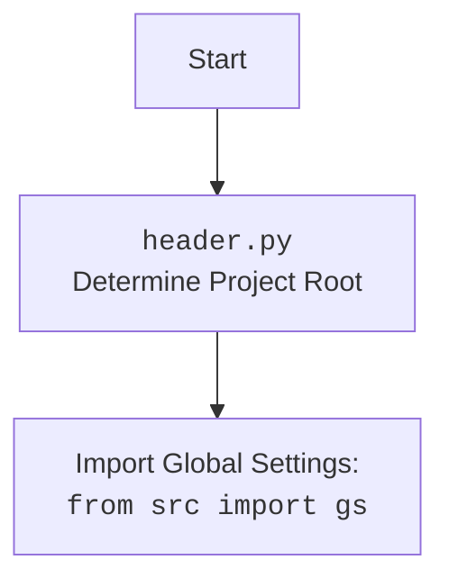

### **Системные инструкции для обработки кода проекта `hypotez`**

=========================================================================================

Описание функциональности и правил для генерации, анализа и улучшения кода. Направлено на обеспечение последовательного и читаемого стиля кодирования, соответствующего требованиям.

---

### **Основные принципы**

#### **1. Общие указания**:
- Соблюдай четкий и понятный стиль кодирования.
- Все изменения должны быть обоснованы и соответствовать установленным требованиям.

#### **2. Комментарии**:
- Используй `#` для внутренних комментариев.
- Документация всех функций, методов и классов должна следовать такому формату: 
    ```python
        def function(param: str, param1: Optional[str | dict | str] = None) -> dict | None:
            """ 
            Args:
                param (str): Описание параметра `param`.
                param1 (Optional[str | dict | str], optional): Описание параметра `param1`. По умолчанию `None`.
    
            Returns:
                dict | None: Описание возвращаемого значения. Возвращает словарь или `None`.
    
            Raises:
                SomeError: Описание ситуации, в которой возникает исключение `SomeError`.

            Ехаmple:
                >>> function('param', 'param1')
                {'param': 'param1'}
            """
    ```
- Комментарии и документация должны быть четкими, лаконичными и точными.

#### **3. Форматирование кода**:
- Используй одинарные кавычки. `a:str = 'value'`, `print('Hello World!')`;
- Добавляй пробелы вокруг операторов. Например, `x = 5`;
- Все параметры должны быть аннотированы типами. `def function(param: str, param1: Optional[str | dict | str] = None) -> dict | None:`;
- Не используй `Union`. Вместо этого используй `|`.

#### **4. Логирование**:
- Для логгирования Всегда Используй модуль `logger` из `src.logger.logger`.
- Ошибки должны логироваться с использованием `logger.error`.
Пример:
    ```python
        try:
            ...
        except Exception as ex:
            logger.error('Error while processing data', ех, exc_info=True)
    ```
#### **5 Не используй `Union[]` в коде. Вместо него используй `|`
Например:
```python
x: str | int ...
```


---

### **Основные требования**:

#### **1. Формат ответов в Markdown**:
- Все ответы должны быть выполнены в формате **Markdown**.

#### **2. Формат комментариев**:
- Используй указанный стиль для комментариев и документации в коде.
- Пример:

```python
from typing import Generator, Optional, List
from pathlib import Path


def read_text_file(
    file_path: str | Path,
    as_list: bool = False,
    extensions: Optional[List[str]] = None,
    chunk_size: int = 8192,
) -> Generator[str, None, None] | str | None:
    """
    Считывает содержимое файла (или файлов из каталога) с использованием генератора для экономии памяти.

    Args:
        file_path (str | Path): Путь к файлу или каталогу.
        as_list (bool): Если `True`, возвращает генератор строк.
        extensions (Optional[List[str]]): Список расширений файлов для чтения из каталога.
        chunk_size (int): Размер чанков для чтения файла в байтах.

    Returns:
        Generator[str, None, None] | str | None: Генератор строк, объединенная строка или `None` в случае ошибки.

    Raises:
        Exception: Если возникает ошибка при чтении файла.

    Example:
        >>> from pathlib import Path
        >>> file_path = Path('example.txt')
        >>> content = read_text_file(file_path)
        >>> if content:
        ...    print(f'File content: {content[:100]}...')
        File content: Example text...
    """
    ...
```
- Всегда делай подробные объяснения в комментариях. Избегай расплывчатых терминов, 
- таких как *«получить»* или *«делать»*. Вместо этого используйте точные термины, такие как *«извлечь»*, *«проверить»*, *«выполнить»*.
- Вместо: *«получаем»*, *«возвращаем»*, *«преобразовываем»* используй имя объекта *«функция получае»*, *«переменная возвращает»*, *«код преобразовывает»* 
- Комментарии должны непосредственно предшествовать описываемому блоку кода и объяснять его назначение.

#### **3. Пробелы вокруг операторов присваивания**:
- Всегда добавляйте пробелы вокруг оператора `=`, чтобы повысить читаемость.
- Примеры:
  - **Неправильно**: `x=5`
  - **Правильно**: `x = 5`

#### **4. Использование `j_loads` или `j_loads_ns`**:
- Для чтения JSON или конфигурационных файлов замените стандартное использование `open` и `json.load` на `j_loads` или `j_loads_ns`.
- Пример:

```python
# Неправильно:
with open('config.json', 'r', encoding='utf-8') as f:
    data = json.load(f)

# Правильно:
data = j_loads('config.json')
```

#### **5. Сохранение комментариев**:
- Все существующие комментарии, начинающиеся с `#`, должны быть сохранены без изменений в разделе «Улучшенный код».
- Если комментарий кажется устаревшим или неясным, не изменяйте его. Вместо этого отметьте его в разделе «Изменения».

#### **6. Обработка `...` в коде**:
- Оставляйте `...` как указатели в коде без изменений.
- Не документируйте строки с `...`.
```

#### **7. Аннотации**
Для всех переменных должны быть определены аннотации типа. 
Для всех функций все входные и выходные параметры аннотириваны
Для все параметров должны быть аннотации типа.


### **8. webdriver**
В коде используется webdriver. Он импртируется из модуля `webdriver` проекта `hypotez`
```python
from src.webdirver import Driver, Chrome, Firefox, Playwright, ...
driver = Driver(Firefox)

Пoсле чего может использоваться как

close_banner = {
  "attribute": null,
  "by": "XPATH",
  "selector": "//button[@id = 'closeXButton']",
  "if_list": "first",
  "use_mouse": false,
  "mandatory": false,
  "timeout": 0,
  "timeout_for_event": "presence_of_element_located",
  "event": "click()",
  "locator_description": "Закрываю pop-up окно, если оно не появилось - не страшно (`mandatory`:`false`)"
}

result = driver.execute_locator(close_banner)
```

## Анализ кода `hypotez/src/utils/convertors/any.py`

### 1. Блок-схема

```mermaid
graph TD
    A[Начало - any2dict(any_data)] --> B{Является ли any_data базовым типом (list, tuple, int, float, str, bool, None, set)?};
    B -- Да --> C{Какой тип данных?};
    C -- int/float/str/bool/None --> D[Возврат any_data];
    C -- list/tuple --> E[Создание пустого списка result_list];
    E --> F{Перебор элементов в any_data};
    F -- Для каждого item --> G[Вызов any2dict(item)];
    G --> H{Возвращает ли any2dict(item) False?};
    H -- Да --> I[Добавление '' в result_list];
    H -- Нет --> J[Добавление converted_item в result_list];
    J --> F;
    I --> F;
    F -- Все элементы обработаны --> K[Возврат result_list];
    C -- set --> L[Создание пустого списка result_set];
    L --> M{Перебор элементов в any_data};
    M -- Для каждого item --> N[Вызов any2dict(item)];
    N --> O{Возвращает ли any2dict(item) False?};
    O -- Да --> P[Добавление '' в result_set];
    O -- Нет --> Q[Добавление converted_item в result_set];
    Q --> M;
    P --> M;
    M -- Все элементы обработаны --> R[Возврат result_set];
    B -- Нет --> S[Создание пустого словаря result_dict];
    S --> T{Имеет ли any_data атрибут __dict__ или это словарь?};
    T -- Да --> U[Получение items_dict из __dict__ или напрямую из словаря];
    T -- Нет --> VA[Возврат False];
    U --> V{items_dict не пустой?};
    V -- Нет --> VA[Возврат False];
    V -- Да --> W{Перебор пар ключ-значение в items_dict};
    W -- Для каждой пары key, value --> X[Вызов any2dict(key)];
    X --> Y[Вызов any2dict(value)];
    Y --> Z{Возвращает ли converted_key False?};
    Z -- Нет --> AA[Присвоение result_dict[converted_key] = converted_value или ''];
    Z -- Да --> W;
    AA --> W;
    W -- Все пары обработаны --> BB[Возврат result_dict];
    D --> End[Конец];
    K --> End;
    R --> End;
    BB --> End;
    VA --> End;
```

### 2. Диаграмма

```mermaid
flowchart TD
    A[any2dict(any_data)] --> B{isinstance(any_data, (set, list, int, float, str, bool, type(None)))};
    B -- True --> C{isinstance(any_data, (int, float, str, bool, type(None)))};
    C -- True --> D[return any_data];
    C -- False --> E{isinstance(any_data, (list, tuple))};
    E -- True --> F[process list/tuple];
    E -- False --> G{isinstance(any_data, set)};
    G -- True --> H[process set];
    G -- False --> I[return False];
    B -- False --> J{hasattr(any_data, '__dict__') or isinstance(any_data, dict)};
    J -- True --> K[items_dict = any_data.__dict__ or any_data];
    J -- False --> L[return False];
    K --> M{items_dict is not None};
    M -- True --> N[process items_dict];
    M -- False --> L;
    N --> O[return result_dict];
    F --> P[return result_list];
    H --> Q[return result_set];
    D --> R[End];
    I --> R;
    L --> R;
    O --> R;
    P --> R;
    Q --> R;
```

Диаграмма описывает работу функции `any2dict`.

-   **A[any2dict(any_data)]**: Начало функции, принимающей `any_data` в качестве аргумента.
-   **B{isinstance(any_data, (set, list, int, float, str, bool, type(None)))}**: Проверка, является ли входной аргумент базовым типом данных (set, list, int, float, str, bool, None).
-   **C{isinstance(any_data, (int, float, str, bool, type(None)))}**: Проверка, является ли входной аргумент одним из простых типов (int, float, str, bool, None).
-   **D[return any_data]**: Если `any_data` является простым типом, возвращается его значение.
-   **E{isinstance(any_data, (list, tuple))}**: Проверка, является ли `any_data` списком или кортежем.
-   **F[process list/tuple]**: Если `any_data` является списком или кортежем, происходит рекурсивная обработка каждого элемента.
-   **G{isinstance(any_data, set)}**: Проверка, является ли `any_data` множеством.
-   **H[process set]**: Если `any_data` является множеством, происходит рекурсивная обработка каждого элемента.
-   **I[return False]**: Если тип `any_data` не поддерживается, возвращается `False`.
-   **J{hasattr(any_data, '__dict__') or isinstance(any_data, dict)}**: Проверка, имеет ли `any_data` атрибут `__dict__` (является объектом) или является ли он словарем.
-   **K[items_dict = any_data.__dict__ or any_data]**: Если `any_data` имеет атрибут `__dict__` или является словарем, `items_dict` присваивается значение `any_data.__dict__` или `any_data` соответственно.
-   **L[return False]**: Если `any_data` не имеет атрибут `__dict__` и не является словарем, возвращается `False`.
-   **M{items_dict is not None}**: Проверка, что items_dict не равен None
-   **N[process items_dict]**: Обработка словаря `items_dict` путем итерации по его элементам и рекурсивного вызова `any2dict` для каждого значения.
-   **O[return result_dict]**: Возвращается полученный словарь.
-   **P[return result_list]**: Возвращается полученный список.
-   **Q[return result_set]**: Возвращается полученное множество.
-   **R[End]**: Конец функции.



### 3. Объяснение

#### Импорты:

-   `from typing import Any`: Импортирует тип `Any` из модуля `typing`. `Any` используется для обозначения того, что переменная может быть любого типа. В данном коде используется в аннотации типа аргумента функции `any2dict`.
-   `import header`: Импортирует модуль `header`. Этот модуль, вероятно, содержит общие настройки или функции, используемые в проекте.
-   `from src.logger import logger`: Импортирует объект `logger` из модуля `src.logger`. Используется для логирования информации, ошибок и предупреждений в приложении.

#### Функция `any2dict`:

-   **Аргументы**:
    -   `any_data: Any`: Входные данные любого типа.
-   **Возвращаемое значение**:
    -   `dict | list | Any | False`: Функция пытается преобразовать входные данные в словарь. Если преобразование успешно, возвращается словарь или список. Если входные данные являются базовым типом (int, float, str, bool, None), то они возвращаются как есть. В случае неудачи преобразования возвращается `False`.
-   **Назначение**:
    -   Функция `any2dict` рекурсивно преобразует данные любого типа в словарь. Она обрабатывает словари, списки, кортежи, множества и объекты, преобразуя их вложенные структуры в словари и списки.
-   **Примеры**:
    ```python
    data1 = {
        "name": "John",
        "age": 30,
        "address": {
            "city": "New York",
            "street": "Main St"
        },
        "phones": ["123-456-7890", "987-654-3210"],
        "skills": {"python", "java", "c++"}
    }
    print(any2dict(data1))
    # Вывод: {'name': 'John', 'age': 30, 'address': {'city': 'New York', 'street': 'Main St'}, 'phones': ['123-456-7890', '987-654-3210'], 'skills': ['python', 'java', 'c++']}

    data2 = [1, 2, "three", {"key": "value"}]
    print(any2dict(data2))
    # Вывод: [1, 2, 'three', {'key': 'value'}]
    ```
-   **Логика работы**:
    1.  Проверяется, является ли входной параметр `any_data` экземпляром одного из базовых типов (list, tuple, int, float, str, bool, type(None), set).
    2.  Если `any_data` является экземпляром `int`, `float`, `str`, `bool` или `None`, функция возвращает `any_data` без изменений.
    3.  Если `any_data` является экземпляром `list` или `tuple`, функция создает новый список и рекурсивно вызывает `any2dict` для каждого элемента `any_data`, добавляя результат в новый список.
    4.  Если `any_data` является экземпляром `set`, функция выполняет аналогичные действия, что и для `list` или `tuple`, но с созданием списка `result_set`.
    5.  Если `any_data` не является экземпляром ни одного из перечисленных типов, функция пытается преобразовать его в словарь. Если у `any_data` есть атрибут `__dict__` или он является словарем, его элементы перебираются, и для каждой пары ключ-значение рекурсивно вызывается `any2dict`. Результаты сохраняются в словаре `result_dict`.
    6.  Если преобразование в словарь невозможно или происходит ошибка, функция возвращает `False`.

#### Переменные:

-   `any_data`: Входные данные любого типа, которые нужно преобразовать в словарь.
-   `result_dict`: Словарь, в который сохраняются преобразованные данные.
-   `items_dict`: Словарь, полученный из атрибута `__dict__` объекта или непосредственно из словаря.
-   `key`, `value`: Ключ и значение в словаре `items_dict`.
-   `converted_key`, `converted_value`: Преобразованные ключ и значение после рекурсивного вызова `any2dict`.
-   `result_list`: Список, в который сохраняются преобразованные элементы списка или кортежа.
-   `result_set`: Список, в который сохраняются преобразованные элементы множества.
-   `item`: Элемент списка, кортежа или множества.
-   `converted_item`: Преобразованный элемент после рекурсивного вызова `any2dict`.

#### Потенциальные ошибки и области для улучшения:

1.  **Обработка ошибок**: В текущей реализации функции `any2dict` используется общий блок `except Exception`. Желательно конкретизировать тип исключения для более точной обработки ошибок. Также, ошибки не логируются. Рекомендуется логировать ошибки с использованием `logger.error`.
2.  **Возврат пустых значений**: Сейчас пустые значения (например, пустые строки) могут быть опущены. Нужно убедиться, что логика обработки пустых значений соответствует требованиям.
3.  **Поддержка других типов данных**: Функция поддерживает основные типы данных, но может потребоваться поддержка других специфичных типов данных, используемых в проекте.
4.  **Аннотации типов**: Отсутствуют аннотации типов для локальных переменных. Добавление аннотаций может улучшить читаемость и поддерживаемость кода.

#### Связи с другими частями проекта:

-   `header`: Модуль `header`, вероятно, используется для общих настроек и инициализации проекта. Функция `any2dict` может использовать эти настройки для определения логики преобразования данных.
-   `src.logger.logger`: Модуль логирования используется для записи информации о работе функции, что полезно для отладки и мониторинга.

Пример использования логирования:

```python
from typing import Any
import header
from src.logger import logger

def any2dict(any_data: Any) -> dict | list | Any | bool:
    """
    Рекурсивно преобразует любой тип данных в словарь.
    
    Args:
        any_data (Any): Любой тип данных.
    
    Returns:
        dict | list | Any | bool: Словарь, представляющий входные данные, или False, если преобразование невозможно.
    """
    if not isinstance(any_data, (set, list, int, float, str, bool, type(None))):
        result_dict = {}

        items_dict = None
        if hasattr(any_data, '__dict__'):
             items_dict = any_data.__dict__
        elif isinstance(any_data, dict):
             items_dict = any_data
        
        if not items_dict:
             return False
        try:
            for key, value in items_dict.items():
                converted_key = any2dict(key)
                converted_value = any2dict(value)
                if converted_key: # чтобы пустые значения тоже писало, надо проверять на то, что не False
                    result_dict[converted_key] = converted_value or ''

            return result_dict

        except Exception as ex: # добавил ex и логгирование
            logger.error(f'Error while converting to dict: {ex}', exc_info=True)
            return False

    elif isinstance(any_data, (list, tuple)):
        result_list = []
        for item in any_data:
            converted_item = any2dict(item)
            if converted_item is False:
                result_list.append('') # Пустая строка
            else:
                result_list.append(converted_item)
        return result_list

    elif isinstance(any_data, set):
        result_set = []
        for item in any_data:
            converted_item = any2dict(item)
            if converted_item is False:
                result_set.append('')
            else:
                result_set.append(converted_item)
        return result_set

    elif isinstance(any_data, (int, float, str, bool, type(None))):
        return any_data  # Базовые типы данных возвращаем как есть
    else:
      return False  # Неподдерживаемый тип данных.