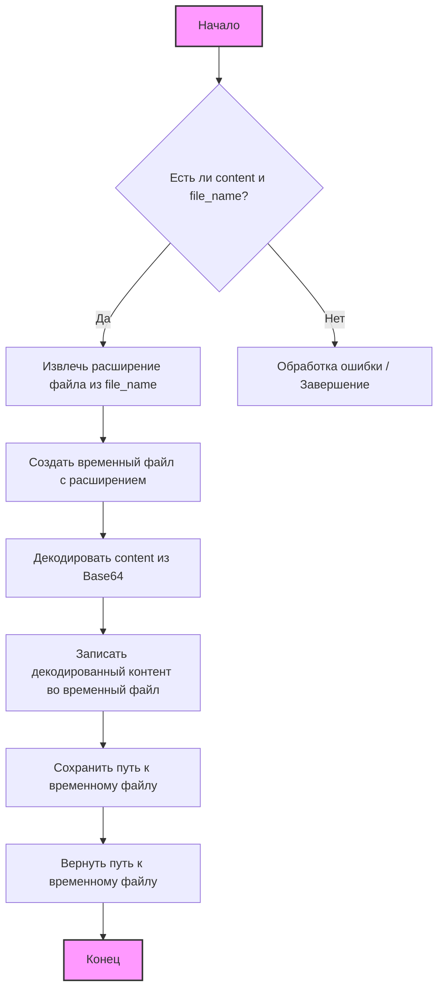
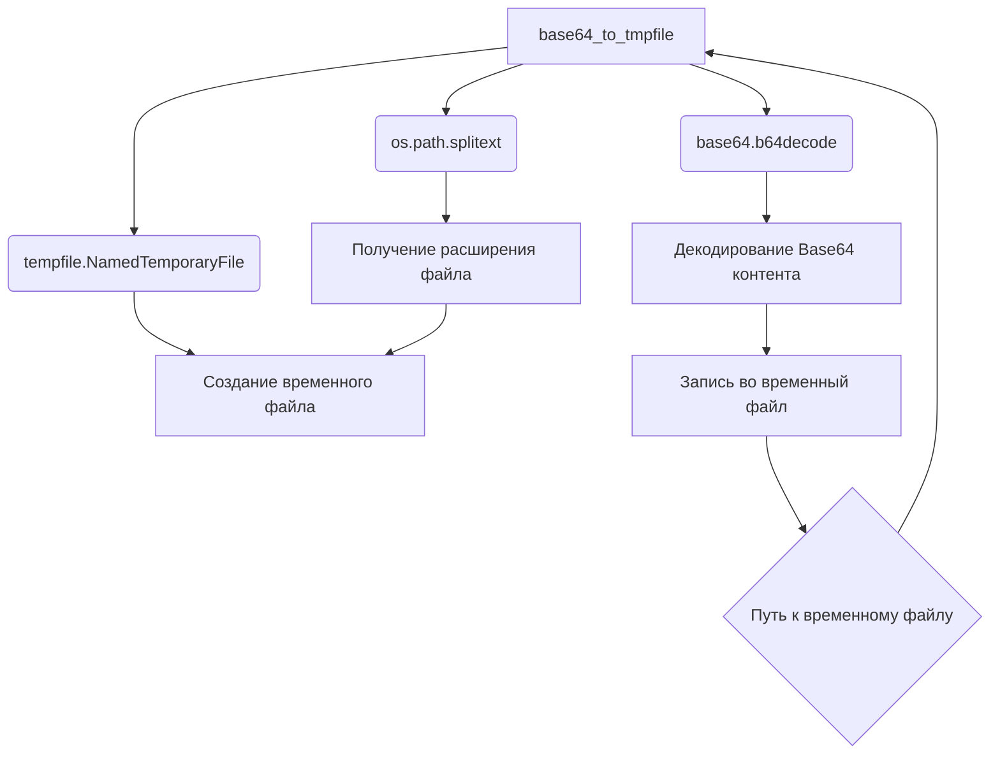

### **Системные инструкции для обработки кода проекта `hypotez`**

=========================================================================================

Описание функциональности и правил для генерации, анализа и улучшения кода. Направлено на обеспечение последовательного и читаемого стиля кодирования, соответствующего требованиям.

---

### **Основные принципы**

#### **1. Общие указания**:
- Соблюдай четкий и понятный стиль кодирования.
- Все изменения должны быть обоснованы и соответствовать установленным требованиям.

#### **2. Комментарии**:
- Используй `#` для внутренних комментариев.
- Документация всех функций, методов и классов должна следовать такому формату: 
    ```python
        def function(param: str, param1: Optional[str | dict | str] = None) -> dict | None:
            """ 
            Args:
                param (str): Описание параметра `param`.
                param1 (Optional[str | dict | str], optional): Описание параметра `param1`. По умолчанию `None`.
    
            Returns:
                dict | None: Описание возвращаемого значения. Возвращает словарь или `None`.
    
            Raises:
                SomeError: Описание ситуации, в которой возникает исключение `SomeError`.

            Ехаmple:
                >>> function('param', 'param1')
                {'param': 'param1'}
            """
    ```
- Комментарии и документация должны быть четкими, лаконичными и точными.

#### **3. Форматирование кода**:
- Используй одинарные кавычки. `a:str = 'value'`, `print('Hello World!')`;
- Добавляй пробелы вокруг операторов. Например, `x = 5`;
- Все параметры должны быть аннотированы типами. `def function(param: str, param1: Optional[str | dict | str] = None) -> dict | None:`;
- Не используй `Union`. Вместо этого используй `|`.

#### **4. Логирование**:
- Для логгирования Всегда Используй модуль `logger` из `src.logger.logger`.
- Ошибки должны логироваться с использованием `logger.error`.
Пример:
    ```python
        try:
            ...
        except Exception as ex:
            logger.error('Error while processing data', ех, exc_info=True)
    ```
#### **5 Не используй `Union[]` в коде. Вместо него используй `|`
Например:
```python
x: str | int ...
```


---

### **Основные требования**:

#### **1. Формат ответов в Markdown**:
- Все ответы должны быть выполнены в формате **Markdown**.

#### **2. Формат комментариев**:
- Используй указанный стиль для комментариев и документации в коде.
- Пример:

```python
from typing import Generator, Optional, List
from pathlib import Path


def read_text_file(
    file_path: str | Path,
    as_list: bool = False,
    extensions: Optional[List[str]] = None,
    chunk_size: int = 8192,
) -> Generator[str, None, None] | str | None:
    """
    Считывает содержимое файла (или файлов из каталога) с использованием генератора для экономии памяти.

    Args:
        file_path (str | Path): Путь к файлу или каталогу.
        as_list (bool): Если `True`, возвращает генератор строк.
        extensions (Optional[List[str]]): Список расширений файлов для чтения из каталога.
        chunk_size (int): Размер чанков для чтения файла в байтах.

    Returns:
        Generator[str, None, None] | str | None: Генератор строк, объединенная строка или `None` в случае ошибки.

    Raises:
        Exception: Если возникает ошибка при чтении файла.

    Example:
        >>> from pathlib import Path
        >>> file_path = Path('example.txt')
        >>> content = read_text_file(file_path)
        >>> if content:
        ...    print(f'File content: {content[:100]}...')
        File content: Example text...
    """
    ...
```
- Всегда делай подробные объяснения в комментариях. Избегай расплывчатых терминов, 
- таких как *«получить»* или *«делать»*
-  . Вместо этого используйте точные термины, такие как *«извлечь»*, *«проверить»*, *«выполнить»*.
- Вместо: *«получаем»*, *«возвращаем»*, *«преобразовываем»* используй имя объекта *«функция получае»*, *«переменная возвращает»*, *«код преобразовывает»* 
- Комментарии должны непосредственно предшествовать описываемому блоку кода и объяснять его назначение.

#### **3. Пробелы вокруг операторов присваивания**:
- Всегда добавляйте пробелы вокруг оператора `=`, чтобы повысить читаемость.
- Примеры:
  - **Неправильно**: `x=5`
  - **Правильно**: `x = 5`

#### **4. Использование `j_loads` или `j_loads_ns`**:
- Для чтения JSON или конфигурационных файлов замените стандартное использование `open` и `json.load` на `j_loads` или `j_loads_ns`.
- Пример:

```python
# Неправильно:
with open('config.json', 'r', encoding='utf-8') as f:
    data = json.load(f)

# Правильно:
data = j_loads('config.json')
```

#### **5. Сохранение комментариев**:
- Все существующие комментарии, начинающиеся с `#`, должны быть сохранены без изменений в разделе «Улучшенный код».
- Если комментарий кажется устаревшим или неясным, не изменяйте его. Вместо этого отметьте его в разделе «Изменения».

#### **6. Обработка `...` в коде**:
- Оставляйте `...` как указатели в коде без изменений.
- Не документируйте строки с `...`.
```

#### **7. Аннотации**
Для всех переменных должны быть определены аннотации типа. 
Для всех функций все входные и выходные параметры аннотириваны
Для все параметров должны быть аннотации типа.


### **8. webdriver**
В коде используется webdriver. Он импртируется из модуля `webdriver` проекта `hypotez`
```python
from src.webdirver import Driver, Chrome, Firefox, Playwright, ...
driver = Driver(Firefox)

Пoсле чего может использоваться как

close_banner = {
  "attribute": null,
  "by": "XPATH",
  "selector": "//button[@id = 'closeXButton']",
  "if_list": "first",
  "use_mouse": false,
  "mandatory": false,
  "timeout": 0,
  "timeout_for_event": "presence_of_element_located",
  "event": "click()",
  "locator_description": "Закрываю pop-up окно, если оно не появилось - не страшно (`mandatory`:`false`)"
}

result = driver.execute_locator(close_banner)
```

### Анализ кода модуля `src.utils.convertors.base64.py`

#### 1. Блок-схема:



**Примеры для каждого логического блока:**

-   **A (Начало)**: Начало выполнения функции `base64_to_tmpfile`.
-   **B (Есть ли content и file_name?)**: Проверка наличия входных аргументов. Пример: `content="SGVsbG8gd29ybGQh"`, `file_name="example.txt"`.
-   **C (Извлечь расширение файла из file_name)**: Получение расширения ".txt" из "example.txt".
-   **D (Создать временный файл с расширением)**: Создание файла `/tmp/tmpfile.txt`.
-   **E (Декодировать content из Base64)**: Преобразование "SGVsbG8gd29ybGQh" в "Hello world!".
-   **F (Записать декодированный контент во временный файл)**: Запись строки "Hello world!" во временный файл.
-   **G (Сохранить путь к временному файлу)**: Сохранение пути `/tmp/tmpfile.txt`.
-   **H (Вернуть путь к временному файлу)**: Возврат значения `/tmp/tmpfile.txt`.
-   **I (Обработка ошибки / Завершение)**: Если `content` или `file_name` отсутствуют, то завершается с ошибкой.
-   **J (Конец)**: Завершение выполнения функции.

#### 2. Диаграмма:



**Объяснение зависимостей:**

-   `base64`: Этот модуль используется для кодирования и декодирования данных в формате Base64. В данном коде применяется функция `b64decode` для декодирования Base64-encoded контента.
-   `tempfile`: Этот модуль используется для создания временных файлов и директорий. Функция `NamedTemporaryFile` создаёт временный файл с указанным расширением.
-   `os`: Этот модуль предоставляет функции для взаимодействия с операционной системой, такие как работа с путями к файлам. Здесь используется `os.path.splitext` для извлечения расширения из имени файла.

#### 3. Объяснение:

**Импорты:**

-   `base64`: Используется для декодирования содержимого, закодированного в Base64. Функция `base64.b64decode(content)` декодирует входную строку `content`.
-   `tempfile`: Используется для создания временных файлов. `tempfile.NamedTemporaryFile(delete=False, suffix=ext)` создаёт временный файл, который не удаляется после закрытия, с расширением, полученным из имени файла.
-   `os`: Используется для работы с путями к файлам. Функция `os.path.splitext(file_name)` разделяет имя файла и его расширение.

**Функции:**

-   `base64_to_tmpfile(content: str, file_name: str) -> str`:
    -   Аргументы:
        -   `content` (str): Строка, содержащая данные, закодированные в Base64.
        -   `file_name` (str): Имя файла, используемое для получения расширения временного файла.
    -   Возвращаемое значение:
        -   `str`: Путь к созданному временному файлу.
    -   Назначение:
        1.  Извлекает расширение файла из `file_name` с использованием `os.path.splitext(file_name)`.
        2.  Создаёт временный файл с использованием `tempfile.NamedTemporaryFile(delete=False, suffix=ext)`. Параметр `delete=False` гарантирует, что файл не будет удалён автоматически при закрытии.
        3.  Декодирует содержимое `content` из Base64 с использованием `base64.b64decode(content)`.
        4.  Записывает декодированное содержимое во временный файл.
        5.  Возвращает путь к созданному временному файлу.

-   `base64encode(image_path)`:
    -   Аргументы:
        -   `image_path` (str): Путь к файлу изображения.
    -   Возвращаемое значение:
        -   `str`: Строка, представляющая изображение, закодированное в Base64.
    -   Назначение:
        1.  Открывает файл изображения в двоичном режиме (`"rb"`).
        2.  Считывает содержимое файла.
        3.  Кодирует содержимое в Base64 с использованием `base64.b64encode()`.
        4.  Декодирует результат в строку UTF-8 с использованием `.decode('utf-8')`.

**Переменные:**

-   `content`: Строка с содержимым в формате Base64, которая будет декодирована и записана во временный файл.
-   `file_name`: Имя файла, используемое для определения расширения временного файла.
-   `ext`: Расширение файла, извлечённое из `file_name`.
-   `tmp`: Объект временного файла, созданный с помощью `tempfile.NamedTemporaryFile`.
-   `path`: Путь к созданному временному файлу.
-   `image_path`: Путь к файлу изображения, которое нужно закодировать в Base64.
-   `image_file`: Объект файла, представляющий открытый файл изображения.

**Потенциальные ошибки и области для улучшения:**

1.  **Обработка ошибок**:
    -   В функции `base64_to_tmpfile` не предусмотрена обработка исключений. Следует добавить блоки `try...except` для обработки возможных ошибок, таких как `base64.binascii.Error` (если `content` не является валидной строкой Base64) или `IOError` (если не удаётся создать временный файл).
    -   В функции `base64encode` также не предусмотрена обработка исключений. Следует добавить `try...except` для обработки `FileNotFoundError` (если файл не найден) и `IOError` (если не удаётся прочитать файл).
2.  **Удаление временных файлов**:
    -   В функции `base64_to_tmpfile` временный файл создаётся с параметром `delete=False`, что означает, что файл не будет автоматически удалён после использования. Необходимо предусмотреть механизм для удаления временных файлов, чтобы избежать засорения диска. Это можно сделать, например, с помощью `os.remove(path)` после завершения работы с файлом, либо использовать контекстный менеджер `tempfile.NamedTemporaryFile` без `delete=False` и перемещать файл в нужное место после записи.
3.  **Явное указание кодировки при открытии файла**:
    -   В функции `base64encode` не указана кодировка при открытии файла. Рекомендуется явно указывать кодировку, например, `open(image_path, "rb")`.

**Цепочка взаимосвязей с другими частями проекта:**

-   Этот модуль (`src.utils.convertors.base64`) может использоваться другими частями проекта для обработки данных, закодированных в Base64, например, для сохранения изображений или других файлов, полученных из внешних источников. Например, его можно использовать в модулях, обрабатывающих API-ответы или веб-страницы, где данные могут быть представлены в формате Base64.

```python
import base64
import tempfile
import os
from typing import Optional

def base64_to_tmpfile(content: str, file_name: str) -> Optional[str]:
    """
    Convert Base64 encoded content to a temporary file.

    This function decodes the Base64 encoded content and writes it to a temporary file with the same extension as the provided file name.
    The path to the temporary file is returned.

    Args:
        content (str): Base64 encoded content to be decoded and written to the file.
        file_name (str): Name of the file used to extract the file extension for the temporary file.

    Returns:
        str: Path to the temporary file or None if an error occurred.

    Example:
        >>> base64_content = "SGVsbG8gd29ybGQh"  # Base64 encoded content "Hello world!"
        >>> file_name = "example.txt"
        >>> tmp_file_path = base64_to_tmpfile(base64_content, file_name)
        >>> if tmp_file_path:
        ...     print(f"Temporary file created at: {tmp_file_path}")
        Temporary file created at: /tmp/tmpfile.txt
    """
    try:
        _, ext = os.path.splitext(file_name)
        with tempfile.NamedTemporaryFile(delete=False, suffix=ext) as tmp:
            tmp.write(base64.b64decode(content))
            return tmp.name
    except (base64.binascii.Error, IOError) as e:
        print(f"Error creating temporary file: {e}")  # Логирование надо заменить на logger.error
        return None


def base64encode(image_path: str) -> Optional[str]:
    """
    Encode the image to Base64.
    Args:
        image_path (str): Path to the image file.

    Returns:
        str: base64 encoded string or None if an error occurred.
    """
    try:
        with open(image_path, "rb") as image_file:
            return base64.b64encode(image_file.read()).decode('utf-8')
    except FileNotFoundError:
        print(f"Error: File not found at {image_path}")  # Логирование надо заменить на logger.error
        return None
    except IOError as e:
        print(f"Error reading file: {e}")  # Логирование надо заменить на logger.error
        return None