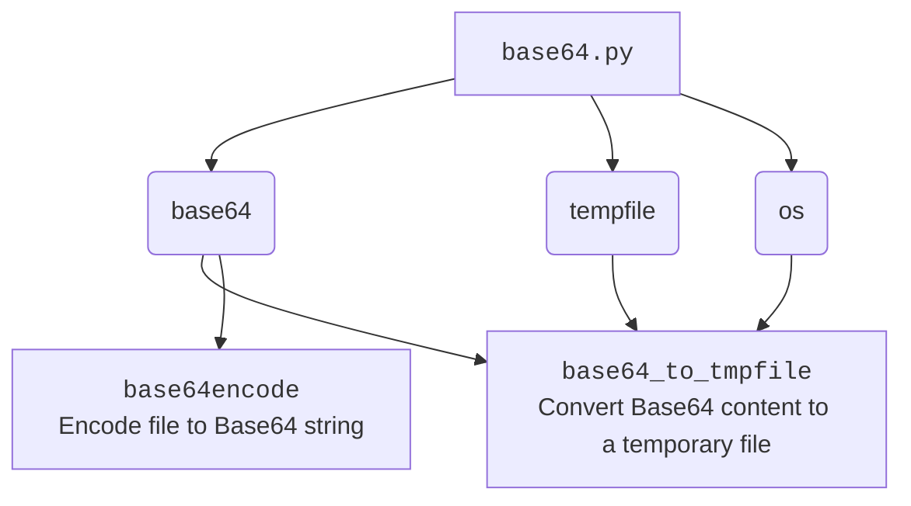

### **Системные инструкции для обработки кода проекта `hypotez`**

=========================================================================================

Описание функциональности и правил для генерации, анализа и улучшения кода. Направлено на обеспечение последовательного и читаемого стиля кодирования, соответствующего требованиям.

---

### **Основные принципы**

#### **1. Общие указания**:
- Соблюдай четкий и понятный стиль кодирования.
- Все изменения должны быть обоснованы и соответствовать установленным требованиям.

#### **2. Комментарии**:
- Используй `#` для внутренних комментариев.
- Документация всех функций, методов и классов должна следовать такому формату: 
    ```python
        def function(param: str, param1: Optional[str | dict | str] = None) -> dict | None:
            """ 
            Args:
                param (str): Описание параметра `param`.
                param1 (Optional[str | dict | str], optional): Описание параметра `param1`. По умолчанию `None`.
    
            Returns:
                dict | None: Описание возващаемого значения. Возвращает словарь или `None`.
    
            Raises:
                SomeError: Описание ситуации, в которой возникает исключение `SomeError`.

            Ехаmple:
                >>> function('param', 'param1')
                {'param': 'param1'}
            """
    ```
- Комментарии и документация должны быть четкими, лаконичными и точными.

#### **3. Форматирование кода**:
- Используй одинарные кавычки. `a:str = 'value'`, `print('Hello World!')`;
- Добавляй пробелы вокруг операторов. Например, `x = 5`;
- Все параметры должны быть аннотированы типами. `def function(param: str, param1: Optional[str | dict | str] = None) -> dict | None:`;
- Не используй `Union`. Вместо этого используй `|`.

#### **4. Логирование**:
- Для логгирования Всегда Используй модуль `logger` из `src.logger.logger`.
- Ошибки должны логироваться с использованием `logger.error`.
Пример:
    ```python
        try:
            ...
        except Exception as ex:
            logger.error('Error while processing data', ех, exc_info=True)
    ```
#### **5 Не используй `Union[]` в коде. Вместо него используй `|`
Например:
```python
x: str | int ...
```


---

### **Основные требования**:

#### **1. Формат ответов в Markdown**:
- Все ответы должны быть выполнены в формате **Markdown**.

#### **2. Формат комментариев**:
- Используй указанный стиль для комментариев и документации в коде.
- Пример:

```python
from typing import Generator, Optional, List
from pathlib import Path


def read_text_file(
    file_path: str | Path,
    as_list: bool = False,
    extensions: Optional[List[str]] = None,
    chunk_size: int = 8192,
) -> Generator[str, None, None] | str | None:
    """
    Считывает содержимое файла (или файлов из каталога) с использованием генератора для экономии памяти.

    Args:
        file_path (str | Path): Путь к файлу или каталогу.
        as_list (bool): Если `True`, возвращает генератор строк.
        extensions (Optional[List[str]]): Список расширений файлов для чтения из каталога.
        chunk_size (int): Размер чанков для чтения файла в байтах.

    Returns:
        Generator[str, None, None] | str | None: Генератор строк, объединенная строка или `None` в случае ошибки.

    Raises:
        Exception: Если возникает ошибка при чтении файла.

    Example:
        >>> from pathlib import Path
        >>> file_path = Path('example.txt')
        >>> content = read_text_file(file_path)
        >>> if content:
        ...    print(f'File content: {content[:100]}...')
        File content: Example text...
    """
    ...
```
- Всегда делай подробные объяснения в комментариях. Избегай расплывчатых терминов, 
- таких как *«получить»* или *«делать»*
-  . Вместо этого используйте точные термины, такие как *«извлечь»*, *«проверить»*, *«выполнить»*.
- Вместо: *«получаем»*, *«возвращаем»*, *«преобразовываем»* используй имя объекта *«функция получае»*, *«переменная возвращает»*, *«код преобразовывает»* 
- Комментарии должны непосредственно предшествовать описываемому блоку кода и объяснять его назначение.

#### **3. Пробелы вокруг операторов присваивания**:
- Всегда добавляйте пробелы вокруг оператора `=`, чтобы повысить читаемость.
- Примеры:
  - **Неправильно**: `x=5`
  - **Правильно**: `x = 5`

#### **4. Использование `j_loads` или `j_loads_ns`**:
- Для чтения JSON или конфигурационных файлов замените стандартное использование `open` и `json.load` на `j_loads` или `j_loads_ns`.
- Пример:

```python
# Неправильно:
with open('config.json', 'r', encoding='utf-8') as f:
    data = json.load(f)

# Правильно:
data = j_loads('config.json')
```

#### **5. Сохранение комментариев**:
- Все существующие комментарии, начинающиеся с `#`, должны быть сохранены без изменений в разделе «Улучшенный код».
- Если комментарий кажется устаревшим или неясным, не изменяйте его. Вместо этого отметьте его в разделе «Изменения».

#### **6. Обработка `...` в коде**:
- Оставляйте `...` как указатели в коде без изменений.
- Не документируйте строки с `...`.
```

#### **7. Аннотации**
Для всех переменных должны быть определены аннотации типа. 
Для всех функций все входные и выходные параметры аннотириваны
Для все параметров должны быть аннотации типа.


### **8. webdriver**
В коде используется webdriver. Он импртируется из модуля `webdriver` проекта `hypotez`
```python
from src.webdirver import Driver, Chrome, Firefox, Playwright, ...
driver = Driver(Firefox)

Пoсле чего может использоваться как

close_banner = {
  "attribute": null,
  "by": "XPATH",
  "selector": "//button[@id = 'closeXButton']",
  "if_list": "first",
  "use_mouse": false,
  "mandatory": false,
  "timeout": 0,
  "timeout_for_event": "presence_of_element_located",
  "event": "click()",
  "locator_description": "Закрываю pop-up окно, если оно не появилось - не страшно (`mandatory`:`false`)"
}

result = driver.execute_locator(close_banner)
```

## Анализ кода `hypotez/src/utils/convertors/base64.py`

### 1. Блок-схема

```mermaid
graph LR
    A[Начало: Функция base64_to_tmpfile(content, file_name)] --> B{Получение расширения файла из file_name};
    B --> C[Создание временного файла с расширением];
    C --> D[Декодирование Base64 контента];
    D --> E[Запись декодированного контента во временный файл];
    E --> F[Получение пути к временному файлу];
    F --> G[Возврат пути к временному файлу];
    H[Начало: Функция base64encode(image_path)] --> I[Открытие файла изображения на чтение в бинарном режиме];
    I --> J[Кодирование содержимого изображения в Base64];
    J --> K[Декодирование результата в UTF-8];
    K --> L[Возврат закодированной строки];
```

**Примеры для логических блоков:**

-   **B (Получение расширения файла из `file_name`):**

    ```python
    file_name = "example.txt"
    _, ext = os.path.splitext(file_name)
    # ext == ".txt"
    ```

-   **D (Декодирование Base64 контента):**

    ```python
    content = "SGVsbG8gd29ybGQh"  # Base64 для "Hello world!"
    decoded_content = base64.b64decode(content)
    # decoded_content == b'Hello world!'
    ```

-   **E (Запись декодированного контента во временный файл):**

    ```python
    with tempfile.NamedTemporaryFile(delete=False, suffix=ext) as tmp:
        tmp.write(decoded_content)
    # Файл tmp содержит "Hello world!"
    ```

### 2. Диаграмма


```mermaid
flowchart TD
    A[<code>base64.py</code>] --> B(base64);
    A --> C(tempfile);
    A --> D(os);
    B --> E[<code>base64_to_tmpfile</code><br>Convert Base64 content to a temporary file];
    B --> F[<code>base64encode</code><br>Encode file to Base64 string];
    C --> E;
    D --> E;
```

**Объяснение зависимостей:**

-   `base64`: Используется для кодирования и декодирования данных в формате Base64. Функция `base64_to_tmpfile` использует `base64.b64decode` для декодирования Base64 контента, а функция `base64encode` использует `base64.b64encode` для кодирования файла в Base64.
-   `tempfile`: Используется для создания временных файлов. Функция `base64_to_tmpfile` использует `tempfile.NamedTemporaryFile` для создания временного файла, в который будет записан декодированный контент.
-   `os`: Используется для работы с файловой системой, в частности, для получения расширения файла. Функция `base64_to_tmpfile` использует `os.path.splitext` для получения расширения файла из имени файла.

### 3. Объяснение

#### Импорты:

-   `base64`: Модуль предоставляет функции для кодирования и декодирования данных в формате Base64.
-   `tempfile`: Модуль используется для создания временных файлов и директорий. В данном случае, он используется для создания временного файла, в который будет записан декодированный контент.
-   `os`: Модуль предоставляет функции для взаимодействия с операционной системой, такие как работа с файловой системой. В данном случае, используется для получения расширения файла.

#### Функции:

-   `base64_to_tmpfile(content: str, file_name: str) -> str`:
    -   **Аргументы:**
        -   `content` (str): Base64 закодированный контент, который нужно декодировать и записать в файл.
        -   `file_name` (str): Имя файла, которое используется для извлечения расширения файла для временного файла.
    -   **Возвращаемое значение:**
        -   `str`: Путь к созданному временному файлу.
    -   **Назначение:**
        Функция декодирует Base64 закодированный контент и записывает его во временный файл с расширением, полученным из `file_name`. Затем она возвращает путь к этому временному файлу.
    -   **Пример:**

        ```python
        base64_content = "SGVsbG8gd29ybGQh"  # Base64 encoded content "Hello world!"
        file_name = "example.txt"
        tmp_file_path = base64_to_tmpfile(base64_content, file_name)
        print(f"Temporary file created at: {tmp_file_path}")
        # Temporary file created at: /tmp/tmpfile.txt
        ```

-   `base64encode(image_path)`:
    -   **Аргументы:**
        -   `image_path` (str): Путь к изображению, которое необходимо закодировать.
    -   **Возвращаемое значение:**
        -   `str`: Base64 закодированная строка.
    -   **Назначение:**
        Функция кодирует содержимое изображения, находящегося по указанному пути, в строку Base64.

#### Переменные:

-   `content` (str): Base64 закодированный контент, передаваемый в функцию `base64_to_tmpfile`.
-   `file_name` (str): Имя файла, передаваемое в функцию `base64_to_tmpfile`, используется для получения расширения файла.
-   `ext` (str): Расширение файла, полученное из `file_name`.
-   `tmp` (tempfile._TemporaryFileWrapper): Объект временного файла, созданный с помощью `tempfile.NamedTemporaryFile`.
-   `path` (str): Путь к временному файлу.
-   `image_path` (str): Путь к файлу изображения, передаваемый в функцию `base64encode`.

#### Потенциальные ошибки и области для улучшения:

1.  **Обработка ошибок:** В функции `base64_to_tmpfile` не предусмотрена обработка ошибок, которые могут возникнуть при декодировании Base64 контента или записи во временный файл. Рекомендуется добавить блоки `try...except` для обработки возможных исключений и логирования ошибок с использованием `logger.error`.
2.  **Удаление временных файлов:** Временные файлы, созданные функцией `base64_to_tmpfile`, не удаляются автоматически. Хотя `delete=False` указан при создании файла, необходимо предусмотреть механизм для их удаления после использования, чтобы избежать засорения файловой системы.  Рассмотреть возможность использования контекстного менеджера `tempfile.TemporaryDirectory` для автоматической очистки временных файлов.
3.  **Типизация:** Функция `base64encode` не имеет аннотации типов для аргумента `image_path` и возвращаемого значения. Рекомендуется добавить аннотации типов для улучшения читаемости и надежности кода.
4.  **Кодировка:** В `base64encode` кодирование в 'utf-8' может быть опущено, если требуется просто вернуть байтовую строку. Если дальнейшая обработка требует строку, то декодирование необходимо.

#### Цепочка взаимосвязей с другими частями проекта:

Данный модуль `base64.py` находится в `src.utils.convertors` и предназначен для преобразования Base64 контента во временные файлы.  Он может использоваться в других частях проекта, где необходимо обрабатывать Base64 закодированные данные, например, при работе с изображениями или другими файлами, полученными из внешних источников.