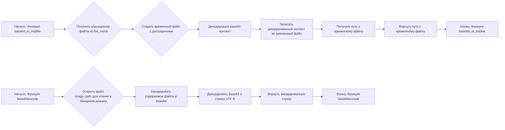

### **Системные инструкции для обработки кода проекта `hypotez`**

=========================================================================================

Описание функциональности и правил для генерации, анализа и улучшения кода. Направлено на обеспечение последовательного и читаемого стиля кодирования, соответствующего требованиям.

---

### **Основные принципы**

#### **1. Общие указания**:
- Соблюдай четкий и понятный стиль кодирования.
- Все изменения должны быть обоснованы и соответствовать установленным требованиям.

#### **2. Комментарии**:
- Используй `#` для внутренних комментариев.
- Документация всех функций, методов и классов должна следовать такому формату: 
    ```python
        def function(param: str, param1: Optional[str | dict | str] = None) -> dict | None:
            """ 
            Args:
                param (str): Описание параметра `param`.
                param1 (Optional[str | dict | str], optional): Описание параметра `param1`. По умолчанию `None`.
    
            Returns:
                dict | None: Описание возвращаемого значения. Возвращает словарь или `None`.
    
            Raises:
                SomeError: Описание ситуации, в которой возникает исключение `SomeError`.

            Ехаmple:
                >>> function('param', 'param1')
                {'param': 'param1'}
            """
    ```
- Комментарии и документация должны быть четкими, лаконичными и точными.

#### **3. Форматирование кода**:
- Используй одинарные кавычки. `a:str = 'value'`, `print('Hello World!')`;
- Добавляй пробелы вокруг операторов. Например, `x = 5`;
- Все параметры должны быть аннотированы типами. `def function(param: str, param1: Optional[str | dict | str] = None) -> dict | None:`;
- Не используй `Union`. Вместо этого используй `|`.

#### **4. Логирование**:
- Для логгирования Всегда Используй модуль `logger` из `src.logger.logger`.
- Ошибки должны логироваться с использованием `logger.error`.
Пример:
    ```python
        try:
            ...
        except Exception as ex:
            logger.error('Error while processing data', ех, exc_info=True)
    ```
#### **5 Не используй `Union[]` в коде. Вместо него используй `|`
Например:
```python
x: str | int ...
```


---

### **Основные требования**:

#### **1. Формат ответов в Markdown**:
- Все ответы должны быть выполнены в формате **Markdown**.

#### **2. Формат комментариев**:
- Используй указанный стиль для комментариев и документации в коде.
- Пример:

```python
from typing import Generator, Optional, List
from pathlib import Path


def read_text_file(
    file_path: str | Path,
    as_list: bool = False,
    extensions: Optional[List[str]] = None,
    chunk_size: int = 8192,
) -> Generator[str, None, None] | str | None:
    """
    Считывает содержимое файла (или файлов из каталога) с использованием генератора для экономии памяти.

    Args:
        file_path (str | Path): Путь к файлу или каталогу.
        as_list (bool): Если `True`, возвращает генератор строк.
        extensions (Optional[List[str]]): Список расширений файлов для чтения из каталога.
        chunk_size (int): Размер чанков для чтения файла в байтах.

    Returns:
        Generator[str, None, None] | str | None: Генератор строк, объединенная строка или `None` в случае ошибки.

    Raises:
        Exception: Если возникает ошибка при чтении файла.

    Example:
        >>> from pathlib import Path
        >>> file_path = Path('example.txt')
        >>> content = read_text_file(file_path)
        >>> if content:
        ...    print(f'File content: {content[:100]}...')
        File content: Example text...
    """
    ...
```
- Всегда делай подробные объяснения в комментариях. Избегай расплывчатых терминов, 
- таких как *«получить»* или *«делать»*
-  . Вместо этого используйте точные термины, такие как *«извлечь»*, *«проверить»*, *«выполнить»*.
- Вместо: *«получаем»*, *«возвращаем»*, *«преобразовываем»* используй имя объекта *«функция получае»*, *«переменная возвращает»*, *«код преобразовывает»* 
- Комментарии должны непосредственно предшествовать описываемому блоку кода и объяснять его назначение.

#### **3. Пробелы вокруг операторов присваивания**:
- Всегда добавляйте пробелы вокруг оператора `=`, чтобы повысить читаемость.
- Примеры:
  - **Неправильно**: `x=5`
  - **Правильно**: `x = 5`

#### **4. Использование `j_loads` или `j_loads_ns`**:
- Для чтения JSON или конфигурационных файлов замените стандартное использование `open` и `json.load` на `j_loads` или `j_loads_ns`.
- Пример:

```python
# Неправильно:
with open('config.json', 'r', encoding='utf-8') as f:
    data = json.load(f)

# Правильно:
data = j_loads('config.json')
```

#### **5. Сохранение комментариев**:
- Все существующие комментарии, начинающиеся с `#`, должны быть сохранены без изменений в разделе «Улучшенный код».
- Если комментарий кажется устаревшим или неясным, не изменяйте его. Вместо этого отметьте его в разделе «Изменения».

#### **6. Обработка `...` в коде**:
- Оставляйте `...` как указатели в коде без изменений.
- Не документируйте строки с `...`.
```

#### **7. Аннотации**
Для всех переменных должны быть определены аннотации типа. 
Для всех функций все входные и выходные параметры аннотириваны
Для все параметров должны быть аннотации типа.


### **8. webdriver**
В коде используется webdriver. Он импртируется из модуля `webdriver` проекта `hypotez`
```python
from src.webdirver import Driver, Chrome, Firefox, Playwright, ...
driver = Driver(Firefox)

Пoсле чего может использоваться как

close_banner = {
  "attribute": null,
  "by": "XPATH",
  "selector": "//button[@id = 'closeXButton']",
  "if_list": "first",
  "use_mouse": false,
  "mandatory": false,
  "timeout": 0,
  "timeout_for_event": "presence_of_element_located",
  "event": "click()",
  "locator_description": "Закрываю pop-up окно, если оно не появилось - не страшно (`mandatory`:`false`)"
}

result = driver.execute_locator(close_banner)
```

### Анализ кода `hypotez/src/utils/convertors/base64.py`

#### 1. Блок-схема:


```mermaid
graph LR
    A[Начало: Функция base64_to_tmpfile] --> B{Получить расширение файла из file_name};
    B --> C{Создать временный файл с расширением};
    C --> D[Декодировать base64 контент];
    D --> E[Записать декодированный контент во временный файл];
    E --> F[Получить путь к временному файлу];
    F --> G[Вернуть путь к временному файлу];
    G --> H[Конец: Функция base64_to_tmpfile];

    I[Начало: Функция base64encode] --> J{Открыть файл image_path для чтения в бинарном режиме};
    J --> K[Закодировать содержимое файла в base64];
    K --> L[Декодировать base64 в строку UTF-8];
    L --> M[Вернуть закодированную строку];
    M --> N[Конец: Функция base64encode];
```

**Примеры для логических блоков:**

-   **A**: Функция `base64_to_tmpfile("SGVsbG8gd29ybGQh", "example.txt")` начинает выполнение.
-   **B**: Из имени файла "example.txt" извлекается расширение ".txt".
-   **C**: Создается временный файл с расширением ".txt", например, "/tmp/tmpfile.txt".
-   **D**: Base64 контент "SGVsbG8gd29ybGQh" декодируется в байтовую строку "Hello world!".
-   **E**: Байтовая строка "Hello world!" записывается во временный файл.
-   **F**: Получается путь к созданному временному файлу, например, "/tmp/tmpfile.txt".
-   **G**: Функция возвращает строку с путем к временному файлу "/tmp/tmpfile.txt".
-   **H**: Функция `base64_to_tmpfile` завершает выполнение.
-   **I**: Функция `base64encode("image.png")` начинает выполнение.
-   **J**: Открывается файл "image.png" для чтения в бинарном режиме.
-   **K**: Содержимое файла кодируется в base64.
-   **L**: Base64 преобразуется в строку UTF-8.
-   **M**: Функция возвращает закодированную строку.
-   **N**: Функция `base64encode` завершает выполнение.

#### 2. Диаграмма:

```mermaid
graph TD
    A[base64_to_tmpfile] --> B[base64.b64decode];
    A --> C[tempfile.NamedTemporaryFile];
    A --> D[os.path.splitext];
    E[base64encode] --> F[base64.b64encode];
    F --> G[open(image_path, "rb")];
```

**Объяснение зависимостей:**

-   `base64_to_tmpfile`:
    -   `base64.b64decode`: Используется для декодирования содержимого Base64.
    -   `tempfile.NamedTemporaryFile`: Используется для создания временного файла.
    -   `os.path.splitext`: Используется для извлечения расширения файла.
-   `base64encode`:
    -   `base64.b64encode`: Используется для кодирования содержимого файла в Base64.
    -   `open(image_path, "rb")`: Используется для открытия файла изображения для чтения в бинарном режиме.

#### 3. Объяснение:

**Импорты:**

-   `base64`: Предоставляет функции для кодирования и декодирования Base64.
-   `tempfile`: Предоставляет функции для создания временных файлов и каталогов.
-   `os`: Предоставляет функции для взаимодействия с операционной системой, такие как работа с путями к файлам.

**Функции:**

-   `base64_to_tmpfile(content: str, file_name: str) -> str`:
    -   Аргументы:
        -   `content` (str): Base64 закодированная строка, которую нужно декодировать.
        -   `file_name` (str): Имя файла, из которого извлекается расширение для временного файла.
    -   Возвращаемое значение:
        -   `str`: Путь к созданному временному файлу.
    -   Назначение:
        Декодирует Base64 закодированную строку и записывает её во временный файл с расширением, полученным из `file_name`.
    -   Пример:
        ```python
        base64_content = "SGVsbG8gd29ybGQh"  # Base64 encoded content "Hello world!"
        file_name = "example.txt"
        tmp_file_path = base64_to_tmpfile(base64_content, file_name)
        print(f"Temporary file created at: {tmp_file_path}")
        # Temporary file created at: /tmp/tmpfile.txt
        ```
-   `base64encode(image_path)`:
    -   Аргументы:
        -   `image_path` (str): Путь к файлу изображения, которое нужно закодировать.
    -   Возвращаемое значение:
        -   `str`: Base64 закодированная строка изображения.
    -   Назначение:
        Кодирует содержимое файла изображения в Base64 формат.

**Переменные:**

-   `content` (str): Base64 закодированная строка, передается в функцию `base64_to_tmpfile`.
-   `file_name` (str): Имя файла, используемое для получения расширения, передается в функцию `base64_to_tmpfile`.
-   `ext` (str): Расширение файла, извлеченное из `file_name`.
-   `path` (str): Путь к созданному временному файлу.
-   `tmp` (tempfile._TemporaryFileWrapper): Объект временного файла, созданный с помощью `tempfile.NamedTemporaryFile`.
-   `image_path` (str): Путь к файлу изображения, передается в функцию `base64encode`.
-   `image_file` (_io.BufferedReader): Объект файла, открытый для чтения изображения.

**Потенциальные ошибки и области для улучшения:**

-   Обработка исключений: В функции `base64_to_tmpfile` не предусмотрена обработка исключений, которые могут возникнуть при декодировании Base64 контента или записи во временный файл.  Стоит добавить блок `try...except` для обработки возможных ошибок и логирования их с использованием `logger.error`.
-   Явное указание кодировки при открытии файла: В функции `base64encode` при открытии файла изображения не указана кодировка.  Хотя для бинарных файлов это не требуется, можно добавить комментарий, указывающий на это, чтобы избежать недоразумений.

**Цепочка взаимосвязей с другими частями проекта:**

Данный модуль `src.utils.convertors.base64` может использоваться в других частях проекта, где требуется конвертация Base64 контента во временные файлы, например, для обработки данных, полученных из сети или конфигурационных файлов. Также, он может быть использован для кодирования изображений в Base64 для передачи их в формате текста.