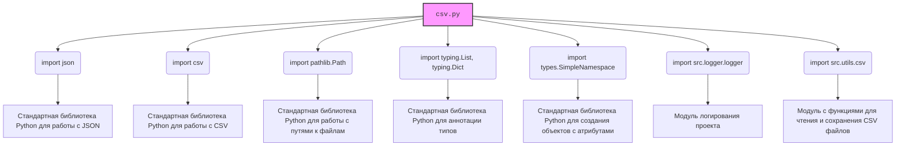

### **Системные инструкции для обработки кода проекта `hypotez`**

=========================================================================================

Описание функциональности и правил для генерации, анализа и улучшения кода. Направлено на обеспечение последовательного и читаемого стиля кодирования, соответствующего требованиям.

---

### **Основные принципы**

#### **1. Общие указания**:
- Соблюдай четкий и понятный стиль кодирования.
- Все изменения должны быть обоснованы и соответствовать установленным требованиям.

#### **2. Комментарии**:
- Используй `#` для внутренних комментариев.
- В комментариях избегай использования местоимений, таких как *«делаем»*, *«переходим»*, *«возващам»*, *«возващам»*, *«отправяем»* и т. д.. Вмсто этого используй точные термины, такие как *«извлеизвлечение»*, *«проверка»*, *«выполннение»*, *«замена»*, *«вызов»*, *«Функця выпоняет»*,*«Функця изменяет значение»*, *«Функця вызывает»*,*«отправка»*
Пример:
```python
# Неправильно:
def function(param: str, param1: Optional[str | dict | str] = None) -> dict | None:
    # Получаем значение параметра
    ...
# Правильно:

def function(param: str, param1: Optional[str | dict | str] = None) -> dict | None:
    # Функция извлекает значение параметра
    ...
# Неправильно:
if not process_directory.exists():
    logger.error(f"Директория не существует: {process_directory}")
    continue  # Переходим к следующей директории, если текущая не существует

if not process_directory.is_dir():
    logger.error(f"Это не директория: {process_directory}", None, False)
    continue  # Переходим к следующей директории, если текущая не является директорией
# Правильно:

if not process_directory.exists():
    logger.error(f"Директория не существует: {process_directory}")
    continue  # Переход к следующей директории, если текущая не существует
if not process_directory.is_dir():
    logger.error(f"Это не директория: {process_directory}", None, False)
    continue  # Переходим к следующей директории, если текущая не является директорией

```
- Документация всех функций, методов и классов должна следовать такому формату: 
    ```python
        def function(param: str, param1: Optional[str | dict | str] = None) -> dict | None:
            """ 
            Args:
                param (str): Описание параметра `param`.
                param1 (Optional[str | dict | str], optional): Описание параметра `param1`. По умолчанию `None`.
    
            Returns:
                dict | None: Описание возващаемого значения. Возвращает словарь или `None`.
    
            Raises:
                SomeError: Описание ситуации, в которой возникает исключение `SomeError`.

            Ехаmple:
                >>> function('param', 'param1')
                {'param': 'param1'}
            """
    ```
- Комментарии и документация должны быть четкими, лаконичными и точными.


### **3. Заголовок файла**:
Обязательно оставляй строки 
```python
## \file path/to/file
# -*- coding: utf-8 -*-
#! .pyenv/bin/python3
```
и
```
"""
...
```rst
 .. module:: src.utils.string.html_simplification
 ```
"""
```
если они есть. Если нет - добавляй.
Пример:
## \file /src/utils/string/html_simplification.py
# -*- coding: utf-8 -*-
#! .pyenv/bin/python3

"""
Модуль для очистки HTML-тегов из текста и упрощения HTML-кода.
===============================================================
Модуль минимизирует HTML-код, удаляет теги и атрибуты, а также обрабатывает
специальные случаи, такие как скрипты, стили и комментарии.
Использует BeautifulSoup для надежного парсинга HTML.

Зависимости:
    - beautifulsoup4 (pip install beautifulsoup4)
    - lxml (опционально, для более быстрого парсинга: pip install lxml)

 .. module:: src.utils.string.html_simplification
"""

#### **4. Форматирование кода**:
- Используй одинарные кавычки. `a:str = 'value'`, `print('Hello World!')`;
- Добавляй пробелы вокруг операторов. Например, `x = 5`;
- Все параметры должны быть аннотированы типами. `def function(param: str, param1: Optional[str | dict | str] = None) -> dict | None:`;
- Не используй `Union`. Вместо этого используй `|`.
- Не используй термин `Product`, только `товар`

#### **5. Логирование**:
- Для логгирования Всегда Используй модуль `logger` из `src.logger.logger`.
- Ошибки должны логироваться с использованием `logger.error`.
Пример:
    ```python
        try:
            ...
        except Exception as ex:
            logger.error('Error while processing data', ех, exc_info=True)
    ```
#### **6. Не используй `Union[]` в коде. Вместо него используй `|`
Например:
```python
x: str | int ...
```

#### **7. Не используй глобальные переменные. Если есть надобность - то поределяй их в классе `Config`.
Пример:

- Неправильно:
```python

state:int = 'global'

def func():
    print(state)

```
- Правильно:
```python

class Config:
    state:int = 'global'

def func():
    print(Config.state)

```

#### **8. Не используй `self` в методах класса. Вместо него используй `cls`.
#### **9. Всегда объявляй переменные вначале функции. Не объявляй их в середине функции.
Пример:
```python
def func():
    # Неправильно
    if condition:
        x = 5
        y = 10
    else:
        x = 20
        y = 30
    # Правильно
    x = None
    y = None
    if condition:
        x = 5
        y = 10
    else:
        x = 20
        y = 30
```
---

### **Основные требования**:

#### **1. Формат ответов в Markdown**:
- Все ответы должны быть выполнены в формате **Markdown**.

#### **2. Формат комментариев**:
- Используй указанный стиль для комментариев и документации в коде.
- Пример:

```python
from typing import Generator, Optional, List
from pathlib import Path


def read_text_file(
    file_path: str | Path,
    as_list: bool = False,
    extensions: Optional[List[str]] = None,
    chunk_size: int = 8192,
) -> Generator[str, None, None] | str | None:
    """
    Считывает содержимое файла (или файлов из каталога) с использованием генератора для экономии памяти.

    Args:
        file_path (str | Path): Путь к файлу или каталогу.
        as_list (bool): Если `True`, возвращает генератор строк.
        extensions (Optional[List[str]]): Список расширений файлов для чтения из каталога.
        chunk_size (int): Размер чанков для чтения файла в байтах.

    Returns:
        Generator[str, None, None] | str | None: Генератор строк, объединенная строка или `None` в случае ошибки.

    Raises:
        Exception: Если возникает ошибка при чтении файла.

    Example:
        >>> from pathlib import Path
        >>> file_path = Path('example.txt')
        >>> content = read_text_file(file_path)
        >>> if content:
        ...    print(f'File content: {content[:100]}...')
        File content: Example text...
    """
    ...
```
- Всегда делай подробные объяснения в комментариях. Избегай расплывчатых терминов, 
- таких как *«получить»* или *«делать»*
-  . Вместо этого используйте точные термины, такие как *«извлечь»*, *«проверить»*, *«выполнить»*.
- Вместо: *«получаем»*, *«возвращаем»*, *«преобразовываем»* используй имя объекта *«функция получае»*, *«переменная возвращает»*, *«код преобразовывает»* 
- Комментарии должны непосредственно предшествовать описываемому блоку кода и объяснять его назначение.

#### **3. Пробелы вокруг операторов присваивания**:
- Всегда добавляйте пробелы вокруг оператора `=`, чтобы повысить читаемость.
- Примеры:
  - **Неправильно**: `x=5`
  - **Правильно**: `x = 5`

#### **4. Использование `j_loads` или `j_loads_ns`**:
- Для чтения JSON или конфигурационных файлов замените стандартное использование `open` и `json.load` на `j_loads` или `j_loads_ns`.
- Пример:

```python
# Неправильно:
with open('config.json', 'r', encoding='utf-8') as f:
    data = json.load(f)

# Правильно:
data = j_loads('config.json')
```

#### **5. Сохранение комментариев**:
- Все существующие комментарии, начинающиеся с `#`, должны быть сохранены без изменений в разделе «Улучшенный код».
- Если комментарий кажется устаревшим или неясным, не изменяйте его. Вместо этого отметьте его в разделе «Изменения».

#### **6. Обработка `...` в коде**:
- Оставляйте `...` как указатели в коде без изменений.
- Не документируйте строки с `...`.
```

#### **7. Аннотации**
Для всех переменных должны быть определены аннотации типа. 
Для всех функций все входные и выходные параметры аннотириваны
Для все параметров должны быть аннотации типа.


### **8. webdriver**
В коде используется webdriver. Он импртируется из модуля `webdriver` проекта `hypotez`
```python
from src.webdirver import Driver, Chrome, Firefox, Playwright, ...
driver = Driver(Firefox)

Пoсле чего может использоваться как

close_banner = {
  "attribute": null,
  "by": "XPATH",
  "selector": "//button[@id = 'closeXButton']",
  "if_list": "first",
  "use_mouse": false,
  "mandatory": false,
  "timeout": 0,
  "timeout_for_event": "presence_of_element_located",
  "event": "click()",
  "locator_description": "Закрываю pop-up окно, если оно не появилось - не страшно (`mandatory`:`false`)"
}

result = driver.execute_locator(close_banner)

#### **9. Не используй `Union[]` в коде. Вместо него используй `|`
Например:
```python
x: str | int ...
```

#### **10. print - это моя встроенная функция.
from src.utils.printer import pprint as print


Вот она:

\file /src/utils/printer.py
-- coding: utf-8 --

#! .pyenv/bin/python3

"""
.. module::  src.utils
:platform: Windows, Unix
:synopsis: Utility functions for pretty printing and text styling.

This module provides functions to print data in a human-readable format with optional text styling, including color, background, and font styles.
"""

import json
import csv
import pandas as pd
from pathlib import Path
from typing import Any
from pprint import pprint as pretty_print

ANSI escape codes

RESET = "\033[0m"

TEXT_COLORS = {
"red": "\033[31m",
"green": "\033[32m",
"blue": "\033[34m",
"yellow": "\033[33m",
"white": "\033[37m",
"cyan": "\033[36m",
"magenta": "\033[35m",
"light_gray": "\033[37m",
"dark_gray": "\033[90m",
"light_red": "\033[91m",
"light_green": "\033[92m",
"light_blue": "\033[94m",
"light_yellow": "\033[93m",
}

Background colors mapping

BG_COLORS = {
"bg_red": "\033[41m",
"bg_green": "\033[42m",
"bg_blue": "\033[44m",
"bg_yellow": "\033[43m",
"bg_white": "\033[47m",
"bg_cyan": "\033[46m",
"bg_magenta": "\033[45m",
"bg_light_gray": "\033[47m",
"bg_dark_gray": "\033[100m",
"bg_light_red": "\033[101m",
"bg_light_green": "\033[102m",
"bg_light_blue": "\033[104m",
"bg_light_yellow": "\033[103m",
}

FONT_STYLES = {
"bold": "\033[1m",
"underline": "\033[4m",
}

def _color_text(text: str, text_color: str = "", bg_color: str = "", font_style: str = "") -> str:
"""Apply color, background, and font styling to the text.

This helper function applies the provided color and font styles to the given text using ANSI escape codes.

:param text: The text to be styled.
:param text_color: The color to apply to the text. Default is an empty string, meaning no color.
:param bg_color: The background color to apply. Default is an empty string, meaning no background color.
:param font_style: The font style to apply to the text. Default is an empty string, meaning no font style.
:return: The styled text as a string.

:example:
    >>> _color_text("Hello, World!", text_color="green", font_style="bold")
    '\033[1m\033[32mHello, World!\033[0m'
"""
return f"{font_style}{text_color}{bg_color}{text}{RESET}"


def pprint(print_data: Any = None, text_color: str = "white", bg_color: str = "", font_style: str = "") -> None:
"""Pretty prints the given data with optional color, background, and font style.

This function formats the input data based on its type and prints it to the console. The data is printed with optional 
text color, background color, and font style based on the specified parameters. The function can handle dictionaries, 
lists, strings, and file paths.

:param print_data: The data to be printed. Can be of type ``None``, ``dict``, ``list``, ``str``, or ``Path``.
:param text_color: The color to apply to the text. Default is 'white'. See :ref:`TEXT_COLORS`.
:param bg_color: The background color to apply to the text. Default is '' (no background color). See :ref:`BG_COLORS`.
:param font_style: The font style to apply to the text. Default is '' (no font style). See :ref:`FONT_STYLES`.
:return: None

:raises: Exception if the data type is unsupported or an error occurs during printing.

:example:
    >>> pprint({"name": "Alice", "age": 30}, text_color="green")
    \033[32m{
        "name": "Alice",
        "age": 30
    }\033[0m

    >>> pprint(["apple", "banana", "cherry"], text_color="blue", font_style="bold")
    \033[34m\033[1mapple\033[0m
    \033[34m\033[1mbanana\033[0m
    \033[34m\033[1mcherry\033[0m

    >>> pprint("text example", text_color="yellow", bg_color="bg_red", font_style="underline")
    \033[4m\033[33m\033[41mtext example\033[0m
"""
if not print_data:
    return
if isinstance(text_color, str):
    text_color = TEXT_COLORS.get(text_color.lower(), TEXT_COLORS["white"])
if isinstance(bg_color, str):
    bg_color = BG_COLORS.get(bg_color.lower(), "")
if isinstance(font_style, str):
    font_style = FONT_STYLES.get(font_style.lower(), "")


try:
    if isinstance(print_data, dict):
        print(_color_text(json.dumps(print_data, indent=4), text_color))
    elif isinstance(print_data, list):
        for item in print_data:
            print(_color_text(str(item), text_color))
    elif isinstance(print_data, (str, Path)) and Path(print_data).is_file():
        ext = Path(print_data).suffix.lower()
        if ext in ['.csv', '.xls']:
            print(_color_text("File reading supported for .csv, .xls only.", text_color))
        else:
            print(_color_text("Unsupported file type.", text_color))
    else:
        print(_color_text(str(print_data), text_color))
except Exception as ex:
    print(_color_text(f"Error: {ex}", text_color=TEXT_COLORS["red"]))
IGNORE_WHEN_COPYING_START
content_copy
download
Use code with caution.
IGNORE_WHEN_COPYING_END

if name == 'main':
pprint({"name": "Alice", "age": 30}, text_color="green")
```

```markdown
## \file /src/utils/convertors/csv.py

# Анализ кода модуля `csv.py`

### 1. Блок-схема

```mermaid
graph TD
    A[Начало] --> B{Вызов csv2dict, csv2ns, csv_to_json}
    
    subgraph csv2dict
    B --> C{csv2dict(csv_file: str | Path, *args, **kwargs)}
    C --> D{read_csv_as_dict(csv_file, *args, **kwargs)}
    D --> E{Чтение CSV файла}
    E --> F{Преобразование в словарь}
    F --> G{Возврат словаря}
    G --> H[Конец csv2dict]
    end
    
    subgraph csv2ns
    B --> I{csv2ns(csv_file: str | Path, *args, **kwargs)}
    I --> J{read_csv_as_ns(csv_file, *args, **kwargs)}
    J --> K{Чтение CSV файла}
    K --> L{Преобразование в SimpleNamespace}
    L --> M{Возврат SimpleNamespace}
    M --> N[Конец csv2ns]
    end

    subgraph csv_to_json
    B --> O{csv_to_json(csv_file_path: str | Path, json_file_path: str | Path, exc_info: bool = True)}
    O --> P{read_csv_file(csv_file_path, exc_info=exc_info)}
    P --> Q{Чтение CSV файла}
    Q --> R{Преобразование в список словарей}
    R --> S{Сохранение в JSON файл}
    S --> T{Возврат списка словарей}
    T --> U[Конец csv_to_json]
    end
    
    H --> V[Конец]
    N --> V
    U --> V
    
    style A fill:#f9f,stroke:#333,stroke-width:2px
    style V fill:#f9f,stroke:#333,stroke-width:2px
```

### 2. Диаграмма



**Объяснение зависимостей:**

-   **json**: Используется для преобразования данных в формат JSON и сохранения их в файл.
-   **csv**: Используется для чтения данных из CSV файлов.
-   **pathlib.Path**: Используется для работы с путями к файлам и директориям.
-   **typing.List, typing.Dict**: Используется для статической типизации, указывая типы данных в списках и словарях.
-   **types.SimpleNamespace**: Используется для создания объектов, к атрибутам которых можно обращаться как к атрибутам объекта.
-   **src.logger.logger**: Используется для логирования ошибок и других событий.
-   **src.utils.csv**: Содержит функции `read_csv_as_dict`, `read_csv_as_ns`, `save_csv_file`, `read_csv_file`, которые выполняют основные операции чтения и записи CSV файлов.

### 3. Объяснение

#### Импорты:

-   **json**: Стандартная библиотека Python для работы с данными в формате JSON. Используется для сериализации и десериализации данных.
-   **csv**: Стандартная библиотека Python для работы с CSV файлами. Позволяет читать и записывать данные в формате CSV.
-   **pathlib.Path**: Модуль для работы с путями к файлам в объектно-ориентированном стиле.
-   **typing.List, typing.Dict**: Модуль для определения типов данных, используется для аннотации типов.
-   **types.SimpleNamespace**: Класс, позволяющий создавать объекты, к атрибутам которых можно обращаться через точку.
-   **src.logger.logger**: Модуль логирования, используемый для записи информации о работе скрипта, включая ошибки.
-   **src.utils.csv**: Модуль, содержащий функции для чтения и записи CSV файлов.

#### Функции:

1.  **`csv2dict(csv_file: str | Path, *args, **kwargs) -> dict | None`**:

    *   **Аргументы**:
        *   `csv_file` (str | Path): Путь к CSV файлу.
        *   `*args`: Произвольные позиционные аргументы, передаваемые в `read_csv_as_dict`.
        *   `**kwargs`: Произвольные именованные аргументы, передаваемые в `read_csv_as_dict`.
    *   **Возвращаемое значение**:
        *   `dict | None`: Словарь с данными из CSV файла или `None` в случае ошибки.
    *   **Назначение**:
        Преобразует CSV файл в словарь, вызывая функцию `read_csv_as_dict` из модуля `src.utils.csv`.
    *   **Пример**:

        ```python
        data = csv2dict('data.csv')
        if data:
            print(data)
        ```

2.  **`csv2ns(csv_file: str | Path, *args, **kwargs) -> SimpleNamespace | None`**:

    *   **Аргументы**:
        *   `csv_file` (str | Path): Путь к CSV файлу.
        *   `*args`: Произвольные позиционные аргументы, передаваемые в `read_csv_as_ns`.
        *   `**kwargs`: Произвольные именованные аргументы, передаваемые в `read_csv_as_ns`.
    *   **Возвращаемое значение**:
        *   `SimpleNamespace | None`: Объект `SimpleNamespace` с данными из CSV файла или `None` в случае ошибки.
    *   **Назначение**:
        Преобразует CSV файл в объект `SimpleNamespace`, вызывая функцию `read_csv_as_ns` из модуля `src.utils.csv`.
    *   **Пример**:

        ```python
        data = csv2ns('data.csv')
        if data:
            print(data)
        ```

3.  **`csv_to_json(csv_file_path: str | Path, json_file_path: str | Path, exc_info: bool = True) -> List[Dict[str, str]] | None`**:

    *   **Аргументы**:
        *   `csv_file_path` (str | Path): Путь к CSV файлу.
        *   `json_file_path` (str | Path): Путь к JSON файлу для сохранения.
        *   `exc_info` (bool, optional): Флаг, определяющий, нужно ли логировать информацию об исключении. По умолчанию `True`.
    *   **Возвращаемое значение**:
        *   `List[Dict[str, str]] | None`: Список словарей с данными из CSV файла или `None` в случае ошибки.
    *   **Назначение**:
        Преобразует CSV файл в JSON файл, вызывая функцию `read_csv_file` из модуля `src.utils.csv` для чтения CSV и сохраняя результат в JSON файл.
    *   **Пример**:

        ```python
        json_data = csv_to_json('data.csv', 'data.json')
        if json_data:
            print(json_data)
        ```

#### Переменные:

*   В функциях используются локальные переменные для хранения данных и путей к файлам. Типы переменных аннотированы для статической типизации.

#### Потенциальные ошибки и области для улучшения:

*   Обработка исключений: В функции `csv_to_json` используется общий блок `except Exception as ex`, что может затруднить отладку. Рекомендуется обрабатывать конкретные типы исключений.
*   Функции `csv2dict` и `csv2ns` просто вызывают другие функции и возвращают результат. Возможно, стоит добавить дополнительную логику или обработку ошибок непосредственно в эти функции.

#### Взаимосвязи с другими частями проекта:

*   Модуль использует модуль `src.logger.logger` для логирования ошибок.
*   Модуль использует модуль `src.utils.csv`, который, вероятно, содержит низкоуровневые функции для чтения CSV файлов.