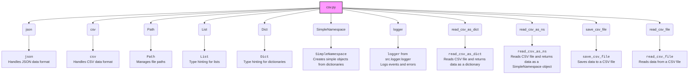

### **Системные инструкции для обработки кода проекта `hypotez`**

=========================================================================================

Описание функциональности и правил для генерации, анализа и улучшения кода. Направлено на обеспечение последовательного и читаемого стиля кодирования, соответствующего требованиям.

---

### **Основные принципы**

#### **1. Общие указания**:
- Соблюдай четкий и понятный стиль кодирования.
- Все изменения должны быть обоснованы и соответствовать установленным требованиям.

#### **2. Комментарии**:
- Используй `#` для внутренних комментариев.
- Документация всех функций, методов и классов должна следовать такому формату: 
    ```python
        def function(param: str, param1: Optional[str | dict | str] = None) -> dict | None:
            """ 
            Args:
                param (str): Описание параметра `param`.
                param1 (Optional[str | dict | str], optional): Описание параметра `param1`. По умолчанию `None`.
    
            Returns:
                dict | None: Описание возвращаемого значения. Возвращает словарь или `None`.
    
            Raises:
                SomeError: Описание ситуации, в которой возникает исключение `SomeError`.

            Ехаmple:
                >>> function('param', 'param1')
                {'param': 'param1'}
            """
    ```
- Комментарии и документация должны быть четкими, лаконичными и точными.

#### **3. Форматирование кода**:
- Используй одинарные кавычки. `a:str = 'value'`, `print('Hello World!')`;
- Добавляй пробелы вокруг операторов. Например, `x = 5`;
- Все параметры должны быть аннотированы типами. `def function(param: str, param1: Optional[str | dict | str] = None) -> dict | None:`;
- Не используй `Union`. Вместо этого используй `|`.

#### **4. Логирование**:
- Для логгирования Всегда Используй модуль `logger` из `src.logger.logger`.
- Ошибки должны логироваться с использованием `logger.error`.
Пример:
    ```python
        try:
            ...
        except Exception as ex:
            logger.error('Error while processing data', ех, exc_info=True)
    ```
#### **5 Не используй `Union[]` в коде. Вместо него используй `|`
Например:
```python
x: str | int ...
```


---

### **Основные требования**:

#### **1. Формат ответов в Markdown**:
- Все ответы должны быть выполнены в формате **Markdown**.

#### **2. Формат комментариев**:
- Используй указанный стиль для комментариев и документации в коде.
- Пример:

```python
from typing import Generator, Optional, List
from pathlib import Path


def read_text_file(
    file_path: str | Path,
    as_list: bool = False,
    extensions: Optional[List[str]] = None,
    chunk_size: int = 8192,
) -> Generator[str, None, None] | str | None:
    """
    Считывает содержимое файла (или файлов из каталога) с использованием генератора для экономии памяти.

    Args:
        file_path (str | Path): Путь к файлу или каталогу.
        as_list (bool): Если `True`, возвращает генератор строк.
        extensions (Optional[List[str]]): Список расширений файлов для чтения из каталога.
        chunk_size (int): Размер чанков для чтения файла в байтах.

    Returns:
        Generator[str, None, None] | str | None: Генератор строк, объединенная строка или `None` в случае ошибки.

    Raises:
        Exception: Если возникает ошибка при чтении файла.

    Example:
        >>> from pathlib import Path
        >>> file_path = Path('example.txt')
        >>> content = read_text_file(file_path)
        >>> if content:
        ...    print(f'File content: {content[:100]}...')
        File content: Example text...
    """
    ...
```
- Всегда делай подробные объяснения в комментариях. Избегай расплывчатых терминов, 
- таких как *«получить»* или *«делать»*. Вместо этого используйте точные термины, такие как *«извлечь»*, *«проверить»*, *«выполнить»*.
- Вместо: *«получаем»*, *«возвращаем»*, *«преобразовываем»* используй имя объекта *«функция получае»*, *«переменная возвращает»*, *«код преобразовывает»* 
- Комментарии должны непосредственно предшествовать описываемому блоку кода и объяснять его назначение.

#### **3. Пробелы вокруг операторов присваивания**:
- Всегда добавляйте пробелы вокруг оператора `=`, чтобы повысить читаемость.
- Примеры:
  - **Неправильно**: `x=5`
  - **Правильно**: `x = 5`

#### **4. Использование `j_loads` или `j_loads_ns`**:
- Для чтения JSON или конфигурационных файлов замените стандартное использование `open` и `json.load` на `j_loads` или `j_loads_ns`.
- Пример:

```python
# Неправильно:
with open('config.json', 'r', encoding='utf-8') as f:
    data = json.load(f)

# Правильно:
data = j_loads('config.json')
```

#### **5. Сохранение комментариев**:
- Все существующие комментарии, начинающиеся с `#`, должны быть сохранены без изменений в разделе «Улучшенный код».
- Если комментарий кажется устаревшим или неясным, не изменяйте его. Вместо этого отметьте его в разделе «Изменения».

#### **6. Обработка `...` в коде**:
- Оставляйте `...` как указатели в коде без изменений.
- Не документируйте строки с `...`.
```

#### **7. Аннотации**
Для всех переменных должны быть определены аннотации типа. 
Для всех функций все входные и выходные параметры аннотириваны
Для все параметров должны быть аннотации типа.


### **8. webdriver**
В коде используется webdriver. Он импртируется из модуля `webdriver` проекта `hypotez`
```python
from src.webdirver import Driver, Chrome, Firefox, Playwright, ...
driver = Driver(Firefox)

Пoсле чего может использоваться как

close_banner = {
  "attribute": null,
  "by": "XPATH",
  "selector": "//button[@id = 'closeXButton']",
  "if_list": "first",
  "use_mouse": false,
  "mandatory": false,
  "timeout": 0,
  "timeout_for_event": "presence_of_element_located",
  "event": "click()",
  "locator_description": "Закрываю pop-up окно, если оно не появилось - не страшно (`mandatory`:`false`)"
}

result = driver.execute_locator(close_banner)
```

### Анализ кода `hypotez/src/utils/convertors/csv.py`

#### 1. Блок-схема

```mermaid
graph TD
    A[Начало] --> B{Вызов csv2dict(csv_file, *args, **kwargs)};
    B -- Да --> C[Вызов read_csv_as_dict(csv_file, *args, **kwargs)];
    C -- Успешно --> D{Чтение CSV и преобразование в dict};
    D --> E[Возврат dict];
    C -- Ошибка --> F[Обработка ошибки];
    F --> G[Возврат None];
    B -- Нет --> H{Вызов csv2ns(csv_file, *args, **kwargs)};
    H -- Да --> I[Вызов read_csv_as_ns(csv_file, *args, **kwargs)];
    I -- Успешно --> J{Чтение CSV и преобразование в SimpleNamespace};
    J --> K[Возврат SimpleNamespace];
    I -- Ошибка --> L[Обработка ошибки];
    L --> M[Возврат None];
    H -- Нет --> N{Вызов csv_to_json(csv_file_path, json_file_path, exc_info=True)};
    N --> O[Вызов read_csv_file(csv_file_path, exc_info=exc_info)];
    O -- Данные прочитаны --> P{Открытие json_file_path на запись};
    P --> Q[Запись данных в JSON];
    Q --> R[Возврат JSON data];
    O -- Ошибка чтения CSV --> S[logger.error("Failed to convert CSV to JSON", ex, exc_info=exc_info)];
    S --> T[Возврат None];
    N -- Ошибка --> U[logger.error("Failed to convert CSV to JSON", ex, exc_info=exc_info)];
    U --> V[Возврат None];
    E --> W[Конец];
    K --> W;
    G --> W;
    M --> W;
    T --> W;
    V --> W;
    R --> W;
```

Пример для каждого логического блока:

- **Вызов `csv2dict`**:
  ```python
  data = csv2dict('data.csv')
  ```
  Здесь происходит вызов функции `csv2dict` с путем к CSV файлу.

- **Вызов `read_csv_as_dict`**:
  ```python
  return read_csv_as_dict(csv_file, *args, **kwargs)
  ```
  Функция `read_csv_as_dict` вызывается для фактического чтения и преобразования CSV в словарь.

- **Вызов `csv2ns`**:
  ```python
  namespace = csv2ns('data.csv')
  ```
  Вызывается функция `csv2ns` для преобразования CSV в объект `SimpleNamespace`.

- **Вызов `read_csv_as_ns`**:
  ```python
  return read_csv_as_ns(csv_file, *args, **kwargs)
  ```
  Функция `read_csv_as_ns` выполняет чтение и преобразование CSV в `SimpleNamespace`.

- **Вызов `csv_to_json`**:
  ```python
  json_data = csv_to_json('data.csv', 'data.json')
  ```
  Функция `csv_to_json` вызывается для преобразования CSV в JSON и сохранения в файл.

- **Вызов `read_csv_file`**:
  ```python
  data = read_csv_file(csv_file_path, exc_info=exc_info)
  ```
  Функция `read_csv_file` вызывается для чтения данных из CSV файла.

#### 2. Диаграмма


```mermaid
graph TD
    A[csv.py] --> B(json);
    A --> C(csv);
    A --> D(Path);
    A --> E(List);
    A --> F(Dict);
    A --> G(SimpleNamespace);
    A --> H(logger);
    A --> I(read_csv_as_dict);
    A --> J(read_csv_as_ns);
    A --> K(save_csv_file);
    A --> L(read_csv_file);

    B --> File[<code>json</code><br>Handles JSON data format];
    C --> FileCSV[<code>csv</code><br>Handles CSV data format];
    D --> FilePath[<code>Path</code><br>Manages file paths];
    E --> ListType[<code>List</code><br>Type hinting for lists];
    F --> DictType[<code>Dict</code><br>Type hinting for dictionaries];
    G --> SimpleNamespaceType[<code>SimpleNamespace</code><br>Creates simple objects from dictionaries];
    H --> Logger[<code>logger</code> from src.logger.logger<br>Logs events and errors];
    I --> ReadCsvAsDict[<code>read_csv_as_dict</code><br>Reads CSV file and returns data as a dictionary];
    J --> ReadCsvAsNs[<code>read_csv_as_ns</code><br>Reads CSV file and returns data as a SimpleNamespace object];
    K --> SaveCsvFile[<code>save_csv_file</code><br>Saves data to a CSV file];
    L --> ReadCsvFile[<code>read_csv_file</code><br>Reads data from a CSV file];

    style A fill:#f9f,stroke:#333,stroke-width:2px
```

Объяснение зависимостей:

- **`json`**: Используется для работы с данными в формате JSON, в частности, для сохранения данных в JSON файл в функции `csv_to_json`.
- **`csv`**: Используется для чтения и обработки данных в формате CSV, например, при чтении данных из CSV файла в функциях `csv2dict`, `csv2ns` и `csv_to_json`.
- **`Path`**: Из модуля `pathlib` используется для представления и манипулирования путями к файлам и директориям. Это обеспечивает кроссплатформенную работу с файловой системой.
- **`List`**: Из модуля `typing` используется для аннотации типов, указывая, что переменная является списком.
- **`Dict`**: Из модуля `typing` используется для аннотации типов, указывая, что переменная является словарем.
- **`SimpleNamespace`**: Из модуля `types` используется для создания объектов, атрибуты которых можно устанавливать и получать. Удобен для представления данных, когда не требуется определять класс.
- **`logger`**: Импортируется из `src.logger.logger` и используется для логирования ошибок и событий, например, при неудачной попытке преобразования CSV в JSON.
- **`read_csv_as_dict`, `read_csv_as_ns`, `save_csv_file`, `read_csv_file`**: Импортируются из `src.utils.csv`. Эти функции предоставляют базовую функциональность для чтения и сохранения CSV файлов в различных форматах (словарь, SimpleNamespace).

#### 3. Объяснение

**Импорты**:

- `json`: Используется для работы с JSON-форматом (сериализация и десериализация данных).
- `csv`: Используется для работы с CSV-форматом (чтение и запись данных).
- `pathlib.Path`: Используется для представления путей к файлам и директориям.
- `typing.List`: Используется для аннотации типов, представляющих списки.
- `typing.Dict`: Используется для аннотации типов, представляющих словари.
- `types.SimpleNamespace`: Используется для создания объектов, атрибуты которых доступны через точечную нотацию.
- `src.logger.logger.logger`: Используется для логирования событий и ошибок.
- `src.utils.csv.read_csv_as_dict`: Используется для чтения CSV файла и преобразования данных в словарь.
- `src.utils.csv.read_csv_as_ns`: Используется для чтения CSV файла и преобразования данных в объект SimpleNamespace.
- `src.utils.csv.save_csv_file`: Используется для сохранения данных в CSV файл.
- `src.utils.csv.read_csv_file`: Используется для чтения данных из CSV файла.

**Функции**:

- `csv2dict(csv_file: str | Path, *args, **kwargs) -> dict | None`:
    - Аргументы:
        - `csv_file` (str | Path): Путь к CSV файлу.
        - `*args`: Произвольные позиционные аргументы, передаваемые в `read_csv_as_dict`.
        - `**kwargs`: Произвольные именованные аргументы, передаваемые в `read_csv_as_dict`.
    - Возвращаемое значение: Словарь, содержащий данные из CSV файла, или `None` в случае ошибки.
    - Назначение: Преобразует CSV файл в словарь.
    - Пример:
      ```python
      data = csv2dict('data.csv')
      ```

- `csv2ns(csv_file: str | Path, *args, **kwargs) -> SimpleNamespace | None`:
    - Аргументы:
        - `csv_file` (str | Path): Путь к CSV файлу.
        - `*args`: Произвольные позиционные аргументы, передаваемые в `read_csv_as_ns`.
        - `**kwargs`: Произвольные именованные аргументы, передаваемые в `read_csv_as_ns`.
    - Возвращаемое значение: Объект `SimpleNamespace`, содержащий данные из CSV файла, или `None` в случае ошибки.
    - Назначение: Преобразует CSV файл в объект `SimpleNamespace`.
    - Пример:
      ```python
      namespace = csv2ns('data.csv')
      ```

- `csv_to_json(csv_file_path: str | Path, json_file_path: str | Path, exc_info: bool = True) -> List[Dict[str, str]] | None`:
    - Аргументы:
        - `csv_file_path` (str | Path): Путь к CSV файлу.
        - `json_file_path` (str | Path): Путь к JSON файлу.
        - `exc_info` (bool): Флаг, указывающий, нужно ли добавлять информацию об исключении в лог.
    - Возвращаемое значение: Список словарей, содержащий данные из CSV файла, или `None` в случае ошибки.
    - Назначение: Преобразует CSV файл в JSON файл.
    - Пример:
      ```python
      json_data = csv_to_json('data.csv', 'data.json')
      ```

**Переменные**:

- В функциях используются локальные переменные для хранения путей к файлам, данных и флагов обработки ошибок.
- `csv_file` (str | Path): Путь к CSV файлу.
- `json_file_path` (str | Path): Путь к JSON файлу.
- `data` (List[Dict[str, str]] | None): Данные, прочитанные из CSV файла.
- `exc_info` (bool): Флаг, указывающий, нужно ли добавлять информацию об исключении в лог.

**Потенциальные ошибки и области для улучшения**:

- **Обработка ошибок**: В функции `csv_to_json` используется общий блок `except Exception as ex`, который может скрывать специфические ошибки. Желательно использовать более конкретные исключения для более точной обработки.
- **Возврат значения**: В функции `csv_to_json` в случае успеха возвращаются данные, а в случае неудачи `None`. Это может быть неочевидно для пользователя функции. Можно рассмотреть вариант возврата исключения в случае ошибки.

**Взаимосвязи с другими частями проекта**:

- Функции `csv2dict` и `csv2ns` используют функции `read_csv_as_dict` и `read_csv_as_ns` из модуля `src.utils.csv`.
- Функция `csv_to_json` использует `read_csv_file` из модуля `src.utils.csv` для чтения CSV файла и `logger` из `src.logger.logger` для логирования ошибок.