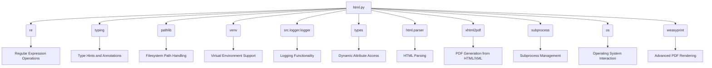

### **Системные инструкции для обработки кода проекта `hypotez`**

=========================================================================================

Описание функциональности и правил для генерации, анализа и улучшения кода. Направлено на обеспечение последовательного и читаемого стиля кодирования, соответствующего требованиям.

---

### **Основные принципы**

#### **1. Общие указания**:
- Соблюдай четкий и понятный стиль кодирования.
- Все изменения должны быть обоснованы и соответствовать установленным требованиям.

#### **2. Комментарии**:
- Используй `#` для внутренних комментариев.
- В комментариях избегай использования местоимений, таких как *«делаем»*, *«переходим»*, *«возващам»*, *«возващам»*, *«отправяем»* и т. д.. Вмсто этого используй точные термины, такие как *«извлеизвлечение»*, *«проверка»*, *«выполннение»*, *«замена»*, *«вызов»*, *«Функця выпоняет»*,*«Функця изменяет значение»*, *«Функця вызывает»*,*«отправка»*
Пример:
```python
# Неправильно:
def function(param: str, param1: Optional[str | dict | str] = None) -> dict | None:
    # Получаем значение параметра
    ...
# Правильно:

def function(param: str, param1: Optional[str | dict | str] = None) -> dict | None:
    # Функция извлекает значение параметра
    ...
# Неправильно:
if not process_directory.exists():
    logger.error(f"Директория не существует: {process_directory}")
    continue  # Переходим к следующей директории, если текущая не существует

if not process_directory.is_dir():
    logger.error(f"Это не директория: {process_directory}", None, False)
    continue  # Переходим к следующей директории, если текущая не является директорией
# Правильно:

if not process_directory.exists():
    logger.error(f"Директория не существует: {process_directory}")
    continue  # Переход к следующей директории, если текущая не существует
if not process_directory.is_dir():
    logger.error(f"Это не директория: {process_directory}", None, False)
    continue  # Переходим к следующей директории, если текущая не является директорией

```
- Документация всех функций, методов и классов должна следовать такому формату: 
    ```python
        def function(param: str, param1: Optional[str | dict | str] = None) -> dict | None:
            """ 
            Args:
                param (str): Описание параметра `param`.
                param1 (Optional[str | dict | str], optional): Описание параметра `param1`. По умолчанию `None`.
    
            Returns:
                dict | None: Описание возващаемого значения. Возвращает словарь или `None`.
    
            Raises:
                SomeError: Описание ситуации, в которой возникает исключение `SomeError`.

            Ехаmple:
                >>> function('param', 'param1')
                {'param': 'param1'}
            """
    ```
- Комментарии и документация должны быть четкими, лаконичными и точными.


### **3. Заголовок файла**:
Обязательно оставляй строки 
```python
## \file path/to/file
# -*- coding: utf-8 -*-
#! .pyenv/bin/python3
```
и
```
"""
...
```rst
 .. module:: src.utils.string.html_simplification
 ```
"""
```
если они есть. Если нет - добавляй.
Пример:
## \file /src/utils/string/html_simplification.py
# -*- coding: utf-8 -*-
#! .pyenv/bin/python3

"""
Модуль для очистки HTML-тегов из текста и упрощения HTML-кода.
===============================================================
Модуль минимизирует HTML-код, удаляет теги и атрибуты, а также обрабатывает
специальные случаи, такие как скрипты, стили и комментарии.
Использует BeautifulSoup для надежного парсинга HTML.

Зависимости:
    - beautifulsoup4 (pip install beautifulsoup4)
    - lxml (опционально, для более быстрого парсинга: pip install lxml)

 .. module:: src.utils.string.html_simplification
"""

#### **4. Форматирование кода**:
- Используй одинарные кавычки. `a:str = 'value'`, `print('Hello World!')`;
- Добавляй пробелы вокруг операторов. Например, `x = 5`;
- Все параметры должны быть аннотированы типами. `def function(param: str, param1: Optional[str | dict | str] = None) -> dict | None:`;
- Не используй `Union`. Вместо этого используй `|`.
- Не используй термин `Product`, только `товар`

#### **5. Логирование**:
- Для логгирования Всегда Используй модуль `logger` из `src.logger.logger`.
- Ошибки должны логироваться с использованием `logger.error`.
Пример:
    ```python
        try:
            ...
        except Exception as ex:
            logger.error('Error while processing data', ех, exc_info=True)
    ```
#### **6. Не используй `Union[]` в коде. Вместо него используй `|`
Например:
```python
x: str | int ...
```

#### **7. Не используй глобальные переменные. Если есть надобность - то поределяй их в классе `Config`.
Пример:

- Неправильно:
```python

state:int = 'global'

def func():
    print(state)

```
- Правильно:
```python

class Config:
    state:int = 'global'

def func():
    print(Config.state)

```

#### **8. Не используй `self` в методах класса. Вместо него используй `cls`.
#### **9. Всегда объявляй переменные вначале функции. Не объявляй их в середине функции.
Пример:
```python
def func():
    # Неправильно
    if condition:
        x = 5
        y = 10
    else:
        x = 20
        y = 30
    # Правильно
    x = None
    y = None
    if condition:
        x = 5
        y = 10
    else:
        x = 20
        y = 30
```
---

### **Основные требования**:

#### **1. Формат ответов в Markdown**:
- Все ответы должны быть выполнены в формате **Markdown**.

#### **2. Формат комментариев**:
- Используй указанный стиль для комментариев и документации в коде.
- Пример:

```python
from typing import Generator, Optional, List
from pathlib import Path


def read_text_file(
    file_path: str | Path,
    as_list: bool = False,
    extensions: Optional[List[str]] = None,
    chunk_size: int = 8192,
) -> Generator[str, None, None] | str | None:
    """
    Считывает содержимое файла (или файлов из каталога) с использованием генератора для экономии памяти.

    Args:
        file_path (str | Path): Путь к файлу или каталогу.
        as_list (bool): Если `True`, возвращает генератор строк.
        extensions (Optional[List[str]]): Список расширений файлов для чтения из каталога.
        chunk_size (int): Размер чанков для чтения файла в байтах.

    Returns:
        Generator[str, None, None] | str | None: Генератор строк, объединенная строка или `None` в случае ошибки.

    Raises:
        Exception: Если возникает ошибка при чтении файла.

    Example:
        >>> from pathlib import Path
        >>> file_path = Path('example.txt')
        >>> content = read_text_file(file_path)
        >>> if content:
        ...    print(f'File content: {content[:100]}...')
        File content: Example text...
    """
    ...
```
- Всегда делай подробные объяснения в комментариях. Избегай расплывчатых терминов, 
- таких как *«получить»* или *«делать»*
-  . Вместо этого используйте точные термины, такие как *«извлечь»*, *«проверить»*, *«выполнить»*.
- Вместо: *«получаем»*, *«возвращаем»*, *«преобразовываем»* используй имя объекта *«функция получае»*, *«переменная возвращает»*, *«код преобразовывает»* 
- Комментарии должны непосредственно предшествовать описываемому блоку кода и объяснять его назначение.

#### **3. Пробелы вокруг операторов присваивания**:
- Всегда добавляйте пробелы вокруг оператора `=`, чтобы повысить читаемость.
- Примеры:
  - **Неправильно**: `x=5`
  - **Правильно**: `x = 5`

#### **4. Использование `j_loads` или `j_loads_ns`**:
- Для чтения JSON или конфигурационных файлов замените стандартное использование `open` и `json.load` на `j_loads` или `j_loads_ns`.
- Пример:

```python
# Неправильно:
with open('config.json', 'r', encoding='utf-8') as f:
    data = json.load(f)

# Правильно:
data = j_loads('config.json')
```

#### **5. Сохранение комментариев**:
- Все существующие комментарии, начинающиеся с `#`, должны быть сохранены без изменений в разделе «Улучшенный код».
- Если комментарий кажется устаревшим или неясным, не изменяйте его. Вместо этого отметьте его в разделе «Изменения».

#### **6. Обработка `...` в коде**:
- Оставляйте `...` как указатели в коде без изменений.
- Не документируйте строки с `...`.
```

#### **7. Аннотации**
Для всех переменных должны быть определены аннотации типа. 
Для всех функций все входные и выходные параметры аннотириваны
Для все параметров должны быть аннотации типа.


### **8. webdriver**
В коде используется webdriver. Он импртируется из модуля `webdriver` проекта `hypotez`
```python
from src.webdirver import Driver, Chrome, Firefox, Playwright, ...
driver = Driver(Firefox)

Пoсле чего может использоваться как

close_banner = {
  "attribute": null,
  "by": "XPATH",
  "selector": "//button[@id = 'closeXButton']",
  "if_list": "first",
  "use_mouse": false,
  "mandatory": false,
  "timeout": 0,
  "timeout_for_event": "presence_of_element_located",
  "event": "click()",
  "locator_description": "Закрываю pop-up окно, если оно не появилось - не страшно (`mandatory`:`false`)"
}

result = driver.execute_locator(close_banner)

#### **9. Не используй `Union[]` в коде. Вместо него используй `|`
Например:
```python
x: str | int ...
```

#### **10. print - это моя встроенная функция.
from src.utils.printer import pprint as print


Вот она:

\file /src/utils/printer.py
-- coding: utf-8 --

#! .pyenv/bin/python3

"""
.. module::  src.utils
:platform: Windows, Unix
:synopsis: Utility functions for pretty printing and text styling.

This module provides functions to print data in a human-readable format with optional text styling, including color, background, and font styles.
"""

import json
import csv
import pandas as pd
from pathlib import Path
from typing import Any
from pprint import pprint as pretty_print

ANSI escape codes

RESET = "\033[0m"

TEXT_COLORS = {
"red": "\033[31m",
"green": "\033[32m",
"blue": "\033[34m",
"yellow": "\033[33m",
"white": "\033[37m",
"cyan": "\033[36m",
"magenta": "\033[35m",
"light_gray": "\033[37m",
"dark_gray": "\033[90m",
"light_red": "\033[91m",
"light_green": "\033[92m",
"light_blue": "\033[94m",
"light_yellow": "\033[93m",
}

Background colors mapping

BG_COLORS = {
"bg_red": "\033[41m",
"bg_green": "\033[42m",
"bg_blue": "\033[44m",
"bg_yellow": "\033[43m",
"bg_white": "\033[47m",
"bg_cyan": "\033[46m",
"bg_magenta": "\033[45m",
"bg_light_gray": "\033[47m",
"bg_dark_gray": "\033[100m",
"bg_light_red": "\033[101m",
"bg_light_green": "\033[102m",
"bg_light_blue": "\033[104m",
"bg_light_yellow": "\033[103m",
}

FONT_STYLES = {
"bold": "\033[1m",
"underline": "\033[4m",
}

def _color_text(text: str, text_color: str = "", bg_color: str = "", font_style: str = "") -> str:
"""Apply color, background, and font styling to the text.

This helper function applies the provided color and font styles to the given text using ANSI escape codes.

:param text: The text to be styled.
:param text_color: The color to apply to the text. Default is an empty string, meaning no color.
:param bg_color: The background color to apply. Default is an empty string, meaning no background color.
:param font_style: The font style to apply to the text. Default is an empty string, meaning no font style.
:return: The styled text as a string.

:example:
    >>> _color_text("Hello, World!", text_color="green", font_style="bold")
    '\033[1m\033[32mHello, World!\033[0m'
"""
return f"{font_style}{text_color}{bg_color}{text}{RESET}"


def pprint(print_data: Any = None, text_color: str = "white", bg_color: str = "", font_style: str = "") -> None:
"""Pretty prints the given data with optional color, background, and font style.

This function formats the input data based on its type and prints it to the console. The data is printed with optional 
text color, background color, and font style based on the specified parameters. The function can handle dictionaries, 
lists, strings, and file paths.

:param print_data: The data to be printed. Can be of type ``None``, ``dict``, ``list``, ``str``, or ``Path``.
:param text_color: The color to apply to the text. Default is 'white'. See :ref:`TEXT_COLORS`.
:param bg_color: The background color to apply to the text. Default is '' (no background color). See :ref:`BG_COLORS`.
:param font_style: The font style to apply to the text. Default is '' (no font style). See :ref:`FONT_STYLES`.
:return: None

:raises: Exception if the data type is unsupported or an error occurs during printing.

:example:
    >>> pprint({"name": "Alice", "age": 30}, text_color="green")
    \033[32m{
        "name": "Alice",
        "age": 30
    }\033[0m

    >>> pprint(["apple", "banana", "cherry"], text_color="blue", font_style="bold")
    \033[34m\033[1mapple\033[0m
    \033[34m\033[1mbanana\033[0m
    \033[34m\033[1mcherry\033[0m

    >>> pprint("text example", text_color="yellow", bg_color="bg_red", font_style="underline")
    \033[4m\033[33m\033[41mtext example\033[0m
"""
if not print_data:
    return
if isinstance(text_color, str):
    text_color = TEXT_COLORS.get(text_color.lower(), TEXT_COLORS["white"])
if isinstance(bg_color, str):
    bg_color = BG_COLORS.get(bg_color.lower(), "")
if isinstance(font_style, str):
    font_style = FONT_STYLES.get(font_style.lower(), "")


try:
    if isinstance(print_data, dict):
        print(_color_text(json.dumps(print_data, indent=4), text_color))
    elif isinstance(print_data, list):
        for item in print_data:
            print(_color_text(str(item), text_color))
    elif isinstance(print_data, (str, Path)) and Path(print_data).is_file():
        ext = Path(print_data).suffix.lower()
        if ext in ['.csv', '.xls']:
            print(_color_text("File reading supported for .csv, .xls only.", text_color))
        else:
            print(_color_text("Unsupported file type.", text_color))
    else:
        print(_color_text(str(print_data), text_color))
except Exception as ex:
    print(_color_text(f"Error: {ex}", text_color=TEXT_COLORS["red"]))
IGNORE_WHEN_COPYING_START
content_copy
download
Use code with caution.
IGNORE_WHEN_COPYING_END

if name == 'main':
pprint({"name": "Alice", "age": 30}, text_color="green")
```

## \file /src/utils/convertors/html.py
# -*- coding: utf-8 -*-

#! .pyenv/bin/python3

"""
Модуль `src.utils.convertors.html` предоставляет утилиты для конвертации HTML
==============================================================================
Этот модуль содержит функции для конвертации HTML в различные форматы, такие как
экранированные последовательности, словари и объекты SimpleNamespace. Также
предоставляет функции для конвертации HTML в PDF и DOCX файлы.

Функции:
    - `html2escape`: Преобразует HTML в экранированные последовательности.
    - `escape2html`: Преобразует экранированные последовательности обратно в HTML.
    - `html2dict`: Преобразует HTML в словарь.
    - `html2ns`: Преобразует HTML в объекты SimpleNamespace.
    - `html2pdf`: Преобразует HTML в PDF файл.
    - `html_to_docx`: Преобразует HTML файл в DOCX файл.

Зависимости:
    - re
    - typing
    - pathlib
    - venv
    - src.logger.logger
    - types
    - html.parser
    - xhtml2pdf
    - subprocess
    - os
    - weasyprint

 .. module:: src.utils.convertors.html
"""

import re
from typing import Dict
from pathlib import Path
from venv import logger

from src.logger.logger import logger
from types import SimpleNamespace
from html.parser import HTMLParser
from xhtml2pdf import pisa
import subprocess
from pathlib import Path
from src.logger import logger
import os

try:
    from weasyprint import HTML
except Exception as ex:
    logger.error(ex)
    ...


def html2escape(input_str: str) -> str:
    """
    Преобразует HTML в экранированные последовательности.

    Args:
        input_str (str): HTML-код.

    Returns:
        str: HTML, преобразованный в экранированные последовательности.

    Example:
        >>> html = "<p>Hello, world!</p>"
        >>> result = html2escape(html)
        >>> print(result)
        &lt;p&gt;Hello, world!&lt;/p&gt;
    """
    return StringFormatter.escape_html_tags(input_str)


def escape2html(input_str: str) -> str:
    """
    Преобразует экранированные последовательности в HTML.

    Args:
        input_str (str): Строка с экранированными последовательностями.

    Returns:
        str: Экранированные последовательности, преобразованные обратно в HTML.

    Example:
        >>> escaped = "&lt;p&gt;Hello, world!&lt;/p&gt;"
        >>> result = escape2html(escaped)
        >>> print(result)
        <p>Hello, world!</p>
    """
    return StringFormatter.unescape_html_tags(input_str)


def html2dict(html_str: str) -> Dict[str, str]:
    """
    Преобразует HTML в словарь, где теги являются ключами, а содержимое - значениями.

    Args:
        html_str (str): HTML-строка для преобразования.

    Returns:
        dict: Словарь с HTML-тегами в качестве ключей и их содержимым в качестве значений.

    Example:
        >>> html = "<p>Hello</p><a href='link'>World</a>"
        >>> result = html2dict(html)
        >>> print(result)
        {'p': 'Hello', 'a': 'World'}
    """

    class HTMLToDictParser(HTMLParser):
        """
        Класс HTMLToDictParser наследуется от HTMLParser и используется для преобразования HTML в словарь.
        """

        def __init__(self):
            """
            Инициализирует экземпляр класса HTMLToDictParser.
            """
            super().__init__()
            self.result = {}
            self.current_tag = None

        def handle_starttag(self, tag: str, attrs: list) -> None:
            """
            Функция обрабатывает начальный тег HTML.

            Args:
                tag (str): Тег HTML.
                attrs (list): Атрибуты тега.
            """
            self.current_tag = tag

        def handle_endtag(self, tag: str) -> None:
            """
            Функция обрабатывает конечный тег HTML.

            Args:
                tag (str): Тег HTML.
            """
            self.current_tag = None

        def handle_data(self, data: str) -> None:
            """
            Функция обрабатывает данные между тегами HTML.

            Args:
                data (str): Данные между тегами.
            """
            if self.current_tag:
                self.result[self.current_tag] = data.strip()

    parser = HTMLToDictParser()
    parser.feed(html_str)
    return parser.result


def html2ns(html_str: str) -> SimpleNamespace:
    """
    Преобразует HTML в объект SimpleNamespace, где теги являются атрибутами, а содержимое - значениями.

    Args:
        html_str (str): HTML-строка для преобразования.

    Returns:
        SimpleNamespace: Объект SimpleNamespace с HTML-тегами в качестве атрибутов и их содержимым в качестве значений.

    Example:
        >>> html = "<p>Hello</p><a href='link'>World</a>"
        >>> result = html2ns(html)
        >>> print(result.p)
        Hello
        >>> print(result.a)
        World
    """
    html_dict = html2dict(html_str)
    return SimpleNamespace(**html_dict)


# def html2pdf(html_str: str, pdf_file: str | Path) -> bool | None:
#     """Converts HTML content to a PDF file after removing unsupported CSS pseudo-selectors.
#
#     Args:
#         html_str (str): HTML content as a string.
#         pdf_file (str | Path): Path to the output PDF file.
#
#     Returns:
#         bool | None: Returns `True` if PDF generation is successful; `None` otherwise.
#     """
#     ...
#     def preprocess_css(css_content: str) -> str:
#         """
#         Remove unsupported pseudo-classes and simplify CSS for xhtml2pdf.
#
#         Args:
#             css_content (str): Original CSS content.
#
#         Returns:
#             str: Preprocessed CSS content without unsupported selectors.
#         """
#         # Убираем `:not(...)`
#         css_content = re.sub(r':not\([^)]*\)', '', css_content)
#
#         return css_content
#     # Убираем неподдерживаемые псевдоклассы, если они есть
#     html_str = preprocess_css(html_str)
#
#     with open(pdf_file, "wb") as f:
#         pisa_status = pisa.CreatePDF(html_str, dest=f)
#
#     if pisa_status.err:
#         print("Error during PDF generation")
#         return
#     else:
#         return True


def html2pdf(html_str: str, pdf_file: str | Path) -> bool | None:
    """Converts HTML content to a PDF file using WeasyPrint."""
    try:
        HTML(string=html_str).write_pdf(pdf_file)
        return True
    except Exception as e:
        print(f"Error during PDF generation: {e}")
        return


def html_to_docx(html_file: str, output_docx: Path | str) -> bool:
    """Преобразует HTML файл в документ Word с использованием LibreOffice.

    Args:
        html_file (str): Путь к входному HTML файлу в виде строки.
        output_docx (Path | str): Путь к выходному DOCX файлу.

    Returns:
        bool: True, если преобразование выполнено успешно, False в противном случае.
    """
    try:
        # Функция проверяет существование html_file
        if not os.path.exists(html_file):
            logger.error(f"HTML file not found: {html_file}")
            return False

        # Функция проверяет существование директории для выходного файла
        output_dir = Path(output_docx).parent
        if not output_dir.exists():
            os.makedirs(output_dir)

        # Функция строит комманду для LibreOffice
        command = [
            "soffice",
            "--headless",  # Запускает LibreOffice в headless режиме
            "--convert-to",
            "docx:HTML",  # Указывает, что входные данные - HTML
            html_file,  # Использует html_file как есть
            "--outdir",
            str(output_dir)
        ]

        # Функция выполняет комманду LibreOffice
        process = subprocess.run(
            command,
            check=True,
            capture_output=True,
            text=True
        )

        # Функция проверяет на наличие ошибок в выводе процесса
        if process.stderr:
            logger.error(f"LibreOffice conversion errors: {process.stderr}")

        return True

    except subprocess.CalledProcessError as ex:
        logger.error(f"LibreOffice failed to convert HTML file: {html_file} to DOCX file: {output_docx}. Error: {ex.stderr}",
                     exc_info=True)
        return False
    except FileNotFoundError:
        logger.error(
            f"LibreOffice executable (soffice) not found. Ensure it is installed and in your system\'s PATH.",
            exc_info=True)
        return False
    except Exception as ex:
        logger.error(f"An unexpected error occurred during conversion. Error: {ex}", exc_info=True)
        return False
```

### 1. **Блок-схема**:

```mermaid
graph LR
    A[Начало] --> B{Функция html2escape(input_str: str)};
    B --> C[StringFormatter.escape_html_tags(input_str)];
    C --> D{Возврат экранированной HTML строки};
    D --> E[Конец];

    F[Начало] --> G{Функция escape2html(input_str: str)};
    G --> H[StringFormatter.unescape_html_tags(input_str)];
    H --> I{Возврат HTML строки из экранированной строки};
    I --> J[Конец];

    K[Начало] --> L{Функция html2dict(html_str: str)};
    L --> M[Создание HTMLToDictParser()];
    M --> N{Парсинг HTML с помощью HTMLToDictParser()};
    N --> O{Возврат словаря HTML тегов и контента};
    O --> P[Конец];

    Q[Начало] --> R{Функция html2ns(html_str: str)};
    R --> S[html_dict = html2dict(html_str)];
    S --> T[Создание SimpleNamespace(**html_dict)];
    T --> U{Возврат SimpleNamespace объекта};
    U --> V[Конец];

    W[Начало] --> X{Функция html2pdf(html_str: str, pdf_file: str | Path)};
    X --> Y{HTML(string=html_str).write_pdf(pdf_file)};
    Y --> Z{Возврат True при успехе, None при неудаче};
    Z --> AA[Конец];

    BB[Начало] --> CC{Функция html_to_docx(html_file: str, output_docx: Path | str)};
    CC --> DD{Проверка существования html_file};
    DD -- Нет --> EE[Логирование ошибки и возврат False];
    DD -- Да --> FF{Проверка существования директории для output_docx};
    FF -- Нет --> GG[Создание директории output_dir];
    FF -- Да --> HH[Создание команды LibreOffice];
    HH --> II[Выполнение команды LibreOffice через subprocess.run()];
    II --> JJ{Проверка ошибок в выводе процесса};
    JJ -- Есть --> KK[Логирование ошибок];
    JJ -- Нет --> LL{Возврат True};
    KK --> LL
    LL --> MM[Конец];
```

### 2. **Диаграмма**:



**Объяснение зависимостей:**

*   **re**: Модуль `re` предоставляет операции для работы с регулярными выражениями. Используется в функции `html2pdf` для удаления неподдерживаемых CSS-псевдоклассов.
*   **typing**: Модуль `typing` используется для аннотации типов, что повышает читаемость и облегчает отладку кода.
*   **pathlib**: Модуль `pathlib` предоставляет классы для работы с путями файловой системы. Используется для обработки путей к файлам HTML и PDF.
*   **venv**: Модуль `venv` используется для создания виртуальных окружений, что позволяет изолировать зависимости проекта.
*   **src.logger.logger**: Модуль `src.logger.logger` предоставляет функциональность логирования. Используется для записи ошибок и отладочной информации.
*   **types**: Модуль `types` используется для работы с различными типами данных, включая `SimpleNamespace`.
*   **html.parser**: Модуль `html.parser` предоставляет классы для разбора HTML. Используется в функции `html2dict` для извлечения данных из HTML-тегов.
*   **xhtml2pdf**: Модуль `xhtml2pdf` используется для генерации PDF-файлов из HTML/XML.
*   **subprocess**: Модуль `subprocess` позволяет запускать внешние процессы. Используется в функции `html_to_docx` для вызова LibreOffice для конвертации HTML в DOCX.
*   **os**: Модуль `os` предоставляет функции для взаимодействия с операционной системой. Используется для проверки существования файлов и директорий.
*   **weasyprint**: Модуль `weasyprint` используется для расширенного рендеринга PDF.

### 3. **Объяснение**:

*   **Импорты**:
    *   `re`: Используется для обработки регулярных выражений, например, для удаления CSS-псевдоклассов в функции `html2pdf`.
    *   `typing`: Используется для статической типизации, что улучшает читаемость и помогает предотвратить ошибки.
    *   `pathlib`: Используется для представления путей к файлам и директориям, что делает код более читаемым и удобным в работе с файловой системой.
    *   `venv`: Используется для создания виртуальных окружений.
    *   `src.logger.logger`: Логирование ошибок и отладочной информации.
    *   `types`: Предоставляет класс