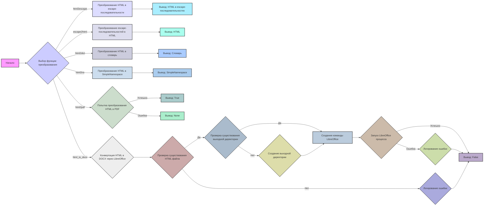
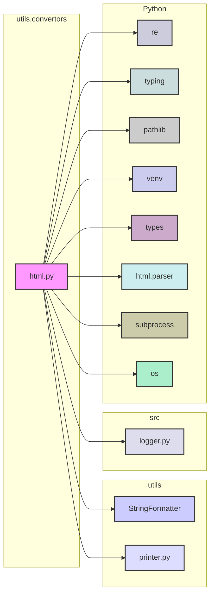

### **Системные инструкции для обработки кода проекта `hypotez`**

=========================================================================================

Описание функциональности и правил для генерации, анализа и улучшения кода. Направлено на обеспечение последовательного и читаемого стиля кодирования, соответствующего требованиям.

---

### **Основные принципы**

#### **1. Общие указания**:
- Соблюдай четкий и понятный стиль кодирования.
- Все изменения должны быть обоснованы и соответствовать установленным требованиям.

#### **2. Комментарии**:
- Используй `#` для внутренних комментариев.
- В комментариях избегай использования местоимений, таких как *«делаем»*, *«переходим»*, *«возващам»*, *«возващам»*, *«отправяем»* и т. д.. Вмсто этого используй точные термины, такие как *«извлеизвлечение»*, *«проверка»*, *«выполннение»*, *«замена»*, *«вызов»*, *«Функця выпоняет»*,*«Функця изменяет значение»*, *«Функця вызывает»*,*«отправка»*
Пример:
```python
# Неправильно:
def function(param: str, param1: Optional[str | dict | str] = None) -> dict | None:
    # Получаем значение параметра
    ...
# Правильно:

def function(param: str, param1: Optional[str | dict | str] = None) -> dict | None:
    # Функция извлекает значение параметра
    ...
# Неправильно:
if not process_directory.exists():
    logger.error(f"Директория не существует: {process_directory}")
    continue  # Переходим к следующей директории, если текущая не существует

if not process_directory.is_dir():
    logger.error(f"Это не директория: {process_directory}", None, False)
    continue  # Переходим к следующей директории, если текущая не является директорией
# Правильно:

if not process_directory.exists():
    logger.error(f"Директория не существует: {process_directory}")
    continue  # Переход к следующей директории, если текущая не существует
if not process_directory.is_dir():
    logger.error(f"Это не директория: {process_directory}", None, False)
    continue  # Переходим к следующей директории, если текущая не является директорией

```
- Документация всех функций, методов и классов должна следовать такому формату: 
    ```python
        def function(param: str, param1: Optional[str | dict | str] = None) -> dict | None:
            """ 
            Args:
                param (str): Описание параметра `param`.
                param1 (Optional[str | dict | str], optional): Описание параметра `param1`. По умолчанию `None`.
    
            Returns:
                dict | None: Описание возващаемого значения. Возвращает словарь или `None`.
    
            Raises:
                SomeError: Описание ситуации, в которой возникает исключение `SomeError`.

            Ехаmple:
                >>> function('param', 'param1')
                {'param': 'param1'}
            """
    ```
- Комментарии и документация должны быть четкими, лаконичными и точными.


### **3. Заголовок файла**:
Обязательно оставляй строки 
```python
## \file path/to/file
# -*- coding: utf-8 -*-
#! .pyenv/bin/python3
```
и
```
"""
...
```rst
 .. module:: src.utils.string.html_simplification
 ```
"""
```
если они есть. Если нет - добавляй.
Пример:
## \file /src/utils/string/html_simplification.py
# -*- coding: utf-8 -*-
#! .pyenv/bin/python3

"""
Модуль для очистки HTML-тегов из текста и упрощения HTML-кода.
===============================================================
Модуль минимизирует HTML-код, удаляет теги и атрибуты, а также обрабатывает
специальные случаи, такие как скрипты, стили и комментарии.
Использует BeautifulSoup для надежного парсинга HTML.

Зависимости:
    - beautifulsoup4 (pip install beautifulsoup4)
    - lxml (опционально, для более быстрого парсинга: pip install lxml)

 .. module:: src.utils.string.html_simplification
"""

#### **4. Форматирование кода**:
- Используй одинарные кавычки. `a:str = 'value'`, `print('Hello World!')`;
- Добавляй пробелы вокруг операторов. Например, `x = 5`;
- Все параметры должны быть аннотированы типами. `def function(param: str, param1: Optional[str | dict | str] = None) -> dict | None:`;
- Не используй `Union`. Вместо этого используй `|`.
- Не используй термин `Product`, только `товар`

#### **5. Логирование**:
- Для логгирования Всегда Используй модуль `logger` из `src.logger.logger`.
- Ошибки должны логироваться с использованием `logger.error`.
Пример:
    ```python
        try:
            ...
        except Exception as ex:
            logger.error('Error while processing data', ех, exc_info=True)
    ```
#### **6. Не используй `Union[]` в коде. Вместо него используй `|`
Например:
```python
x: str | int ...
```

#### **7. Не используй глобальные переменные. Если есть надобность - то поределяй их в классе `Config`.
Пример:

- Неправильно:
```python

state:int = 'global'

def func():
    print(state)

```
- Правильно:
```python

class Config:
    state:int = 'global'

def func():
    print(Config.state)

```

#### **8. Не используй `self` в методах класса. Вместо него используй `cls`.
#### **9. Всегда объявляй переменные вначале функции. Не объявляй их в середине функции.
Пример:
```python
def func():
    # Неправильно
    if condition:
        x = 5
        y = 10
    else:
        x = 20
        y = 30
    # Правильно
    x = None
    y = None
    if condition:
        x = 5
        y = 10
    else:
        x = 20
        y = 30
```
---

### **Основные требования**:

#### **1. Формат ответов в Markdown**:
- Все ответы должны быть выполнены в формате **Markdown**.

#### **2. Формат комментариев**:
- Используй указанный стиль для комментариев и документации в коде.
- Пример:

```python
from typing import Generator, Optional, List
from pathlib import Path


def read_text_file(
    file_path: str | Path,
    as_list: bool = False,
    extensions: Optional[List[str]] = None,
    chunk_size: int = 8192,
) -> Generator[str, None, None] | str | None:
    """
    Считывает содержимое файла (или файлов из каталога) с использованием генератора для экономии памяти.

    Args:
        file_path (str | Path): Путь к файлу или каталогу.
        as_list (bool): Если `True`, возвращает генератор строк.
        extensions (Optional[List[str]]): Список расширений файлов для чтения из каталога.
        chunk_size (int): Размер чанков для чтения файла в байтах.

    Returns:
        Generator[str, None, None] | str | None: Генератор строк, объединенная строка или `None` в случае ошибки.

    Raises:
        Exception: Если возникает ошибка при чтении файла.

    Example:
        >>> from pathlib import Path
        >>> file_path = Path('example.txt')
        >>> content = read_text_file(file_path)
        >>> if content:
        ...    print(f'File content: {content[:100]}...')
        File content: Example text...
    """
    ...
```
- Всегда делай подробные объяснения в комментариях. Избегай расплывчатых терминов, 
- таких как *«получить»* или *«делать»*
-  . Вместо этого используйте точные термины, такие как *«извлечь»*, *«проверить»*, *«выполнить»*.
- Вместо: *«получаем»*, *«возвращаем»*, *«преобразовываем»* используй имя объекта *«функция получае»*, *«переменная возвращает»*, *«код преобразовывает»* 
- Комментарии должны непосредственно предшествовать описываемому блоку кода и объяснять его назначение.

#### **3. Пробелы вокруг операторов присваивания**:
- Всегда добавляйте пробелы вокруг оператора `=`, чтобы повысить читаемость.
- Примеры:
  - **Неправильно**: `x=5`
  - **Правильно**: `x = 5`

#### **4. Использование `j_loads` или `j_loads_ns`**:
- Для чтения JSON или конфигурационных файлов замените стандартное использование `open` и `json.load` на `j_loads` или `j_loads_ns`.
- Пример:

```python
# Неправильно:
with open('config.json', 'r', encoding='utf-8') as f:
    data = json.load(f)

# Правильно:
data = j_loads('config.json')
```

#### **5. Сохранение комментариев**:
- Все существующие комментарии, начинающиеся с `#`, должны быть сохранены без изменений в разделе «Улучшенный код».
- Если комментарий кажется устаревшим или неясным, не изменяйте его. Вместо этого отметьте его в разделе «Изменения».

#### **6. Обработка `...` в коде**:
- Оставляйте `...` как указатели в коде без изменений.
- Не документируйте строки с `...`.
```

#### **7. Аннотации**
Для всех переменных должны быть определены аннотации типа. 
Для всех функций все входные и выходные параметры аннотириваны
Для все параметров должны быть аннотации типа.


### **8. webdriver**
В коде используется webdriver. Он импртируется из модуля `webdriver` проекта `hypotez`
```python
from src.webdirver import Driver, Chrome, Firefox, Playwright, ...
driver = Driver(Firefox)

Пoсле чего может использоваться как

close_banner = {
  "attribute": null,
  "by": "XPATH",
  "selector": "//button[@id = 'closeXButton']",
  "if_list": "first",
  "use_mouse": false,
  "mandatory": false,
  "timeout": 0,
  "timeout_for_event": "presence_of_element_located",
  "event": "click()",
  "locator_description": "Закрываю pop-up окно, если оно не появилось - не страшно (`mandatory`:`false`)"
}

result = driver.execute_locator(close_banner)

#### **9. Не используй `Union[]` в коде. Вместо него используй `|`
Например:
```python
x: str | int ...
```

#### **10. print - это моя встроенная функция.
from src.utils.printer import pprint as print


Вот она:

\file /src/utils/printer.py
-- coding: utf-8 --

#! .pyenv/bin/python3

"""
.. module::  src.utils
:platform: Windows, Unix
:synopsis: Utility functions for pretty printing and text styling.

This module provides functions to print data in a human-readable format with optional text styling, including color, background, and font styles.
"""

import json
import csv
import pandas as pd
from pathlib import Path
from typing import Any
from pprint import pprint as pretty_print

ANSI escape codes

RESET = "\033[0m"

TEXT_COLORS = {
"red": "\033[31m",
"green": "\033[32m",
"blue": "\033[34m",
"yellow": "\033[33m",
"white": "\033[37m",
"cyan": "\033[36m",
"magenta": "\033[35m",
"light_gray": "\033[37m",
"dark_gray": "\033[90m",
"light_red": "\033[91m",
"light_green": "\033[92m",
"light_blue": "\033[94m",
"light_yellow": "\033[93m",
}

Background colors mapping

BG_COLORS = {
"bg_red": "\033[41m",
"bg_green": "\033[42m",
"bg_blue": "\033[44m",
"bg_yellow": "\033[43m",
"bg_white": "\033[47m",
"bg_cyan": "\033[46m",
"bg_magenta": "\033[45m",
"bg_light_gray": "\033[47m",
"bg_dark_gray": "\033[100m",
"bg_light_red": "\033[101m",
"bg_light_green": "\033[102m",
"bg_light_blue": "\033[104m",
"bg_light_yellow": "\033[103m",
}

FONT_STYLES = {
"bold": "\033[1m",
"underline": "\033[4m",
}

def _color_text(text: str, text_color: str = "", bg_color: str = "", font_style: str = "") -> str:
"""Apply color, background, and font styling to the text.

This helper function applies the provided color and font styles to the given text using ANSI escape codes.

:param text: The text to be styled.
:param text_color: The color to apply to the text. Default is an empty string, meaning no color.
:param bg_color: The background color to apply. Default is an empty string, meaning no background color.
:param font_style: The font style to apply to the text. Default is an empty string, meaning no font style.
:return: The styled text as a string.

:example:
    >>> _color_text("Hello, World!", text_color="green", font_style="bold")
    '\033[1m\033[32mHello, World!\033[0m'
"""
return f"{font_style}{text_color}{bg_color}{text}{RESET}"


def pprint(print_data: Any = None, text_color: str = "white", bg_color: str = "", font_style: str = "") -> None:
"""Pretty prints the given data with optional color, background, and font style.

This function formats the input data based on its type and prints it to the console. The data is printed with optional 
text color, background color, and font style based on the specified parameters. The function can handle dictionaries, 
lists, strings, and file paths.

:param print_data: The data to be printed. Can be of type ``None``, ``dict``, ``list``, ``str``, or ``Path``.
:param text_color: The color to apply to the text. Default is 'white'. See :ref:`TEXT_COLORS`.
:param bg_color: The background color to apply to the text. Default is '' (no background color). See :ref:`BG_COLORS`.
:param font_style: The font style to apply to the text. Default is '' (no font style). See :ref:`FONT_STYLES`.
:return: None

:raises: Exception if the data type is unsupported or an error occurs during printing.

:example:
    >>> pprint({"name": "Alice", "age": 30}, text_color="green")
    \033[32m{
        "name": "Alice",
        "age": 30
    }\033[0m

    >>> pprint(["apple", "banana", "cherry"], text_color="blue", font_style="bold")
    \033[34m\033[1mapple\033[0m
    \033[34m\033[1mbanana\033[0m
    \033[34m\033[1mcherry\033[0m

    >>> pprint("text example", text_color="yellow", bg_color="bg_red", font_style="underline")
    \033[4m\033[33m\033[41mtext example\033[0m
"""
if not print_data:
    return
if isinstance(text_color, str):
    text_color = TEXT_COLORS.get(text_color.lower(), TEXT_COLORS["white"])
if isinstance(bg_color, str):
    bg_color = BG_COLORS.get(bg_color.lower(), "")
if isinstance(font_style, str):
    font_style = FONT_STYLES.get(font_style.lower(), "")


try:
    if isinstance(print_data, dict):
        print(_color_text(json.dumps(print_data, indent=4), text_color))
    elif isinstance(print_data, list):
        for item in print_data:
            print(_color_text(str(item), text_color))
    elif isinstance(print_data, (str, Path)) and Path(print_data).is_file():
        ext = Path(print_data).suffix.lower()
        if ext in ['.csv', '.xls']:
            print(_color_text("File reading supported for .csv, .xls only.", text_color))
        else:
            print(_color_text("Unsupported file type.", text_color))
    else:
        print(_color_text(str(print_data), text_color))
except Exception as ex:
    print(_color_text(f"Error: {ex}", text_color=TEXT_COLORS["red"]))
IGNORE_WHEN_COPYING_START
content_copy
download
Use code with caution.
IGNORE_WHEN_COPYING_END

if name == 'main':
pprint({"name": "Alice", "age": 30}, text_color="green")
```

### **Анализ кода `hypotez/src/utils/convertors/html.py`**

#### **1. Блок-схема**



#### **2. Диаграмма зависимостей**



**Объяснение зависимостей:**

*   `re`: Модуль Python для работы с регулярными выражениями, используется в функции `html2pdf` для предобработки CSS.
*   `typing`: Модуль Python для аннотации типов, используется для статической типизации.
*   `pathlib`: Модуль Python для работы с путями к файлам и директориям.
*   `venv`: Модуль Python для создания виртуальных окружений.
*   `types`: Модуль Python для работы с типами, используется для создания `SimpleNamespace`.
*   `html.parser`: Модуль Python для парсинга HTML, используется в функции `html2dict`.
*   `subprocess`: Модуль Python для запуска внешних процессов, используется в функции `html_to_docx` для вызова LibreOffice.
*   `os`: Модуль Python для работы с операционной системой, используется в функции `html_to_docx` для проверки существования файлов и директорий.
*   `src.logger.logger`: Пользовательский модуль для логирования.
*   `src.utils.string.StringFormatter`: Пользовательский модуль для форматирования строк (экранирование HTML).
*   `src.utils.printer.pprint`:  Пользовательский модуль для красивого вывода информации.

#### **3. Объяснение кода**

Файл `/src/utils/convertors/html.py` содержит набор функций для преобразования HTML в различные форматы.

**Импорты:**

*   `re`:  Используется для работы с регулярными выражениями, например, для удаления CSS-псевдоселекторов.
*   `typing`: Используется для аннотации типов.
*   `Path`: Из модуля `pathlib` используется для работы с путями к файлам.
*   `logger`: Из модуля `venv` используется для логирования. Однако, он переопределяется импортом `from src.logger.logger import logger`.
*   `logger`: Из модуля `src.logger.logger` используется для логирования ошибок и информации.
*   `SimpleNamespace`: Из модуля `types` используется для создания объектов, к атрибутам которых можно обращаться как к атрибутам объекта.
*   `HTMLParser`: Из модуля `html.parser` используется для парсинга HTML-кода.
*   `pisa`: Из модуля `xhtml2pdf` используется для конвертации HTML в PDF (предположительно, хотя в коде есть альтернативный способ с `weasyprint`).
*   `subprocess`: Используется для запуска внешних процессов, в частности, LibreOffice для конвертации в DOCX.
*   `os`: Используется для работы с файловой системой.
*   `HTML` from `weasyprint`: Используется для конвертации HTML в PDF. Импортируется с обработкой исключения.

**Функции:**

*   `html2escape(input_str: str) -> str`:
    *   **Аргументы:**
        *   `input_str` (str): HTML-код для преобразования.
    *   **Возвращаемое значение:**
        *   `str`: HTML, преобразованный в escape-последовательности.
    *   **Назначение:**
        *   Преобразует HTML-код в escape-последовательности, используя `StringFormatter.escape_html_tags`.
    *   **Пример:**
        ```python
        html = "<p>Hello, world!</p>"
        result = html2escape(html)
        print(result)  # Вывод: &lt;p&gt;Hello, world!&lt;/p&gt;
        ```

*   `escape2html(input_str: str) -> str`:
    *   **Аргументы:**
        *   `input_str` (str): Строка с escape-последовательностями.
    *   **Возвращаемое значение:**
        *   `str`: HTML-код, полученный из escape-последовательностей.
    *   **Назначение:**
        *   Преобразует escape-последовательности обратно в HTML-код, используя `StringFormatter.unescape_html_tags`.
    *   **Пример:**
        ```python
        escaped = "&lt;p&gt;Hello, world!&lt;/p&gt;"
        result = escape2html(escaped)
        print(result)  # Вывод: <p>Hello, world!</p>
        ```

*   `html2dict(html_str: str) -> Dict[str, str]`:
    *   **Аргументы:**
        *   `html_str` (str): HTML-код для преобразования.
    *   **Возвращаемое значение:**
        *   `Dict[str, str]`: Словарь, где ключи - теги HTML, а значения - их содержимое.
    *   **Назначение:**
        *   Преобразует HTML-код в словарь, используя класс `HTMLToDictParser`.
    *   **Внутренний класс `HTMLToDictParser`:**
        *   Наследуется от `HTMLParser`.
        *   `__init__`: Инициализирует словарь `result` и `current_tag`.
        *   `handle_starttag`: Функция, которая вызывается при обнаружении открывающего тега. Сохраняет имя тега в `current_tag`.
        *   `handle_endtag`: Функция, которая вызывается при обнаружении закрывающего тега. Обнуляет `current_tag`.
        *   `handle_data`: Функция, которая вызывается при обнаружении текстовых данных. Если `current_tag` не `None`, добавляет данные в словарь `result`.
    *   **Пример:**
        ```python
        html = "<p>Hello</p><a href='link'>World</a>"
        result = html2dict(html)
        print(result)  # Вывод: {'p': 'Hello', 'a': 'World'}
        ```

*   `html2ns(html_str: str) -> SimpleNamespace`:
    *   **Аргументы:**
        *   `html_str` (str): HTML-код для преобразования.
    *   **Возвращаемое значение:**
        *   `SimpleNamespace`: Объект `SimpleNamespace`, где атрибуты - теги HTML, а значения - их содержимое.
    *   **Назначение:**
        *   Преобразует HTML-код в объект `SimpleNamespace`, используя функцию `html2dict`.
    *   **Пример:**
        ```python
        html = "<p>Hello</p><a href='link'>World</a>"
        result = html2ns(html)
        print(result.p)  # Вывод: Hello
        print(result.a)  # Вывод: World
        ```

*   `html2pdf(html_str: str, pdf_file: str | Path) -> bool | None`:
    *   **Аргументы:**
        *   `html_str` (str): HTML-код для преобразования.
        *   `pdf_file` (str | Path): Путь к PDF-файлу.
    *   **Возвращаемое значение:**
        *   `bool | None`: `True`, если преобразование прошло успешно, `None` - в случае ошибки.
    *   **Назначение:**
        *   Преобразует HTML-код в PDF-файл, используя `WeasyPrint`.
        *   Обрабатывает исключения при конвертации и логирует ошибки.

*   `html_to_docx(html_file: str, output_docx: Path | str) -> bool`:
    *   **Аргументы:**
        *   `html_file` (str): Путь к HTML-файлу.
        *   `output_docx` (str | Path): Путь к DOCX-файлу.
    *   **Возвращаемое значение:**
        *   `bool`: `True`, если преобразование прошло успешно, `False` - в случае ошибки.
    *   **Назначение:**
        *   Преобразует HTML-файл в DOCX-файл, используя LibreOffice.
        *   Проверяет существование входного HTML-файла и выходной директории.
        *   Формирует команду для запуска LibreOffice в headless режиме.
        *   Логирует ошибки, если процесс завершается с ошибкой или LibreOffice не найден.

**Переменные:**

*   В основном используются локальные переменные внутри функций для хранения промежуточных результатов.

**Потенциальные ошибки и области для улучшения:**

*   В функции `html2pdf` используется `try...except` для обработки ошибок `WeasyPrint`.  Однако, если `WeasyPrint` не установлен, то `...` не реализован.
*   В функции `html_to_docx` используется `subprocess.run` для запуска LibreOffice. Важно убедиться, что LibreOffice установлен и доступен в системном PATH. Отсутствие проверки версии LibreOffice может привести к проблемам совместимости.
*   Функция `html2dict` извлекает только текст из тегов, игнорируя атрибуты.
*   В коде встречается как `logger` из `venv`, так и `logger` из `src.logger.logger`. Необходимо убедиться, что используется правильный объект логгера.

**Взаимосвязи с другими частями проекта:**

*   Использует модуль `src.logger.logger` для логирования.
*   Использует модуль `src.utils.string.StringFormatter` для экранирования HTML.
*   Использует модуль `src.utils.printer.pprint` для красивого вывода информации.

Этот модуль предоставляет полезные утилиты для работы с HTML, позволяя преобразовывать его в различные форматы, что может быть полезно для обработки и анализа веб-страниц в проекте `hypotez`.