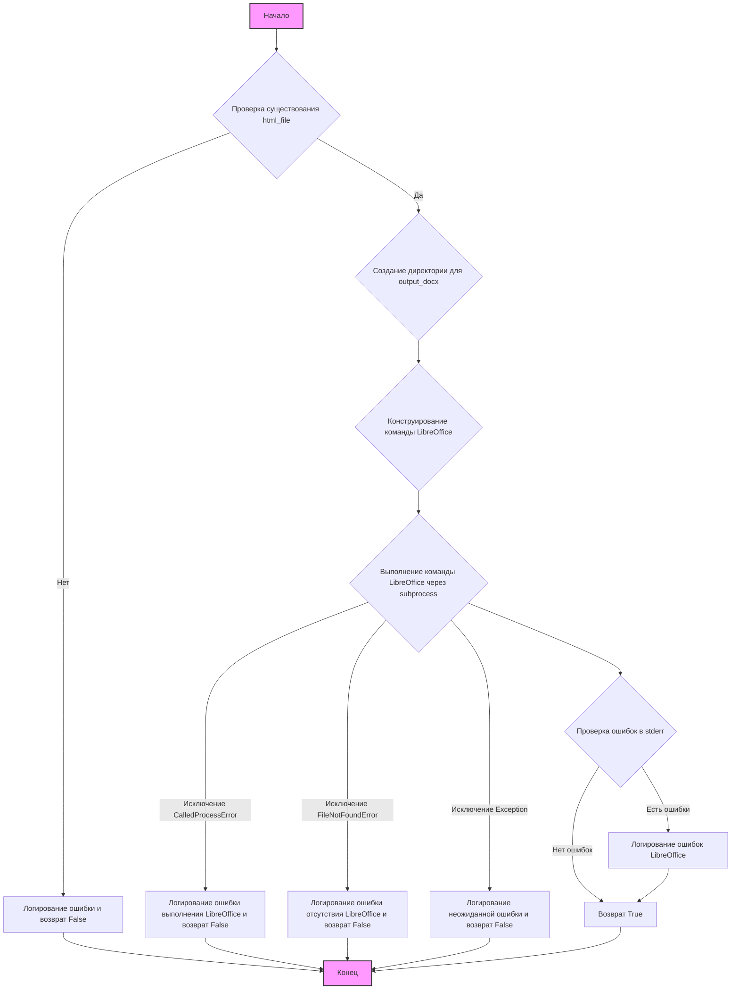

### **Системные инструкции для обработки кода проекта `hypotez`**

=========================================================================================

Описание функциональности и правил для генерации, анализа и улучшения кода. Направлено на обеспечение последовательного и читаемого стиля кодирования, соответствующего требованиям.

---

### **Основные принципы**

#### **1. Общие указания**:
- Соблюдай четкий и понятный стиль кодирования.
- Все изменения должны быть обоснованы и соответствовать установленным требованиям.

#### **2. Комментарии**:
- Используй `#` для внутренних комментариев.
- Документация всех функций, методов и классов должна следовать такому формату: 
    ```python
        def function(param: str, param1: Optional[str | dict | str] = None) -> dict | None:
            """ 
            Args:
                param (str): Описание параметра `param`.
                param1 (Optional[str | dict | str], optional): Описание параметра `param1`. По умолчанию `None`.
    
            Returns:
                dict | None: Описание возвращаемого значения. Возвращает словарь или `None`.
    
            Raises:
                SomeError: Описание ситуации, в которой возникает исключение `SomeError`.

            Ехаmple:
                >>> function('param', 'param1')
                {'param': 'param1'}
            """
    ```
- Комментарии и документация должны быть четкими, лаконичными и точными.

#### **3. Форматирование кода**:
- Используй одинарные кавычки. `a:str = 'value'`, `print('Hello World!')`;
- Добавляй пробелы вокруг операторов. Например, `x = 5`;
- Все параметры должны быть аннотированы типами. `def function(param: str, param1: Optional[str | dict | str] = None) -> dict | None:`;
- Не используй `Union`. Вместо этого используй `|`.

#### **4. Логирование**:
- Для логгирования Всегда Используй модуль `logger` из `src.logger.logger`.
- Ошибки должны логироваться с использованием `logger.error`.
Пример:
    ```python
        try:
            ...
        except Exception as ex:
            logger.error('Error while processing data', ех, exc_info=True)
    ```
#### **5 Не используй `Union[]` в коде. Вместо него используй `|`
Например:
```python
x: str | int ...
```


---

### **Основные требования**:

#### **1. Формат ответов в Markdown**:
- Все ответы должны быть выполнены в формате **Markdown**.

#### **2. Формат комментариев**:
- Используй указанный стиль для комментариев и документации в коде.
- Пример:

```python
from typing import Generator, Optional, List
from pathlib import Path


def read_text_file(
    file_path: str | Path,
    as_list: bool = False,
    extensions: Optional[List[str]] = None,
    chunk_size: int = 8192,
) -> Generator[str, None, None] | str | None:
    """
    Считывает содержимое файла (или файлов из каталога) с использованием генератора для экономии памяти.

    Args:
        file_path (str | Path): Путь к файлу или каталогу.
        as_list (bool): Если `True`, возвращает генератор строк.
        extensions (Optional[List[str]]): Список расширений файлов для чтения из каталога.
        chunk_size (int): Размер чанков для чтения файла в байтах.

    Returns:
        Generator[str, None, None] | str | None: Генератор строк, объединенная строка или `None` в случае ошибки.

    Raises:
        Exception: Если возникает ошибка при чтении файла.

    Example:
        >>> from pathlib import Path
        >>> file_path = Path('example.txt')
        >>> content = read_text_file(file_path)
        >>> if content:
        ...    print(f'File content: {content[:100]}...')
        File content: Example text...
    """
    ...
```
- Всегда делай подробные объяснения в комментариях. Избегай расплывчатых терминов, 
- таких как *«получить»* или *«делать»*. Вместо этого используйте точные термины, такие как *«извлечь»*, *«проверить»*, *«выполнить»*.
- Вместо: *«получаем»*, *«возвращаем»*, *«преобразовываем»* используй имя объекта *«функция получае»*, *«переменная возвращает»*, *«код преобразовывает»* 
- Комментарии должны непосредственно предшествовать описываемому блоку кода и объяснять его назначение.

#### **3. Пробелы вокруг операторов присваивания**:
- Всегда добавляйте пробелы вокруг оператора `=`, чтобы повысить читаемость.
- Примеры:
  - **Неправильно**: `x=5`
  - **Правильно**: `x = 5`

#### **4. Использование `j_loads` или `j_loads_ns`**:
- Для чтения JSON или конфигурационных файлов замените стандартное использование `open` и `json.load` на `j_loads` или `j_loads_ns`.
- Пример:

```python
# Неправильно:
with open('config.json', 'r', encoding='utf-8') as f:
    data = json.load(f)

# Правильно:
data = j_loads('config.json')
```

#### **5. Сохранение комментариев**:
- Все существующие комментарии, начинающиеся с `#`, должны быть сохранены без изменений в разделе «Улучшенный код».
- Если комментарий кажется устаревшим или неясным, не изменяйте его. Вместо этого отметьте его в разделе «Изменения».

#### **6. Обработка `...` в коде**:
- Оставляйте `...` как указатели в коде без изменений.
- Не документируйте строки с `...`.
```

#### **7. Аннотации**
Для всех переменных должны быть определены аннотации типа. 
Для всех функций все входные и выходные параметры аннотириваны
Для все параметров должны быть аннотации типа.


### **8. webdriver**
В коде используется webdriver. Он импртируется из модуля `webdriver` проекта `hypotez`
```python
from src.webdirver import Driver, Chrome, Firefox, Playwright, ...
driver = Driver(Firefox)

Пoсле чего может использоваться как

close_banner = {
  "attribute": null,
  "by": "XPATH",
  "selector": "//button[@id = 'closeXButton']",
  "if_list": "first",
  "use_mouse": false,
  "mandatory": false,
  "timeout": 0,
  "timeout_for_event": "presence_of_element_located",
  "event": "click()",
  "locator_description": "Закрываю pop-up окно, если оно не появилось - не страшно (`mandatory`:`false`)"
}

result = driver.execute_locator(close_banner)
```

## Анализ кода `hypotez/src/utils/convertors/html2docx.py`

### 1. Блок-схема:



**Примеры для каждого логического блока:**

*   **A (Начало)**: Начало выполнения функции `html_to_docx`.
*   **B (Проверка существования `html_file`)**: Проверяет, существует ли файл, переданный в аргументе `html_file`. Пример: `os.path.exists(html_file)`.
*   **C (Создание директории для `output_docx`)**: Создает директорию, в которой будет сохранен сконвертированный DOCX файл, если её не существует. Пример: `os.makedirs(output_dir)`.
*   **D (Конструирование команды LibreOffice)**: Формирует список аргументов для запуска LibreOffice в режиме командной строки. Пример: `command = ["soffice", "--headless", "--convert-to", "docx:HTML", html_file, "--outdir", str(output_dir)]`.
*   **F (Выполнение команды LibreOffice через subprocess)**: Запускает процесс LibreOffice с помощью модуля `subprocess`. Пример: `process = subprocess.run(command, check=True, capture_output=True, text=True)`.
*   **G (Проверка ошибок в `stderr`)**: Проверяет, есть ли сообщения об ошибках в стандартном потоке ошибок процесса LibreOffice. Пример: `if process.stderr:`.
*   **H (Логирование ошибок LibreOffice)**: Логирует сообщения об ошибках, полученные от LibreOffice. Пример: `logger.error(f"LibreOffice conversion errors: {process.stderr}")`.
*   **I (Возврат `True`)**: Возвращает `True`, если конвертация прошла успешно.
*   **J (Логирование ошибки выполнения LibreOffice и возврат `False`)**: Логирует ошибку, возникшую во время выполнения команды LibreOffice (например, если команда завершилась с ненулевым кодом возврата) и возвращает `False`.
*   **K (Логирование ошибки отсутствия LibreOffice и возврат `False`)**: Логирует ошибку, если исполняемый файл LibreOffice не найден, и возвращает `False`.
*   **L (Логирование неожиданной ошибки и возврат `False`)**: Логирует любую другую возникшую ошибку и возвращает `False`.
*   **E (Логирование ошибки и возврат `False`)**:  Логирует ошибку, если входной HTML-файл не найден, и возвращает `False`.
*   **M (Конец)**: Завершение выполнения функции.

### 2. Диаграмма:

```mermaid
graph TD
    A[html2docx.py: html_to_docx(html_file, output_docx)] --> B(subprocess);
    A --> C(pathlib.Path);
    A --> D(src.logger.logger);
    A --> E(os);

    B --> F[subprocess.run()];
    C --> G[Path(output_docx).parent];
    D --> H[logger.error()];
    E --> I[os.path.exists()];
    E --> J[os.makedirs()];
    style A fill:#f9f,stroke:#333,stroke-width:2px
```

**Объяснение зависимостей:**

*   **`subprocess`**: Используется для запуска внешнего процесса LibreOffice. Функция `subprocess.run()` выполняет команду и возвращает результат.
*   **`pathlib.Path`**: Используется для работы с путями к файлам и директориям. В данном случае, используется для определения родительской директории выходного файла.
*   **`src.logger.logger`**: Используется для логирования ошибок и предупреждений. Функция `logger.error()` записывает сообщения об ошибках.
*   **`os`**: Используется для работы с операционной системой, в частности, для проверки существования файла и создания директорий. `os.path.exists()` проверяет, существует ли файл или директория по указанному пути. `os.makedirs()` создает директорию (и все необходимые родительские директории).

### 3. Объяснение:

*   **Импорты**:
    *   `subprocess`: Этот модуль позволяет запускать новые процессы, подключаться к их входным/выходным/ошибочным потокам и получать их коды возврата. В данном случае, он используется для запуска LibreOffice из Python.
    *   `pathlib.Path`: Этот модуль предоставляет способ представления путей к файлам и директориям, а также выполняет операции с ними.
    *   `src.logger.logger`: Это модуль логирования, используемый для записи информации о работе программы, включая ошибки.  Он является частью проекта `hypotez` и предназначен для централизованного ведения логов.
    *   `os`: Модуль, предоставляющий функции для взаимодействия с операционной системой, такие как проверка существования файлов и создание директорий.

*   **Функции**:
    *   `html_to_docx(html_file: str, output_docx: Path | str) -> bool`:
        *   Аргументы:
            *   `html_file (str)`: Путь к входному HTML-файлу.
            *   `output_docx (Path | str)`: Путь к выходному DOCX-файлу.
        *   Возвращаемое значение: `bool`. Возвращает `True`, если преобразование выполнено успешно, и `False` в противном случае.
        *   Назначение: Эта функция преобразует HTML-файл в документ Word (DOCX) с помощью LibreOffice. Сначала проверяется существование входного HTML-файла и создается выходная директория, если она отсутствует. Затем формируется команда для запуска LibreOffice в режиме командной строки с указанием входного файла, формата преобразования и выходной директории. После этого команда выполняется с использованием модуля `subprocess`.  В случае успеха возвращается `True`, иначе логируется ошибка и возвращается `False`.
        *   Примеры:
            ```python
            html_file = "template.html"
            output_docx = Path("output_libreoffice.docx")
            if html_to_docx(html_file, output_docx):
                print(f"Successfully converted {html_file} to {output_docx} using LibreOffice!")
            else:
                print(f"Failed to convert {html_file} to {output_docx} using LibreOffice.")
            ```

*   **Переменные**:
    *   `html_file (str)`: Путь к входному HTML-файлу.
    *   `output_docx (Path | str)`: Путь к выходному DOCX-файлу.
    *   `command (List[str])`: Список, содержащий команду для запуска LibreOffice и ее аргументы.
    *   `process (subprocess.CompletedProcess)`: Объект, содержащий информацию о запущенном процессе LibreOffice, включая код возврата, стандартный вывод и стандартный поток ошибок.
    *   `output_dir (Path)`:  Путь к директории, в которой будет сохранен сконвертированный DOCX файл.

*   **Потенциальные ошибки и области для улучшения**:
    *   **Зависимость от LibreOffice**: Код напрямую зависит от наличия LibreOffice в системе и доступности команды `soffice` в переменной `PATH`.  Необходимо предусмотреть обработку ситуаций, когда LibreOffice не установлен или недоступен.
    *   **Обработка ошибок**:  В блоках `except` выполняется логирование ошибок с использованием `logger.error`, но не предпринимается никаких действий для восстановления после ошибки или предоставления более информативного сообщения пользователю.  Стоит рассмотреть возможность добавления обработки специфических ошибок и предоставления более детальных инструкций пользователю (например, как установить LibreOffice).
    *   **Отсутствие обработки исключений при создании директории**: При создании директории `os.makedirs(output_dir)` не обрабатываются возможные исключения (например, отсутствие прав доступа).
    *   **Безопасность**:  Формирование команды для `subprocess` может быть уязвимым для внедрения команд, если `html_file` или `output_docx`  содержат специальные символы. Следует использовать `shlex.quote` для экранирования аргументов.
    *   **Логирование**: Можно добавить логирование на уровне `DEBUG` для записи команды LibreOffice и другой полезной информации для отладки.

*   **Взаимосвязи с другими частями проекта**:
    *   Функция `html_to_docx` использует модуль `src.logger.logger` для логирования, что обеспечивает централизованное ведение логов в проекте `hypotez`.  Это позволяет отслеживать ошибки и предупреждения, связанные с конвертацией HTML в DOCX.  Если в проекте есть другие модули, которые также используют `src.logger.logger`, то все логи будут собираться в одном месте, что облегчает анализ и отладку.  Также функция использует `pathlib.Path`, что позволяет единообразно работать с файловыми путями в рамках проекта.