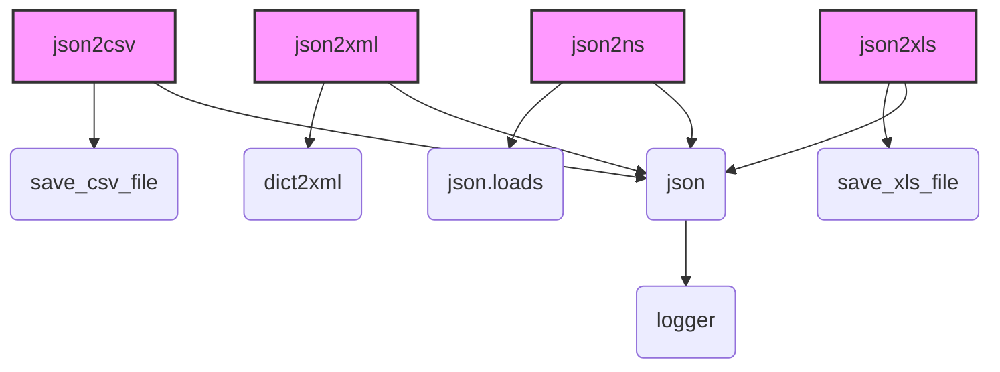

### **Системные инструкции для обработки кода проекта `hypotez`**

=========================================================================================

Описание функциональности и правил для генерации, анализа и улучшения кода. Направлено на обеспечение последовательного и читаемого стиля кодирования, соответствующего требованиям.

---

### **Основные принципы**

#### **1. Общие указания**:
- Соблюдай четкий и понятный стиль кодирования.
- Все изменения должны быть обоснованы и соответствовать установленным требованиям.

#### **2. Комментарии**:
- Используй `#` для внутренних комментариев.
- Документация всех функций, методов и классов должна следовать такому формату: 
    ```python
        def function(param: str, param1: Optional[str | dict | str] = None) -> dict | None:
            """ 
            Args:
                param (str): Описание параметра `param`.
                param1 (Optional[str | dict | str], optional): Описание параметра `param1`. По умолчанию `None`.
    
            Returns:
                dict | None: Описание возвращаемого значения. Возвращает словарь или `None`.
    
            Raises:
                SomeError: Описание ситуации, в которой возникает исключение `SomeError`.

            Ехаmple:
                >>> function('param', 'param1')
                {'param': 'param1'}
            """
    ```
- Комментарии и документация должны быть четкими, лаконичными и точными.

#### **3. Форматирование кода**:
- Используй одинарные кавычки. `a:str = 'value'`, `print('Hello World!')`;
- Добавляй пробелы вокруг операторов. Например, `x = 5`;
- Все параметры должны быть аннотированы типами. `def function(param: str, param1: Optional[str | dict | str] = None) -> dict | None:`;
- Не используй `Union`. Вместо этого используй `|`.

#### **4. Логирование**:
- Для логгирования Всегда Используй модуль `logger` из `src.logger.logger`.
- Ошибки должны логироваться с использованием `logger.error`.
Пример:
    ```python
        try:
            ...
        except Exception as ex:
            logger.error('Error while processing data', ех, exc_info=True)
    ```
#### **5 Не используй `Union[]` в коде. Вместо него используй `|`
Например:
```python
x: str | int ...
```


---

### **Основные требования**:

#### **1. Формат ответов в Markdown**:
- Все ответы должны быть выполнены в формате **Markdown**.

#### **2. Формат комментариев**:
- Используй указанный стиль для комментариев и документации в коде.
- Пример:

```python
from typing import Generator, Optional, List
from pathlib import Path


def read_text_file(
    file_path: str | Path,
    as_list: bool = False,
    extensions: Optional[List[str]] = None,
    chunk_size: int = 8192,
) -> Generator[str, None, None] | str | None:
    """
    Считывает содержимое файла (или файлов из каталога) с использованием генератора для экономии памяти.

    Args:
        file_path (str | Path): Путь к файлу или каталогу.
        as_list (bool): Если `True`, возвращает генератор строк.
        extensions (Optional[List[str]]): Список расширений файлов для чтения из каталога.
        chunk_size (int): Размер чанков для чтения файла в байтах.

    Returns:
        Generator[str, None, None] | str | None: Генератор строк, объединенная строка или `None` в случае ошибки.

    Raises:
        Exception: Если возникает ошибка при чтении файла.

    Example:
        >>> from pathlib import Path
        >>> file_path = Path('example.txt')
        >>> content = read_text_file(file_path)
        >>> if content:
        ...    print(f'File content: {content[:100]}...')
        File content: Example text...
    """
    ...
```
- Всегда делай подробные объяснения в комментариях. Избегай расплывчатых терминов, 
- таких как *«получить»* или *«делать»*. Вместо этого используйте точные термины, такие как *«извлечь»*, *«проверить»*, *«выполнить»*.
- Вместо: *«получаем»*, *«возвращаем»*, *«преобразовываем»* используй имя объекта *«функция получае»*, *«переменная возвращает»*, *«код преобразовывает»* 
- Комментарии должны непосредственно предшествовать описываемому блоку кода и объяснять его назначение.

#### **3. Пробелы вокруг операторов присваивания**:
- Всегда добавляйте пробелы вокруг оператора `=`, чтобы повысить читаемость.
- Примеры:
  - **Неправильно**: `x=5`
  - **Правильно**: `x = 5`

#### **4. Использование `j_loads` или `j_loads_ns`**:
- Для чтения JSON или конфигурационных файлов замените стандартное использование `open` и `json.load` на `j_loads` или `j_loads_ns`.
- Пример:

```python
# Неправильно:
with open('config.json', 'r', encoding='utf-8') as f:
    data = json.load(f)

# Правильно:
data = j_loads('config.json')
```

#### **5. Сохранение комментариев**:
- Все существующие комментарии, начинающиеся с `#`, должны быть сохранены без изменений в разделе «Улучшенный код».
- Если комментарий кажется устаревшим или неясным, не изменяйте его. Вместо этого отметьте его в разделе «Изменения».

#### **6. Обработка `...` в коде**:
- Оставляйте `...` как указатели в коде без изменений.
- Не документируйте строки с `...`.
```

#### **7. Аннотации**
Для всех переменных должны быть определены аннотации типа. 
Для всех функций все входные и выходные параметры аннотириваны
Для все параметров должны быть аннотации типа.


### **8. webdriver**
В коде используется webdriver. Он импртируется из модуля `webdriver` проекта `hypotez`
```python
from src.webdirver import Driver, Chrome, Firefox, Playwright, ...
driver = Driver(Firefox)

Пoсле чего может использоваться как

close_banner = {
  "attribute": null,
  "by": "XPATH",
  "selector": "//button[@id = 'closeXButton']",
  "if_list": "first",
  "use_mouse": false,
  "mandatory": false,
  "timeout": 0,
  "timeout_for_event": "presence_of_element_located",
  "event": "click()",
  "locator_description": "Закрываю pop-up окно, если оно не появилось - не страшно (`mandatory`:`false`)"
}

result = driver.execute_locator(close_banner)
```

## Анализ кода `hypotez/src/utils/convertors/json.py`

### 1. Блок-схема

```mermaid
graph TD
    A[Начало: `json2csv`, `json2ns`, `json2xml`, `json2xls`] --> B{Определение типа `json_data`};
    B -- dict --> C[Обработка как словарь];
    B -- str --> D[JSON парсинг: `json.loads(json_data)`];
    B -- list --> E[Обработка как список];
    B -- Path --> F[Чтение JSON файла: `open(json_data)` -> `json.load(json_file)`];
    B -- other --> G[Вызов исключения `ValueError`];

    C --> H{Обработка данных};
    D --> H;
    E --> H;
    F --> H;
    G --> I[Логирование ошибки];
    H --> J{Выбор преобразования};

    J -- `json2csv` --> K[Сохранение в CSV: `save_csv_file`];
    J -- `json2ns` --> L[Преобразование в SimpleNamespace];
    J -- `json2xml` --> M[Преобразование в XML: `dict2xml`];
    J -- `json2xls` --> N[Сохранение в XLS: `save_xls_file`];

    K --> O[Успех: return True];
    L --> P[return SimpleNamespace];
    M --> Q[return XML string];
    N --> R[Успех: return True];

    O --> S[Конец];
    P --> S;
    Q --> S;
    R --> S;
    I --> S;
```

**Примеры для логических блоков:**

*   **Определение типа `json_data` (B):**
    *   `json_data` является словарем: `json2csv({"key": "value"}, "output.csv")`
    *   `json_data` является строкой: `json2csv('{"key": "value"}', "output.csv")`
    *   `json_data` является списком: `json2csv([{"key": "value"}], "output.csv")`
    *   `json_data` является путем к файлу: `json2csv(Path("input.json"), "output.csv")`
    *   `json_data` - недопустимый тип: `json2csv(123, "output.csv")` (вызывает `ValueError`)
*   **Чтение JSON файла (F):**

    ```python
    # Предполагаем, что input.json содержит '{"key": "value"}'
    with open('input.json', 'w', encoding='utf-8') as f:
        json.dump({"key": "value"}, f)
    json2csv(Path("input.json"), "output.csv")
    ```
*   **Преобразование в SimpleNamespace (L):**

    ```python
    result = json2ns('{"key": "value"}')
    print(result.key)  # Вывод: value
    ```
*   **Преобразование в XML (M):**

    ```python
    result = json2xml('{"key": "value"}', root_tag="root")
    print(result)  # Вывод: <?xml version="1.0" encoding="utf-8"?><root><key>value</key></root>
    ```

### 2. Диаграмма


```mermaid
graph TD
    A[json2csv] --> B(save_csv_file);
    C[json2ns] --> D(json.loads);
    E[json2xml] --> F(dict2xml);
    G[json2xls] --> H(save_xls_file);

    A --> I(json);
    E --> I;
    G --> I;
    C --> I;

    I --> J(logger);

    style A fill:#f9f,stroke:#333,stroke-width:2px
    style C fill:#f9f,stroke:#333,stroke-width:2px
    style E fill:#f9f,stroke:#333,stroke-width:2px
    style G fill:#f9f,stroke:#333,stroke-width:2px
```

**Объяснение зависимостей:**

*   `json2csv` использует `save_csv_file` для сохранения данных в формате CSV.
*   `json2ns` использует `json.loads` для парсинга JSON из строки и `SimpleNamespace` для преобразования в объект.
*   `json2xml` использует `dict2xml` для преобразования JSON в формат XML.
*   `json2xls` использует `save_xls_file` для сохранения данных в формате XLS.
*   Все функции используют `json` для обработки JSON данных и `logger` для логирования ошибок.

### 3. Объяснение

**Импорты:**

*   `json`: Стандартная библиотека Python для работы с JSON данными (парсинг и сериализация).
*   `csv`: Стандартная библиотека Python для работы с CSV файлами.
*   `types.SimpleNamespace`: Класс для создания объектов, атрибуты которых могут быть доступны через точку.
*   `pathlib.Path`: Класс для представления путей к файлам и каталогам.
*   `typing.List`, `typing.Dict`: Используются для аннотации типов.
*   `src.utils.csv.save_csv_file`: Функция для сохранения данных в CSV файл.
*   `src.utils.jjson.j_dumps`: Функция для преобразования Python объектов в JSON строку.
*   `src.utils.xls.save_xls_file`: Функция для сохранения данных в XLS файл.
*   `src.utils.convertors.dict.dict2xml`: Функция для преобразования словаря в XML строку.
*   `src.logger.logger`: Модуль логирования.

**Функции:**

*   **`json2csv(json_data: str | list | dict | Path, csv_file_path: str | Path) -> bool`**:
    *   **Аргументы:**
        *   `json_data`: JSON данные в виде строки, списка словарей, словаря или пути к JSON файлу.
        *   `csv_file_path`: Путь к CSV файлу для записи.
    *   **Возвращаемое значение:** `True` в случае успеха, `False` в противном случае.
    *   **Назначение:** Преобразует JSON данные в CSV формат.
    *   **Пример:**

        ```python
        json2csv('[{"ключ1": "значение1", "ключ2": "значение2"}]', "output.csv")
        ```
*   **`json2ns(json_data: str | dict | Path) -> SimpleNamespace`**:
    *   **Аргументы:**
        *   `json_data`: JSON данные в виде строки, словаря или пути к JSON файлу.
    *   **Возвращаемое значение:** Объект `SimpleNamespace`, представляющий JSON данные.
    *   **Назначение:** Преобразует JSON данные в объект `SimpleNamespace` для удобного доступа к данным через атрибуты.
    *   **Пример:**

        ```python
        data = json2ns('{"ключ1": "значение1", "ключ2": "значение2"}')
        print(data.ключ1)  # Вывод: значение1
        ```
*   **`json2xml(json_data: str | dict | Path, root_tag: str = "root") -> str`**:
    *   **Аргументы:**
        *   `json_data`: JSON данные в виде строки, словаря или пути к JSON файлу.
        *   `root_tag`: Корневой тег для XML документа.
    *   **Возвращаемое значение:** Строка, представляющая XML документ.
    *   **Назначение:** Преобразует JSON данные в XML формат.  Использует функцию `dict2xml` из `src.utils.convertors.dict`.
    *   **Пример:**

        ```python
        xml_string = json2xml('{"ключ1": "значение1", "ключ2": "значение2"}', root_tag="данные")
        print(xml_string)
        # Вывод: <?xml version="1.0" encoding="utf-8"?><данные><ключ1>значение1</ключ1><ключ2>значение2</ключ2></данные>
        ```
*   **`json2xls(json_data: str | list | dict | Path, xls_file_path: str | Path) -> bool`**:
    *   **Аргументы:**
        *   `json_data`: JSON данные в виде строки, списка словарей, словаря или пути к JSON файлу.
        *   `xls_file_path`: Путь к XLS файлу для записи.
    *   **Возвращаемое значение:** `True` в случае успеха, `False` в противном случае.
    *   **Назначение:** Преобразует JSON данные в XLS формат.  Использует функцию `save_xls_file` из `src.utils.xls`.
    *   **Пример:**

        ```python
        json2xls('[{"ключ1": "значение1", "ключ2": "значение2"}]', "output.xls")
        ```

**Переменные:**

*   `data`: Используется во всех функциях для хранения преобразованных JSON данных. Тип зависит от входных данных `json_data`.
*   `json_file`: Используется для хранения файлового объекта при чтении JSON файла.
*   `ex`: Используется для хранения объекта исключения при обработке ошибок.
*    `csv_file_path`: Используется для хранения пути к файлу.

**Потенциальные ошибки и области для улучшения:**

*   В функциях `json2csv` и `json2ns` повторяется код обработки `json_data`. Можно вынести эту логику в отдельную функцию.
*   В `json2xls` не указана переменная `file_path`. Следует использовать `xls_file_path`.
*   Обработка исключений: вместо `except Exception as ex:` лучше использовать более конкретные типы исключений.
*   Отсутствует обработка кодировки при чтении JSON-файла в функциях `json2ns` и `json2xls`, что может привести к ошибкам при работе с файлами, содержащими символы, отличные от ASCII.
*   В `json2xls` отсутствует логирование в блоке `except Exception`.

**Цепочка взаимосвязей с другими частями проекта:**

*   Этот модуль является частью подсистемы конвертации данных `src.utils.convertors`.
*   Использует модули `src.utils.csv`, `src.utils.jjson`, `src.utils.xls`, `src.utils.convertors.dict` для выполнения конкретных операций конвертации.
*   Использует модуль `src.logger.logger` для логирования ошибок.

```mermaid
flowchart TD
    Start --> A[src.utils.convertors.json];
    A --> B[src.utils.csv];
    A --> C[src.utils.jjson];
    A --> D[src.utils.xls];
    A --> E[src.utils.convertors.dict];
    A --> F[src.logger.logger];
    style A fill:#f9f,stroke:#333,stroke-width:2px