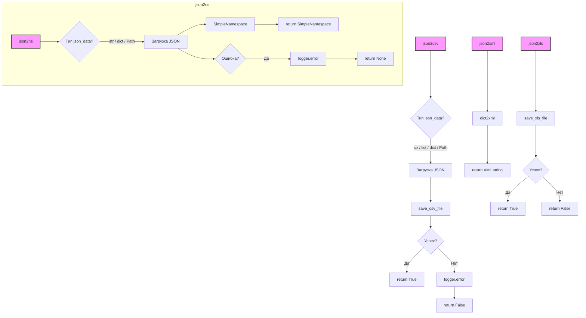

### **Системные инструкции для обработки кода проекта `hypotez`**

=========================================================================================

Описание функциональности и правил для генерации, анализа и улучшения кода. Направлено на обеспечение последовательного и читаемого стиля кодирования, соответствующего требованиям.

---

### **Основные принципы**

#### **1. Общие указания**:
- Соблюдай четкий и понятный стиль кодирования.
- Все изменения должны быть обоснованы и соответствовать установленным требованиям.

#### **2. Комментарии**:
- Используй `#` для внутренних комментариев.
- Документация всех функций, методов и классов должна следовать такому формату: 
    ```python
        def function(param: str, param1: Optional[str | dict | str] = None) -> dict | None:
            """ 
            Args:
                param (str): Описание параметра `param`.
                param1 (Optional[str | dict | str], optional): Описание параметра `param1`. По умолчанию `None`.
    
            Returns:
                dict | None: Описание возвращаемого значения. Возвращает словарь или `None`.
    
            Raises:
                SomeError: Описание ситуации, в которой возникает исключение `SomeError`.

            Ехаmple:
                >>> function('param', 'param1')
                {'param': 'param1'}
            """
    ```
- Комментарии и документация должны быть четкими, лаконичными и точными.

#### **3. Форматирование кода**:
- Используй одинарные кавычки. `a:str = 'value'`, `print('Hello World!')`;
- Добавляй пробелы вокруг операторов. Например, `x = 5`;
- Все параметры должны быть аннотированы типами. `def function(param: str, param1: Optional[str | dict | str] = None) -> dict | None:`;
- Не используй `Union`. Вместо этого используй `|`.

#### **4. Логирование**:
- Для логгирования Всегда Используй модуль `logger` из `src.logger.logger`.
- Ошибки должны логироваться с использованием `logger.error`.
Пример:
    ```python
        try:
            ...
        except Exception as ex:
            logger.error('Error while processing data', ех, exc_info=True)
    ```
#### **5 Не используй `Union[]` в коде. Вместо него используй `|`
Например:
```python
x: str | int ...
```


---

### **Основные требования**:

#### **1. Формат ответов в Markdown**:
- Все ответы должны быть выполнены в формате **Markdown**.

#### **2. Формат комментариев**:
- Используй указанный стиль для комментариев и документации в коде.
- Пример:

```python
from typing import Generator, Optional, List
from pathlib import Path


def read_text_file(
    file_path: str | Path,
    as_list: bool = False,
    extensions: Optional[List[str]] = None,
    chunk_size: int = 8192,
) -> Generator[str, None, None] | str | None:
    """
    Считывает содержимое файла (или файлов из каталога) с использованием генератора для экономии памяти.

    Args:
        file_path (str | Path): Путь к файлу или каталогу.
        as_list (bool): Если `True`, возвращает генератор строк.
        extensions (Optional[List[str]]): Список расширений файлов для чтения из каталога.
        chunk_size (int): Размер чанков для чтения файла в байтах.

    Returns:
        Generator[str, None, None] | str | None: Генератор строк, объединенная строка или `None` в случае ошибки.

    Raises:
        Exception: Если возникает ошибка при чтении файла.

    Example:
        >>> from pathlib import Path
        >>> file_path = Path('example.txt')
        >>> content = read_text_file(file_path)
        >>> if content:
        ...    print(f'File content: {content[:100]}...')
        File content: Example text...
    """
    ...
```
- Всегда делай подробные объяснения в комментариях. Избегай расплывчатых терминов, 
- таких как *«получить»* или *«делать»*. Вместо этого используйте точные термины, такие как *«извлечь»*, *«проверить»*, *«выполнить»*.
- Вместо: *«получаем»*, *«возвращаем»*, *«преобразовываем»* используй имя объекта *«функция получае»*, *«переменная возвращает»*, *«код преобразовывает»* 
- Комментарии должны непосредственно предшествовать описываемому блоку кода и объяснять его назначение.

#### **3. Пробелы вокруг операторов присваивания**:
- Всегда добавляйте пробелы вокруг оператора `=`, чтобы повысить читаемость.
- Примеры:
  - **Неправильно**: `x=5`
  - **Правильно**: `x = 5`

#### **4. Использование `j_loads` или `j_loads_ns`**:
- Для чтения JSON или конфигурационных файлов замените стандартное использование `open` и `json.load` на `j_loads` или `j_loads_ns`.
- Пример:

```python
# Неправильно:
with open('config.json', 'r', encoding='utf-8') as f:
    data = json.load(f)

# Правильно:
data = j_loads('config.json')
```

#### **5. Сохранение комментариев**:
- Все существующие комментарии, начинающиеся с `#`, должны быть сохранены без изменений в разделе «Улучшенный код».
- Если комментарий кажется устаревшим или неясным, не изменяйте его. Вместо этого отметьте его в разделе «Изменения».

#### **6. Обработка `...` в коде**:
- Оставляйте `...` как указатели в коде без изменений.
- Не документируйте строки с `...`.
```

#### **7. Аннотации**
Для всех переменных должны быть определены аннотации типа. 
Для всех функций все входные и выходные параметры аннотириваны
Для все параметров должны быть аннотации типа.


### **8. webdriver**
В коде используется webdriver. Он импртируется из модуля `webdriver` проекта `hypotez`
```python
from src.webdirver import Driver, Chrome, Firefox, Playwright, ...
driver = Driver(Firefox)

Пoсле чего может использоваться как

close_banner = {
  "attribute": null,
  "by": "XPATH",
  "selector": "//button[@id = 'closeXButton']",
  "if_list": "first",
  "use_mouse": false,
  "mandatory": false,
  "timeout": 0,
  "timeout_for_event": "presence_of_element_located",
  "event": "click()",
  "locator_description": "Закрываю pop-up окно, если оно не появилось - не страшно (`mandatory`:`false`)"
}

result = driver.execute_locator(close_banner)
```

### **Анализ кода `hypotez/src/utils/convertors/json.py`**

#### **1. Блок-схема**

```mermaid
graph LR
    A[Начало] --> B{Определение типа входных данных (json_data)}
    B -- dict --> C[Обработка как словарь]
    B -- str --> D[Загрузка JSON из строки]
    B -- list --> E[Обработка как список]
    B -- Path --> F[Чтение JSON из файла]
    B -- other --> G[Ошибка: неподдерживаемый тип данных]
    C --> H{Вызов функции сохранения}
    D --> H
    E --> H
    F --> H
    H --> I[Успешное завершение]
    G --> J[Обработка ошибки]
    J --> K[Логирование ошибки]
    K --> L[Завершение с ошибкой]
    I --> M[Возврат True]
    L --> N[Возврат False]
    H -- csv --> O[save_csv_file]
    H -- SimpleNamespace --> P[SimpleNamespace]
    H -- xml --> Q[dict2xml]
    H -- xls --> R[save_xls_file]
```

Примеры для каждого логического блока:

- **A[Начало]**: Начало выполнения одной из функций: `json2csv`, `json2ns`, `json2xml`, `json2xls`.
- **B{Определение типа входных данных (json_data)}**:
  - Пример: `json_data = '{"name": "John", "age": 30}'` (тип `str`).
  - Пример: `json_data = {"name": "John", "age": 30}` (тип `dict`).
  - Пример: `json_data = Path('data.json')` (тип `Path`).
- **C[Обработка как словарь]**:
  - Пример: `data = json_data` (если `json_data` - словарь).
- **D[Загрузка JSON из строки]**:
  - Пример: `data = json.loads(json_data)` (если `json_data` - строка).
- **E[Обработка как список]**:
  - Пример: `data = json_data` (если `json_data` - список).
- **F[Чтение JSON из файла]**:
  - Пример: `with open(json_data, 'r', encoding='utf-8') as json_file: data = json.load(json_file)` (если `json_data` - путь к файлу).
- **G[Ошибка: неподдерживаемый тип данных]**:
  - Пример: `raise ValueError("Unsupported type for json_data")` (если `json_data` имеет неподдерживаемый тип).
- **H{Вызов функции сохранения}**: Вызывается функция сохранения в соответствующем формате (`save_csv_file`, `SimpleNamespace`, `dict2xml`, `save_xls_file`).
- **I[Успешное завершение]**: Функция успешно завершила свою работу.
- **J[Обработка ошибки]**: Происходит при возникновении исключения в процессе работы.
- **K[Логирование ошибки]**: Запись информации об ошибке в лог с использованием `logger.error`.
- **L[Завершение с ошибкой]**: Функция завершает свою работу с ошибкой.
- **M[Возврат True]**: Функция возвращает `True`, если преобразование выполнено успешно.
- **N[Возврат False]**: Функция возвращает `False`, если произошла ошибка.
- **O[save_csv_file]**: Вызов функции для сохранения данных в формате CSV.
- **P[SimpleNamespace]**: Преобразование данных в объект `SimpleNamespace`.
- **Q[dict2xml]**: Вызов функции для преобразования данных в формат XML.
- **R[save_xls_file]**: Вызов функции для сохранения данных в формате XLS.

#### **2. Диаграмма**



Объяснение зависимостей, импортируемых при создании диаграммы:

- `json2csv`: Функция для преобразования JSON данных в CSV формат.
  - Зависимости: `json`, `csv`, `Path`, `List`, `Dict`, `save_csv_file`, `logger`.
- `json2ns`: Функция для преобразования JSON данных в SimpleNamespace объект.
  - Зависимости: `json`, `SimpleNamespace`, `Path`, `logger`.
- `json2xml`: Функция для преобразования JSON данных в XML формат.
  - Зависимости: `dict2xml`.
- `json2xls`: Функция для преобразования JSON данных в XLS формат.
  - Зависимости: `save_xls_file`.

#### **3. Объяснение**

**Импорты:**

- `json`: Используется для работы с JSON-данными (загрузка из строки, файла).
- `csv`: Используется для работы с CSV-данными (генерация CSV файла).
- `types.SimpleNamespace`: Используется для создания объектов, доступ к атрибутам которых осуществляется через точку.
- `pathlib.Path`: Используется для работы с путями к файлам и директориям.
- `typing.List`, `typing.Dict`: Используются для аннотации типов.
- `src.utils.csv.save_csv_file`: Функция для сохранения данных в формате CSV.
- `src.utils.jjson.j_dumps`: Функция для преобразования данных в JSON формат (вероятно, с дополнительными настройками).
- `src.utils.xls.save_xls_file`: Функция для сохранения данных в формате XLS.
- `src.utils.convertors.dict.dict2xml`: Функция для преобразования словаря в XML формат.
- `src.logger.logger.logger`: Модуль для логирования.

**Функции:**

- `json2csv(json_data: str | list | dict | Path, csv_file_path: str | Path) -> bool`:
  - Аргументы:
    - `json_data`: JSON данные в виде строки, списка словарей, словаря или пути к файлу.
    - `csv_file_path`: Путь к CSV файлу для записи.
  - Возвращаемое значение:
    - `bool`: `True` при успешном преобразовании, `False` в случае ошибки.
  - Назначение:
    - Преобразует JSON данные в CSV формат и сохраняет в файл.
  - Пример:
    ```python
    json_data = '[{"name": "John", "age": 30}, {"name": "Jane", "age": 25}]'
    csv_file_path = 'data.csv'
    result = json2csv(json_data, csv_file_path)
    print(result)  # Вывод: True или False в зависимости от успеха
    ```
- `json2ns(json_data: str | dict | Path) -> SimpleNamespace`:
  - Аргументы:
    - `json_data`: JSON данные в виде строки, словаря или пути к файлу.
  - Возвращаемое значение:
    - `SimpleNamespace`: Объект `SimpleNamespace`, представляющий JSON данные.
  - Назначение:
    - Преобразует JSON данные в объект `SimpleNamespace`.
  - Пример:
    ```python
    json_data = '{"name": "John", "age": 30}'
    result = json2ns(json_data)
    print(result.name)  # Вывод: John
    print(result.age)   # Вывод: 30
    ```
- `json2xml(json_data: str | dict | Path, root_tag: str = "root") -> str`:
  - Аргументы:
    - `json_data`: JSON данные в виде строки, словаря или пути к файлу.
    - `root_tag`: Корневой тег для XML (по умолчанию "root").
  - Возвращаемое значение:
    - `str`: XML строка.
  - Назначение:
    - Преобразует JSON данные в XML формат.
  - Пример:
    ```python
    json_data = '{"name": "John", "age": 30}'
    xml_string = json2xml(json_data)
    print(xml_string)
    ```
- `json2xls(json_data: str | list | dict | Path, xls_file_path: str | Path) -> bool`:
  - Аргументы:
    - `json_data`: JSON данные в виде строки, списка словарей, словаря или пути к файлу.
    - `xls_file_path`: Путь к XLS файлу для записи.
  - Возвращаемое значение:
    - `bool`: `True` при успешном преобразовании, `False` в случае ошибки.
  - Назначение:
    - Преобразует JSON данные в XLS формат и сохраняет в файл.
  - Пример:
    ```python
    json_data = '[{"name": "John", "age": 30}, {"name": "Jane", "age": 25}]'
    xls_file_path = 'data.xls'
    result = json2xls(json_data, xls_file_path)
    print(result)  # Вывод: True или False в зависимости от успеха
    ```

**Переменные:**

- `json_data`: Входные JSON данные, которые могут быть строкой, словарем, списком или путем к файлу.
- `csv_file_path`: Путь к файлу CSV, в который будут записаны преобразованные данные.
- `data`: Переменная, в которую загружаются JSON данные после проверки типа входных данных.
- `ex`: Переменная, содержащая информацию об исключении в блоке `try...except`.
- `json_file`: Файловый объект, используемый при чтении JSON данных из файла.
- `root_tag`: Корневой тег для XML документа (используется в `json2xml`).
- `xls_file_path`: Путь к файлу XLS, в который будут записаны преобразованные данные.

**Потенциальные ошибки или области для улучшения:**

1.  **Обработка ошибок**: В функциях `json2csv` и `json2ns` используется `logger.error` для логирования ошибок, но нет обработки исключений в случае, если `save_csv_file` или `json.loads` вызывают исключения.
2.  **Типы данных**: В функциях `json2csv`, `json2ns` и `json2xls` многократно проверяется тип входных данных `json_data`. Это можно вынести в отдельную функцию для переиспользования.
3.  **Отсутствие обработки кодировки**: В функции `json2xls` не указана кодировка при открытии файла для записи, что может привести к проблемам с символами.
4. **Неполная обработка исключений**: В функции `json2xls` отсутствует блок `try...except`, как в остальных функциях.
5. **Использование `j_loads`**: В коде не используется `j_loads` для чтения JSON файлов. Следует заменить стандартное использование `open` и `json.load` на `j_loads`.

**Цепочка взаимосвязей с другими частями проекта:**

- Данный модуль `src.utils.convertors.json` зависит от других модулей в проекте `hypotez`:
  - `src.utils.csv.save_csv_file`: Используется для сохранения JSON данных в формате CSV.
  - `src.utils.jjson.j_dumps`: Используется для преобразования данных в JSON формат (возможно, с дополнительными настройками).
  - `src.utils.xls.save_xls_file`: Используется для сохранения JSON данных в формате XLS.
  - `src.utils.convertors.dict.dict2xml`: Используется для преобразования JSON данных в XML формат через преобразование в словарь.
  - `src.logger.logger.logger`: Используется для логирования ошибок.

Эти зависимости показывают, что модуль `src.utils.convertors.json` является частью более широкой системы утилит, предназначенных для работы с различными форматами данных и логирования.