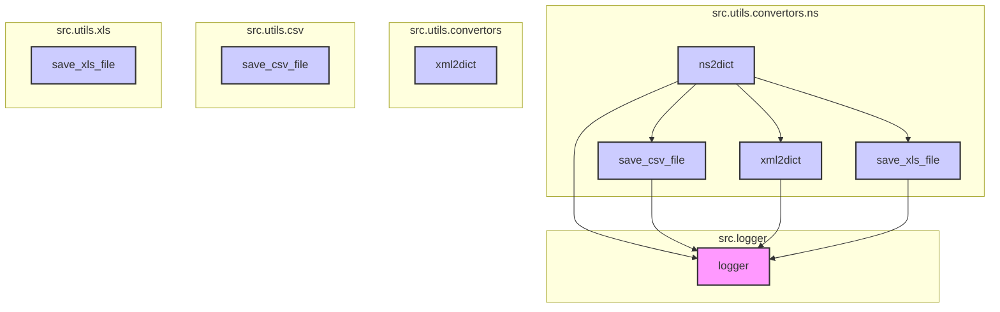

### **Системные инструкции для обработки кода проекта `hypotez`**

=========================================================================================

Описание функциональности и правил для генерации, анализа и улучшения кода. Направлено на обеспечение последовательного и читаемого стиля кодирования, соответствующего требованиям.

---

### **Основные принципы**

#### **1. Общие указания**:
- Соблюдай четкий и понятный стиль кодирования.
- Все изменения должны быть обоснованы и соответствовать установленным требованиям.

#### **2. Комментарии**:
- Используй `#` для внутренних комментариев.
- Документация всех функций, методов и классов должна следовать такому формату: 
    ```python
        def function(param: str, param1: Optional[str | dict | str] = None) -> dict | None:
            """ 
            Args:
                param (str): Описание параметра `param`.
                param1 (Optional[str | dict | str], optional): Описание параметра `param1`. По умолчанию `None`.
    
            Returns:
                dict | None: Описание возвращаемого значения. Возвращает словарь или `None`.
    
            Raises:
                SomeError: Описание ситуации, в которой возникает исключение `SomeError`.

            Ехаmple:
                >>> function('param', 'param1')
                {'param': 'param1'}
            """
    ```
- Комментарии и документация должны быть четкими, лаконичными и точными.

#### **3. Форматирование кода**:
- Используй одинарные кавычки. `a:str = 'value'`, `print('Hello World!')`;
- Добавляй пробелы вокруг операторов. Например, `x = 5`;
- Все параметры должны быть аннотированы типами. `def function(param: str, param1: Optional[str | dict | str] = None) -> dict | None:`;
- Не используй `Union`. Вместо этого используй `|`.

#### **4. Логирование**:
- Для логгирования Всегда Используй модуль `logger` из `src.logger.logger`.
- Ошибки должны логироваться с использованием `logger.error`.
Пример:
    ```python
        try:
            ...
        except Exception as ex:
            logger.error('Error while processing data', ех, exc_info=True)
    ```
#### **5 Не используй `Union[]` в коде. Вместо него используй `|`
Например:
```python
x: str | int ...
```


---

### **Основные требования**:

#### **1. Формат ответов в Markdown**:
- Все ответы должны быть выполнены в формате **Markdown**.

#### **2. Формат комментариев**:
- Используй указанный стиль для комментариев и документации в коде.
- Пример:

```python
from typing import Generator, Optional, List
from pathlib import Path


def read_text_file(
    file_path: str | Path,
    as_list: bool = False,
    extensions: Optional[List[str]] = None,
    chunk_size: int = 8192,
) -> Generator[str, None, None] | str | None:
    """
    Считывает содержимое файла (или файлов из каталога) с использованием генератора для экономии памяти.

    Args:
        file_path (str | Path): Путь к файлу или каталогу.
        as_list (bool): Если `True`, возвращает генератор строк.
        extensions (Optional[List[str]]): Список расширений файлов для чтения из каталога.
        chunk_size (int): Размер чанков для чтения файла в байтах.

    Returns:
        Generator[str, None, None] | str | None: Генератор строк, объединенная строка или `None` в случае ошибки.

    Raises:
        Exception: Если возникает ошибка при чтении файла.

    Example:
        >>> from pathlib import Path
        >>> file_path = Path('example.txt')
        >>> content = read_text_file(file_path)
        >>> if content:
        ...    print(f'File content: {content[:100]}...')
        File content: Example text...
    """
    ...
```
- Всегда делай подробные объяснения в комментариях. Избегай расплывчатых терминов, 
- таких как *«получить»* или *«делать»*
-  . Вместо этого используйте точные термины, такие как *«извлечь»*, *«проверить»*, *«выполнить»*.
- Вместо: *«получаем»*, *«возвращаем»*, *«преобразовываем»* используй имя объекта *«функция получае»*, *«переменная возвращает»*, *«код преобразовывает»* 
- Комментарии должны непосредственно предшествовать описываемому блоку кода и объяснять его назначение.

#### **3. Пробелы вокруг операторов присваивания**:
- Всегда добавляйте пробелы вокруг оператора `=`, чтобы повысить читаемость.
- Примеры:
  - **Неправильно**: `x=5`
  - **Правильно**: `x = 5`

#### **4. Использование `j_loads` или `j_loads_ns`**:
- Для чтения JSON или конфигурационных файлов замените стандартное использование `open` и `json.load` на `j_loads` или `j_loads_ns`.
- Пример:

```python
# Неправильно:
with open('config.json', 'r', encoding='utf-8') as f:
    data = json.load(f)

# Правильно:
data = j_loads('config.json')
```

#### **5. Сохранение комментариев**:
- Все существующие комментарии, начинающиеся с `#`, должны быть сохранены без изменений в разделе «Улучшенный код».
- Если комментарий кажется устаревшим или неясным, не изменяйте его. Вместо этого отметьте его в разделе «Изменения».

#### **6. Обработка `...` в коде**:
- Оставляйте `...` как указатели в коде без изменений.
- Не документируйте строки с `...`.
```

#### **7. Аннотации**
Для всех переменных должны быть определены аннотации типа. 
Для всех функций все входные и выходные параметры аннотириваны
Для все параметров должны быть аннотации типа.


### **8. webdriver**
В коде используется webdriver. Он импртируется из модуля `webdriver` проекта `hypotez`
```python
from src.webdirver import Driver, Chrome, Firefox, Playwright, ...
driver = Driver(Firefox)

Пoсле чего может использоваться как

close_banner = {
  "attribute": null,
  "by": "XPATH",
  "selector": "//button[@id = 'closeXButton']",
  "if_list": "first",
  "use_mouse": false,
  "mandatory": false,
  "timeout": 0,
  "timeout_for_event": "presence_of_element_located",
  "event": "click()",
  "locator_description": "Закрываю pop-up окно, если оно не появилось - не страшно (`mandatory`:`false`)"
}

result = driver.execute_locator(close_banner)
```

### Анализ кода `hypotez/src/utils/convertors/ns.py`

#### 1. Блок-схема

```mermaid
graph TD
    A[Начало] --> B{ns2dict(obj: Any)};
    B --> C{hasattr(value, '__dict__')};
    C -- Да --> D[vars(value).items()];
    C -- Нет --> E{hasattr(value, 'items')};
    E -- Да --> F[value.items()];
    E -- Нет --> G{isinstance(value, list)};
    G -- Да --> H[convert(item) для item in value];
    G -- Нет --> I[return value];
    D --> J[convert(val)];
    F --> K[convert(val)];
    J --> L[Формирование словаря];
    K --> L
    H --> L
    I --> L
    L --> M[Конец];

    N[Начало] --> O{ns2csv(ns_obj: SimpleNamespace, csv_file_path: str | Path)};
    O --> P[data = [ns2dict(ns_obj)]];
    P --> Q[save_csv_file(data, csv_file_path)];
    Q --> R{Успех?};
    R -- Да --> S[return True];
    R -- Нет --> T[logger.error];
    T --> U[return False];
    S --> V[Конец];
    U --> V;

    W[Начало] --> X{ns2xml(ns_obj: SimpleNamespace, root_tag: str = "root")};
    X --> Y[data = ns2dict(ns_obj)];
    Y --> Z[xml2dict(data)];
    Z --> AA{Успех?};
    AA -- Да --> BB[return xml2dict(data)];
    AA -- Нет --> CC[logger.error];
    CC --> DD[return False];
    BB --> EE[Конец];
    DD --> EE;
    
    FF[Начало] --> GG{ns2xls(data: SimpleNamespace, xls_file_path: str | Path)};
    GG --> HH[save_xls_file(data, xls_file_path)];
    HH --> II{Успех?};
    II -- Да --> JJ[return True];
    II -- Нет --> KK[logger.error];
    KK --> LL[return False];
    JJ --> MM[Конец];
    KK --> MM;
```

#### 2. Диаграмма



Объяснение зависимостей:

-   `ns2dict` зависит от:
    *   Модуля `logger` из `src.logger.logger` для логирования ошибок.
    *   Функции `xml2dict` из `src.utils.convertors` для конвертации в XML.
    *   Функции `save_csv_file` из `src.utils.csv` для сохранения в CSV.
    *   Функции `save_xls_file` из `src.utils.xls` для сохранения в XLS.
-   `xml2dict`, `save_csv_file` и `save_xls_file` также зависят от модуля `logger` для логирования.

#### 3. Объяснение

**Импорты**:

*   `json`: Используется для работы с JSON-форматом.
*   `csv`: Используется для работы с CSV-форматом.
*   `SimpleNamespace` from `types`: Класс, позволяющий создавать объекты с атрибутами, доступными через точку.
*   `Path` from `pathlib`: Класс для представления путей к файлам и каталогам.
*   `List`, `Dict`, `Any` from `typing`: Используются для аннотации типов.
*   `xml2dict` from `src.utils.convertors`: Функция для преобразования данных в XML-формат.
*   `save_csv_file` from `src.utils.csv`: Функция для сохранения данных в CSV-файл.
*   `save_xls_file` from `src.utils.xls`: Функция для сохранения данных в XLS-файл.
*   `logger` from `src.logger.logger`: Модуль для логирования.

**Функции**:

*   `ns2dict(obj: Any) -> Dict[str, Any]`:
    *   Аргументы:
        *   `obj` (`Any`): Объект для преобразования (может быть `SimpleNamespace`, `dict` или любой другой объект с похожей структурой).
    *   Возвращает:
        *   `Dict[str, Any]`: Преобразованный словарь.
    *   Назначение: Рекурсивно преобразует объект с парами "ключ-значение" в словарь. Обрабатывает пустые ключи, заменяя их пустой строкой.
    *   Пример:
        ```python
        from types import SimpleNamespace
        obj = SimpleNamespace(name='John', age=30, address=SimpleNamespace(city='New York'))
        result = ns2dict(obj)
        print(result)  # Вывод: {'name': 'John', 'age': 30, 'address': {'city': 'New York'}}
        ```
*   `ns2csv(ns_obj: SimpleNamespace, csv_file_path: str | Path) -> bool`:
    *   Аргументы:
        *   `ns_obj` (`SimpleNamespace`): Объект `SimpleNamespace` для преобразования.
        *   `csv_file_path` (`str | Path`): Путь для сохранения CSV-файла.
    *   Возвращает:
        *   `bool`: `True`, если успешно, `False` в противном случае.
    *   Назначение: Преобразует объект `SimpleNamespace` в CSV-формат и сохраняет его в файл.
    *   Пример:
        ```python
        from types import SimpleNamespace
        obj = SimpleNamespace(name='John', age=30)
        result = ns2csv(obj, 'data.csv')
        print(result)  # Вывод: True (если файл успешно сохранен)
        ```
*   `ns2xml(ns_obj: SimpleNamespace, root_tag: str = "root") -> str`:
    *   Аргументы:
        *   `ns_obj` (`SimpleNamespace`): Объект `SimpleNamespace` для преобразования.
        *   `root_tag` (`str`): Корневой тег для XML (по умолчанию "root").
    *   Возвращает:
        *   `str`: XML-строка.
    *   Назначение: Преобразует объект `SimpleNamespace` в XML-формат.
    *   Пример:
        ```python
        from types import SimpleNamespace
        obj = SimpleNamespace(name='John', age=30)
        result = ns2xml(obj)
        print(result)  # Вывод: XML-строка
        ```
*   `ns2xls(data: SimpleNamespace, xls_file_path: str | Path) -> bool`:
    *   Аргументы:
        *   `data` (`SimpleNamespace`): Объект `SimpleNamespace` для преобразования.
        *   `xls_file_path` (`str | Path`): Путь для сохранения XLS-файла.
    *   Возвращает:
        *   `bool`: `True`, если успешно, `False` в противном случае.
    *   Назначение: Преобразует объект `SimpleNamespace` в XLS-формат и сохраняет его в файл.
    *   Пример:
        ```python
        from types import SimpleNamespace
        obj = SimpleNamespace(name='John', age=30)
        result = ns2xls(obj, 'data.xls')
        print(result)  # Вывод: True (если файл успешно сохранен)
        ```

**Переменные**:

*   `obj` в `ns2dict`: Объект, который нужно преобразовать в словарь.
*   `ns_obj` в `ns2csv`, `ns2xml`, `ns2xls`: Объект `SimpleNamespace`, который нужно преобразовать.
*   `csv_file_path`, `xls_file_path`: Пути к файлам для сохранения данных.
*   `root_tag`: Корневой тег для XML-формата.
*   `data`: Промежуточные данные, полученные после преобразования.

**Потенциальные ошибки и области для улучшения**:

*   В функциях `ns2csv`, `ns2xml`, `ns2xls` при возникновении исключения возвращается `None`, хотя в аннотации типа указан `bool`.  Стоит возвращать `False` или перехватывать исключение и логировать его, а затем генерировать повторно.
*   Не хватает обработки исключений в `ns2xls`.  В случае ошибки нужно логировать ее и возвращать `False`.

**Взаимосвязи с другими частями проекта**:

*   Этот модуль предоставляет функции для преобразования объектов `SimpleNamespace` в различные форматы (словарь, JSON, CSV, XML, XLS).  Он используется другими частями проекта, когда необходимо экспортировать данные в определенном формате.
*   Модуль использует `logger` для логирования ошибок, что позволяет отслеживать проблемы, возникающие при преобразовании данных.
*   Для сохранения в форматы CSV и XLS используются модули `src.utils.csv` и `src.utils.xls` соответственно, обеспечивая повторное использование кода и упрощая процесс сохранения данных.