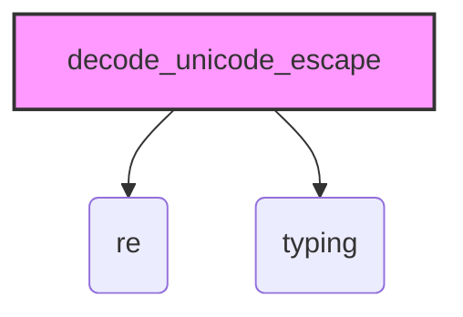

### **Системные инструкции для обработки кода проекта `hypotez`**

=========================================================================================

Описание функциональности и правил для генерации, анализа и улучшения кода. Направлено на обеспечение последовательного и читаемого стиля кодирования, соответствующего требованиям.

---

### **Основные принципы**

#### **1. Общие указания**:
- Соблюдай четкий и понятный стиль кодирования.
- Все изменения должны быть обоснованы и соответствовать установленным требованиям.

#### **2. Комментарии**:
- Используй `#` для внутренних комментариев.
- Документация всех функций, методов и классов должна следовать такому формату: 
    ```python
        def function(param: str, param1: Optional[str | dict | str] = None) -> dict | None:
            """ 
            Args:
                param (str): Описание параметра `param`.
                param1 (Optional[str | dict | str], optional): Описание параметра `param1`. По умолчанию `None`.
    
            Returns:
                dict | None: Описание возващаемого значения. Возвращает словарь или `None`.
    
            Raises:
                SomeError: Описание ситуации, в которой возникает исключение `SomeError`.

            Ехаmple:
                >>> function('param', 'param1')
                {'param': 'param1'}
            """
    ```
- Комментарии и документация должны быть четкими, лаконичными и точными.

#### **3. Форматирование кода**:
- Используй одинарные кавычки. `a:str = 'value'`, `print('Hello World!')`;
- Добавляй пробелы вокруг операторов. Например, `x = 5`;
- Все параметры должны быть аннотированы типами. `def function(param: str, param1: Optional[str | dict | str] = None) -> dict | None:`;
- Не используй `Union`. Вместо этого используй `|`.

#### **4. Логирование**:
- Для логгирования Всегда Используй модуль `logger` из `src.logger.logger`.
- Ошибки должны логироваться с использованием `logger.error`.
Пример:
    ```python
        try:
            ...
        except Exception as ex:
            logger.error('Error while processing data', ех, exc_info=True)
    ```
#### **5 Не используй `Union[]` в коде. Вместо него используй `|`
Например:
```python
x: str | int ...
```


---

### **Основные требования**:

#### **1. Формат ответов в Markdown**:
- Все ответы должны быть выполнены в формате **Markdown**.

#### **2. Формат комментариев**:
- Используй указанный стиль для комментариев и документации в коде.
- Пример:

```python
from typing import Generator, Optional, List
from pathlib import Path


def read_text_file(
    file_path: str | Path,
    as_list: bool = False,
    extensions: Optional[List[str]] = None,
    chunk_size: int = 8192,
) -> Generator[str, None, None] | str | None:
    """
    Считывает содержимое файла (или файлов из каталога) с использованием генератора для экономии памяти.

    Args:
        file_path (str | Path): Путь к файлу или каталогу.
        as_list (bool): Если `True`, возвращает генератор строк.
        extensions (Optional[List[str]]): Список расширений файлов для чтения из каталога.
        chunk_size (int): Размер чанков для чтения файла в байтах.

    Returns:
        Generator[str, None, None] | str | None: Генератор строк, объединенная строка или `None` в случае ошибки.

    Raises:
        Exception: Если возникает ошибка при чтении файла.

    Example:
        >>> from pathlib import Path
        >>> file_path = Path('example.txt')
        >>> content = read_text_file(file_path)
        >>> if content:
        ...    print(f'File content: {content[:100]}...')
        File content: Example text...
    """
    ...
```
- Всегда делай подробные объяснения в комментариях. Избегай расплывчатых терминов, 
- таких как *«получить»* или *«делать»*. Вместо этого используйте точные термины, такие как *«извлечь»*, *«проверить»*, *«выполнить»*.
- Вместо: *«получаем»*, *«возвращаем»*, *«преобразовываем»* используй имя объекта *«функция получае»*, *«переменная возвращает»*, *«код преобразовывает»* 
- Комментарии должны непосредственно предшествовать описываемому блоку кода и объяснять его назначение.

#### **3. Пробелы вокруг операторов присваивания**:
- Всегда добавляйте пробелы вокруг оператора `=`, чтобы повысить читаемость.
- Примеры:
  - **Неправильно**: `x=5`
  - **Правильно**: `x = 5`

#### **4. Использование `j_loads` или `j_loads_ns`**:
- Для чтения JSON или конфигурационных файлов замените стандартное использование `open` и `json.load` на `j_loads` или `j_loads_ns`.
- Пример:

```python
# Неправильно:
with open('config.json', 'r', encoding='utf-8') as f:
    data = json.load(f)

# Правильно:
data = j_loads('config.json')
```

#### **5. Сохранение комментариев**:
- Все существующие комментарии, начинающиеся с `#`, должны быть сохранены без изменений в разделе «Улучшенный код».
- Если комментарий кажется устаревшим или неясным, не изменяйте его. Вместо этого отметьте его в разделе «Изменения».

#### **6. Обработка `...` в коде**:
- Оставляйте `...` как указатели в коде без изменений.
- Не документируйте строки с `...`.
```

#### **7. Аннотации**
Для всех переменных должны быть определены аннотации типа. 
Для всех функций все входные и выходные параметры аннотириваны
Для все параметров должны быть аннотации типа.


### **8. webdriver**
В коде используется webdriver. Он импртируется из модуля `webdriver` проекта `hypotez`
```python
from src.webdirver import Driver, Chrome, Firefox, Playwright, ...
driver = Driver(Firefox)

Пoсле чего может использоваться как

close_banner = {
  "attribute": null,
  "by": "XPATH",
  "selector": "//button[@id = 'closeXButton']",
  "if_list": "first",
  "use_mouse": false,
  "mandatory": false,
  "timeout": 0,
  "timeout_for_event": "presence_of_element_located",
  "event": "click()",
  "locator_description": "Закрываю pop-up окно, если оно не появилось - не страшно (`mandatory`:`false`)"
}

result = driver.execute_locator(close_banner)
```

## Анализ кода `hypotez/src/utils/convertors/unicode.py`

### 1. Блок-схема

```mermaid
graph TD
    A[Начало: decode_unicode_escape(input_data)] --> B{Тип input_data?};
    B -- dict --> C[Обработка словаря: рекурсивный вызов для каждого value];
    C --> A;
    B -- list --> D[Обработка списка: рекурсивный вызов для каждого item];
    D --> A;
    B -- str --> E[Декодирование строки];
    E --> F{Ошибка декодирования?};
    F -- Да --> G[decoded_string = input_data];
    F -- Нет --> G[Применение regex для \\\\uXXXX];
    G --> H[Возврат decoded_string];
    B -- other --> I[Возврат input_data без изменений];
    H --> J[Конец];
    I --> J;
```

**Примеры:**

1.  **Словарь**:

    *   `input_data = {'name': r'\u0418\u043c\u044f'}`
    *   Блок `B` определяет тип как `dict`.
    *   Блок `C` рекурсивно вызывает `decode_unicode_escape` для значения `'name'`.
2.  **Список**:

    *   `input_data = [r'\u0418\u043c\u044f', r'\u0424\u0430\u043c\u0438\u043b\u0438\u044f']`
    *   Блок `B` определяет тип как `list`.
    *   Блок `D` рекурсивно вызывает `decode_unicode_escape` для каждого элемента списка.
3.  **Строка**:

    *   `input_data = r'\u0418\u043c\u044f'`
    *   Блок `B` определяет тип как `str`.
    *   Блок `E` пытается декодировать строку.
    *   Блок `F` проверяет, возникла ли ошибка при декодировании.
    *   Блок `G` применяет regex для обработки последовательностей `\\\\uXXXX`.
    *   Блок `H` возвращает декодированную строку.
4.  **Другой тип**:

    *   `input_data = 123`
    *   Блок `B` определяет тип как `other`.
    *   Блок `I` возвращает `input_data` без изменений.

### 2. Диаграмма зависимостей



**Объяснение зависимостей:**

*   `re`: Модуль `re` (Regular Expression Operations) используется для поиска и замены юникодных escape-последовательностей в строках с помощью регулярных выражений. В частности, функция `re.sub` используется для замены всех найденных последовательностей `\\\\uXXXX` на соответствующие Unicode символы.
*   `typing`: Модуль `typing` используется для статической типизации, что позволяет указывать типы входных и выходных данных функции `decode_unicode_escape`. Это улучшает читаемость и помогает выявлять ошибки на этапе разработки.

### 3. Объяснение

#### Импорты:

*   `import re`: Импортирует модуль `re` для работы с регулярными выражениями. Используется для поиска и замены юникодных escape-последовательностей в строках.
*   `from typing import Dict, Any`: Импортирует типы `Dict` и `Any` из модуля `typing` для статической типизации.

#### Функция `decode_unicode_escape`

*   **Аргументы**:
    *   `input_data (Dict[str, Any] | list | str)`: Входные данные, которые могут быть словарем, списком или строкой.
*   **Возвращаемое значение**:
    *   `Dict[str, Any] | list | str`: Преобразованные данные, где юникодные escape-последовательности заменены на соответствующие символы.
*   **Назначение**:
    Функция `decode_unicode_escape` рекурсивно декодирует юникодные escape-последовательности в строках, списках и словарях. Она проверяет тип входных данных и выполняет соответствующие действия:
    *   Если входные данные - словарь, она рекурсивно вызывает себя для каждого значения в словаре.
    *   Если входные данные - список, она рекурсивно вызывает себя для каждого элемента в списке.
    *   Если входные данные - строка, она пытается декодировать escape-последовательности и заменяет последовательности `\\\\uXXXX` на соответствующие Unicode символы с использованием регулярных выражений.
    *   Если входные данные имеют другой тип, они возвращаются без изменений.

#### Переменные:

*   `unicode_escape_pattern (str)`: Регулярное выражение для поиска последовательностей `\\\\uXXXX` в строке.
*   `decoded_string (str)`: Промежуточная переменная для хранения декодированной строки.

#### Потенциальные ошибки и области для улучшения:

*   **Обработка ошибок**:
    *   В текущей реализации функция обрабатывает `UnicodeDecodeError` при первой попытке декодирования строки, но не предоставляет подробной информации об ошибке. Логирование ошибки могло бы помочь в отладке.
*   **Оптимизация регулярного выражения**:
    *   Регулярное выражение `r'\\\\u[0-9a-fA-F]{4}'` может быть оптимизировано для повышения производительности, особенно если функция вызывается часто.

#### Взаимосвязи с другими частями проекта:

*   Функция `decode_unicode_escape` может использоваться в различных частях проекта `hypotez`, где требуется обработка данных, содержащих юникодные escape-последовательности. Например, она может использоваться для обработки данных, полученных из внешних источников, таких как API или базы данных, где данные могут быть представлены в виде юникодных escape-последовательностей.