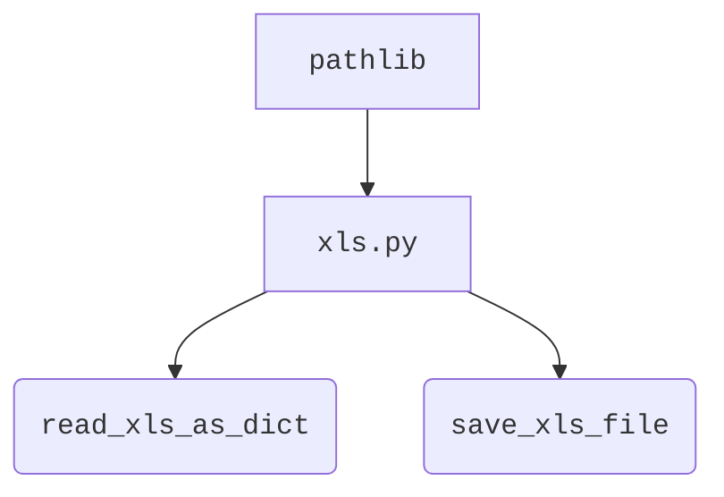

### **Анализ кода проекта `hypotez`**

=========================================================================================

#### **1. Блок-схема**

```mermaid
graph TD
    A[Начало: xls2dict(xls_file)] --> B{Вызов: read_xls_as_dict(xls_file)}
    B --> C{Чтение файла Excel в словарь}
    C --> D{Возврат: dict | None}
    D --> E[Конец]
```

**Примеры для каждого логического блока:**

1.  **Начало**: Функция `xls2dict` вызывается с аргументом `xls_file = "example.xls"`.
2.  **Вызов**: Функция `read_xls_as_dict("example.xls")` вызывается для чтения данных из Excel файла.
3.  **Чтение файла Excel в словарь**: Файл "example.xls" читается, и его содержимое преобразуется в структуру данных dict.
4.  **Возврат**: Функция `read_xls_as_dict` возвращает словарь, содержащий данные из Excel файла, или None, если произошла ошибка.

#### **2. Диаграмма зависимостей**


```mermaid
flowchart TD
    A[<code>xls.py</code>] --> B(<code>read_xls_as_dict</code>)
    A --> C(<code>save_xls_file</code>)
    D[<code>pathlib</code>] --> A
```

**Объяснение зависимостей:**

*   `xls.py`: Модуль, содержащий функции для работы с файлами Excel.
*   `read_xls_as_dict`: Функция, предназначенная для чтения данных из файла Excel и преобразования их в словарь.
*   `save_xls_file`: Функция, предназначенная для сохранения данных в файл Excel.
*    `pathlib`:  Используется для манипулирования путями к файлам.  Модуль `pathlib` предоставляет способ представления путей к файлам и каталогам в виде объектов, что упрощает выполнение операций, таких как объединение путей, проверка существования файла или каталога и т. д.

#### **3. Объяснение**

**Импорты:**

*   `pathlib`: Используется для работы с путями к файлам.
*   `src.utils.xls`: Содержит функции `read_xls_as_dict` и `save_xls_file` для чтения и записи файлов Excel.

**Функции:**

*   `xls2dict(xls_file: str | Path) -> dict | None`:
    *   Аргументы:
        *   `xls_file` (str | Path): Путь к файлу Excel.
    *   Возвращаемое значение:
        *   `dict | None`: Словарь с данными из Excel файла или `None` в случае ошибки.
    *   Назначение:
        *   Преобразует файл Excel в словарь с использованием функции `read_xls_as_dict`.
    *   Пример:

```python
        from pathlib import Path
        file_path = Path('example.xls')
        data = xls2dict(file_path)
        if data:
            print(data)
```

**Переменные:**

*   `xls_file`: Путь к файлу Excel (тип `str` или `Path`).

**Потенциальные ошибки и области для улучшения:**

*   Не указана обработка исключений в функции `xls2dict`.
*   Отсутствует документация для параметров `xls_file`.

**Взаимосвязи с другими частями проекта:**

*   `xls2dict` используется для чтения данных из файлов Excel, которые могут быть использованы в других модулях проекта для обработки и анализа данных.
*   Связь с `src.utils.xls`: `xls2dict` вызывает функции из `src.utils.xls` для чтения данных из Excel файлов.