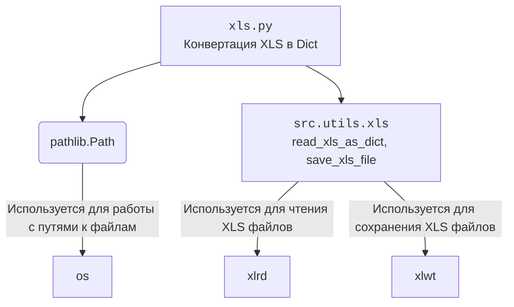

### **Анализ кода `hypotez/src/utils/convertors/xls.py`**

=========================================================================================

#### **1. Блок-схема**

```mermaid
graph LR
    A[Начало: xls2dict(xls_file)] --> B{Проверка типа xls_file: str | Path}
    B -- xls_file: str --> C[Вызов read_xls_as_dict(xls_file)]
    B -- xls_file: Path --> C
    C --> D{Результат получен?}
    D -- Да --> E[Возврат результата]
    D -- Нет --> F[Возврат None]
    E --> G[Конец]
    F --> G
```

**Примеры для каждого логического блока:**

-   **A**: `xls2dict("example.xls")` - начало работы функции с передачей пути к файлу.
-   **B**: Проверка, является ли `xls_file` строкой или объектом `Path`.
-   **C**: `read_xls_as_dict(xls_file="example.xls")` - вызов функции для чтения содержимого XLS-файла.
-   **D**: Проверка, успешно ли прочитан файл и получены данные.
-   **E**: Если данные получены, они возвращаются функцией.
-   **F**: Если произошла ошибка при чтении, возвращается `None`.
-   **G**: Завершение работы функции.

#### **2. Диаграмма зависимостей**



**Объяснение зависимостей:**

-   `pathlib.Path`: Используется для представления и манипулирования путями к файлам и директориям. Позволяет абстрагироваться от различий в представлении путей в разных операционных системах.
-   `src.utils.xls`: Внутренний модуль, содержащий функции `read_xls_as_dict` и `save_xls_file`, предназначенные для чтения данных из XLS-файлов в формате словаря и сохранения данных в XLS-файлы соответственно.
    -   `xlrd`: Библиотека, используемая в `src.utils.xls` для чтения данных из файлов Excel (XLS).
    -   `xlwt`: Библиотека, используемая в `src.utils.xls` для записи данных в файлы Excel (XLS).
-   `os`: Модуль, используемый `pathlib` для взаимодействия с операционной системой, например, для получения информации о файловой системе.

#### **3. Объяснение**

**Импорты:**

-   `from pathlib import Path`: Импортирует класс `Path` из модуля `pathlib`, который предоставляет способ работы с путями к файлам и директориям в объектно-ориентированном стиле.
-   `from src.utils.xls import read_xls_as_dict, save_xls_file`: Импортирует функции `read_xls_as_dict` и `save_xls_file` из модуля `src.utils.xls`. Эти функции используются для чтения данных из XLS-файлов в формате словаря и сохранения данных в XLS-файлы соответственно.

**Функции:**

-   `xls2dict(xls_file: str | Path) -> dict | None`:
    -   **Аргументы**:
        -   `xls_file` (str | Path): Путь к XLS-файлу, который необходимо преобразовать в словарь. Может быть строкой или объектом `Path`.
    -   **Возвращаемое значение**:
        -   `dict | None`: Функция возвращает словарь, полученный из XLS-файла, или `None`, если произошла ошибка.
    -   **Назначение**:
        -   Эта функция является оберткой для `read_xls_as_dict`, упрощая ее вызов и обеспечивая единую точку входа для преобразования XLS-файлов в словари.
    -   **Пример**:

        ```python
        data = xls2dict("example.xls")
        if data:
            print(data)
        ```

**Переменные:**

-   `xls_file`: Переменная, представляющая путь к XLS-файлу. Тип - строка или объект `Path`. Используется для передачи пути к файлу в функцию `read_xls_as_dict`.

**Потенциальные ошибки и области для улучшения:**

-   **Обработка ошибок**: Функция `xls2dict` не содержит явной обработки ошибок. Если `read_xls_as_dict` вызывает исключение, оно не обрабатывается, и функция может завершиться аварийно. Рекомендуется добавить обработку исключений для обеспечения более устойчивой работы.
-   **Документация**: Добавить расширенную документацию, включая возможные исключения, которые могут быть вызваны.
-   **Типизация**: Добавить аннотации типов для всех переменных.

**Взаимосвязи с другими частями проекта:**

-   Функция `xls2dict` является частью модуля `src.utils.convertors`, который предназначен для преобразования данных из различных форматов. Она использует функции из модуля `src.utils.xls` для работы с XLS-файлами.