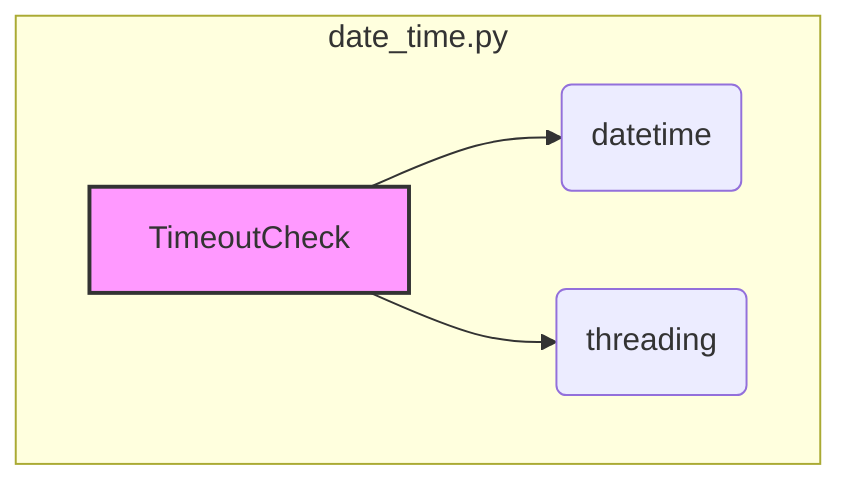

### **Системные инструкции для обработки кода проекта `hypotez`**

=========================================================================================

Описание функциональности и правил для генерации, анализа и улучшения кода. Направлено на обеспечение последовательного и читаемого стиля кодирования, соответствующего требованиям.

---

### **Основные принципы**

#### **1. Общие указания**:
- Соблюдай четкий и понятный стиль кодирования.
- Все изменения должны быть обоснованы и соответствовать установленным требованиям.

#### **2. Комментарии**:
- Используй `#` для внутренних комментариев.
- Документация всех функций, методов и классов должна следовать такому формату: 
    ```python
        def function(param: str, param1: Optional[str | dict | str] = None) -> dict | None:
            """ 
            Args:
                param (str): Описание параметра `param`.
                param1 (Optional[str | dict | str], optional): Описание параметра `param1`. По умолчанию `None`.
    
            Returns:
                dict | None: Описание возвращаемого значения. Возвращает словарь или `None`.
    
            Raises:
                SomeError: Описание ситуации, в которой возникает исключение `SomeError`.

            Ехаmple:
                >>> function('param', 'param1')
                {'param': 'param1'}
            """
    ```
- Комментарии и документация должны быть четкими, лаконичными и точными.

#### **3. Форматирование кода**:
- Используй одинарные кавычки. `a:str = 'value'`, `print('Hello World!')`;
- Добавляй пробелы вокруг операторов. Например, `x = 5`;
- Все параметры должны быть аннотированы типами. `def function(param: str, param1: Optional[str | dict | str] = None) -> dict | None:`;
- Не используй `Union`. Вместо этого используй `|`.

#### **4. Логирование**:
- Для логгирования Всегда Используй модуль `logger` из `src.logger.logger`.
- Ошибки должны логироваться с использованием `logger.error`.
Пример:
    ```python
        try:
            ...
        except Exception as ex:
            logger.error('Error while processing data', ех, exc_info=True)
    ```
#### **5 Не используй `Union[]` в коде. Вместо него используй `|`
Например:
```python
x: str | int ...
```


---

### **Основные требования**:

#### **1. Формат ответов в Markdown**:
- Все ответы должны быть выполнены в формате **Markdown**.

#### **2. Формат комментариев**:
- Используй указанный стиль для комментариев и документации в коде.
- Пример:

```python
from typing import Generator, Optional, List
from pathlib import Path


def read_text_file(
    file_path: str | Path,
    as_list: bool = False,
    extensions: Optional[List[str]] = None,
    chunk_size: int = 8192,
) -> Generator[str, None, None] | str | None:
    """
    Считывает содержимое файла (или файлов из каталога) с использованием генератора для экономии памяти.

    Args:
        file_path (str | Path): Путь к файлу или каталогу.
        as_list (bool): Если `True`, возвращает генератор строк.
        extensions (Optional[List[str]]): Список расширений файлов для чтения из каталога.
        chunk_size (int): Размер чанков для чтения файла в байтах.

    Returns:
        Generator[str, None, None] | str | None: Генератор строк, объединенная строка или `None` в случае ошибки.

    Raises:
        Exception: Если возникает ошибка при чтении файла.

    Example:
        >>> from pathlib import Path
        >>> file_path = Path('example.txt')
        >>> content = read_text_file(file_path)
        >>> if content:
        ...    print(f'File content: {content[:100]}...')
        File content: Example text...
    """
    ...
```
- Всегда делай подробные объяснения в комментариях. Избегай расплывчатых терминов, 
- таких как *«получить»* или *«делать»*. Вместо этого используйте точные термины, такие как *«извлечь»*, *«проверить»*, *«выполнить»*.
- Вместо: *«получаем»*, *«возвращаем»*, *«преобразовываем»* используй имя объекта *«функция получае»*, *«переменная возвращает»*, *«код преобразовывает»* 
- Комментарии должны непосредственно предшествовать описываемому блоку кода и объяснять его назначение.

#### **3. Пробелы вокруг операторов присваивания**:
- Всегда добавляйте пробелы вокруг оператора `=`, чтобы повысить читаемость.
- Примеры:
  - **Неправильно**: `x=5`
  - **Правильно**: `x = 5`

#### **4. Использование `j_loads` или `j_loads_ns`**:
- Для чтения JSON или конфигурационных файлов замените стандартное использование `open` и `json.load` на `j_loads` или `j_loads_ns`.
- Пример:

```python
# Неправильно:
with open('config.json', 'r', encoding='utf-8') as f:
    data = json.load(f)

# Правильно:
data = j_loads('config.json')
```

#### **5. Сохранение комментариев**:
- Все существующие комментарии, начинающиеся с `#`, должны быть сохранены без изменений в разделе «Улучшенный код».
- Если комментарий кажется устаревшим или неясным, не изменяйте его. Вместо этого отметьте его в разделе «Изменения».

#### **6. Обработка `...` в коде**:
- Оставляйте `...` как указатели в коде без изменений.
- Не документируйте строки с `...`.
```

#### **7. Аннотации**
Для всех переменных должны быть определены аннотации типа. 
Для всех функций все входные и выходные параметры аннотириваны
Для все параметров должны быть аннотации типа.


### **8. webdriver**
В коде используется webdriver. Он импртируется из модуля `webdriver` проекта `hypotez`
```python
from src.webdirver import Driver, Chrome, Firefox, Playwright, ...
driver = Driver(Firefox)

Пoсле чего может использоваться как

close_banner = {
  "attribute": null,
  "by": "XPATH",
  "selector": "//button[@id = 'closeXButton']",
  "if_list": "first",
  "use_mouse": false,
  "mandatory": false,
  "timeout": 0,
  "timeout_for_event": "presence_of_element_located",
  "event": "click()",
  "locator_description": "Закрываю pop-up окно, если оно не появилось - не страшно (`mandatory`:`false`)"
}

result = driver.execute_locator(close_banner)
```

### **Анализ кода `hypotez/src/utils/date_time.py`**

#### **1. Блок-схема**

```mermaid
graph TD
    A[Начало: Инициализация TimeoutCheck] --> B{Вызов interval_with_timeout или interval};
    
    subgraph interval_with_timeout
    B --> C[Создание и запуск потока interval];
    C --> D{Ожидание завершения потока (timeout)};
    D -- Да, поток жив --> E[Вывод сообщения о timeout];
    E --> F[Завершение потока interval];
    F --> G{Возврат False (timeout)};
    D -- Нет, поток завершен --> H{Возврат результата interval};
    end
    
    subgraph interval
    B --> I[Получение текущего времени];
    I --> J{start < end?};
    J -- Да --> K{start <= current_time <= end?};
    J -- Нет --> L{current_time >= start or current_time <= end?};
    K -- Да --> M[result = True];
    K -- Нет --> N[result = False];
    L -- Да --> O[result = True];
    L -- Нет --> P[result = False];
    M --> Q[Возврат result];
    N --> Q;
    O --> Q;
    P --> Q;
    end

    subgraph input_with_timeout
    B --> R[Создание и запуск потока get_input];
    R --> S{Ожидание завершения потока (timeout)};
    S -- Да, поток жив --> T[Вывод сообщения о timeout];
    T --> U[Возврат None (timeout)];
    S -- Нет, поток завершен --> V{Возврат user_input};
    end

    A --> input_with_timeout;
    V --> End;
    G --> End;
    Q --> End;
    H --> End;

    style A fill:#f9f,stroke:#333,stroke-width:2px
    style End fill:#f9f,stroke:#333,stroke-width:2px
    style B fill:#ccf,stroke:#333,stroke-width:2px
```

Примеры для каждого блока:

*   **A**: `timeout_check = TimeoutCheck()`
*   **B**: `timeout_check.interval_with_timeout(timeout=5)` или `timeout_check.interval()`
*   **C**: `thread = threading.Thread(target=self.interval, args=(start, end))`
*   **D**: `thread.join(timeout)`
*   **E**: `print(f"Timeout occurred after {timeout} seconds, continuing execution.")`
*   **F**: `thread.join()`
*   **G**: `return False`
*   **H**: `return self.result`
*   **I**: `current_time = datetime.now().time()`
*   **J**: `if start < end:`
*   **K**: `self.result = start <= current_time <= end`
*   **L**: `self.result = current_time >= start or current_time <= end`
*   **M**: `self.result = True`
*   **N**: `self.result = False`
*   **O**: `self.result = True`
*   **P**: `self.result = False`
*   **Q**: `return self.result`
*   **R**: `thread = threading.Thread(target=self.get_input)`
*   **S**: `thread.join(timeout)`
*   **T**: `print(f"Timeout occurred after {timeout} seconds.")`
*   **U**: `return`
*   **V**: `return self.user_input`

#### **2. Диаграмма зависимостей в формате Mermaid**



**Объяснение зависимостей:**

*   `datetime`: Модуль `datetime` используется для получения текущего времени (`datetime.now().time()`) и для создания объектов `time` для задания начала и конца интервала.
*   `threading`: Модуль `threading` используется для реализации таймаута при проверке интервала (`interval_with_timeout`) и при ожидании ввода пользователя (`input_with_timeout`). Это позволяет выполнять операции асинхронно и не блокировать основной поток выполнения.

#### **3. Объяснение**

*   **Импорты**:
    *   `datetime` используется для работы с датой и временем. В частности, `datetime.now().time()` используется для получения текущего времени, а `time` - для задания интервала времени.
    *   `threading` используется для создания потоков, что необходимо для реализации таймаутов в функциях `interval_with_timeout` и `input_with_timeout`.

*   **Класс `TimeoutCheck`**:
    *   **Роль**: Предоставляет методы для проверки, находится ли текущее время в заданном интервале, с возможностью использования таймаута.
    *   **Атрибуты**:
        *   `self.result`: Сохраняет результат проверки времени в интервале.
        *   `self.user_input`: Сохраняет ввод пользователя.
    *   **Методы**:
        *   `__init__(self)`: Инициализирует атрибут `self.result` в `None`.
        *   `interval(self, start: time = time(23, 0), end: time = time(6, 0)) -> bool`: Проверяет, находится ли текущее время в интервале между `start` и `end`. Возвращает `True`, если находится, и `False` в противном случае.
        *   `interval_with_timeout(self, timeout: int = 5, start: time = time(23, 0), end: time = time(6, 0)) -> bool`: Запускает проверку интервала в отдельном потоке и ожидает завершения потока в течение заданного времени `timeout`. Если таймаут истекает, возвращает `False`.
        *   `get_input(self)`: Запрашивает ввод от пользователя и сохраняет его в `self.user_input`.
        *   `input_with_timeout(self, timeout: int = 5) -> str | None`: Запускает ввод от пользователя в отдельном потоке и ожидает ввода в течение заданного времени `timeout`. Если таймаут истекает, возвращает `None`.

*   **Функции**:
    *   `interval(self, start: time = time(23, 0), end: time = time(6, 0)) -> bool`:
        *   Аргументы: `start` (начало интервала), `end` (конец интервала).
        *   Возвращаемое значение: `bool` (находится ли текущее время в интервале).
        *   Назначение: Проверяет, находится ли текущее время в заданном интервале.
        *   Пример:
            ```python
            timeout_check = TimeoutCheck()
            result = timeout_check.interval(start=time(8, 0), end=time(17, 0))
            print(result)
            ```
    *   `interval_with_timeout(self, timeout: int = 5, start: time = time(23, 0), end: time = time(6, 0)) -> bool`:
        *   Аргументы: `timeout` (время ожидания), `start` (начало интервала), `end` (конец интервала).
        *   Возвращаемое значение: `bool` (находится ли текущее время в интервале в течение времени ожидания).
        *   Назначение: Проверяет, находится ли текущее время в заданном интервале с использованием таймаута.
        *   Пример:
            ```python
            timeout_check = TimeoutCheck()
            result = timeout_check.interval_with_timeout(timeout=5, start=time(23, 0), end=time(6, 0))
            print(result)
            ```
    *   `input_with_timeout(self, timeout: int = 5) -> str | None`:
        *   Аргументы: `timeout` (время ожидания).
        *   Возвращаемое значение: `str | None` (введенные пользователем данные или `None`, если произошел таймаут).
        *   Назначение: Ожидает ввод от пользователя с использованием таймаута.
        *   Пример:
            ```python
            timeout_check = TimeoutCheck()
            user_input = timeout_check.input_with_timeout(timeout=5)
            print(user_input)
            ```

*   **Переменные**:
    *   `current_time`: Тип `datetime.time`, содержит текущее время.
    *   `self.result`: Тип `bool`, хранит результат проверки времени в интервале.
    *   `self.user_input`: Тип `str | None`, хранит ввод пользователя.
    *   `timeout`: Тип `int`, задает время ожидания в секундах.
    *   `start`: Тип `time`, задает начало интервала.
    *   `end`: Тип `time`, задает конец интервала.

*   **Потенциальные ошибки и области для улучшения**:
    *   В функции `interval_with_timeout` после истечения таймаута выполняется `thread.join()`, что может привести к блокировке, если поток `interval` все еще выполняется. Возможно, следует использовать `thread.daemon = True` перед запуском потока, чтобы он автоматически завершался при завершении основной программы.
    *   В функции `input_with_timeout` при таймауте возвращается `None`, но в `interval_with_timeout` - `False`. Было бы логично унифицировать поведение.
    *   Отсутствует обработка исключений при запросе ввода от пользователя в функции `get_input()`. Если пользователь прервет ввод (например, нажав Ctrl+C), это может привести к необработанному исключению.

**Цепочка взаимосвязей с другими частями проекта:**

Данный модуль предоставляет утилиты для работы со временем и таймаутами. Он может быть использован в других частях проекта, где требуется выполнение операций в определенное время или ожидание ответа в течение заданного времени. Например, модуль `date_time.py` может использоваться для планирования задач, выполняемых в определенный период суток, или для ожидания ответа от внешнего сервиса с использованием таймаута. В частности, в задачах, связанных с webdriver, можно ограничивать время ожидания загрузки страницы или поиска элемента.