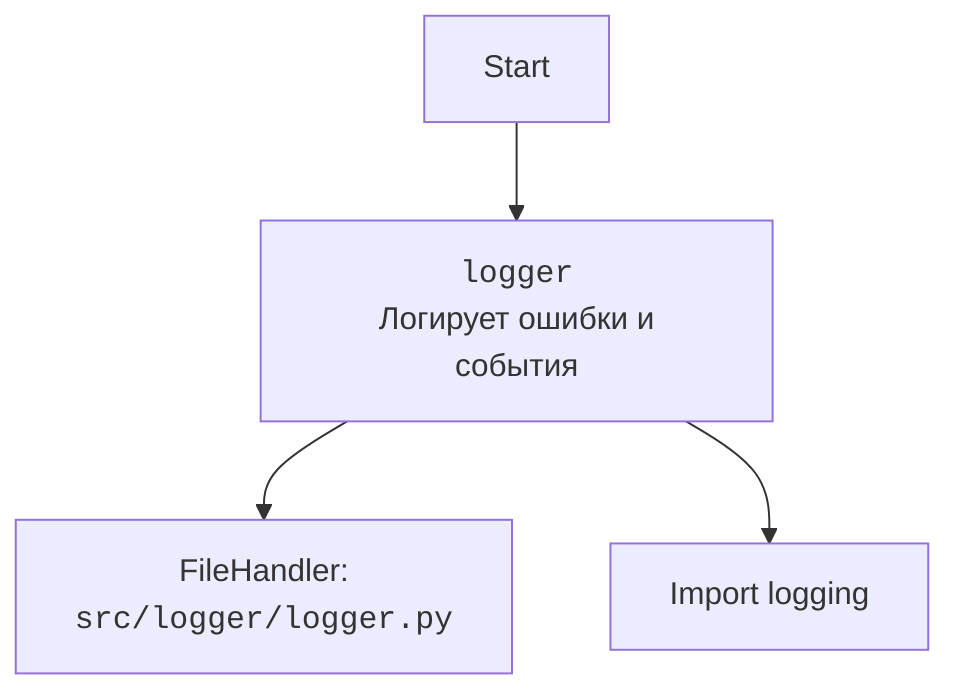

### **Системные инструкции для обработки кода проекта `hypotez`**

=========================================================================================

Описание функциональности и правил для генерации, анализа и улучшения кода. Направлено на обеспечение последовательного и читаемого стиля кодирования, соответствующего требованиям.

---

### **Основные принципы**

#### **1. Общие указания**:
- Соблюдай четкий и понятный стиль кодирования.
- Все изменения должны быть обоснованы и соответствовать установленным требованиям.

#### **2. Комментарии**:
- Используй `#` для внутренних комментариев.
- Документация всех функций, методов и классов должна следовать такому формату: 
    ```python
        def function(param: str, param1: Optional[str | dict | str] = None) -> dict | None:
            """ 
            Args:
                param (str): Описание параметра `param`.
                param1 (Optional[str | dict | str], optional): Описание параметра `param1`. По умолчанию `None`.
    
            Returns:
                dict | None: Описание возвращаемого значения. Возвращает словарь или `None`.
    
            Raises:
                SomeError: Описание ситуации, в которой возникает исключение `SomeError`.

            Ехаmple:
                >>> function('param', 'param1')
                {'param': 'param1'}
            """
    ```
- Комментарии и документация должны быть четкими, лаконичными и точными.

#### **3. Форматирование кода**:
- Используй одинарные кавычки. `a:str = 'value'`, `print('Hello World!')`;
- Добавляй пробелы вокруг операторов. Например, `x = 5`;
- Все параметры должны быть аннотированы типами. `def function(param: str, param1: Optional[str | dict | str] = None) -> dict | None:`;
- Не используй `Union`. Вместо этого используй `|`.

#### **4. Логирование**:
- Для логгирования Всегда Используй модуль `logger` из `src.logger.logger`.
- Ошибки должны логироваться с использованием `logger.error`.
Пример:
    ```python
        try:
            ...
        except Exception as ex:
            logger.error('Error while processing data', ех, exc_info=True)
    ```
#### **5 Не используй `Union[]` в коде. Вместо него используй `|`
Например:
```python
x: str | int ...
```


---

### **Основные требования**:

#### **1. Формат ответов в Markdown**:
- Все ответы должны быть выполнены в формате **Markdown**.

#### **2. Формат комментариев**:
- Используй указанный стиль для комментариев и документации в коде.
- Пример:

```python
from typing import Generator, Optional, List
from pathlib import Path


def read_text_file(
    file_path: str | Path,
    as_list: bool = False,
    extensions: Optional[List[str]] = None,
    chunk_size: int = 8192,
) -> Generator[str, None, None] | str | None:
    """
    Считывает содержимое файла (или файлов из каталога) с использованием генератора для экономии памяти.

    Args:
        file_path (str | Path): Путь к файлу или каталогу.
        as_list (bool): Если `True`, возвращает генератор строк.
        extensions (Optional[List[str]]): Список расширений файлов для чтения из каталога.
        chunk_size (int): Размер чанков для чтения файла в байтах.

    Returns:
        Generator[str, None, None] | str | None: Генератор строк, объединенная строка или `None` в случае ошибки.

    Raises:
        Exception: Если возникает ошибка при чтении файла.

    Example:
        >>> from pathlib import Path
        >>> file_path = Path('example.txt')
        >>> content = read_text_file(file_path)
        >>> if content:
        ...    print(f'File content: {content[:100]}...')
        File content: Example text...
    """
    ...
```
- Всегда делай подробные объяснения в комментариях. Избегай расплывчатых терминов, 
- таких как *«получить»* или *«делать»*. Вместо этого используйте точные термины, такие как *«извлечь»*, *«проверить»*, *«выполнить»*.
- Вместо: *«получаем»*, *«возвращаем»*, *«преобразовываем»* используй имя объекта *«функция получае»*, *«переменная возвращает»*, *«код преобразовывает»* 
- Комментарии должны непосредственно предшествовать описываемому блоку кода и объяснять его назначение.

#### **3. Пробелы вокруг операторов присваивания**:
- Всегда добавляйте пробелы вокруг оператора `=`, чтобы повысить читаемость.
- Примеры:
  - **Неправильно**: `x=5`
  - **Правильно**: `x = 5`

#### **4. Использование `j_loads` или `j_loads_ns`**:
- Для чтения JSON или конфигурационных файлов замените стандартное использование `open` и `json.load` на `j_loads` или `j_loads_ns`.
- Пример:

```python
# Неправильно:
with open('config.json', 'r', encoding='utf-8') as f:
    data = json.load(f)

# Правильно:
data = j_loads('config.json')
```

#### **5. Сохранение комментариев**:
- Все существующие комментарии, начинающиеся с `#`, должны быть сохранены без изменений в разделе «Улучшенный код».
- Если комментарий кажется устаревшим или неясным, не изменяйте его. Вместо этого отметьте его в разделе «Изменения».

#### **6. Обработка `...` в коде**:
- Оставляйте `...` как указатели в коде без изменений.
- Не документируйте строки с `...`.
```

#### **7. Аннотации**
Для всех переменных должны быть определены аннотации типа. 
Для всех функций все входные и выходные параметры аннотириваны
Для все параметров должны быть аннотации типа.


### **8. webdriver**
В коде используется webdriver. Он импртируется из модуля `webdriver` проекта `hypotez`
```python
from src.webdirver import Driver, Chrome, Firefox, Playwright, ...
driver = Driver(Firefox)

Пoсле чего может использоваться как

close_banner = {
  "attribute": null,
  "by": "XPATH",
  "selector": "//button[@id = 'closeXButton']",
  "if_list": "first",
  "use_mouse": false,
  "mandatory": false,
  "timeout": 0,
  "timeout_for_event": "presence_of_element_located",
  "event": "click()",
  "locator_description": "Закрываю pop-up окно, если оно не появилось - не страшно (`mandatory`:`false`)"
}

result = driver.execute_locator(close_banner)
```

## Анализ кода `hypotez/src/utils/get_free_port.py`

### 1. Блок-схема

```mermaid
graph TD
    A[Начало: get_free_port(host, port_range)] --> B{port_range is None?};
    B -- Да --> C[port = 1024];
    C --> D{_is_port_in_use(host, port)?};
    D -- Да --> E[port += 1];
    E --> F{port > 65535?};
    F -- Да --> G[logger.error('No free port found')];
    G --> H[raise ValueError('No free port found')];
    F -- Нет --> D;
    D -- Нет --> I[return port];
    B -- Нет --> J{isinstance(port_range, str)?};
    J -- Да --> K[min_port, max_port = _parse_port_range(port_range)];
    K --> L{ValueError?};
    L -- Да --> M[logger.error(e)];
    M --> N[raise ValueError];
    L -- Нет --> O[for port in range(min_port, max_port + 1)];
    O --> P{_is_port_in_use(host, port)?};
    P -- Да --> O;
    P -- Нет --> Q[return port];
    O --> R[logger.error('No free port found in range')];
    R --> S[raise ValueError];
    J -- Нет --> T{isinstance(port_range, list)?};
    T -- Да --> U[for item in port_range];
    U --> V{isinstance(item, str)?};
    V -- Да --> WW[min_port, max_port = _parse_port_range(item)];
    V -- Нет --> XX[logger.error('Invalid port range item')];
    XX --> YY[raise ValueError];
    WW --> AA{ValueError?};
    AA -- Да --> BB[logger.error(e)];
    BB --> U;
    AA -- Нет --> CC[for port in range(min_port, max_port + 1)];
    CC --> DD{_is_port_in_use(host, port)?};
    DD -- Да --> CC;
    DD -- Нет --> EE[return port];
    CC --> FF[logger.error('No free port found in specified ranges')];
    FF --> GG[raise ValueError];
    T -- Нет --> HH[logger.error('Invalid port range type')];
    HH --> II[raise ValueError];
```

**Примеры для логических блоков:**

*   **A (Начало):** `get_free_port('localhost', '3000-3005')`
*   **B (port\_range is None?):**
    *   Да: `get_free_port('localhost')`
    *   Нет: `get_free_port('localhost', '3000-3005')`
*   **D (\_is\_port\_in\_use(host, port)?):** Проверка, занят ли порт. Например, если `port` равен 3000, проверяется, доступен ли порт 3000 на `localhost`.
*   **K (min\_port, max\_port = \_parse\_port\_range(port\_range)):** Если `port_range` равен `'3000-3005'`, то `min_port` станет 3000, а `max_port` станет 3005.
*   **V (isinstance(item, str)?):** Проверяется, является ли элемент в списке `port_range` строкой. Например, в списке `['3000-3005', '8000-8005']` каждый элемент проверяется на соответствие типу строка.

### 2. Диаграмма

```mermaid
flowchart TD
    A[get_free_port] --> B{port_range};
    B -- No --> C[Ищет первый свободный порт начиная с 1024];
    B -- Yes --> D{type(port_range) is str?};
    D -- Yes --> E[parse_port_range(port_range)];
    E --> F[Ищет свободный порт в заданном диапазоне];
    D -- No --> G{type(port_range) is list?};
    G -- Yes --> H[Перебирает диапазоны в списке];
    H --> I[parse_port_range(item)];
    I --> J[Ищет свободный порт в текущем диапазоне];
    G -- No --> K[Вызывает исключение ValueError];
    F --> L{Свободный порт найден?};
    J --> M{Свободный порт найден?};
    L -- Yes --> N[Возвращает свободный порт];
    M -- Yes --> O[Возвращает свободный порт];
    L -- No --> P[Вызывает исключение ValueError];
    M -- No --> Q[Продолжает перебор диапазонов];
    C --> R{Свободный порт найден?};
    R -- Yes --> S[Возвращает свободный порт];
    R -- No --> T[Вызывает исключение ValueError];
    Q --> H;
```

**Объяснение зависимостей:**

*   `get_free_port`: Основная функция, которая определяет свободный порт.
*   `port_range`: Параметр, определяющий диапазон портов для поиска.
*   `parse_port_range`: Функция, преобразующая строковый диапазон портов в минимальное и максимальное значения.
*   Функция `_is_port_in_use`: Проверяет, используется ли порт.
*   `ValueError`: Исключение, которое возникает, если не удается найти свободный порт.



### 3. Объяснение

*   **Импорты:**
    *   `socket`: Используется для работы с сетевыми сокетами, необходимо для проверки доступности порта.
    *   `typing.Optional`, `typing.Tuple`, `typing.List`: Используются для аннотации типов, что улучшает читаемость и помогает в отладке.
    *   `header`: Импортируется, но не используется в коде.  Стоит удалить.
    *   `src.logger.logger`: Используется для логирования ошибок.
*   **Функции:**
    *   `get_free_port(host: str, port_range: Optional[str | List[str]] = None) -> int`:
        *   Аргументы:
            *   `host (str)`: Хост, на котором нужно проверить доступность порта (например, `'localhost'`).
            *   `port_range (Optional[str | List[str]], optional)`: Диапазон портов для проверки. Может быть строкой (например, `'3000-3005'`) или списком строк (например, `['3000-3005', '8000-8010']`). Если `None`, ищется первый свободный порт начиная с 1024. По умолчанию `None`.
        *   Возвращаемое значение:
            *   `int`: Номер свободного порта.
        *   Назначение:
            *   Находит свободный порт в заданном диапазоне или первый доступный, если диапазон не указан.
        *   Пример:
            *   `get_free_port('localhost', '3000-3005')`
    *   `_is_port_in_use(host: str, port: int) -> bool`:
        *   Аргументы:
            *   `host (str)`: Хост для проверки.
            *   `port (int)`: Порт для проверки.
        *   Возвращаемое значение:
            *   `bool`: `True`, если порт занят, `False` в противном случае.
        *   Назначение:
            *   Проверяет, используется ли указанный порт на данном хосте.
    *   `_parse_port_range(port_range_str: str) -> Tuple[int, int]`:
        *   Аргументы:
            *   `port_range_str (str)`: Строка, представляющая диапазон портов (например, `'3000-3005'`).
        *   Возвращаемое значение:
            *   `Tuple[int, int]`: Кортеж, содержащий минимальный и максимальный порты диапазона.
        *   Назначение:
            *   Разбирает строку диапазона портов в кортеж минимального и максимального значений.
*   **Переменные:**
    *   `host (str)`: Хост, на котором ищется свободный порт.
    *   `port_range (Optional[str | List[str]])`: Диапазон портов для поиска.
    *   `port (int)`: Текущий проверяемый порт.
    *   `min_port (int)`: Минимальный порт в диапазоне.
    *   `max_port (int)`: Максимальный порт в диапазоне.
*   **Потенциальные ошибки и области для улучшения:**
    *   Импорт `header` не используется, его следует удалить.
    *   В случае, если в списке диапазонов портов ни в одном из диапазонов не был найден свободный порт, вызывается исключение, но перед этим происходит логирование ошибки для каждого диапазона. Желательно логировать ошибку только один раз после перебора всех диапазонов.
    *   Функция `get_free_port` начинает поиск с порта 1024. Было бы неплохо сделать этот параметр настраиваемым.
    *   В `_parse_port_range` возникает `ValueError`, если части не равны 2. Можно использовать более конкретное исключение.
*   **Взаимосвязи с другими частями проекта:**
    *   Использует модуль `src.logger.logger` для логирования.