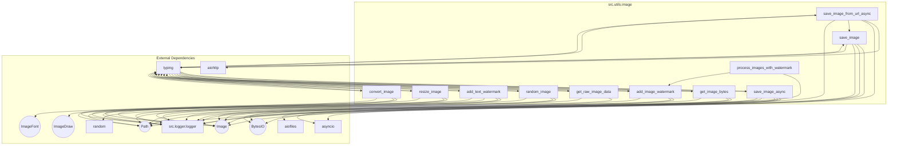

### **Системные инструкции для обработки кода проекта `hypotez`**

=========================================================================================

Описание функциональности и правил для генерации, анализа и улучшения кода. Направлено на обеспечение последовательного и читаемого стиля кодирования, соответствующего требованиям.

---

### **Основные принципы**

#### **1. Общие указания**:
- Соблюдай четкий и понятный стиль кодирования.
- Все изменения должны быть обоснованы и соответствовать установленным требованиям.

#### **2. Комментарии**:
- Используй `#` для внутренних комментариев.
- Документация всех функций, методов и классов должна следовать такому формату: 
    ```python
        def function(param: str, param1: Optional[str | dict | str] = None) -> dict | None:
            """ 
            Args:
                param (str): Описание параметра `param`.
                param1 (Optional[str | dict | str], optional): Описание параметра `param1`. По умолчанию `None`.
    
            Returns:
                dict | None: Описание возвращаемого значения. Возвращает словарь или `None`.
    
            Raises:
                SomeError: Описание ситуации, в которой возникает исключение `SomeError`.

            Ехаmple:
                >>> function('param', 'param1')
                {'param': 'param1'}
            """
    ```
- Комментарии и документация должны быть четкими, лаконичными и точными.

#### **3. Форматирование кода**:
- Используй одинарные кавычки. `a:str = 'value'`, `print('Hello World!')`;
- Добавляй пробелы вокруг операторов. Например, `x = 5`;
- Все параметры должны быть аннотированы типами. `def function(param: str, param1: Optional[str | dict | str] = None) -> dict | None:`;
- Не используй `Union`. Вместо этого используй `|`.

#### **4. Логирование**:
- Для логгирования Всегда Используй модуль `logger` из `src.logger.logger`.
- Ошибки должны логироваться с использованием `logger.error`.
Пример:
    ```python
        try:
            ...
        except Exception as ex:
            logger.error('Error while processing data', ех, exc_info=True)
    ```
#### **5 Не используй `Union[]` в коде. Вместо него используй `|`
Например:
```python
x: str | int ...
```


---

### **Основные требования**:

#### **1. Формат ответов в Markdown**:
- Все ответы должны быть выполнены в формате **Markdown**.

#### **2. Формат комментариев**:
- Используй указанный стиль для комментариев и документации в коде.
- Пример:

```python
from typing import Generator, Optional, List
from pathlib import Path


def read_text_file(
    file_path: str | Path,
    as_list: bool = False,
    extensions: Optional[List[str]] = None,
    chunk_size: int = 8192,
) -> Generator[str, None, None] | str | None:
    """
    Считывает содержимое файла (или файлов из каталога) с использованием генератора для экономии памяти.

    Args:
        file_path (str | Path): Путь к файлу или каталогу.
        as_list (bool): Если `True`, возвращает генератор строк.
        extensions (Optional[List[str]]): Список расширений файлов для чтения из каталога.
        chunk_size (int): Размер чанков для чтения файла в байтах.

    Returns:
        Generator[str, None, None] | str | None: Генератор строк, объединенная строка или `None` в случае ошибки.

    Raises:
        Exception: Если возникает ошибка при чтении файла.

    Example:
        >>> from pathlib import Path
        >>> file_path = Path('example.txt')
        >>> content = read_text_file(file_path)
        >>> if content:
        ...    print(f'File content: {content[:100]}...')
        File content: Example text...
    """
    ...
```
- Всегда делай подробные объяснения в комментариях. Избегай расплывчатых терминов, 
- таких как *«получить»* или *«делать»*
-  . Вместо этого используйте точные термины, такие как *«извлечь»*, *«проверить»*, *«выполнить»*.
- Вместо: *«получаем»*, *«возвращаем»*, *«преобразовываем»* используй имя объекта *«функция получае»*, *«переменная возвращает»*, *«код преобразовывает»* 
- Комментарии должны непосредственно предшествовать описываемому блоку кода и объяснять его назначение.

#### **3. Пробелы вокруг операторов присваивания**:
- Всегда добавляйте пробелы вокруг оператора `=`, чтобы повысить читаемость.
- Примеры:
  - **Неправильно**: `x=5`
  - **Правильно**: `x = 5`

#### **4. Использование `j_loads` или `j_loads_ns`**:
- Для чтения JSON или конфигурационных файлов замените стандартное использование `open` и `json.load` на `j_loads` или `j_loads_ns`.
- Пример:

```python
# Неправильно:
with open('config.json', 'r', encoding='utf-8') as f:
    data = json.load(f)

# Правильно:
data = j_loads('config.json')
```

#### **5. Сохранение комментариев**:
- Все существующие комментарии, начинающиеся с `#`, должны быть сохранены без изменений в разделе «Улучшенный код».
- Если комментарий кажется устаревшим или неясным, не изменяйте его. Вместо этого отметьте его в разделе «Изменения».

#### **6. Обработка `...` в коде**:
- Оставляйте `...` как указатели в коде без изменений.
- Не документируйте строки с `...`.
```

#### **7. Аннотации**
Для всех переменных должны быть определены аннотации типа. 
Для всех функций все входные и выходные параметры аннотириваны
Для все параметров должны быть аннотации типа.


### **8. webdriver**
В коде используется webdriver. Он импртируется из модуля `webdriver` проекта `hypotez`
```python
from src.webdirver import Driver, Chrome, Firefox, Playwright, ...
driver = Driver(Firefox)

Пoсле чего может использоваться как

close_banner = {
  "attribute": null,
  "by": "XPATH",
  "selector": "//button[@id = 'closeXButton']",
  "if_list": "first",
  "use_mouse": false,
  "mandatory": false,
  "timeout": 0,
  "timeout_for_event": "presence_of_element_located",
  "event": "click()",
  "locator_description": "Закрываю pop-up окно, если оно не появилось - не страшно (`mandatory`:`false`)"
}

result = driver.execute_locator(close_banner)
```

### **Анализ кода `hypotez/src/utils/image.py`**

#### **1. Блок-схема**

```mermaid
graph LR
    A[Начало] --> B{Выбор функции обработки изображений};
    B -- save_image_from_url_async --> C[Скачать изображение по URL];
    C --> D{Успешно скачано?};
    D -- Да --> E[Сохранить изображение асинхронно];
    E --> F{Изображение сохранено?};
    F -- Да --> G[Вернуть путь к файлу];
    F -- Нет --> H[Логировать ошибку];
    D -- Нет --> H;
    B -- save_image / save_image_async --> I[Сохранить изображение (асинхронно/синхронно)];
    I --> J{Создать директорию?};
    J -- Да --> K[Открыть изображение через BytesIO];
    K --> L[Сохранить изображение в BytesIO];
    L --> M[Записать данные в файл];
    M --> N{Файл создан и не пуст?};
    N -- Да --> G;
    N -- Нет --> H;
    B -- get_image_bytes --> O[Прочитать изображение через Pillow];
    O --> P[Сохранить в формате JPEG];
    P --> Q[Вернуть байты изображения];
    B -- get_raw_image_data --> R[Прочитать raw данные файла];
    R --> S{Файл существует?};
    S -- Да --> T[Вернуть raw данные];
    S -- Нет --> H;
    B -- random_image --> U[Найти случайное изображение];
    U --> V[Получить список файлов изображений];
    V --> W{Список не пуст?};
    W -- Да --> X[Выбрать случайный файл];
    X --> G;
    W -- Нет --> H;
    B -- add_text_watermark --> Y[Добавить текстовый водяной знак];
    Y --> Z[Создать прозрачный слой];
    Z --> AA[Нарисовать текст на слое];
    AA --> BB[Объединить изображение и водяной знак];
    BB --> G;
    B -- add_image_watermark --> CC[Добавить водяной знак-изображение];
    CC --> DD[Открыть основное и водяное изображения];
    DD --> EE[Изменить размер водяного знака];
    EE --> FF[Определить позицию водяного знака];
    FF --> GG[Создать прозрачный слой и объединить изображения];
    GG --> G;
    B -- resize_image --> HH[Изменить размер изображения];
    HH --> II[Открыть и изменить размер изображения];
    II --> G;
    B -- convert_image --> JJ[Конвертировать изображение];
    JJ --> KK[Открыть и конвертировать изображение];
    KK --> G;
    H --> End[Конец с ошибкой];
    G --> End[Конец успешно];
    B -- process_images_with_watermark --> LL[Обработать изображения с водяным знаком в папке];
    LL --> MM{Папка существует?};
    MM -- Да --> NN[Создать выходную директорию];
    NN --> OO[Для каждого файла в папке];
    OO --> add_image_watermark;
    MM -- Нет --> H;
```

#### **2. Диаграмма зависимостей**



#### **3. Объяснение**

**Импорты:**
- `aiohttp`: Асинхронная HTTP-клиентская библиотека для выполнения HTTP-запросов (например, скачивание изображений по URL).
- `aiofiles`: Асинхронная библиотека для работы с файлами.
- `asyncio`: Библиотека для написания конкурентного кода с использованием синтаксиса async/await.
- `random`: Модуль для генерации случайных чисел (используется для выбора случайного изображения).
- `pathlib.Path`: Класс для представления путей к файлам и директориям.
- `typing.Optional, typing.Union, typing.Tuple`: Используются для аннотации типов переменных и функций, указывая на возможность отсутствия значения (`Optional`), объединение нескольких типов (`Union`) и кортежи (`Tuple`).
- `io.BytesIO`: Класс, позволяющий работать с байтами в памяти как с файлом.
- `PIL.Image, PIL.ImageDraw, PIL.ImageFont`: Модули из библиотеки Pillow (PIL Fork) для работы с изображениями, рисования и добавления текста.
- `src.logger.logger`: Модуль для логирования событий и ошибок внутри приложения.

**Классы:**
- `ImageError`: Пользовательское исключение для обработки ошибок, связанных с изображениями. Позволяет более конкретно обрабатывать исключения, возникающие при работе с изображениями.

**Функции:**

- `save_image_from_url_async(image_url: str, filename: Union[str, Path]) -> Optional[str]`:
    - **Аргументы:**
        - `image_url` (str): URL изображения для скачивания.
        - `filename` (Union[str, Path]): Имя файла для сохранения изображения.
    - **Возвращает:**
        - `Optional[str]`: Путь к сохраненному файлу или `None` в случае ошибки.
    - **Назначение:**
        - Асинхронно скачивает изображение из заданного URL и сохраняет его локально.
    - **Пример:**
        ```python
        image_path = await save_image_from_url_async('https://example.com/image.png', 'image.png')
        if image_path:
            print(f'Image saved to {image_path}')
        else:
            print('Failed to save image')
        ```

- `save_image(image_data: bytes, file_name: str | Path, format: str = 'PNG') -> Optional[str]`:
    - **Аргументы:**
        - `image_data` (bytes): Бинарные данные изображения.
        - `file_name` (Union[str, Path]): Имя файла для сохранения изображения.
        - `format` (str): Формат изображения (по умолчанию 'PNG').
    - **Возвращает:**
        - `Optional[str]`: Путь к сохраненному файлу или `None` в случае ошибки.
    - **Назначение:**
        - Сохраняет бинарные данные изображения в файл.
    - **Пример:**
        ```python
        with open('image.png', 'rb') as f:
            image_data = f.read()
        image_path = save_image(image_data, 'new_image.png')
        if image_path:
            print(f'Image saved to {image_path}')
        else:
            print('Failed to save image')
        ```

- `save_image_async(image_data: bytes, file_name: str | Path, format: str = 'PNG') -> Optional[str]`:
    - **Аргументы:**
        - `image_data` (bytes): Бинарные данные изображения.
        - `file_name` (Union[str, Path]): Имя файла для сохранения изображения.
        - `format` (str): Формат изображения (по умолчанию 'PNG').
    - **Возвращает:**
        - `Optional[str]`: Путь к сохраненному файлу или `None` в случае ошибки.
    - **Назначение:**
        - Асинхронно сохраняет бинарные данные изображения в файл.
    - **Пример:**
        ```python
        with open('image.png', 'rb') as f:
            image_data = f.read()
        image_path = await save_image_async(image_data, 'new_image.png')
        if image_path:
            print(f'Image saved to {image_path}')
        else:
            print('Failed to save image')
        ```

- `get_image_bytes(image_path: Path, raw: bool = True) -> Optional[BytesIO | bytes]`:
    - **Аргументы:**
        - `image_path` (Path): Путь к файлу изображения.
        - `raw` (bool): Если `True`, возвращает объект `BytesIO`; иначе возвращает `bytes`. По умолчанию `True`.
    - **Возвращает:**
        - `Optional[BytesIO | bytes]`: Байты изображения в формате JPEG или `None` в случае ошибки.
    - **Назначение:**
        - Читает изображение из файла и возвращает его байтовое представление.
    - **Пример:**
        ```python
        image_bytes = get_image_bytes(Path('image.png'))
        if image_bytes:
            print(f'Image bytes: {image_bytes[:100]}...')
        else:
            print('Failed to read image')
        ```

- `get_raw_image_data(file_name: Union[str, Path]) -> Optional[bytes]`:
    - **Аргументы:**
        - `file_name` (Union[str, Path]): Имя файла для чтения.
    - **Возвращает:**
        - `Optional[bytes]`: Бинарные данные файла или `None`, если файл не существует или произошла ошибка.
    - **Назначение:**
        - Читает файл и возвращает его бинарные данные.
    - **Пример:**
        ```python
        raw_data = get_raw_image_data('data.bin')
        if raw_data:
            print(f'Raw data: {raw_data[:100]}...')
        else:
            print('Failed to read file')
        ```

- `random_image(root_path: Union[str, Path]) -> Optional[str]`:
    - **Аргументы:**
        - `root_path` (Union[str, Path]): Директория для поиска изображений.
    - **Возвращает:**
        - `Optional[str]`: Путь к случайному изображению или `None`, если изображения не найдены.
    - **Назначение:**
        - Рекурсивно ищет случайное изображение в указанной директории.
    - **Пример:**
        ```python
        random_image_path = random_image('images')
        if random_image_path:
            print(f'Random image: {random_image_path}')
        else:
            print('No images found')
        ```

- `add_text_watermark(image_path: str | Path, watermark_text: str, output_path: Optional[str | Path] = None) -> Optional[str]`:
    - **Аргументы:**
        - `image_path` (Union[str, Path]): Путь к файлу изображения.
        - `watermark_text` (str): Текст водяного знака.
        - `output_path` (Optional[Union[str, Path]]): Путь для сохранения изображения с водяным знаком. Если не указан, перезаписывает исходное изображение.
    - **Возвращает:**
        - `Optional[str]`: Путь к изображению с водяным знаком или `None` в случае ошибки.
    - **Назначение:**
        - Добавляет текстовый водяной знак на изображение.
    - **Пример:**
        ```python
        watermarked_image_path = add_text_watermark('image.png', 'Watermark', 'watermarked_image.png')
        if watermarked_image_path:
            print(f'Watermarked image saved to: {watermarked_image_path}')
        else:
            print('Failed to add watermark')
        ```

- `add_image_watermark(input_image_path: Path, watermark_image_path: Path, output_image_path: Optional[Path] = None) -> Optional[Path]`:
    - **Аргументы:**
        - `input_image_path` (Path): Путь к исходному изображению.
        - `watermark_image_path` (Path): Путь к изображению водяного знака.
        - `output_image_path` (Optional[Path]): Путь для сохранения изображения с водяным знаком. Если не указан, сохраняется в директории "output".
    - **Возвращает:**
        - `Optional[Path]`: Путь к изображению с водяным знаком или `None` в случае ошибки.
    - **Назначение:**
        - Добавляет изображение в качестве водяного знака на другое изображение.
    - **Пример:**
        ```python
        watermarked_image_path = add_image_watermark(Path('image.png'), Path('watermark.png'), Path('output/watermarked_image.png'))
        if watermarked_image_path:
            print(f'Watermarked image saved to: {watermarked_image_path}')
        else:
            print('Failed to add watermark')
        ```

- `resize_image(image_path: Union[str, Path], size: Tuple[int, int], output_path: Optional[Union[str, Path]] = None) -> Optional[str]`:
    - **Аргументы:**
        - `image_path` (Union[str, Path]): Путь к файлу изображения.
        - `size` (Tuple[int, int]): Кортеж с новой шириной и высотой изображения.
        - `output_path` (Optional[Union[str, Path]]): Путь для сохранения измененного изображения. Если не указан, перезаписывает исходное изображение.
    - **Возвращает:**
        - `Optional[str]`: Путь к измененному изображению или `None` в случае ошибки.
    - **Назначение:**
        - Изменяет размер изображения.
    - **Пример:**
        ```python
        resized_image_path = resize_image('image.png', (500, 500), 'resized_image.png')
        if resized_image_path:
            print(f'Resized image saved to: {resized_image_path}')
        else:
            print('Failed to resize image')
        ```

- `convert_image(image_path: Union[str, Path], format: str, output_path: Optional[Union[str, Path]] = None) -> Optional[str]`:
    - **Аргументы:**
        - `image_path` (Union[str, Path]): Путь к файлу изображения.
        - `format` (str): Формат для конвертации изображения (например, "JPEG", "PNG").
        - `output_path` (Optional[Union[str, Path]]): Путь для сохранения конвертированного изображения. Если не указан, перезаписывает исходное изображение.
    - **Возвращает:**
        - `Optional[str]`: Путь к конвертированному изображению или `None` в случае ошибки.
    - **Назначение:**
        - Конвертирует изображение в указанный формат.
    - **Пример:**
        ```python
        converted_image_path = convert_image('image.png', 'JPEG', 'converted_image.jpg')
        if converted_image_path:
            print(f'Converted image saved to: {converted_image_path}')
        else:
            print('Failed to convert image')
        ```

- `process_images_with_watermark(folder_path: Path, watermark_path: Path) -> None`:
    - **Аргументы:**
        - `folder_path` (Path): Путь к папке с изображениями.
        - `watermark_path` (Path): Путь к изображению водяного знака.
    - **Возвращает:**
        - `None`
    - **Назначение:**
        - Обрабатывает все изображения в указанной папке, добавляя водяной знак и сохраняя их в подпапке "output".
    - **Пример:**
        ```python
        process_images_with_watermark(Path('images'), Path('watermark.png'))
        ```

**Переменные:**
- Основные переменные, такие как `image_url`, `filename`, `image_data`, `file_name`, `image_path`, `watermark_text`, `output_path`, `size`, `format`, хранят соответствующие значения для обработки изображений.
- Переменные `img`, `resized_img`, `watermarked_image` используются для хранения объектов изображений PIL.
- Локальные переменные внутри функций служат для временного хранения промежуточных результатов операций с изображениями.

**Потенциальные ошибки и области для улучшения:**

1.  **Обработка исключений:** В коде присутствуют блоки `try...except`, которые перехватывают исключения, логируют их с помощью `logger.error` и затем закомментированы `raise ImageError`.  Рекомендуется пересмотреть обработку исключений и либо пробрасывать исключения выше, чтобы вызывающий код мог их обработать, либо выполнять какие-то действия по восстановлению после ошибок. В текущей реализации ошибки просто логируются, и функция возвращает `None`, что может привести к непредсказуемому поведению программы.
2.  **Использование BytesIO:** В функциях `save_image` и `save_image_async` происходит двойная запись в `BytesIO`: сначала изображение сохраняется в `BytesIO`, а затем данные из `BytesIO` записываются в файл. Это может быть неэффективно.  Возможно, стоит оптимизировать этот процесс, записывая изображение сразу в файл.
3.  **Асинхронность:** В функции `save_image_async` закомментирован код, который записывает неформатированные данные. Это может быть полезно для отладки, но в рабочей версии его следует убрать или заменить логированием.
4.  **Обработка путей:** В функциях `add_text_watermark`, `resize_image` и `convert_image` используется следующая конструкция:
    ```python
    output_path = image_path if output_path is None else Path(output_path)
    ```
    Это означает, что если `output_path` не указан, исходный файл будет перезаписан.  Стоит добавить предупреждение об этом в документацию функций.
5. **Совместимость форматов**: При конвертации и изменении размера изображения не учитываются особенности различных форматов. Например, при конвертации в JPEG стоит указывать уровень сжатия, чтобы контролировать качество изображения.

**Взаимосвязь с другими частями проекта:**

- Модуль `src.utils.image` использует `src.logger.logger` для логирования, что обеспечивает централизованный механизм логирования для всего проекта. Это позволяет легко отслеживать ошибки и предупреждения, связанные с обработкой изображений.
- Функции в этом модуле могут быть использованы другими модулями проекта, которым требуется функциональность для работы с изображениями, например, для скачивания, обработки и сохранения изображений.